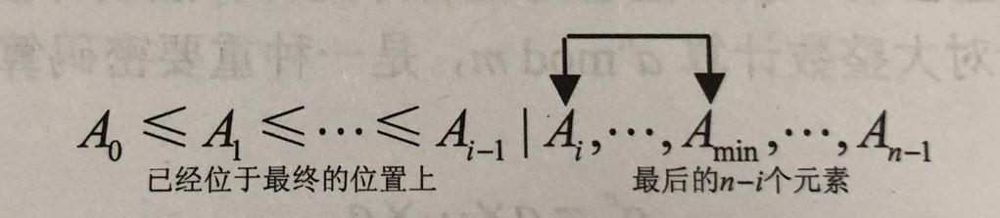
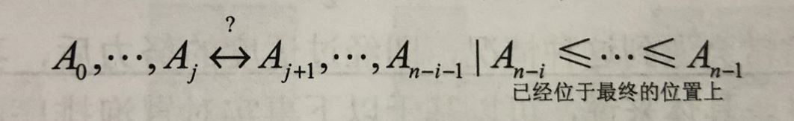
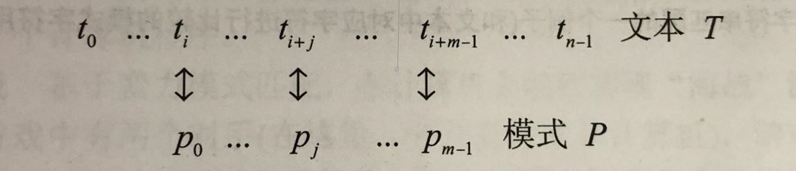
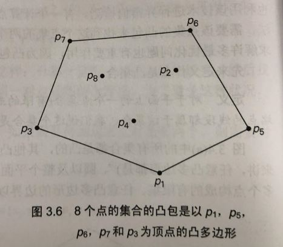
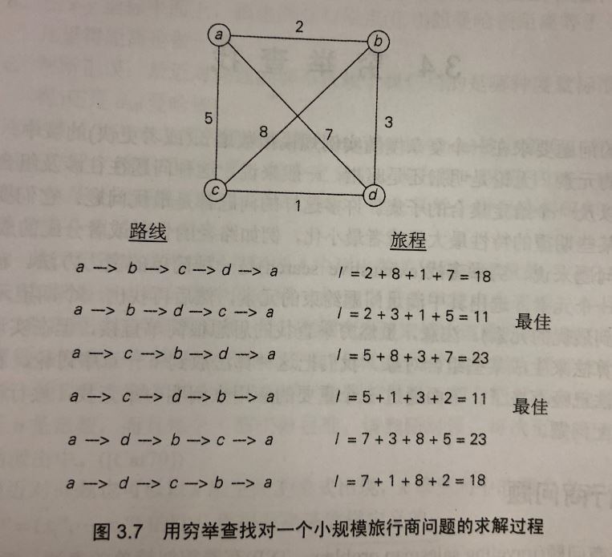
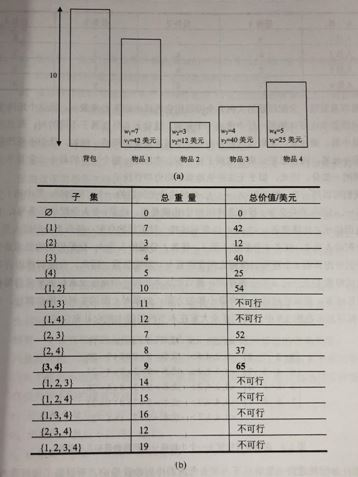
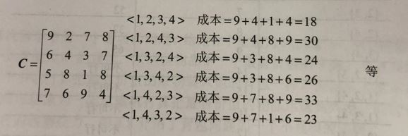

## 蛮力法
—— 一种最简单的设计策略

我们可以用 “just do it!” 来描述蛮力法的策略。

##### 蛮力法的特点
与其他某些策略不同，我们可以应用蛮力法来解决广阔领域的各种问题。 实际上，它可能是唯一一种几乎什么问题都能解决的一般性方法。 (技巧同时意味着对场景的挑剔。)

##### 重要的问题类型
* 排序
* 查找
* 字符串处理
* 图问题
* 组合问题
* 几何问题
* 数值问题

<br>

##### 1. 选择排序
<div align="center"></div>

算法： Selection Sort
```
//输入： 一个可排序数组 A[0…n-1]
//输出： 升序排列的数组 A[0…n-1]
for i ← 0 to n-2 do
  min ← i
  for j ← i+1 to n-1 do
    if A[j] < A[min] min ← j
  swap A[i] and A[min]
```

##### 2. 冒泡排序
<div align="center"></div>

算法: Bubble Sort
```
//输入： 一个可排序数组 A[0…n-1]
//输出： 非降序排列的数组 A[0…n-1]
for i ← 0 to n-2 do
  for j ← 0 to n-2-i do
    if A[j+1] < A[j] swap A[j] and A[j+1]
```

##### 3. 顺序查找
算法： Sequential Search
```
//输入： 一个 n 个元素的数组 A[0…n-1] 和一个查找键 K
//输出： 第一个值等于 K 的元素的位置，如果找不到这样的元素，返回 -1
i ← 0
while A[i] ≠ K do
  i ← i+1
if i < n return i
else return -1
```

##### 4. 蛮力字符串匹配
<div align="center"></div>

算法： BruteForceStringMatch
```
//输入： 一个 n 个字符的数组 T[0…n-1]
        一个 m 个字符的数组 P[0…m-1]
//输出： 如果查找成功，返回文本的第一个匹配字串中第一个字符的位置，
        否则，返回 -1
for i ← 0 to n-m do
  j ← 0
  while j < m and P[j] == T[i+j] do
    j ← j+1
    if j == m return i
return -1
```

##### 5. 最近对问题
算法： BruteForceClosestPoints
```
//输入： 一个 n 个点的列表 p， p1=(x1,y1)，…，pn=(xn,yn)
//输出： 两个最近点的距离
d ← infinity
for i ← 1 to n-1 do
  for j ← i+1 to n do
    d ← min(d, sqrt((xi-xj)^2+(yi-yj)^2))
return d
```

##### 6. 凸包问题
凸包能方便地提供目标形状或给定数据集的一个近似。
<div align="center"></div>

* 凸集合 <br>
对于平面上的一个点集合，如果以集合中任意两点 p 和 q 为端点的线段都属于该集合，我们说这个集合是凸的。
* 凸包 <br>
一个点集合 S 的凸包是包含 S 的最小凸集合。

如何用蛮力法解决凸包问题呢？ <br>
凸包问题正是这种没有明显算法解法的问题。微笑。

##### 7. 旅行商问题
问题描述： 找出一条 n 个给定的城市间的最短路径，使我们在回到出发的城市之前，对每个城市都只访问一次。 （又名：图的最短哈密顿回路，Hamiltonian circuit）

穷举
<div align="center"></div>

##### 8. 背包问题
问题描述： 给定 n 个重量为 w1，w2，...，wn，价值为 v1，v2，...，vn 的物品和一个承重为 W 的背包。
求这些物品中一个最有价值的子集，并且要能够装到背包中。

穷举
<div align="center"></div>

##### 9. 分配问题
问题描述： 有 n 个任务需要分配给 n 个人执行，一个任务只对应一个人。对于每一种匹配来说，将第 j 个任务分配给第 i 个人的成本是 C\[i,j\]。找出总成本最小的分配方案。

穷举
<div align="center"></div>

##### 10. 深度优先查找
深度优先查找遍历的时候往往构造一个所谓的深度优先查找森林。（depth-first search forest）

算法： DepthFirstSearch
```
//输入： 图 G = <V,E>
//输出： 图 G 的顶点，按照被 DFS 遍历**第一次**访问到的先后次序，用连续的整数对顶点标记，
        将 V 中的顶点标记为 0，表示还“未访问”。
count ← 0
for each vertex v in V do
  if v is marked with 0
    dfs(v)

dfs(v)
  //递归访问和 v 相连接的未访问顶点，按照 count 的值对其赋值。
  count ← count+1; mark v with count
  for each vertex w in V adjacent to v do
    if w is marked with 0
      dfs(w)
```

深度优先查找的跟踪逻辑与栈的思维一致。

##### 11. 广度优先查找
广度优先查找遍历的时候往往构造一个所谓的广度优先查找森林。（breadth-first search forest）

算法： BreadthFirstSearch
```
//输入： 图 G = <V,E>
//输出： 图 G 的顶点，按照被 BFS 遍历访问到的先后次序，用连续的整数对顶点标记，
        将 V 中的顶点标记为 0，表示还“未访问”。
count ← 0
for each vertex v in V do
  if v is marked with 0
    bfs(v)

bfs(v)
  //访问所有和 v 相连接的未访问顶点，按照 count 的值对其赋值。
  count ← count+1; mark v with count; initialize a queue with v
  while the queue is no empty do
    for each vertex w in V adjacent to the front vertex do
      if w is marked with 0
        count ← count+1; mark w with count
        add w to the queue
    remove the front vertex from the queue 
```

广度优先查找的跟踪逻辑与队列的思维一致。
