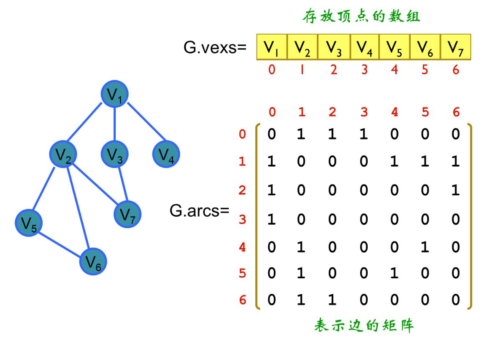
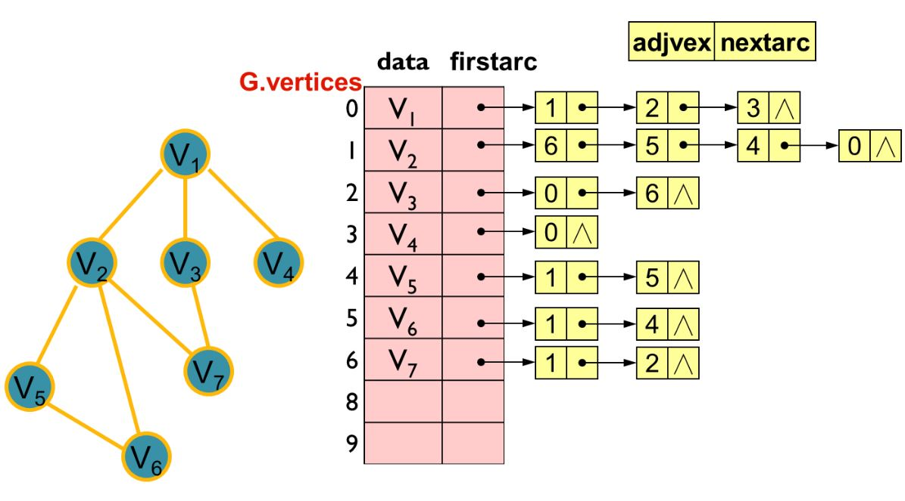
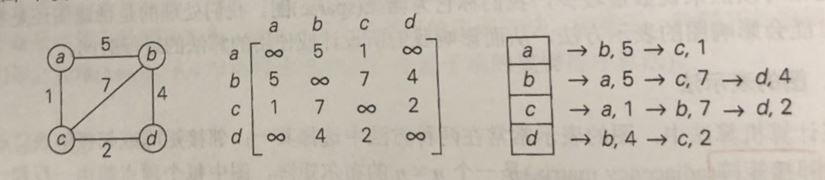

## 算法设计与分析基础
—— "十大通用算法设计技术"

“微积分以及在此基础之上建立起来的数学分析体系造就了现代科学；而算法造就了现代世界。”

<br>

### Part 1. 绪论

##### 1.1 学习算法的必要
从实践的角度看，我们必须了解计算领域中不同问题的一系列标准算法，以此具备分析算法效率和设计新算法的能力。

一个人只有把知识教给“计算机”，才能“真正”掌握它。 也就是说，将知识表述为一种算法，比起简单按照常规去理解事物，
尝试用算法将其形式化能使理解更加深刻。

##### 1.2 什么是算法
算法是一系列解决问题的明确指令。

* 算法的每一个步骤都必须没有歧义。 （明确且可执行。）
* 算法所处理的输入具有明确的值域规定。 （严格定义的待处理内容。）

算法的描述形式有多种：
* 文字描述。 （第一步，第二步，第三步，...）
* 伪代码 - 伪代码往往比自然语言更精确。
* 流程图。

特别说明
```
算法本身并不是答案，而是获得答案的精确指令。
正是对于精确定义的结构化过程的强调，才使计算机科学有别于其他科学。
```

##### 1.3 算法设计的分析过程

##### 1.3.1 明确的问题
* 首先仔细阅读问题描述，明确问题解除所有疑惑，并尝试手工处理一些小规模的例子，考虑一下特殊的情况。
* 严格确定算法需要处理的实例的范围是非常重要的。

问题描述的精确性决定着算法设计最终的成功与否。（生死攸关）

##### 1.3.2 确认计算设备的性能
计算设备是算法指令的执行者，决定着执行力。

##### 1.3.3 在精确解法和近似解法之间做出选择
有一些重要的问题在很多情况下的确无法求得精确解，另外，某些问题的精确求解代价过大。

##### 1.3.4 确认设计技术
用算法解题的一般性方法/思想，如： “十大通用算法设计技术”。

##### 1.3.5 确定适当的数据结构
根据算法执行的操作为其选择合适的数据结构。 （数据结构决定着访问效率）

##### 1.3.6 描述算法
实践证明，除了一些非常简单的算法以外，流程图这种表示方法使用起来非常不便。

##### 1.3.7 正确性证明
正确性证明的一般方法是使用数学归纳法，因为算法的迭代过程原本就符合这种证明所需要的一系列步骤。
对于近似算法的证明，通常证明该算法所产生的误差不超过预定义的范围。

##### 1.3.8 效率分析
算法的两种效率： 时间效率 （time efficiency）、 空间效率 (space efficiency)。 另外，算法应该具有的另一个特性是简单性 （simplicity），因为简单的算法更容易理解和实现。
“不是在无以复加，而是在无以复减的时候，设计师才知道他已经达到了完美的境界。”

##### 1.3.9 为算法写代码
绝大多数算法注定最终以计算机程序的形式实现。

##### 总结
```
算法设计的三个方面：
    ▪ 1~3 - **必要条件**
    ▪ 4~6 - **内容设计**
    ▪ 7~9 - **验证**
```

<br>

### Part 2. 重要的问题类型
计算中能遇到无数种问题，但是只有少数领域的问题能够引起研究人员的特殊关注。 这些问题要么具有非常重要的使用价值，
要么具有一些非常重要的特性。 幸运的是，在大多数情况下，这两种因素往往可以相互强化。

##### 2.1 排序
排序使我们更容易解决和列表相关的问题。 例如：查找问题。 <br>
“现在知道学校为什么对学生排名了吧？ 排序是基本问题，微笑。”

##### 2.2 查找

##### 2.3 字符串处理

##### 2.4 图问题
算法中最古老也最有趣的领域是图算法。 图 （graph） 是由一些称为顶点的点构成的集合。

##### 2.5 组合问题
有一些问题要求寻找一个组合对象，该组合对象能够满足特定的条件并具有我们想要的特性。 一般说来，无论从理论角度还是实践角度来看，
组合问题都是计算领域中最难的问题。
* 随着问题规模的增大，组合对象的数量增长极快。
* 还没有一种已知算法能在可接受的时间内，精确地解决绝大多数这类问题。
* 大多数计算机科学家认为，这样的算法是不存在的。 （类似全局最优问题的求解）

##### 2.6 几何问题
古希腊人非常热衷于开发一些过程（他们不会称其为算法）来解决各种各样的几何问题，包括用没有刻度的尺和圆规绘出简单的几何图形，如三角形、圆形等。

##### 2.7 数值问题
数值问题涉及具有连续性的数学问题：像解方程和方程组，计算定积分以及求函数的值等。
最近三十年，计算机业界将注意力转移到了商业应用，这些应用需要另外一些算法，它们能对信息存储、取出，再通过网络传输和呈现给用户。
* 数值分析 - “科学/工程”
* 信息（化）/通信 - “商业”

作为这种革命性变化的结果，数值分析丧失了它在计算机科学界和业界的应用统治地位。但在数值分析领域已开发出大量成熟的算法，应用于科学和工程。

<br>

### Part 3. 基本数据结构
数据的组织方式在算法设计和分析中扮演了一个至关重要的角色。

##### 3.1 线性数据结构
* 数组 <br>
只要指定数组的下标就能访问内部元素。能用相等的常量时间访问数组中的任何元素。 (字符串是特殊的数组。)

* 链表 <br>
链表的每个节点包含两类信息：数据、指针。插入和删除的效率非常高。

* 栈 <br>
插入和删除都只能在端部进行。

* 队列 <br>
删除元素在列表的一头进行，插入元素在表的另一头进行。

* 优先队列

##### 3.2 图
严格来说，一个图 G = <V,E> 由两个集合来定义。 顶点（vertex），边（edge）。 圈（loop），即连接顶点自身的边。

* 无向图 （undirected graph）
* 有向图 （directed graph）
* 完全图 （complete graph）
* 稠密图 （dense graph） - 图中所缺的边数量相对较少。
* 稀疏图 （sparse graph） - 图中的边相对顶点来说数量较少。

##### 3.2.1 图的表示方法
* 邻接矩阵 （adjacency matrix）
<div align="center"></div>

* 邻接链表 (adjacency list) <br>
以有向图为例来理解邻接链表更容易理解。
<div align="center"></div>

##### 3.2.2 加权图（weighted graph）的表示
<div align="center"></div>

##### 3.2.3 路径和环
* 路径 （path）
    * 连通性 （connectivity）
    * 无环性 （acyclicity）
* 回路 （cycle） <br>
它的起点和终点都是同一顶点，长度大于0，而且绝不会将同一条边包含两次。

##### 3.3 树
更精确地说，树即自由树（free tree）就是连通无回路图。 无回路但不一定连通的图称为森林（forest），它的每一个连通分量是一颗树。
```
树具有其他图没有的一些重要特性。 具体来说，树的边数总是比它的顶点数少1。 （即：树是图的特殊情况。）
```

##### 3.3.1 有根树
指定根（root）节点的树。通常所说的树都是有根树。

* 树的深度（depth） <br>
从根到指定节点v的简单路径的长度。

* 树的高度（height） <br>
从根到叶子节点的最长简单路径的长度。

##### 3.2.2 有序树
树中每一顶点的所有子女都是有序的。（例如，所有的子女都是从左到右有序排列。）

##### 3.4 集合与字典
集合是互不相同项的无序组合（可以为空）。 集合是一个数学上的概念。
* 集合的表示：
    * 1.基于一个通用大集合的表示方式 <br>
    集合 S = {2, 3, 5, 7} 的表示为 011010100。其中，通用大集合为 U = {n: 1到9的整数}。
    * 2.线性列表的表示方法 <br>
    列表 {2, 3, 5, 7}。 （该方式是集合的常规表示方法。）

* 列表与集合的区别： 是否包含相同元素。

字典（dictionary）是我们在计算中对集合的称呼。

##### 特别说明
```
我们在说到数据结构的时候，总是无法避免的提到访问操作，以及访问效率。
```
很久以前，计算机科学家就认识到了数据与访问（操作）之间无法割舍的联系，因此催生了抽象数据类型这一思想/概念。 （abstract data type, ADT）

<br>

### Part 4. 算法效率分析

