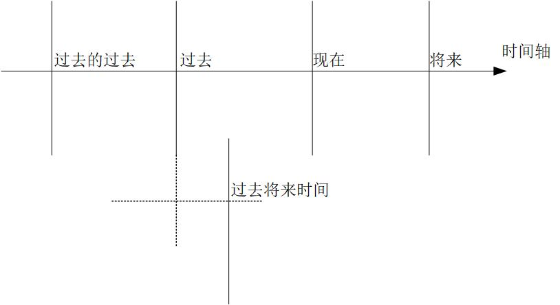

# 英语思维
阐述“时”和“态”的概念， 并结合两个概念进一步阐述英语的“时态”体系。

* 由谓语动词的 “时态” “语态” “语气” 体系，进而到非谓语动词的框架体系.
* 主要针对 时态、谓语动词、虚拟语气、被动语态、非谓语动词、从句、疑问句，7种语法.

## 时
过去时间、 现在时间、将来时间、过去将来时间

## 态
一般态、 不定态、 进行态、 完成态、 完成进行态

## 时间轴

## 非谓语动词的句法功能
主语、 谓语、 宾语、 表语、 定语、 状语、 补语

