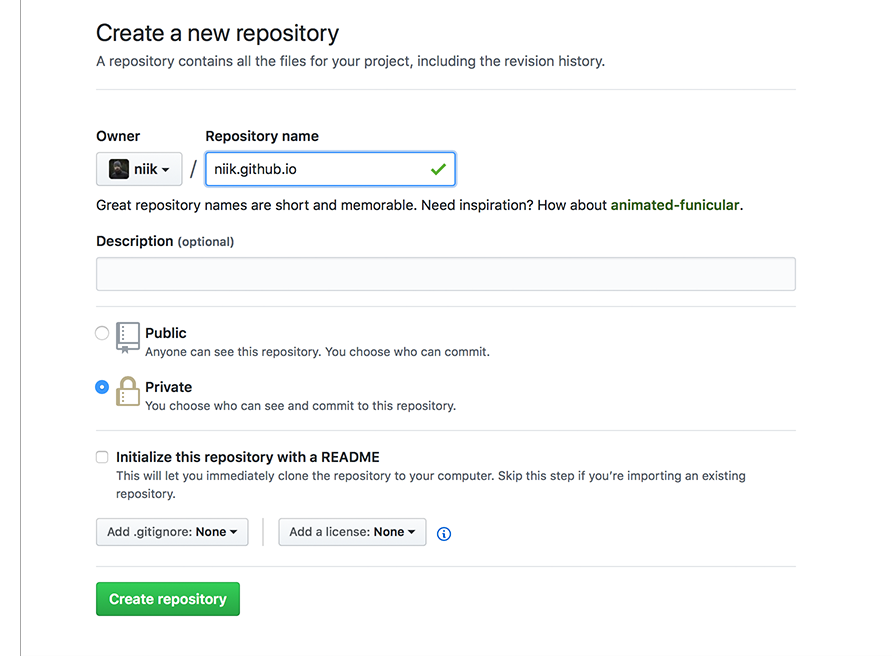
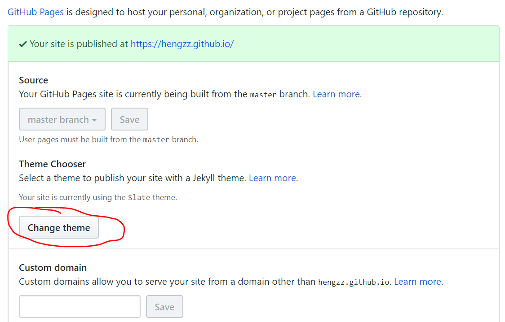

# 如何快速搭建自己的github.io博客
基于 github 的 repo 管理，意味着对博客拥有绝对的控制，与放置于第三方平台相比，可控性更好。

要完成自己的 github.io 博客网站，总共分三步：
* 开通自己的 github.io repo
* 选择一款 Jekyll 的主题
* 编写发布博客

## 开通自己的 github.io repo
github.io 是完全基于 github 创建的，其本质上是在你的 github 账户下创建一个特殊的 repo.

#### 创建 \<username>.github.io 仓库
**其中 username 替换成你的 github 账户名** <br>


#### 初始化仓库
```bash
echo "# hengzZ.github.io" >> README.md
git init
git add README.md
git commit -m "first commit"
git remote add origin https://github.com/hengzZ/hengzZ.github.io.git
git push -u origin master
```

#### 创建第一个博客（网页）
```bash
echo "Hello." > index.html
git add index.html
git commit -m "index"
git push
```
#### 选择一个主题风格
打开项目设置(Settings)


博客： http://hengzZ.github.io


## 选择一款 Jekyll 的主题
github.io 默认采用 Jekyll 作为建站工具。这里注意的是静态网站，Jekyll 没有任何的后台数据库。

Jekyll 自身的强大功能已经足够打造自己心仪的静态网站，前提是你得有一定的前端功底，为了不至于长的太难看，你得有一定的设计能力。

#### 选择一个模板（主题）
```bash
git clone https://github.com/Huxpro/huxpro.github.io.git
```
将模板内的内容拷贝到自己的 github.io 仓库，模板其实是 Huxpro 的博客网站，里面有一些作者的博文，可根据需要进行删减。

#### 修改配置
基于 Jekyll 的博客网站，有一个非常重要的配置文件_config.yml.
```html
# Site settings
title: Peter
SEOTitle: 志恒的博客 | Peter
header-img: img/home-bg.jpg
email: zh632299795@gmail.com
description: "关于设计与梦想 | 志恒，Software Engineer | 这里是 @志恒zZ 的个人博客，与你一起探索世界。"
keyword: "@志恒zZ, 个人网站, 互联网, Web, Software Engineer, designer dream"
url: "https://hengzZ.github.io"  # your host, for absolute URL
baseurl: ""  # for example, '/blog' if your blog hosted on 'host/blog'
```
其他配置及信息，请逐个查看文件并修改。


## 编写发布博客
Jekyll 对于博文，要求放在 _posts 目录下，同时对文件名有严格的规定，必须保持格式 YEAR-MONTH-DAY-title.MARKUP。通常情况下，采用推荐的 Markdown 撰写博文，基于该格式，博文的文件名为 2017-08-15-how-to-setup-your-github-io-blog.md

#### 提交博文
```bash
git add _posts/2017-08-15-how-to-setup-your-github-io-blog.md
git commit -m "Add how to setup your github.io blog"
git push
```


## 本地查看自己的博客
有时候，在提交到 github 之前，想先看看博文的效果如何，既然 github 采用的是 Jekyll，那么完全可以采用 Jekyll 在本地构建网站，查看博文效果。

#### 安装 Ruby (请务必确保版本在1.9.3以上)
```bash
apt-get install ruby
```

#### 安装 Github pages
Github pages 其实就是 github 基于 Jekyll 用来构建 github.io 的工具，安装好 Ruby 之后可以执行：
```bash
gem install github-pages
```

#### 开启 Jekyll 本地服务
```bash
cd hengzZ.github.io
jekyll serve --watch
```
默认情况下，该服务会侦听在本地的 4000 端口，打开浏览器访问 http://127.0.0.1:4000，就可以在本地查看自己的博文效果了。

###### 博客网站式样修改请参考
https://github.com/Huxpro/huxpro.github.io/blob/master/README.zh.md
