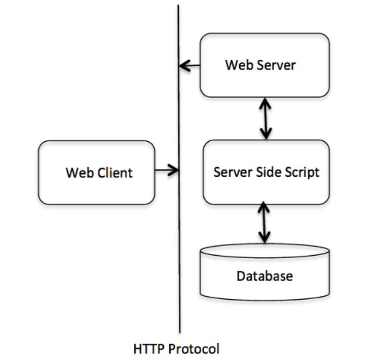

# HTTP Quick Start
快速理解、感受HTTP传输协议 <br>
HTTP是一个应用层协议，由请求和响应构成，是一个标准的客户端服务模型。HTTP通常承载于TCP协议之上，有时候也承载于TLS或SSL协议层之上，这个时候，就成了常说的HTTPS。默认HTTP的端口号为80，HTTPS的端口号为443。

## HTTP - Basic Features
There are three basic features that make HTTP a simple but powerful protocol:
* **HTTP is connectionless:** Client and server knows about each other during current request and response only. Further requests are made on new connection like client and server are new to each other.
* **HTTP is media independent:** It is required for the client as well as the server to specify the content type using appropriate MIME-type. (*Multipurpose Internet Mail Extensions*)
* **HTTP is stateless:** Neither the client nor the browser can retain information between different requests across the web pages. 

*The server and client are aware of each other only during a current request. Afterwards, both of them forget about each other.*

**The following diagram shows a very basic architecture of a web application and depicts where HTTP sits:**
<p></p>


## HTTP - Parameters
* HTTP Version
```html
HTTP-Version   = "HTTP" "/" 1*DIGIT "." 1*DIGIT
```
* Uniform Resource Identifiers
```html
URI = "http:" "//" host [ ":" port ] [ abs_path [ "?" query ]]
```
* Date/Time Formats
```html
# All HTTP date/time stamps MUST be represented in Greenwich Mean Time (GMT), without exception.
Sun, 06 Nov 1994 08:49:37 GMT  ; RFC 822, updated by RFC 1123
Sunday, 06-Nov-94 08:49:37 GMT ; RFC 850, obsoleted by RFC 1036
Sun Nov  6 08:49:37 1994       ; ANSI C's asctime() format
```
* Character Sets <br>
We use character sets to specify the character sets that the client prefers. If a value is not specified, the default is the US-ASCII.
* Content Encodings <br>
A content encoding value indicates that an encoding algorithm has been used to encode the content before passing it over the network.
* Media Types <br>
HTTP uses Internet Media Types in the **Content-Type** and **Accept header** fields in order to provide open and extensible data typing and type negotiation. All the Media-type values are registered with the Internet Assigned Number Authority (IANA).
* Language Tags <br>
HTTP uses language tags within the **Accept-Language** and **Content-Language** fields.


## HTTP - Messages
HTTP is based on the client-server architecture model and a stateless request/response protocol that operates by **exchanging messages** across a reliable TCP/IP connection.

HTTP requests and HTTP responses use a generic message format of RFC 822 for transferring the required data. This generic message format consists of the following four items:
```html
    A Start-line

    Zero or more header fields followed by CRLF

    An empty line (i.e., a line with nothing preceding the CRLF) 
    indicating the end of the header fields

    Optionally a message-body
```


## HTTP - Message Examples
HTTP request to fetch **hello.htm** page from the web server running on *tutorialspoint.com*. <br>

**Client request**
```html
GET /hello.htm HTTP/1.1
User-Agent: Mozilla/4.0 (compatible; MSIE5.01; Windows NT)
Host: www.tutorialspoint.com
Accept-Language: en-us
Accept-Encoding: gzip, deflate
Connection: Keep-Alive
```
**Server response**
```html
HTTP/1.1 200 OK
Date: Mon, 27 Jul 2009 12:28:53 GMT
Server: Apache/2.2.14 (Win32)
Last-Modified: Wed, 22 Jul 2009 19:15:56 GMT
Content-Length: 88
Content-Type: text/html
Connection: Closed
```
```html
<html>
   <body>

   <h1>Hello, World!</h1>

   </body>
</html>
```

HTTP request to post form data to **process.cgi** CGI page on a web server running on *tutorialspoint.com*. The server returns the passed name after setting them as cookies: <br>

**Client request**
```html
POST /cgi-bin/process.cgi HTTP/1.1
User-Agent: Mozilla/4.0 (compatible; MSIE5.01; Windows NT)
Host: www.tutorialspoint.com
Content-Type: text/xml; charset=utf-8
Content-Length: 60
Accept-Language: en-us
Accept-Encoding: gzip, deflate
Connection: Keep-Alive

first=Zara&last=Ali
```
**Server response**
```html
HTTP/1.1 200 OK
Date: Mon, 27 Jul 2009 12:28:53 GMT
Server: Apache/2.2.14 (Win32)
Content-Length: 88
Set-Cookie: first=Zara,last=Ali;domain=tutorialspoint.com;Expires=Mon, 19-
Nov-2010 04:38:14 GMT;Path=/
Content-Type: text/html
Connection: Closed
```
```html
<html>

<body>
   <h1>Hello Zara Ali</h1>
</body>

</html>
```


# GO HTTP 小例子
**Host Code:** /* filename : go_http.go */
```go
package main

import   "io"
import   "log"
import   "net/http"


func sayHello(w http.ResponseWriter, r *http.Request) {
    io.WriteString(w, "Hello world,this is version one.")
}


func main() {
    //set route
    http.HandleFunc("/", sayHello)
    err := http.ListenAndServe(":8080", nil)  //default while the second parameter is nil
    if err != nil {
        log.Fatal(err)
    }
}
```
**Run**
```bash
go run go_http.go  # Start the server
```
```html
http://localhost:8080/  # User browser to request http://localhost:8080/
```
