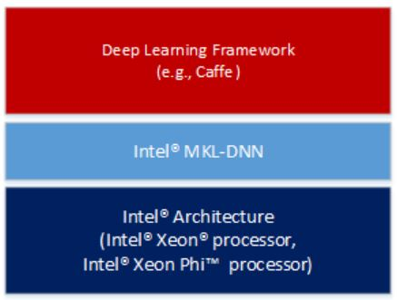

# MKL-DNN Quick start
Math Kernel Library for Deep Neural Networks <br>
英特尔 MKL-DNN 专为在英特尔架构上加快深度学习框架的速度而设计，包含了高度矢量化和线程化的构建模块，支持利用 C 和 C++ 接口实施卷积神经网络。
<p></p>

英特尔 MKL-DNN 主要在以下对象上运行：基元、引擎和流
* **基元** - 任何操作，包括卷积、数据格式重新排序和内存。基元可以以其他基元为输入，但是智能输出内存基元。
* **引擎** - 一种执行设备，如 CPU。每个基元都映射为特定的引擎。
* **流** - 一种执行环境，将基元提交至流后等待完成。提交至流的基元可能有不同的引擎。流对象也可以跟踪基元间的相关性。

## Installation
* build
```
git clone https://github.com/intel/mkl-dnn.git
cd mkl-dnn
cd scripts && ./prepare_mkl.sh && cd ..

mkdir -p build && cd build && cmake ..&& make
make test
```
* install
```
cd mkl-dnn/build
sudo make install
```

共享库 (/usr/local/lib)：
* libiomp5.so
* libmkldnn.so
* libmklml_intel.so

标头文件 (/usr/local/include)：
* mkldnn.h
* mkldnn.hpp
* mkldnn_types.h

## How to compile your code
```bash
export MKLDNN_ROOT=mkl-dnn
export LD_LIBRARY_PATH=${MKLDNN_ROOT}/build/src:${MKLDNN_ROOT}/external/mklml_lnx_2019.0.1.20180928/lib${LD_LIBRARY_PATH:+:${LD_LIBRARY_PATH}}

g++ -Wall -std=c++11 main.cpp -I${MKLDNN_ROOT}/include -L${MKLDNN_ROOT}/build/src -lmkldnn -o test
```

## Run demo
```bash
export MKLDNN_ROOT=mkl-dnn
export LD_LIBRARY_PATH=${MKLDNN_ROOT}/build/src:${MKLDNN_ROOT}/external/mklml_lnx_2019.0.1.20180928/lib${LD_LIBRARY_PATH:+:${LD_LIBRARY_PATH}}

# enable verbose mode
export MKLDNN_VERBOSE=1
./test
```

## NOTE
1. Activation functions are integrated into the Eltwise module.
```C++
  /* AlexNet: relu
   * {batch, 96, 55, 55} -> {batch, 96, 55, 55}
   */
  const double negative_slope = 1.0;

  // original relu
  //auto relu_dst_memory = mkldnn::memory(conv_prim_desc.dst_primitive_desc());

  //auto relu_desc = mkldnn::relu_forward::desc(mkldnn::prop_kind::forward, 
  //    conv_prim_desc.dst_primitive_desc().desc(), negative_slope);

  //auto relu_prim_desc = mkldnn::relu_forward::primitive_desc(relu_desc, cpu_engine);

  //net.push_back(mkldnn::relu_forward(relu_prim_desc, conv_dst_memory, relu_dst_memory));

  // Eltwise alternate
  auto relu_desc = mkldnn::eltwise_forward::desc(mkldnn::prop_kind::forward,
      mkldnn::algorithm::eltwise_relu,
      conv_prim_desc.dst_primitive_desc().desc(), negative_slope);

  auto relu_prim_desc = mkldnn::eltwise_forward::primitive_desc(relu_desc, cpu_engine);

  auto relu_dst_memory = mkldnn::memory(relu_prim_desc.dst_primitive_desc());

  auto relu_fd = mkldnn::eltwise_forward(relu_prim_desc, conv_dst_memory, relu_dst_memory);
  net.push_back(relu_fd);
```

###### reference:
* source code: https://github.com/intel/mkl-dnn
* tutorial ref: https://software.intel.com/ru-ru/node/731389

# OpenCV 环境安装

##### 方式1: 从源码编译安装 （不推荐）
该方式主要针对项目有明确的指定版本时的需求。

##### 方式2：从 Linux 源安装
```bash
# Debian 系列
sudo apt-get install libopencv-dev
# RedHat 系列
sudo yum install opencv-devel
```
注意，旧版系统默认安装 2.4.5，新版系统可能安装 3.2.0 或者以上版本。

### 头文件兼容性问题解决

##### 1 cv.h 的问题
2.4 版本的开发者可能使用如下的头引用：
```c++
#include <cv.h>
```
3.0 以上版本对应的头引用如下：
```c++
#include <opencv/cv.hpp>
```

# OpenMP 环境安装
