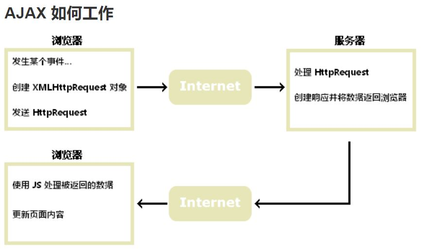

# PHP Quick Start
快速理解、感受 PHP 脚本语言:

PHP 是服务器端脚本语言。 <br>
用途：创建动态交互性站点（网站）. <br>
特点：
* PHP 文件可包含文本、HTML、JavaScript代码和 PHP 代码
* <font color="#CC0000">**PHP 代码在服务器上执行，结果以纯 HTML 形式返回给浏览器**</font>
* PHP 文件的默认文件扩展名是 ".php"

例子：
```html
<!DOCTYPE html> 
<html> 
<body> 

<?php 
echo "Hello World!"; 
?> 

</body> 
</html>
```

## PHP 能做什么？
* PHP 可以生成动态页面内容
* PHP 可以创建、打开、读取、写入、关闭服务器上的文件
* PHP 可以收集表单数据
* PHP 可以发送和接收 cookies
* PHP 可以添加、删除、修改您的数据库中的数据
* PHP 可以限制用户访问您的网站上的一些页面
* PHP 可以加密数据

通过 PHP，您不再限于输出 HTML。您可以输出图像、PDF 文件，甚至 Flash 电影。您还可以输出任意的文本，比如 XHTML 和 XML。


## PHP 与 AJAX
**AJAX 简介:** <br>
AJAX 是一种在无需重新加载整个网页的情况下，能够更新部分网页的技术。 <br>
AJAX = Asynchronous JavaScript and XML.

**AJAX 基于因特网标准，并使用以下技术组合：**
* XMLHttpRequest 对象（与服务器异步交互数据）
* JavaScript/DOM（显示/取回信息）
* CSS（设置数据的样式）
* XML（常用作数据传输的格式）

<font color="#CC0000">**HTML 中的 javascript 代码在 browser 中执行，实现无需重新加载下的页面更新**</font>

<p></p>
