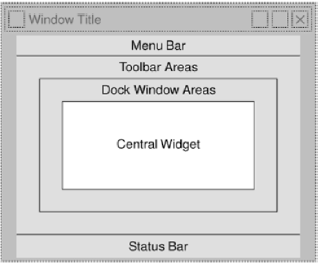

## PyQt5

#### Part 1 —— PyQt 入门
—— http://www.tutorialspoint.com/pyqt

##### 1.1 PyQt 简介
PyQt is a GUI widgets toolkit. 

##### 1.2 PyQt 版本
* ***PyQt4***
* ***PyQt5***

PyQt4 同时支持 Python2 和 Python3，PyQt5 仅支持 Python3。

##### 1.3 PyQt 的组成
* ***QtCore*** —— 处理文件/目录等等的非 GUI 功能，以及 event loop， Qt’s signal and slot mechanism， animations 等等。
* ***QtGui*** —— 包含所有的 *low level* UI 控件。 *The core classes common to widget and OpenGL GUIs.*
* ***QtWidgets*** —— 用于 *classic desktop-style* UI 制作。 *higher level APIs.*
* 其他模块
    * ***QtXml*** —— XML
    * ***QtSvg*** —— SVG（Structured Vector Graphics） 文件渲染
    * ***QtSql*** —— SQL
    * ***QtWebEngineWidgets*** —— 一个 web browser 的实现，取代（supersede）旧的 QtWebKit 模块，更好的支持 HTML/CSS/JavaScript 特性。

详细列表，请查看 <br>
https://www.riverbankcomputing.com/static/Docs/PyQt5/module_index.html#ref-module-index

##### 1.4 PyQt 对象树
* ***QObject*** —— 所有 Qt 对象的基类。
* ***QPaintDevice*** —— 所有可绘制（painted）对象的基类。
* ***QApplication*** —— GUI App 入口。
* ***QMainWindow*** —— 主界面类。

###### QMainWindow 对象的盒子模型
<div align="center"></div>

##### 1.5 PyQt Signals-Slots 机制
—— GUI 应用程序与 Console Mode 应用程序的 sequential manner 不同，由事件驱动。

* 完整写法
```python
QtCore.QObject.connect(widget, QtCore.SIGNAL('signalname'), slot_function)
```
* 简便写法
```python
widget.signal.connect(slot_function)
```

示例： PyQt 4.8
```python
import sys
from PyQt4.QtCore import *
from PyQt4.QtGui import *

def window():
   app = QApplication(sys.argv)
   win = QDialog()
   b1 = QPushButton(win)
   b1.setText("Button1")
   b1.move(50,20)
   b1.clicked.connect(b1_clicked)

   b2 = QPushButton(win)
   b2.setText("Button2")
   b2.move(50,50)
   QObject.connect(b2,SIGNAL("clicked()"),b2_clicked)

   win.setGeometry(100,100,200,100)
   win.setWindowTitle("PyQt")
   win.show()
   sys.exit(app.exec_())

def b1_clicked():
   print("Button 1 clicked")

def b2_clicked():
   print("Button 2 clicked")

if __name__ == '__main__':
   window()
```

##### 1.6 PyQt Layout （布局）
##### 基础布局方法 （Absolute Positioning）
—— 以像素为单位，指定在 MainWindow 左上角位置和该组件的宽高。
```python
QWidget.setGeometry(xpos, ypos, width, height)
```
##### 高级布局方式 （Elegant Management）
—— Layout ***div***
* QBoxLayout （*lines up the widgets vertically or horizontally*） <br>
  https://www.tutorialspoint.com/pyqt/pyqt_qboxlayout_class.htm
* QGridLayout （*a grid of cells*） <br>
  https://www.tutorialspoint.com/pyqt/pyqt_qgridlayout_class.htm
* QFormLayout （*a convenient way to create two column form*） <br>
  https://www.tutorialspoint.com/pyqt/pyqt_qformlayout_class.htm

<br>

#### Part 2 —— PyQt UI 实例

##### 2.1 PyQt 加载网页
* PyQt 安装
```bash
  pip3 install --force-reinstall PyQt5==5.10.1
```
* 注意
```
Note that for v5.11 and later the 32-bit Windows wheels do not contain
the WebEngine modules.
```

代码
```python
import os
import sys

from PyQt5.QtCore import *
from PyQt5.QtGui import *
from PyQt5.QtWidgets import *
from PyQt5.QtWebEngineWidgets import *


class MainWindow(QMainWindow):
    def __init__(self):
        super(QMainWindow, self).__init__()
        self.setWindowTitle("MainForm")
        #相当于初始化这个加载web的控件
        self.browser = QWebEngineView()
        #加载外部页面，调用
        self.browser.load(QUrl("http://www.baidu.com"))
        self.setCentralWidget(self.browser)


if __name__=='__main__':
    app = QApplication(sys.argv)
    win = MainWindow()
    win.show()
    sys.exit(app.exec_())
```
*Note:* ***QMainWindow*** 和 ***QApplication*** 类在 *QtWidgets* 模块内。
