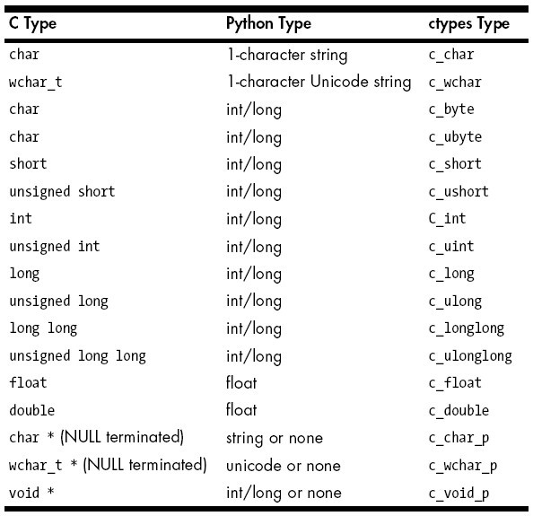
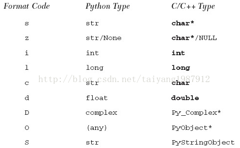

## Python C++ 混合编程


#### 1. C++ 动态库 so 编译

```
gcc 编译： gcc -o libpycall.so -shared -fPIC pycall.c
g++ 编译： g++ -o libpycallclass.so -shared -fPIC pycallclass.cpp (需要使用 extern "C"来进行辅助)
```

* Python 调用 C++(类) 动态链接库
```cpp
/* C++ 类文件： pycallclass.cpp */
#include <iostream>  
using namespace std;  
  
class TestLib  
{  
    public:  
        void display();  
        void display(int a);  
};  
void TestLib::display() {  
    cout<<"First display"<<endl;  
}  
  
void TestLib::display(int a) {  
    cout<<"Second display:"<<a<<endl;  
}  
extern "C" {  
    TestLib obj;  
    void display() {  
        obj.display();   
      }  
    void display_int() {  
        obj.display(2);   
      }  
}


/* Python 程序： pycallclass.py */
import ctypes  
so = ctypes.cdll.LoadLibrary   
lib = so("./libpycallclass.so")   
print 'display()'  
lib.display()  
print 'display(100)'  
lib.display_int(100) 
```


#### 2. Python 调用 so 动态库函数

###### 如果 python 在调用 C 函数内部出现了问题，系统不会提示具体出现什么问题，只会提示 "segmentation fault" 。所以最好是先用 C 语言调用该动态库验证没有问题了再提供给 python 调用。
```
python 调用 C++ 中的类：
因为 python 不能直接调用 C++ 中的类，所以必须把 C++ 中的类转换为 C 的接口

#ifdef __cplusplus
extern "C" {
#endif
xxxxxx function declaration xxxxx
#ifdef __cplusplus
}
#endif
```


#### 3. Python C++ 之间的数据传递

###### python 传参给 C 函数时，可能会因为 python 传入实参与 C 函数形参类型不一致会出现问题。

* python - cpp 数据类型对照标


* C 数组的传入传出
```python
1. 如果将 python 中 list 传入 C 函数数组，则需要提前转换。

import ctypes
pyarray = [1, 2, 3, 4, 5]
carrary = (ctypes.c_int * len(pyarray))(*pyarray) //有点类似malloc的方式生成carray
print so.sum_array(carray, len(pyarray))

2. 如果如果需要将 C array 返回 python，需要提前把 array 传入，然后在 C 函数中修改，返回时再把 c array 转换为 np.array。

pyarray = [1,2,3,4,5,6,7,8]
carray = (ctypes.c_int*len(pyarray))(*pyarray)
so.modify_array(carray, len(pyarray))
print np.array(carray)

[output]:
[10 20 30 40 50 60 70 80]
```

* numpy 数组的传入传出
```python
用形参方式提前定义函数接口，然后再传入 numpy 结构。
import ctypes
import numpy as np
from numpy.ctypeslib import ndpointer
so = ctypes.CDLL('./sum.so')
pyarray = np.array([1,2,3,4,5,6,7,8], dtype="int32")
fun = so.modify_array
fun.argtypes = [ndpointer(ctypes.c_int), ctypes.c_int]
fun.restype = None
fun(pyarray, len(pyarray))
print np.array(pyarray)

注意： numpy 中的数据类型指定很重要，即 dtype 的设定。
```

* 图片数据的传入传出
```python
python 中的 opencv 图片是用 numpy 的方式保存，而 opencv3 C 语言的图片数据结构为 cvMat (IplImage已经逐弃用)。
所以需要把 python 中 numpy 图片转换为 ctypes.POINTER(ctypes.c_ubyte) 的指针转入其数据域，再将其行列信息传入，就可以在 C 中从最底层初始化一个 cvMat，如果要初始化一个其他数据结构的图片也是同理(如： darknet 的 image， caffe 的 blob)。

# python numpy image 转换为 C pointer的方法
python_frm.ctypes.data_as(C.POINTER(ctypes.c_ubyte))

注意： 无论是何种方式得到的 numpy image，都先强行转换为 numpy array，再传入 ctypes_so.fun。
```


#### 4. 扩展 Python（C++ 为 Python 编写扩展模块）

###### 为 Python 创建扩展需要三个主要的步骤：创建应用程序代码、利用样板来包装代码和编译与测试。

##### 4.1 创建应用程序代码 （c++ demo）
```cpp
#include <stdio.h>  
#include <stdlib.h>  
#include <string.h>  
  
int fac(int n)  
{  
    if (n < 2) return(1); /* 0! == 1! == 1 */  
    return (n)*fac(n-1); /* n! == n*(n-1)! */  
}  
  
char *reverse(char *s)  
{  
    register char t,                    /* tmp */  
            *p = s,                     /* fwd */  
            *q = (s + (strlen(s) - 1)); /* bwd */  
  
    while (p < q)               /* if p < q */  
    {  
        t = *p;         /* swap & move ptrs */  
        *p++ = *q;  
        *q-- = t;  
    }  
    return(s);  
}  
  
int main()  
{  
    char s[BUFSIZ];  
    printf("4! == %d\n", fac(4));  
    printf("8! == %d\n", fac(8));  
    printf("12! == %d\n", fac(12));  
    strcpy(s, "abcdef");  
    printf("reversing 'abcdef', we get '%s'\n", \  
        reverse(s));  
    strcpy(s, "madam");  
    printf("reversing 'madam', we get '%s'\n", \  
        reverse(s));  
    return 0;  
}  
```

##### 4.2 用样板来包装代码
```
* 接口的代码被称为“样板”代码，它是应用程序代码与Python解释器之间进行交互所必不可少的一部分。
* 样板主要分为 4 步：
    1. 包含 Python 的头文件
    2. 为每个模块的每一个函数增加一个型如: PyObject* Module_func() 的包装函数
    3. 为每个模块增加一个型如: PyMethodDef ModuleMethods[] 的数组
    4. 增加模块初始化函数: void initModule()
```
```cpp
#include <stdio.h>  
#include <stdlib.h>  
#include <string.h>  
  
int fac(int n)  
{  
    if (n < 2) return(1);  
    return (n)*fac(n-1);  
}  
  
char *reverse(char *s)  
{  
    register char t,  
            *p = s,  
            *q = (s + (strlen(s) - 1));  
  
    while (s && (p < q))  
    {  
        t = *p;  
        *p++ = *q;  
        *q-- = t;  
    }  
    return(s);  
}  
  
int test()  
{  
    char s[BUFSIZ];  
    printf("4! == %d\n", fac(4));  
    printf("8! == %d\n", fac(8));  
    printf("12! == %d\n", fac(12));  
    strcpy(s, "abcdef");  
    printf("reversing 'abcdef', we get '%s'\n", \  
        reverse(s));  
    strcpy(s, "madam");  
    printf("reversing 'madam', we get '%s'\n", \  
        reverse(s));  
    return 0;  
}  
  
#include "Python.h"  
  
static PyObject *  
Extest_fac(PyObject *self, PyObject *args)  
{  
    int num;  
    if (!PyArg_ParseTuple(args, "i", &num))  
        return NULL;  
    return (PyObject*)Py_BuildValue("i", fac(num));  
}  
  
static PyObject *  
Extest_doppel(PyObject *self, PyObject *args)  
{  
    char *orig_str;  
    char *dupe_str;  
    PyObject* retval;  
  
    if (!PyArg_ParseTuple(args, "s", &orig_str))  
        return NULL;  
    retval = (PyObject*)Py_BuildValue("ss", orig_str,  
        dupe_str=reverse(strdup(orig_str)));  
    free(dupe_str);             #防止内存泄漏  
    return retval;  
}  
  
static PyObject *  
Extest_test(PyObject *self, PyObject *args)  
{  
    test();  
    return (PyObject*)Py_BuildValue("");  
}  
  
static PyMethodDef  
ExtestMethods[] =  
{  
    { "fac", Extest_fac, METH_VARARGS },  
    { "doppel", Extest_doppel, METH_VARARGS },  
    { "test", Extest_test, METH_VARARGS },  
    { NULL, NULL },  
};  
  
void initExtest()  
{  
    Py_InitModule("Extest", ExtestMethods);  
} 
```
说明：
```
* 模块名为 Extest，其中一个包装函数叫 Extest_fac()。
* 在 Python 脚本中使用时先 import Extest，然后调用 Extest.fac()。
* 当 Extest.fac() 被调用时，包装函数 Extest_fac() 会被调用，包装函数接受一个 Python 的整数参数，把它转为 C 的整数，然后调用 C 的 fac()函数，得到一个整型的返回值，最后把这个返回值转为 Python 的整型数做为整个函数调用的结果返回。

* 为每个模块增加一个型如: PyMethodDef ModuleMethods[] 的数组，以便于 Python 解释器能够导入并调用它们，每一个数组都包含了函数在 Python 中的名字。
* METH_VARARGS 表示参数以 tuple 形式传入。
* 若需要使用 PyArg_ParseTupleAndKeywords() 函数来分析命名参数的话，还需要让这个标志常量与 METH_KEYWORDS 常量进行逻辑与运算常量。
* 数组最后用两个 NULL 来表示函数信息列表的结束。

* 所有工作的最后一部分就是模块的初始化函数，调用： Py_InitModule() 函数，并把模块名和 ModuleMethods[] 数组的名字传递进去，以便于解释器能正确的调用模块中的函数。
```

* ***从 Python 到 C 的转换用 PyArg_Parse\*系列函数***
* ***从 C 到 Python 的转换函数是 PyObject\* Py_BuildValue()***

##### 4.3  编译
```
distutils 包被用来编译、安装和分发这些模块、扩展和包的。

创建一个setup.py 文件，编译最主要的工作由setup()函数来完成：
#!/usr/bin/env python  
  
from distutils.core import setup, Extension  
  
MOD = 'Extest'  
setup(name=MOD, ext_modules=[Extension(MOD, sources=['Extest2.c'])])

运行 setup.py build 命令就可以开始编译扩展了，提示部分信息：
creating build/lib.linux-x86_64-2.6
gcc -pthread -shared build/temp.linux-x86_64-2.6/Extest2.o -L/usr/lib64 -lpython2.6 -o build/lib.linux-x86_64-2.6/Extest.so

安装到 Python 中：
python setup.py install 
```

##### 4.4 引用计数和线程安全
```
Python 对象引用计数的宏： Py_INCREF(obj) 增加对象 obj 的引用计数，Py_DECREF(obj) 减少对象 obj 的引用计数。Py_INCREF() 和 Py_DECREF() 两个函数也有一个先检查对象是否为空的版本，分别为 Py_XINCREF() 和 Py_XDECREF()。
编译扩展的程序员必须要注意，代码有可能会被运行在一个多线程的 Python 环境中。这些线程使用了两个 C 宏 Py_BEGIN_ALLOW_THREADS 和 Py_END_ALLOW_THREADS，通过将代码和线程隔离，保证了运行和非运行时的安全性，由这些宏包裹的代码将会允许其他线程的运行。
```

* C 与 Python 之间数据转换的转换代码



#### 5. C/C++ 调用 Python


###### reference:
https://www.cnblogs.com/apexchu/p/5015961.html
