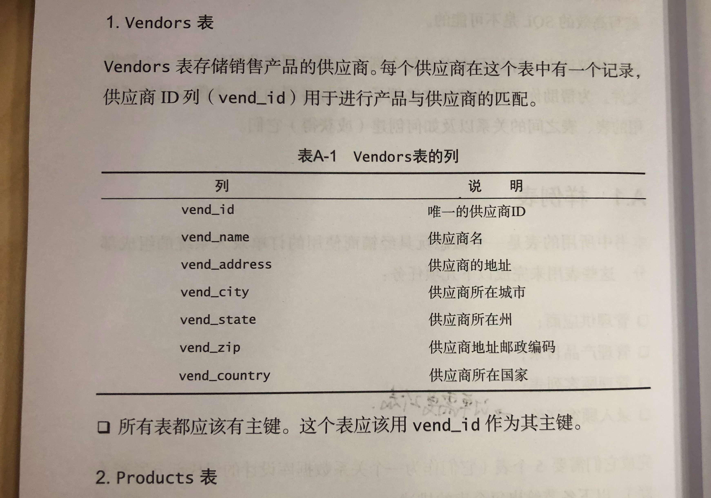
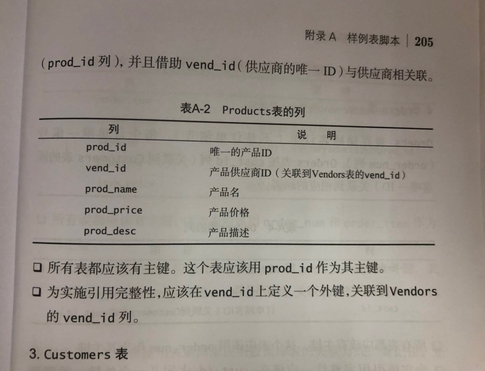
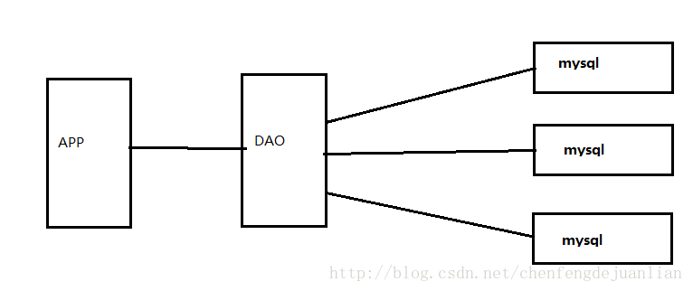
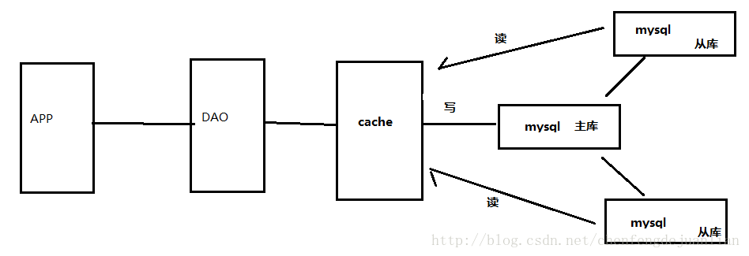
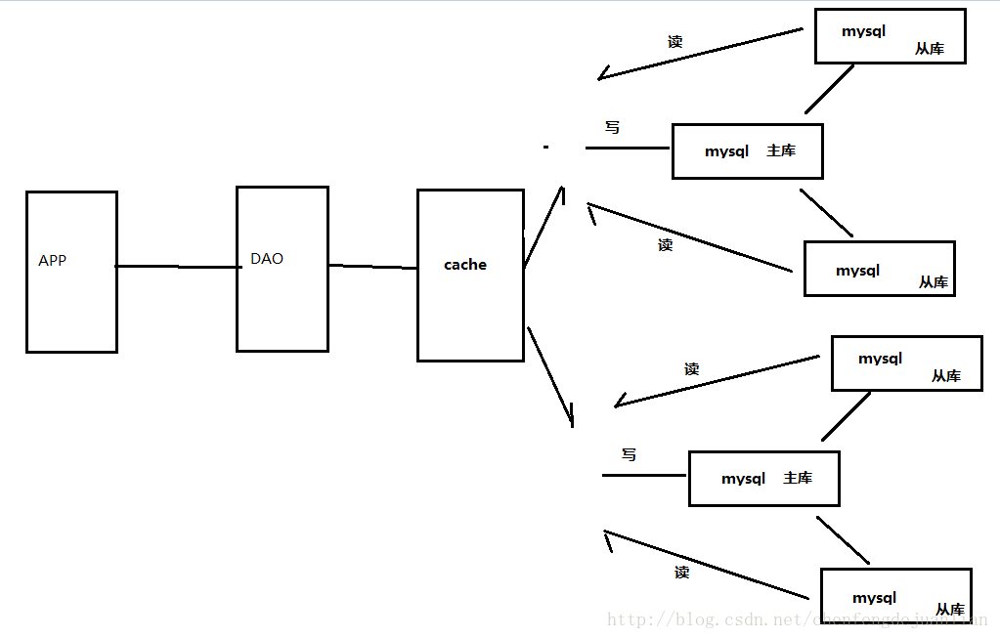

## SQL (Structured Query Language, *sequel*)
—— 来源 《SQL 必知必会》

###### 很多图书讲的不是 SQL 本身，而是从数据库设计、规范化到关系数据库理论以及管理问题等，事无巨细都讲一通。

#### 目录
1. 检索数据（Retrieving Data）
2. 排序检索数据（Sorting Retrieved Data）
3. 过滤数据（Filtering Data）
4. 高级数据过滤（Advanced Data Filtering）
5. 用通配符进行过滤（Using Wildcard Filtering）
6. 创建计算字段（Creating Calculated Fields）
7. 使用函数处理数据（Using Data Manipulation Functions）
8. 汇总数据（Summarizing Data）
9. 分组数据（Grouping Data）
10. 使用子查询（Working with Subqueries）
11. 联结表（Joining Tables）
12. 创建高级联结（Creating Advanced Joins）
13. 组合查询（Combining Queries）
14. 插入数据（Inserting Data）
15. 更新和删除数据（Updating and Deleting Data）
16. 创建和操纵表（Creating and Manipulating Tables）
17. 使用视图（Using Views）
18. 使用存储过程（Working with Stored Procedures）
19. 管理事务处理（Managing Transaction Processing）
20. 使用游标（Using Cursors）
21. 高级 SQL 特性（Understanding Advanced SQL Features）

<br>

##### 数据库（database）
—— 数据库软件应称为数据库管理系统（DBMS）
* 表（table） —— 表的模式（schema）描述了数据在表中如何存储。
* 列（column），又称字段。
* 行（row），又常常被称为记录（record）。
* 主键（primary key），表中每一行都应该有一列（或几列结合）可以唯一标识自己。
* 外键（foreign key） —— 即，联结（Join）。 联结是两个表的公用字段。
##### 注意，定义主键并不总是被 DBMS 强制要求的，但应该总是定义主键。

外键示例
```
db = SQLAlchemy(app)  # SQLAlchemy 示例

class User(db.Model):
    __tablename__ = "user"
    id = db.Column(db.Integer, primary_key=True)  # 编号
    name = db.Column(db.String(20), nullable=False)  # 账号
    pwd = db.Column(db.String(100), nullable=False)  # 密码
    addtime = db.Column(db.DateTime, nullable=False, index=True, default=datetime.now)  # 注册时间
    articles = db.relationship('Article', backref='user')  # 文章外键关系关联
    def __repr__(self):   # 重定义 typeof() 返回字符串 
        return "<User %r>" % self.name
    def check_pwd(self, pwd):  # 自定义函数
        return check_password_hash(self.pwd, pwd)

class Article(db.Model):
    __tablename__ = "article"
    id = db.Column(db.Integer, primary_key=True)  # 编号
    title = db.Column(db.String(255), nullable=False, unique=True)  # 标题
    cate = db.Column(db.Integer, nullable=False)  # 分类
    logo = db.Column(db.String(255), nullable=False)  # 封面
    user_id = db.Column(db.Integer, db.ForeignKey('user.id'))  # 作者
    content = db.Column(db.Text, nullable=False)  # 内容
    addtime = db.Column(db.DateTime, nullable=False, index=True, default=datetime.now)  # 添加时间
    def __repr__(self):
        return "<Article %r>" % self.title

if __name__ == "__main__":
    db.create_all()  # create tables
    # user = User(  # create a record to test saving
    #     name="root",
    #     pwd=generate_password_hash("root"),
    #     addtime=datetime.now().strftime("%Y-%m-%d %H:%M:%S")
    # )
    # db.session.add(user)
    # db.session.commit()
```

##### 主键的特点
—— 显示声明的，每行的唯一标识
* 任意两行的主键值都不同。
* 主键列不允许 NULL 值。
* 主键列中的值不允许修改或更新。
* 主键不能重用。（**如果某行从表中删除，它的主键不能赋给以后的新行。**）

<br>

#### Part 1 —— 检索 (***SELECT***)
##### 1. 检索数据
* 检索单个列
```
SELECT prod_name
FROM Products;
```
* 检索多个列
```
SELECT prod_id, prod_name, prod_price
FROM Products;
```
* 检索所有列
```
SELECT *
FROM Products;
```
* 检索不同的值（即，去重）
```
SELECT DISTINCT vend_id
FROM Products;
```
* 限制结果（即，限制返回的条目数量）
```
注意，不同的 DBMS 语法不同
ex1: SELECT TOP 5 prod_name
     FROM Products;
ex2: SELECT prod_name
     FROM Products
     FETCH FIRST 5 ROWS ONLY;
ex3: SELECT prod_name
     FROM Products
     LIMIT 5 OFFSET 5;
等等
```
* 添加注释
```
SELECT prod_name    -- 这是一条注释
FROM Products;
# 这是一条注释
SELECT prod_name
FROM Products;
/*
 这是一个多行注释
 */
SELECT prod_name
FROM Products;
```
###### 小结1
* ***SELECT column_name1, column_name2 FROM table_name;***
* ***SELECT * FROM table_name;***
* ***SELECT DISTINCT column_name1, column_name2 FROM table_name;***
* ***SELECT column_name1, column_name2 FROM table_name LIMIT 5;***

##### 2. 排序检索数据
* 排序数据
```
SELECT prod_name
FROM Products
ORDER BY prod_name;
```
* 按多个列排序
```
SELECT prod_id, prod_price, prod_name
FROM Products
ORDER BY prod_price, prod_name;
```
* 按列位置排序 （即，用列序号代替列名）
```
SELECT prod_id, prod_price, prod_name
FROM Products
ORDER BY 2, 3;
```
* 指定排序方向 （即，升序or降序）
```
SELECT prod_id, prod_price, prod_name
FROM Products
ORDER BY prod_price DESC;  -- 只有一列时
SELECT prod_id, prod_price, prod_name
FROM Products
ORDER BY prod_price DESC, prod_name;  -- 在一个列上降序 （如果多列，每个 column_name 后都加上 DESC 或 ASC）
```
###### 小结2
* ***SELECT column_name1, column_name2 FROM table_name ORDER BY column_name;***
* ***SELECT column_name1, column_name2 FROM table_name ORDER BY column_namea, column_nameb;***
* ***SELECT column_name1, column_name2 FROM table_name ORDER BY column_namea DESC, column_nameb DESC;***

##### 3. 过滤数据 —— 指定检索条件
* 使用 WHERE 子句
```
SELECT prod_name, prod_price
FROM Products
WHERE prod_price = 3.49;
```
* WHERE 子句操作符
    * 等于，大于，小于，between 等等比较符，请查阅 DBMS 手册
```
SELECT prod_name, prod_price
FROM Products
WHERE prod_price < 10;
```
* 不匹配项查找
```
SELECT vend_id, prod_name
FROM Products
WHERE vend_id <> 'DLL01';
```
* 范围值查找
```
SELECT prod_name, prod_price
FROM Products
WHERE prod_price BETWEEN 5 AND 10;
```
* 空值查找
```
SELECT cust_name
FROM Customers
WHERE cust_email IS NULL;
```
###### 小结3
* ***SELECT column_name1, column_name2 FROM table_name WHERE column_name < 字面值常量;***
* ***SELECT column_name1, column_name2 FROM table_name WHERE column_name <> '字面值字符串';***
* ***SELECT column_name1, column_name2 FROM table_name WHERE column_name BETWEEN 字面值常量1 AND 字面值常量2;***
* ***SELECT column_name1, column_name2 FROM table_name WHERE column_name IS NULL;***

##### 4. 高级数据过滤
* 组合 WHERE 子句 (***AND*** 或 ***OR***)
```
SELECT prod_id, prod_price, prod_name
FROM Products
WHERE vend_id = 'DLL01' AND prod_price <= 4;
SELECT prod_name, prod_price
FROM Products
WHERE vend_id = 'DLL01' OR vend_id = 'BRS01';
```
* SQL 的复杂逻辑运算求值顺序 （默认优先处理 AND 操作符）
```
SELECT prod_name, prod_price
FROM Products
WHERE (vend_id = 'DLL01' OR vend_id = 'BRS01') AND prod_price >= 10;
```
* IN 操作符
```
SELECT prod_name, prod_price
FROM Products
WHERE vend_id IN ('DLL01', 'BRS01')
ORDER BY prod_name;
```
* NOT 操作符
```
SELECT prod_name
FROM Products
WHERE NOT vend_id = 'DLL01'
ORDER BY prod_name;
```
###### 小结4
* ***SELECT column_name1, column_name2 FROM table_name WHERE (column_namea = \'字符串1' OR column_nameb = \'字符串2') OR column_namec >= 字面值常量;***
* ***SELECT column_name1, column_name2 FROM table_name WHERE column_name IN ('字面值1', '字面值2', '字面值3');***
* ***SELECT column_name1, column_name2 FROM table_name WHERE NOT column_name < 字面值常量;***

##### 5. 用通配符进行过滤 —— “模糊搜索”
* LIKE 操作符
    * % 通配符
```
SELECT prod_id, prod_name
FROM Products
WHERE prod_name LIKE 'FISH%';   -- % 匹配任意字符的任意次数
```
* \_ 通配符
```
SELECT prod_id, prod_name
FROM Products
WHERE prod_name LIKE '__ inch teddy bear';  -- _ 与 % 用途一样，只是仅匹配单个字符。
```
* \[] 通配符
```
SELECT cust_contact
FROM Customers
WHERE cust_contact LIKE '[JM]%'  -- 第一字符为 J 或 M.
ORDER BY cust_contact;
```
* 使用通配符的代价
```
通配符搜索（“模糊搜索”） LIKE， 一般比前面讨论的其他搜索耗费更长的处理时间。
```
###### 小结5
* ***SELECT column_name1, column_name2 FROM table_name WHERE column_name LIKE '[^JM]%';***
* ***SELECT column_name1, column_name2 FROM table_name WHERE column_name LIKE '__ teddy bear';'***

##### 6. 创建计算字段 —— 字符串拼接 或 算术计算
* 拼接字段
```
SELECT vend_name + '(' + vend_country + ')'
FROM Vendors
ORDER BY vend_name;
SELECT vend_name || '(' || vend_country || ')'
FROM Vendors
ORDER BY vend_name;  -- + 与 || 的意思相同，只是不同数据库的表示方法不同。
SELECT Concat(vend_name, '(', vend_country, ')')
FROM Vendors
ORDER BY vend_name; -- 同上， MySQL/MariaDB 语法
```
* 去掉拼接字段检索列的两侧空白填充 （参考 python strip 功能）
```
SELECT RTRIM(vend_name) + '(' + RTRIM(vend_country) + ')'
FROM Vendors
ORDER BY vend_name;
```
* 使用别名 （参考 bash alias 功能）
```
SELECT RTRIM(vend_name) + '(' + RTRIM(vend_country) + ')'
       AS vend_title
FROM Vendors
ORDER BY vend_name;
```
* 执行算术计算
```
SELECT prod_id,
       quantity,
       item_price,
       quantity*item_price AS expanded_price  -- 定义计算字段，并指定别名
FROM OrderItems
WHERE order_num = 2008;
```
###### 小结6
* ***SELECT column_name1 + '-' + column_name2 FROM table_name;***
* ***SELECT RTRIM(column_name1) + '-' + RTRIM(column_name2) FROM table_name;***
* ***SELECT RTRIM(column_name1) + '-' + RTRIM(column_name2) AS alias_name FROM table_name;***
* ***SELECT column_name1, column_name2, column_name1\*column_name2 AS alias_name FROM table_name;***

##### 7. 使用函数处理数据 —— 内置函数的使用
* 文本处理函数
    * *LEFT()*
    * *RIGHT()*
    * *LENGTH()*
    * *LOWER()*
    * *UPPER()*
    * *RTRIM()*
    * *LTRIM()*
    * *SOUNDEX()*  -- 文本转发音
```
SELECT cust_name, cust_contact
FROM Customers
WHERE SOUNDEX(cust_contact) = SOUNDEX('Michael Green');
```
* 日期和时间处理函数
```
SELECT order_num
FROM Orders
WHERE DATEPART(yy, order_date) = 2012;  -- 年、月分割获取
/* 每种数据库的时间处理函数不同 */
```
* 数值处理函数
    * *ABS()*
    * *COS()*
    * *EXP()*
    * *PI()*
    * *SIN()*
    * *SQRT()*
    * *TAN()*
###### 小结7
* ***SELECT column_name1, column_name2 WHERE SOUNDEX(column_name2) = SOUNDEX('字符串'');***

##### 8. 汇总数据(Summarizing Data) —— 内置统计函数的使用
* 聚集函数
    * *AVG()*
    * *COUNT()*
    * *MAX()*
    * *MIN()*
    * *SUM()*
```
SELECT AVG(prod_price) AS avg_price
FROM Products;
SELECT COUNT(*) AS num_cust  -- 统计客户数量
FROM Customers;
SELECT SUM(item_price*quantity) AS total_price  -- 计算订单总价
FROM OrderItems
WHERE order_num = 20005;
```
* 聚合不同值，考虑 DISTINCT 关键词的加入
```
SELECT AVG(DISTINCT prod_price) AS avg_price  -- 过滤掉值相同的 prod_price 项
FROM Products
WHERE vend_id = 'DLL01';
```
* 组合聚合函数，包含多个函数
```
SELECT COUNT(*) AS num_items,
       MIN(prod_price) AS price_min,
       MAX(prod_price) AS price_max,
       AVG(prod_price) AS price_avg
FROM Products;
```
###### 小结8
* ***SELECT COUNT(\*) AS rows_num FROM table_name;***

##### 9. 分组数据 —— 使用内置函数划分子集
* 创建分组 ***GROUP BY***
```
SELECT vend_id, COUNT(*) AS num_prods
FROM Products
GROUP BY vend_id;  -- 对每个 vend_id 计算 num_prods.
```
* 过滤分组 ***HAVING*** (请类比 WHERE 用法)
```
SELECT cust_id, COUNT(*) AS orders
FROM Orders
GROUP BY cust_id
HAVING COUNT(*) >= 2;
```
* 特别提醒
    * ***WHERE*** 对行过滤， ***HAVING*** 对组过滤。
    * ***ORDER BY*** 输出结果按序， ***GROUP BY*** 先分组，后在各独立组内检索
###### 小结9
* ***SELECT column_name1, column_name2 FROM table_name GROUP BY column_name;***

##### 10. 使用子查询 —— SELECT 结果的管道传递 （参考 bash 的管道功能）
* 利用子查询进行过滤
```
SELECT cust_id
FROM Orders
WHERE order_num IN (SELECT order_num
                    FROM OrderItems
                    WHERE prod_id = 'RGAN01');  -- 将实现一个功能的两次查询合并
```
* 特别说明
    * 作为子查询的 SELECT 语句只能查询当个列。（因为，一个 WHERE 语句只能判断一个列。）
    * **"表名.列名"** 才是列名的全写，当可能出现不明确时，请使用全称。
    ```
      SELECT cust_name,
             cust_state,
             (SELECT COUNT(*)
              FROM Orders
              WHERE Orders.cust_id = Customers.cust_id) AS orders  -- 相关联的键
      FROM Customers
      ORDER　BY　cust_name;
    ```
    * 子查询常用于 WHERE 子句的 IN 操作符中。
###### 小结10
* ***SELECT column_name1, column_name2 FROM table_name WHERE column_name IN (SELECT column_name FROM table_name1 WHERE cloumn_namea < 字面值);***

##### 11. 联结表 —— 最常用的 “Inner Join”
* 预备知识
    * 关系数据库，“关系” 二字的由来 —— 信息分解成多个表，一类数据一个表，各表通过某些共同的值互相关联。
    * 初衷 —— 尽可能地减少数据冗余。（相同的数据出现多次决不是一件好事。）
    * 代价 —— 一个库中存在很多表，需要记忆表关系图。
    * 特别说明，由于数据不重复，数据显然是一致的。 （有利于数据一致性管理）
* 创建级联
```
SELECT vend_name, prod_name, prod_price  -- 整合两个表的三列
FROM Vendors, Products
WHERE Vendors.vend_id = Products.vend_id;  -- 联结常常会伴随完全限定列名的出现
```
* ***Warning:*** 要保证所有联结都有 WHERE 条件判定语句，否则...将返回比实际更多的结果。
* 内联结（又称等值联结）
```
语法1： 
SELECT vend_name, prod_name, prod_price
FROM Vendors, Products                    -- 简单格式： FROM table_name1, table_name2 WHERE ...
WHERE Vendors.vend_id = Products.vend_id;
语法2：
SELECT vend_name, prod_name, prod_price
FROM Vendors INNER JOIN Products
 ON Vendors.vend_id = Products.vend_id;   -- 标准格式： FROM table_name1 INNER JOIN table_name2 ON ...
```
* 联结多个表
```
SELECT prod_name, vend_name, prod_price, quantity
FROM OrderItems, Products, Vendors
WHERE Products.vend_id = Vendors.vend_id    -- 3.产品的供应商
 AND OrderItems.prod_id = Products.prod_id  -- 2.订单内的产品
 AND order_num = 20007;                     -- 1.订单号
```
###### 小结11
* ***SELECT table1_colname1, table2_colname1,table2_colname2 FROM table1, table2 WHERE table1.colname = table2.colname;***

##### 12. 创建高级联结 —— “self-join” “natural join” “outer join”
* 扩展知识：表别名 —— 为了缩短联结条件子语句的长度，使用 "别名.列名" 表示。
```
SELECT cust_name, cust_contact
FROM Customers AS C, Orders AS O, OrderItems as OI
WHERE C.cust_id = O.cust_id
 AND OI.order_num = O.order_num
 AND prod_id = 'RGAN01';
```
* 自联结 （Self Join） <br>
  —— 一种子查询的情况，同一个表内的两次递进查找
``` 
SELECT cust_id, cust_name, cust_contact
FROM Customers
WHERE cust_name = (SELECT cust_name
                   FROM Customers       -- 此处只返回一条 （由 contact 查 name，再由 name 查 id.）
                   WHERE cust_contact = 'Jim Jones');
新语法的诞生：
SELECT c1.cust_id, c1.cust_name, c1.cust_contact  -- 3.查 id
FROM Customers AS c1, Customers AS c2   
WHERE c1.cust_name = c2.cust_name       -- 2.name 自联
 AND c2.cust_contact = 'Jim Jones';     -- 1.contact 条件
```
* 自然联结 （Natural Join） <br>
  —— 至少有一列不止出现在一个表中。 但是，自然联结要求这个被联结的列排除多次出现（即该列一定是主键）。
```
SELECT C.*, O.order_num, O.order_date, OI.prod_id, OI.quantity, OI.item_price
FROM Customers AS C, Orders AS O, OrderItems AS OI
WHERE C.cust_id = O.cust_id        -- 用户 ID 唯一，因此只有一条
 AND OI.order_num = O.order_num    -- 点单号唯一，因此只有一条
 AND prod_id = 'RGAN01';           -- 产品 ID 唯一，因此只有一条
/* 自然联结，即联结都是只有唯一一条。 “自然联结只是个人为概念，DBMS 在机制上没有定制标准！” */
```
*Warning:* 迄今为止，建立的内联结都是自然联结。非自然联结的内联结，可能永远都用不到。
* 外联结 （Outer Join） <br>
  —— 一列应该不止出现在一个表中，但是，现在还没有实际关联上。（例如：注册了账号但是没有订单消费）
```
SELECT Customers.cust_id, Orders.order_num
FROM Customers LEFT OUTER JOIN Orders       -- cust_id 在左边的表中是主键，因此为 LEFT OUTER JION.
 ON Customers.cust_id = Orders.cust_id;
/* 外联结太经常发生了！ */
```
* ***Warning:*** 外联结一定要指定 ***LEFT*** 或 ***RIGHT***，用于明确指定 “联结在左右哪个表中是主键”。
* 使用带聚集函数的联结
```
SELECT Customers.cust_id,
       COUNT(Orders.order_num) AS num_ord
FROM Customers LEFT OUTER JOIN Orders       -- 左表主查 id， 又表主查 order， 所以 id 为 LEFT 外联结。
 ON Customers.cust_id = Orders.cust_id
GROUP BY Customers.cust_id;    /* 最常用的实例！ */
```
###### 小结12
* ***SELECT c1.colname1, c1.colname2, c1.colname3 FROM table1 AS c1, table1 AS c2 WHERE c1.colname2 = c2.colname2 AND c2.colname3 = '字符串';***
* ***SELECT table1.colname1, table2.colname2 FROM table1 LEFT OUTER JOIN table2 ON table1.colname1 = table2.colname1;***

##### 13. 组合查询 —— 并（Uinon） 或称 复合查询（Compound Query）
* 使用 UNION
```
SELECT cust_name, cust_contact, cust_email
FROM Customers
WHERE cust_state IN ('IL','IN','MI');
```
```
SELECT cust_name, cust_contact, cust_email
FROM Customers
WHERE cust_name = 'Fun4All';
```
```
SELECT cust_name, cust_contact, cust_email
FROM Customers
WHERE cust_state IN ('IL','IN','MI')
UNION
SELECT cust_name, cust_contact, cust_email  -- 注意，两个 select 的结果返回项要一致
FROM Customers
WHERE cust_name = 'Fun4All';
```
* 使用多条 WHERE 子句而不是 UNION 的相同查询
```
SELECT cust_name, cust_contact, cust_email
FROM Customers
WHERE cust_state IN ('IL','IN','MI')
 OR cust_name = 'Fun4All';
```
**对于简单例子，使用 UNION 可能比使用 WHERE 子句更为复杂。 但是，对于复杂的过滤条件或从多个表中检索，使用 UNION 会更方便。**
* 对组合结果排序
```
SELECT cust_name, cust_contact, cust_email
FROM Customers
WHERE cust_state IN ('IL','IN','MI')
UNION
SELECT cust_name, cust_contact, cust_email
FROM Customers
WHERE cust_name = 'Fun4All'
ORDER BY cust_name, cust_contact;
```
###### 小结13
* ***SELECT column_name1, column_name2, column_name3 From table1 WHERE column_namea = '字符串' UNION SELECT column_name1, column_name2, column_name3 FROM table2 WHERE column_nameb = '字符串1';***
* ***SELECT column_name1, column_name2, column_name3 From table1 WHERE column_namea = '字符串' UNION SELECT column_name1, column_name2, column_name3 FROM table2 WHERE column_nameb = '字符串1' ORDER BY column_name;***

<br>

#### Part 2 —— 插入 (***INSERT INTO***)
插入数据的方式：
* 插入完整的行
* 插入行的一部分
* 插入某些查询的结果

##### 14. 插入数据
* 插入完整的行
```
INSERT INTO Customers
VALUES('1000000006',
       'Toy Land',
       '123 Any Street',
       'New York',
       'NY',
       '11111',
       'USA',
        NULL,
        NULL);  -- 必须给每一列都提供一个值，如果没有理想值就使用 NULL。
```
```
INSERT INTO Customers(cust_id,
                      cust_contact,
                      cust_email,
                      cust_name,
                      cust_address,
                      cust_city,
                      cust_state,
                      cust_zip)
VALUES('1000000006',  -- 使用明确给出列名的插入方式才是安全的！
        NULL,
        NULL,
       'Toy Land',
       '123 Any Street',
       'New York',
       'NY',
       '11111');
```
* 插入部分行 (语法上省略带默认值或允许 NULL 的行，简化代码，因为表单一般有很多选填项。)
```
INSERT INTO Customers(cust_id,
                      cust_name,
                      cust_address,
                      cust_city,
                      cust_state,
                      cust_zip,
                      cust_country)
VALUES('1000000006',
       'Toy Land',
       '123 Any Street',
       'New York',
       'NY',
       '11111',
       'USA');
```
* 插入检索出的数据
```
INSERT INTO Customers(cust_id,
                      cust_contact,
                      cust_email,
                      cust_name,
                      cust_address,
                      cust_city,
                      cust_state,
                      cust_zip,
                      cust_country)
SELECT cust_id,
       cust_contact,
       cust_email,
       cust_name,
       cust_address,
       cust_city,
       cust_state,
       cust_zip,
       cust_country
FROM CustNew;
```
* 从一个表复制到另一个表
```
SELECT *                  -- DB 语法
INTO CustCopy
FROM Customers;  -- 先创建 CustCopy，后将 SELECT 结果插入到 CustCopy。
CREATE TABLE CustCopy AS  -- MySQL 一列数据库的语法  
SELECT * FROM Customers;
```
###### 小结14
* ***INSERT INTO table_name(column_name1, column_name2, column_name3) VALUES('字符串1','字符串2',字面值);***
* ***INSERT INTO table_name(column_name1, column_name2) SELECT column_name1, column_name2 FROM table1 WHERE column_namea = '字符串';***
* ***CREATE TABLE table_name AS SELECT column_name1, column_name2 FROM table1 WHERE column_namea = '字符串';***
* ***CREATE TABLE table_name AS*** 后的 SELECT 子句可以是查询部分的任何句法，包括 WHERE、 GROUP BY 和 联结 的使用。 

<br>

#### Part 3 —— 修改 (***UPDATE SET***)、 删除 (***DELETE FROM***)
更新表中数据的方式：
* 更新特定行
* 更新所有行

删除数据的方式：
* 将某个列设置为 NULL （伪删除）。 **注意，删除列不需要真删除，设置为 NULl 即可！！**
* 删除特定行
* 删除所有行

##### 15. 更新和删除数据
* 更新特定行的一些值
```
UPDATE Customers                        -- 表名
SET cust_email = 'git@thetoystore.com'  -- SET column_name = '字符串' or 字面值
WHERE cust_id = '1000000005';           -- WHERE 过滤条件以指定特定行. (没有 WHERE 子句将在所有行上更新！！)
```
```
UPDATE Customers
SET cust_contact = 'Sam Roberts'        -- 更新多个列，用 (,) 分隔。
    cust_email = 'sam@toyland.com'
WHERE cust_id = '1000000006';
```
* 将某个列设置为 NULL （伪删除）
```
UPDATE Customers
SET cust_email = NULL
WHERE cust_id = '1000000005';
```
* 删除特定行
```
DELETE FROM Customers
WHERE cust_id = '1000000006';  -- (没有 WHERE 子句将在所有行上执行删除！！)
```
**如果要删除的行，包含作为外键被其他表引用的列，并且确实已被引用，则不允许删除，并报错。**
* 更快的删除表中的所有行
```
TRUNCATE TABLE table_name;
```
###### 小结15
* ***UPDATE table_name SET column_name1 = '字符串', column_name2 = 字面值 WHERE column_name = '字符串';***
* ***UPDATE table_name SET column_name = NULL;***
* ***DELECT FROM table_name WHERE colmn_name = '字符串';***
* **SQL 没有撤销，请小心使用 UPDATE 和 DELETE。**

<br>

#### Part 4 —— 创建和操纵表
##### 16. 创建和操纵表
* 创建表
```
CREATE TABLE Products
(
    prod_id         CHAR(10)        NOT NULL,
    vend_id         CHAR(10)        NOT NULL,
    prod_name       CHAR(254)       NOT NULL,
    prod_price      DECIMAL(8,2)    NOT NULL      DEFAULT 1,
    prod_desc       VARCHAR(1000)   NULL
);
```
* 不同 DBMS 间的数据类型兼容性（替换）
```
varchar <-> text

DBMS 的数据类型分 4 大类：
* 字符串大类
* 数值数据大类
* 日期时间大类
* 二进制数据大类
```
* 更新表 （对表结构进行改动） —— 主要是增加列
```
ALTER TABLE Vendors
ADD vend_phone CHAR(20);
```
* 删除列 —— 不是所有 DMBS 都支持删除列，查文档确认
```
ALTER TABLE Vendors
DROP COLUMN vend_phone;
```
* 删除表
```
DROP TABLE CustCopy;
```
* 给表重命名
```
RENAME TABLE old_table TO new_table;  -- MySQL，其他 DBMS 的语法请百度
```
###### 小结16
* ***CREATE TABLE table_name(column_name1 CHAR(10) NOT NULL, column_name2 DECIMAL(8,2) NOT NULL DEFAULT 1, column_name3 VARCHAR(1000) NULL);***
* ***ALTER TABLE table_name ADD column_name CHAR(100);***
* ***ALTER TABLE table_name DROP COLUMN column_name;***
* ***DROP TABLE table_name;***
* ***RENAME TABLE old_table_name TO new_table_name;***

<br>

#### Part 5 —— 创建用户/创建数据库
##### Step 1. MySQL Client 交互
```
* 打开 MySQL Command Line Client 终端
\s 打印状态
\q 退出
\h 帮助
```
##### Step 2. 创建/删除数据库
```
* 查看当前所有数据库
show databases;
* 创建一个数据库
CREATE DATABASE 数据库名称
CREATE DATABASE IF NOT EXISTS 数据库名称 default charset utf8 COLLATE utf8_general_ci;
* 进入数据库（访问）
USE 库名;
* 删除数据库
DROP DATABASE 数据库名称;
```
##### Step 3. 创建/删除用户，以及授权
```
* 创建一个用户
select user,host from mysql.user;
create user 'username'@'%' identified by 'userpassword';
* 删除用户
drop user 'username'@'%';
* 授权 —— 用户可访问/可修改授权
grant all on *.* to 'username'@'%'
flush privileges;  -- 可选则性执行
```
##### Step 4. 创建表
```
# 创建表单
CREATE TABLE `users` (
    `id` int(11) NOT NULL AUTO_INCREMENT,
    `email` varchar(255) COLLATE utf8_bin NOT NULL,
    `password` varchar(255) COLLATE utf8_bin NOT NULL,
    PRIMARY KEY (`id`)
) ENGINE=InnoDB DEFAULT CHARSET=utf8 COLLATE=utf8_bin
AUTO_INCREMENT=1;

# 查看表单信息
show table status;
```

<br>

#### Part 6 —— 高级 SQL 功能
##### 17. 使用视图（View）
###### 现在，假如可以把整个查询包装成一个名为 ProductCustomers 的虚拟表。 <br> 视图不包含任何真正的行或数据，它只包含一个查询。（因为，查询的结果即是一个子集，何必保存数据呢？！）
* 创建视图 —— 简化复杂的联结
```
CREATE VIEW ProductCustomers AS  -- 创建一个视图
SELECT cust_name, cust_contact, prod_id  -- 视图对应的查询
FROM Customers, Orders, OrderItems
WHERE Customers.cust_id = Orders.cust_id,
 AND  OrderItems.order_num = Orders.order_num;
```
```
SELECT cust_name, cust_contact  -- 基于视图做查询 (起到简化/封装隐藏作用)
FROM ProductCustomers
WHERE prod_id = 'RGAN01';
```
* 创建视图 —— 重新格式化检索出的数据
```
CREATE VIEW VendorLocations AS
SELECT RTRIM(vend_name) || '(' || RTRIM(vend_country) || ')'
       AS vend_title
FROM Vendors;
```
```
SELECT *
FROM VendorLocaitons;
```
* 创建视图 —— 过滤不想要的数据
```
CREATE VIEW CustomerEMailList AS
SELECT cust_id, cust_name, cust_email
FROM Customers
WHERE cust_email IS NOT NULL;
```
```
SELECT *
FROM CustomerEMailList;
```
* 创建视图 —— 添加计算字段
```
CREATE VIEW OrderItemsExpanded AS
SELECT order_num,
       prod_id,
       quantity,
       item_price,
       quantity*item_price AS expanded_price
FROM OrderItems;
```
```
SELECT *
FROM OrderItemsExpanded
WHERE order_num = 20008;
```
###### 小结17
* ***CREATE VIEW view_name AS SELECT ... FROM ... WHERE ...;***

##### 18. 使用存储过程
###### 存储过程是为了以后使用而保存的一条或多条 SQL 语句。 可将其视为批文件。
* 执行存储过程
```
EXECUTE AddNewProduct( 'JTS01',
                       'Stuffed Eiffel Tower',
                        6.49,
                       'Plush stuffed toy with the next LaTour Eiffel');
```
* 创建存储过程，并直接  —— Oracle 语法
```
CREATE PROCEDURE MailingListCount (
    ListCount OUT INTEGER           -- 形参
)
IS
v_rows INTEGER;                     -- 定义变量
BEGIN
    SELECT COUNT(*) INTO v_rows     -- 查询复制
    FROM Customers
    WHERE NOT cust_email IS NULL;
    ListCount := v_rows;            -- 赋值
END;
```
```
var RetureValue NUMBER
EXEC MailingListCount(:RetureValue);
SELECT RetureValue;
```
###### 小结18
* 存储过程可视为批文件，除了用于保存语句为以后使用。 也可以当函数使用。

##### 19. 管理事务处理
###### 事务处理是一种机制，用来管理**必须成批**执行的 SQL 操作。 用于保证操作的完整性。
事务处理的术语：
* transaction （事务） —— 指一组 SQL 语句。
* rollback (回退) —— 撤销执行。
* commit (提交) —— 结果写入数据库表。
* savepoint (保留点) —— 用于指定回退点。

事务处理可以管理 INSERT、UPDATE 和 DELETE，但是不能回退 CREATE 和 DROP。

* 添加事务机制的 SQL 语句
```
BEGIN TRANSACTION
...
COMMIT TRANSACTION
```
* 使用保留点 （相当于游戏里的存档功能）
```
SAVE TRANSACTION delete1;  -- 当前的整个状态被存档为 delete1 名称。
```
* 还原
```
ROLLBACK TRANSACTION delete1;
```

示例：
```
BEGIN TRANSACTION
INSERT INTO Customers(cust_id, cust_name)
VALUES('1000000010', 'Toys Emporium');
SAVE TRANSACTION StartOrder;  -- 存档
INSERT INTO Orders(order_num, order_date, cust_id)
VALUES(20100, '2001/12/1', '1000000010');
IF @@ERROR <> 0 ROLLBACK TRANSACTION StartOrder;  -- 异常时回滚
INSERT INTO OrderItems(order_num, order_item, prod_id, quantity, item_price)
VALUES(20100, 1, 'BR01', 100, 5.49);
IF @@ERROR <> 0 ROLLBACK TRANSACTION StartOrder;  -- 异常时回滚
INSERT INTO OrderItems(order_num, order_item, prod_id, quantity, item_price)
VALUES(20100, 2, 'BR03', 100, 10.99);
IF @@ERROR <> 0 ROLLBACK TRANSACTION StartOrder;  -- 异常时回滚
COMMIT TRANSACTION  -- 真正写入数据库表
```
###### 小结19
* 各种 DBMS 的事务处理实现不同，详细内容请参考具体的文档。

##### 20. 使用游标
###### 有时，需要在检索出来的行中前进或后退一行或多行，这就是游标的用途所在。
* 创建游标
```
DECLARE CustCursor CURSOR
FOR
SELECT * FROM Customers
WHERE cust_email IS NULL;
```
* 使用游标 （打开）
```
OPEN CURSOR CustCursor;
```
* 使用游标 （访问游标数据）
```
FETCH CustCursor;
```
* 关闭游标
```
CLOSE CustCursor;
```
###### 小结20
* 每种 DBMS 会提供某种形式的游标，详细内容请参阅具体文档。

##### 21. 高级 SQL 特性
###### 几个高级数据处理特征： 约束、索引 和 触发器。
* 约束特性 —— 插入或处理数据库数据的规则
```
* 主键 (PRIMARY KEY)
  ◦ 每个表只允许一个主键；
  ◦ 只有主键可用作外键。
* 外键 (REFERENCES table_name(column_name))
  ◦ 外键是保证引用完整性的极其重要部分。
* 唯一约束 (UNIQUE)
  ◦ 表可以包含多个唯一约束，但是只允许一个主键；
  ◦ 唯一约束列可以包含 NULL 值；
  ◦ 唯一约束列可修改或更新；
  ◦ 唯一约束列的值可以重复使用； （即其中一列删除后，一个值可以被其他列使用）
  ◦ 唯一约束不可以用来定义外键。
* 检查约束 (CHECK column_name > 0)
  ◦ 利用这个约束，任何插入或更新的行都会被检查。
```
* 索引 —— 用来排序数据，以加快搜索和排序操作的速度 （想象一本书后的索引）
```
CREATE INDEX prod_name_ind
ON Products (prod_name);
```
* 触发器 —— 特殊的存储过程（批文件），在特定的数据库活动发生时自动执行
```
CREATE TRIGGER customer_state
ON Customers
FOR INSERT, UPDATE
AS
UPDATE Customers
SET cust_state = Upper(cust_state)
WHERE Customers.cust_id = inserted.cust_id;
```

##### 实例： 定义外键
* 创建表时定义
```
CREATE TABLE Orders
(
    order_num    INTEGER     NOT NULL    PRIMARY KEY,  -- 主键
    order_date   DATETIME    NOT NULL,
    cust_id      CHAR(10)    NOT NULL    REFERENCES Customers(cust_id)  -- 外键
);
```
* 创建表之后定义外键
```
ALTER TABLE Orders
ADD CONSTRAINT
FOREIGN KEY (cust_id) REFERENCES Customers (cust_id);
```

<br>

#### Part 7 —— 数据库安全
**任何安全系统的基础都是用户授权和身份确认。** 这是一种处理操作(基于一种逻辑) 😜

<br>

#### 后记
##### 1. 表的描述
<div align="center"></div>
<div align="center"></div>

##### 2. 表的关系图
<div align="center"></div>

##### 3. MySQL 与 Redis 的区别
* mysql 是关系型数据库，主要用于存放持久化数据，将数据存储在硬盘中。 （从磁盘读写）
* redis 是 NoSQL，即非关系型数据库，也是缓存数据库，数据存储在缓存中。 （从缓存读写）
* Redis首先把数据保存在内存中，在满足特定条件（默认是 15分钟一次以上，5分钟内10个以上，1分钟内10000个以上的键发生变更）的时候将数据写入到硬盘中，这样既确保了内存中数据的处理速度，又可以通过写入硬盘来保证数据的永久性。

##### 4. 数据库结构的演变
###### 单机时代
<div align="center"></div>

###### 大数据时代 （不仅读取压力大，写入压力也大）
<div align="center"></div>

###### 后大数据时代 （数据持续猛增，主库的写压力先开始出现瓶颈）
<div align="center"></div>

此时，MySQL 开始使用 ***InnoDB*** 引擎提高并发特性，以改善严重的锁问题。
