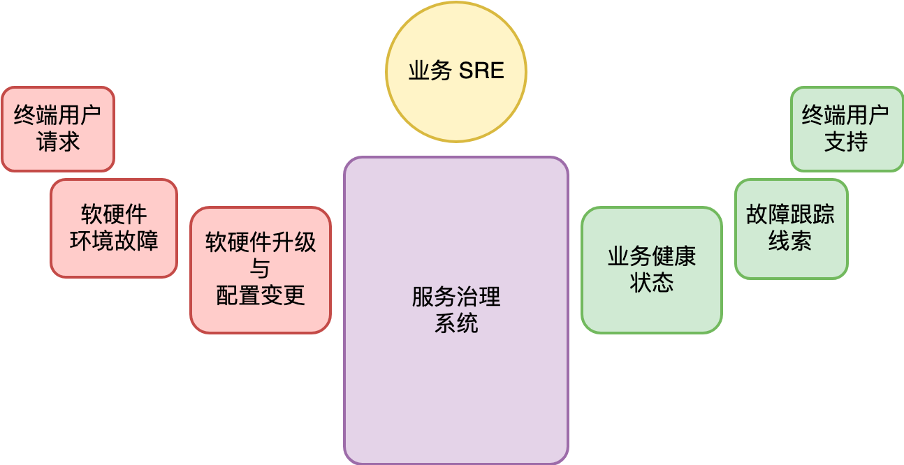

### Part IV —— 服务治理

#### 48. 服务治理的宏观视角

##### 48.1 服务治理的目标

把软件开发出来交付给用户就是其工作的结束？ NO.
###### 对一个产品或者产品里面的某项功能来说，把东西开发出来只是个开始！ 后面是无尽的迭代和维护。

服务治理的核心目标，除了常规的软件治理外，更重要的是考虑如何确保这些软件能够真正做到 24 小时不间断的服务。

###### 思考： 产品的生命周期
```
对于一款产品，其开发是短暂的。
# 开发出来只是个开始，后面需要面临的是： 被取代（淘汰） or 很长一段时间的维护期。
```

##### 48.2 成本到底多少？
虽然功能开发阶段的成本是非常显性的，但是功能维护期，包括了功能迭代和售后维保，它的隐性成本往往更高。

产品的功能开发期虽然有可能很短（产品可能很简单），但它只是起点，是源头。
公司/产品的每一分每一秒时间是怎么度过，很大程度上决定了这个产品或功能的最终维护代价。

##### 48.3 功能开发与维护的边界
开发与维护（经营/运营）的边界变得模糊，一些公司甚至每天都在发布新的版本。

##### 48.4 服务治理系统
从服务治理角度，面对的第一件事情，是如何把它发布出去。
* 这就涉及部署、升级和版本管理等相关的话题。

软件在线上成功地跑了起来，接着面临的就是，怎么保证它不会挂掉。
* 首先，怎么知道服务是不是挂了，这就涉及监控与报警。
* 理想情况下我们应该尽可能自动化所有故障的恢复，但故障的可能性太多，这意味着人工介入无可避免。

一个服务治理系统看起来是这样的：
<div align="center"></div>

服务治理不是纯理论，没有简洁的抽象问题模型，它面对的是现实世界的复杂性。 这些现实的复杂性，必然带来解决方案的复杂性。
