### Part II —— 桌面软件开发架构

#### 21. 桌面开发的宏观视角
从架构的角度，无论你在什么样的终端设备（比如：PC、手机、手表、手机等等），也无论你在做 Native 应用，还是基于 Web 和小程序，我们都可以统一称之为桌面程序。

一个桌面程序完整的架构体系如下，
<div align="center"></div>

###### 对于桌面程序，最核心的话题是交互。

从需求角度看，桌面程序的交互方式并不稳定，它的交互范式经历了很多次的迭代。

##### 21.1 命令行交互
—— 最早出现的交互范式

##### 特征
* 键盘 + 显示器。
* 输入被抽象为一段以回车（Enter 键）为结束的文本。
* （通常是单行文本，要输入多行文本，需要在行末输入“ \ ”对回车进行转义。）
* 命令行交互程序的输入输出可以被重定向。

##### 示意图
<div align="center">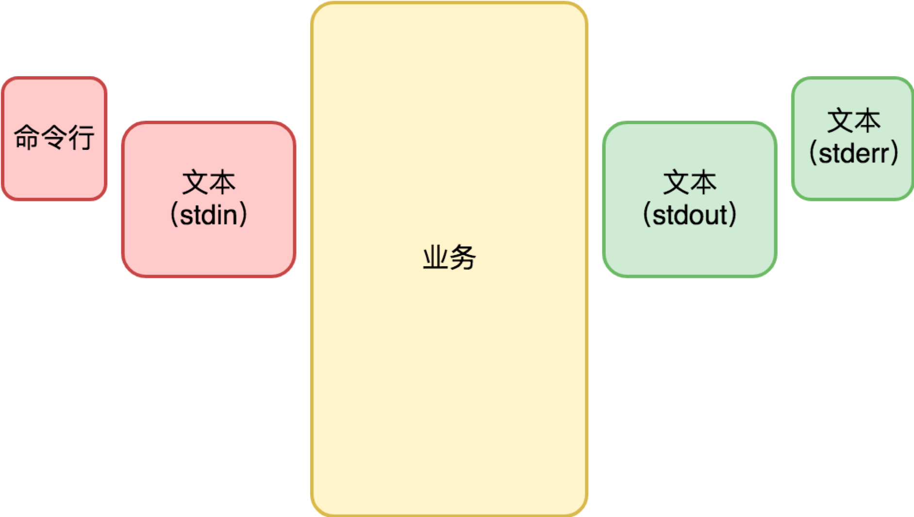</div>

##### 21.2 字符界面
* 键盘 + 显示器。
* 输入不再是一段文本，而是键盘按键事件（KeyDown 和 KeyUp）。
* 输出也不是一段文本，而是可以修改屏幕任何位置显示的字符。
* （此时，键盘的功用在需求上分化为两个：一是输入文本，二是输入命令。）
* 从输入文本的角度，需要有当前输入的光标（Caret）位置。

##### 示意图
<div align="center">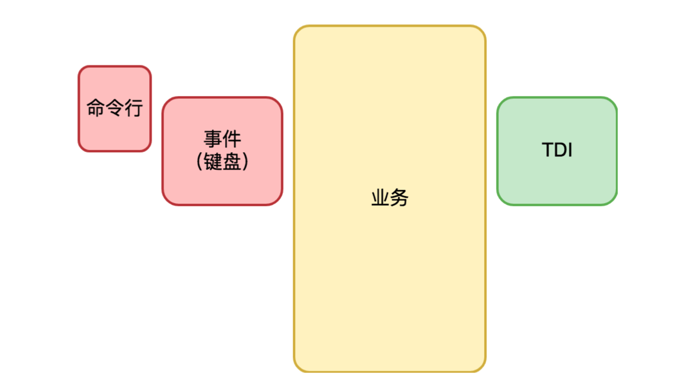</div>

上图的 TDI 含义是字符设备接口（Text Device Interface），它指的是一组向屏幕绘制文本的方法集合。 类似这样：
```go
func ClearScreen()
func DrawText(x, y int, text string)
```

##### 21.3 图形界面
—— 一个划时代的变化

##### 特征
* 键盘 + 鼠标 + 显示器 + 音箱。
* 与字符界面时期相比，图形界面时代变化的根源是输出的变化：从字符变成像素。
* 为什么会出现鼠标？ 因为屏幕精度太高，用键盘的方向键改变当前位置既笨拙又不方便。
* 为什么出现音箱？ 原因很平凡，只不过是声音设备演进的自然结果。以前是内置喇叭，现在是外置音箱。
* （与字符界面程序相比，图形界面程序还有一个重大变化：多窗口！！ 窗口（Window），也有人会把它叫视图（View）。）

###### 复杂的窗口会切分出多个逻辑独立的子窗口，以降低单个窗口的程序复杂性。

##### 示意图
<div align="center">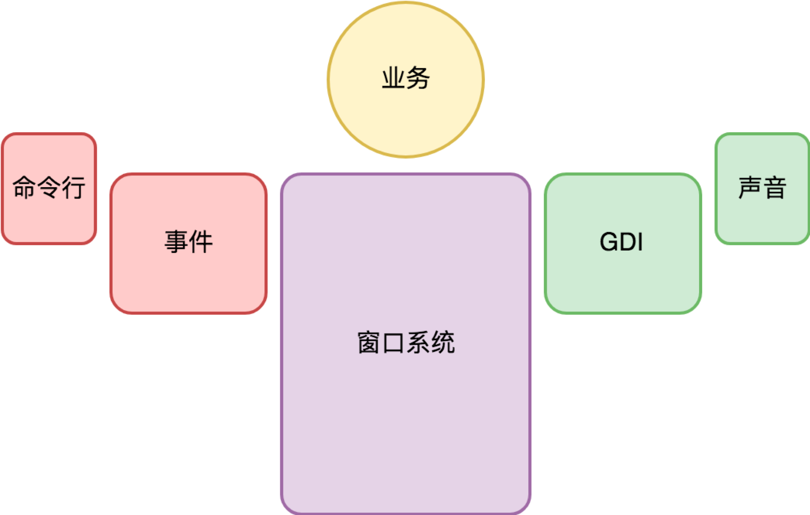</div>

上图的 GDI 含义是图形设备接口（Graphic Device Interface），它指的是一组向指定窗口(不是屏幕)绘制图形的方法集合。绘制的对象包括有几何图形、图像、文本等。

##### 注意
一旦界面涉及复杂的窗口系统，交互变得非常复杂。为了降低编程的负担，窗口系统往往接管了桌面程序的主逻辑，提供了一套基于事件驱动的编程框架，**业务代码由窗口系统提供的界面框架所驱动。**

##### 21.4 移动时代
鼠标交互方式被淘汰，变成了多点触摸。
###### “键盘 + 鼠标 + 显示器” ⇨ 触摸屏

##### 特征
* 触摸屏 + 麦克风 + 内置扬声器。
* 音箱被内置到手机中，变成内置扬声器。这些变化因移动设备便携性的述求引起。
* 从架构的角度，它们并没有引起实质性的变化，只是鼠标事件变成了触摸事件。

##### 智能交互
—— 麦克风让计算机多了一个输入：语音。

三种典型用法：
* 在应用内把语音录下来，直接作为类似照片视频的媒体消息，或者识别为文本去应用（比如语音搜索）。
* 作为语音输入法输入文本。（用法 1 的特例，因为输入法在操作系统中有特殊地位而单独列出。）
* 基于语音助手来交互。（类似 Siri）

##### 语音交互示意图
<div align="center">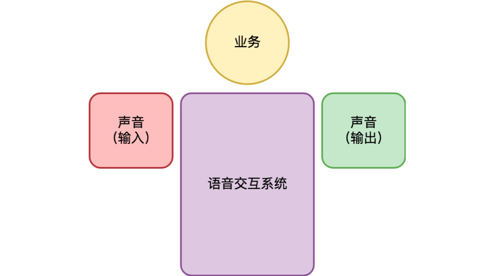</div>

###### 语音交互与图形界面，由于其复杂性，通常其业务代码都由交互系统提供的框架所驱动。

##### 21.5 总结
交互体验越来越自然，但从编程的角度来说，如果没有操作系统支持，实现难度也将越来越高。

同时也说明了一点： 桌面操作系统和服务端操作系统的演进方向非常不一样。 （桌面操作系统的演进方向主要是交互范式的迭代。）

#### 22. 图形界面程序的框架
—— 关注点聚焦于现在仍然占主流地位的图形界面程序。

###### 实现一个图形界面程序，最大的复杂性在于不同操作系统的使用接口完全不同，差异非常巨大。

好在，尽管操作系统的使用接口有异，但基本的大逻辑差不多。

##### 22.1 事件
无论是什么桌面操作系统，每个进程都有一个全局的事件队列（Event Queue）。

###### 当我们在键盘上按了一个键、移动或者点击鼠标、触摸屏幕等等，都会产生一个事件（Event），并由操作系统负责将它扔到进程的事件队列。

大体流程如下，
* 硬件产生了一个硬件中断；
* 操作系统的硬件中断处理程序收到对应事件；
* 确定事件的目标进程；
* 事件被放入目标进程的事件队列。

##### 22.2 窗口与事件响应
一个窗口响应发送给它的事件（Event），修改内部的状态，然后调用 GDI 绘制子系统更新界面显示。

##### 响应事件的常见机制有两种，
* 事件处理类(EventHandler 或叫 Responder)
* 委托(delegate)

（事件处理类）自定义的窗口类会直接或间接从事件处理类继承。 （委托）事件处理不是收到事件的人自己来做，而是把它委托给了别人。

##### 思考： onPaint 或 onDraw
为什么会有这样的事件？ 想象以下场景：两个窗口存在遮挡，当我们移动一个窗口，以前被遮挡的部分现在不再被遮挡。
操作系统并不会帮我们保存被遮挡的窗口内容，而是发送 onPaint 事件给对应的窗口让它重新绘制。

##### 22.3 事件分派 —— 事件是怎么从全局的事件队列（Event Queue）到窗口的?
这就是事件分派（Event Dispatch）过程，它通常由一个事件分派循环（Event Dispatch Loop）来完成。

Windows 平台，类似以下流程，
```go
func RunLoop() {
  for {
    msg, ok := winapi.GetMessage() // 从事件队列中取出一个消息
    if !ok {
      break
    }
    winapi.TranslateMessage(msg)
    winapi.DispatchMessage(msg)
  }
}
```

其中，TranslateMessage 函数可能会比较陌生，它负责的是将键盘按键事件（onKeyDown、onKeyUp）转化为字符事件（onChar）。 敲击到文本输入的转换。

对于嵌套窗口，交互变得更为复杂。此时，事件分派依赖的是**事件处理链（EventHandler Chain）**。
* 首先由焦点窗口响应，再逐层上升，直到最顶层的窗口。

##### 22.4 窗口内容绘制
在收到 onPaint 或 onDraw 消息时，就要绘制窗口内容了，此时需要操作系统的 GDI 子系统。

从大分类来说，首先需要确定绘制的内容是 2D or 3D，
* 对于 2D 内容，操作系统 GDI 子系统往往有较好的支持，但不同平台终究还是会有较大的差异。
* 对于 3D 内容来说，OpenGL 这样的跨平台方案占据了今天的主流市场，而 Vulkan 号称是 NextGL。

###### 对于 GDI 的优化，GDI 优化往往通过硬件加速来完成，真正的关键角色是在硬件厂商这里。

##### 22.5 通用控件
为了进一步简化开发过程，操作系统往往还提供了一些通用的界面元素，通常我们称之为控件 (Control)。

###### 不同操作系统提供的基础控件大同小异。不过一些处理细节上的差异往往会成为跨平台开发的坑。

##### 22.6 总结
图形界面程序的三大块内容：事件、窗口事件响应、窗口内容绘制。 这些机制都是由操作系统提供支持。

###### 我们身处在由操作系统约定的编程框架中，这是桌面编程的特点。
<div align="center">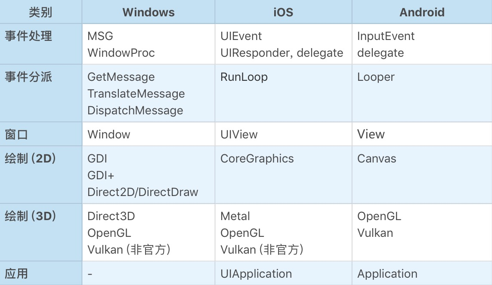</div>

这还不是全部。要做一个跨平台的桌面应用程序并不容易，我们需要面对的平台太多，
* PC：Windows、MacOS、Linux 等；
* PC 浏览器：Chrome、Safri、Firefox 等；
* 手机 / 平板 / 手表：Android（不同手机厂商也会有细节差异）、iOS 等；
* 小程序：微信、支付宝、快应用等。

怎么安排不同平台的优先级？怎么规划未来版本的迭代计划？选择什么样的跨平台方案？这些问题在业务架构之外，极其考验架构师的决策能力。

#### 23. 桌面程序的架构建议
—— 站在应用架构的角度，聊聊如何设计一个桌面应用程序。

前面的桌面程序框架介绍，都是站在操作系统交互子系统的角度分析。

现在从软件设计模式角度来分析。

##### 23.1 从 MVC 说起
关于桌面程序，听得最多的莫过于 MVC 这个架构范式。 MVC 全称是 “模型 (Model) - 视图 (View) - 控制器 (Controller)”。
<div align="center">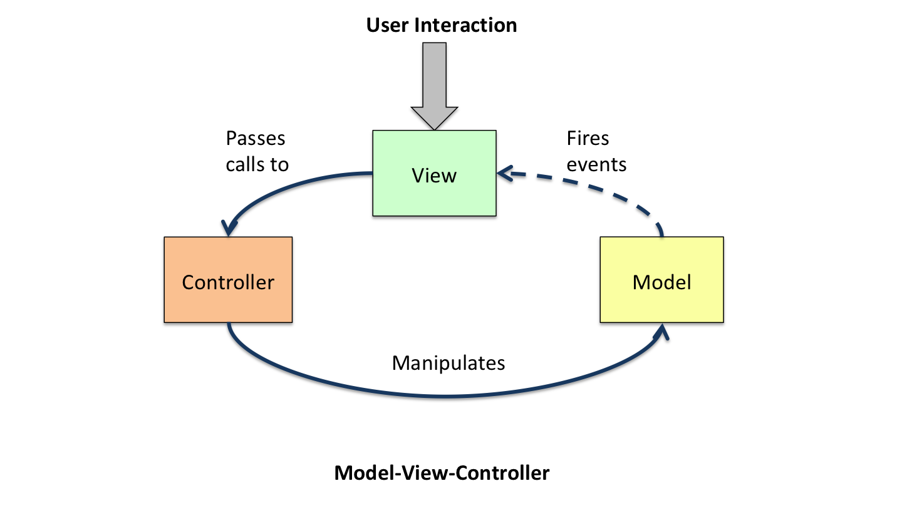</div>

* Model 是数据。
* View 是数据的显示结果，同时也接受用户的交互动作，也就是事件。
* **Controller 负责 Process（处理），以 “Model + 由 View 转发的事件” 作为 Input，处理的结果（Output）仍然是 Model，作用是更新 Model 的数据。**
* **注意： Model 的数据更新后，发送 DataChanged 事件，View 会在监听并收到 DataChanged 事件后，更新 View。**

##### 23.2 MVP
对 MVC 模式做些细微的调整，就会产生一些变种。

##### MVP 模式 （Model-View-Presenter）
* Model 的数据更新发出 DataChanged 事件后，由 Controller 负责监听并 Update View。
<div align="center">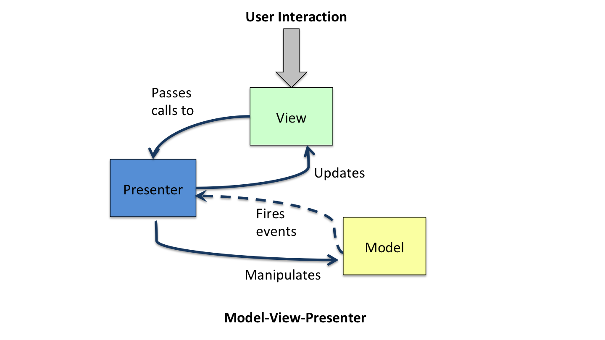</div>

##### 23.3 思考： 如何判断程序架构是否优良？哪种架构范式比较好？
架构优劣的评判标准。 比较知名且重要的一些基本原则如下：
* 最低耦合原则。 不同子系统（或模块）之间有最少的交互频率，最简洁且自然的接口。
* 单一职责原则。 不要让一个子系统（或模块）干多件事情，也不要让它不干事情。

##### 23.4 深入理解 Model 层的意义
Model 层是承载业务逻辑的 DOM，即 “文档对象模型（Document Object Mode）”。 **直白理解，DOM 是 “面向对象” 意义上的数据。它不只是有数据结构，也有访问接口。**

##### 对于 Model 层，有两种常见的架构误区
* 误区一： 让 Controller 层直接操作数据库，也就是拿数据库的读写接口作为 Model 层的接口。
* 误区二： 用所谓的 ORM 技术来实现 Model 层，让 Controller 直接操作 ORM。

###### Model 层的真正价值所在是： Model 层的使用接口最重要的是要自然体现业务的需求。

##### Why?
* 只有这样（直接自然体现业务的需求），Model 层的边界才是稳定的，才与你基于的技术无关。

(是用了 MySQL，还是用了 NoSQL？是直接裸写 SQL 语句，还是基于 ORM？这都没关系，未来喜欢了还可以改。)

* 从界面编程角度看，Model 层越厚越好。 （逻辑更多向 Model 层倾斜，那么 Controller 层就简洁很多。）

因为，Model 层是和操作系统的界面程序框架最为无关的部分，是最容易测试的部分，也同时是跨平台最容易的部分。

###### 如果用一句话来描述 Model 层的职责，那么应该是 “负责业务需求的内核逻辑” —— “DataCore”。

##### Model 层为何要发出 DataChanged 事件？
这是从 Model 层的独立性考虑。 Model 层作为架构的最底层，它不需要知道其他层的存在。有了 DataChanged 事件，上层就能够感知到 Model 层的变化，从而作出自己的反应。

###### 如果还记得之前反复强调的：稳定点与变化点。显然，DataChanged 事件就是 Model 层面对需求变化点的对策。

##### 23.5 深入理解 View 层的意义
View 层首要的责任，是负责界面呈现。

界面呈现的两个选择，
* 直接调用 GDI 接口自己画。
* 创建子 View 让别人画。

View 层的另一个责任是被自然带来的： 响应用户交互事件的入口。 这是操作系统的界面编程框架决定的。

理想情况下，View 应该把自己所有的事件都委托（delegate）出去，不要自己干。 但是....View 层有以下问题需要考虑：

* View 层不一定会负责生成所有用户看到的 View。

（例如：有的 View 是 Controller 在做某个逻辑的过程中临时生成的，那么这样的 View 就应该是 Controller 的一部分。）

* View 层可能需要非常友好的委托（delegate）机制的的支持。

（例如：一组界面元素的交互事件共同做委托。）

* 负责界面呈现，意味着 View 层和 Model 层的关系非常紧密。

（这可能会导致 Model 层要为 View 层提供一些专享的只读访问接口。需要确保这些访问接口不要扩散使用。）

* 负责界面呈现，看似只是根据数据绘制界面，似乎很简单，但实则不简单。

（例如：有时为了效率，需要做局部更新的优化。）

###### 在局部更新这个优化足够复杂时，我们往往不得不在 Model 和 View 之间，再额外引入一层 ViewModel 层来做这个事情。

ViewModel 层顾名思义，是为 View 的界面呈现而设计的 Model 层，它的数据组织更接近于 View 的表达。
<div align="center">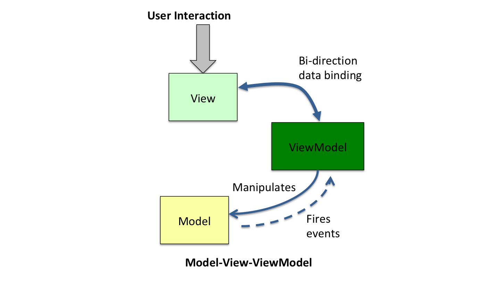</div>

##### Model-View-ViewModel 的例子
一个极端但又很典型的例子是 Word。 它是数据流式的文档，但是，界面显示常以页面视图方式，内容是分页显示的。

这种情况下就需要有一个 ViewModel 层是按分页显示的结构来组织数据。 其中负责维持 Model 与 ViewModel 层的数据一致性的模块，我们叫排版引擎。

###### 从理解上来讲，更倾向于认为 ViewModel 是 View 层的一部分，只不过是 View 层太复杂而进行了再次拆分的结果。 而不是单独作为一个模式。

##### 23.6 深入理解 Controller 层的意义
Controller 层是负责用户交互的。 可以有很多个 Controller，分别负责不同的用户交互需...

Controller 层与 Model 和 View 的差异：
* Model 层是一个整体。虽然这一个层会有很多类，但是它们共同构成了一个完整的逻辑：DOM。
* View 层也是一个整体，它是 DOM 的界面呈现，是 DOM 的镜像。
* 负责用户交互的 Controller 层，是被正交分解的，彼此完全没有耦合关系。

一个 Controller 模块，可能包含一些属于自己的辅助 View，也会接受 View 层委托的一些事件，由事件驱动自己。

###### Controller 层最应该思考的问题是代码的内聚性。哪些代码是相关的，是应该放在一起的，需要一一理清。

如果设计恰当，Controller 之间应该是完全无关的。而且要干掉某一个交互特别容易，都不需要删除该 Controller 本身相关的代码，只需要把创建该 Controller 的一行代码注释掉就可以。

##### 23.7 Model - View - Controller 的层次
从分层角度，
* Model 层在最底层；
* View 层在中间，它持有 Model 层的 DOM 指针；
* Controller 层在最上方，它知道 Model 和 View 层，通过 DOM 接口操作 Model 层，但不操作 View 去改变数据，而是监听兴趣事件。

###### 如果 View 层提供了抽象得当的事件绑定接口，将发现，Controller 层大部分的逻辑都与操作系统提供的界面编程框架无关（除了可能的辅助View的需要），是跨平台的。

##### MVC 各个模块是如何串起来的？
应用程序（Application）。 在应用开始的时候，它就把 Model 层、View 层，我们感兴趣的若干 Controller 模块都创建好，建立了彼此的关联。

##### 23.8 桌面应用程序的第二大需求
—— 提供应用程序的二次开发接口（API，全称为 Application Programming Interface）。

###### 提供了 API 的应用程序，意味着它身处一个应用生态之中，可以与其他应用程序完美协作。

##### 通过哪一层提供 API 接口？
倾向于认为最佳的选择是在 ViewModel 层。

#### 24. Web 开发：浏览器、小程序与 PWA
—— 原生应用(Native App)之外

##### 24.1 浏览器
##### 从商业价值的角度看，浏览器带来了三个重大进步，
* **软件服务化。** 产品交付从单机软件转向云服务，同时，社会分工发生巨变，任何一个环节都可能成长出一个超级节点，进而吞噬上下游，让服务链条更短。
* **随时发布。** 人们快速试验自己的想法，不必过度因为顾虑软件质量召回而束手束脚。(服务端可以及时更新与处理，所谓的召回和传统意义已不同。)
* **跨平台。** 浏览器消除了不同操作系统平台的差异性。

##### 从界面开发的角度看，浏览器带来的重大变化，
* **操作系统的窗口系统被颠覆。** 一个网页只是一个窗口，不再有父子窗口。网页中的界面元素都是一个虚拟视图，常规的通用控件(input,image,div等)和自绘窗口(canvas)都一样。
* **窗口的绘制机制变了。** 之前是调用操作系统的 GDI 生成界面，现在换成了 HTML+CSS。
* **语言限制。** 浏览器长期以来只支持 JavaScript 一门语言。
* **B/S 架构。** 无论是 B/S 还是 C/S，本质上还是软件服务化。这对软件架构产生了巨大影响。 （从 server 端看，系统从单用户变成了多用户。从 browser/client 端看，仍然是单用户，但是没有了数据。）

从 MVC 角度分析 HTML+CSS，我们不能把它理解为 View 层，它其实是 ViewModel 层。 View 层由谁干掉了？浏览器。怎么做到局部更新优化的？你不必关心，浏览器已完成支持。
###### 这事的真正价值超过你的想象。它大幅提升了桌面应用开发的效率。

##### 24.2 小程序
小程序引发的思考
<div align="center">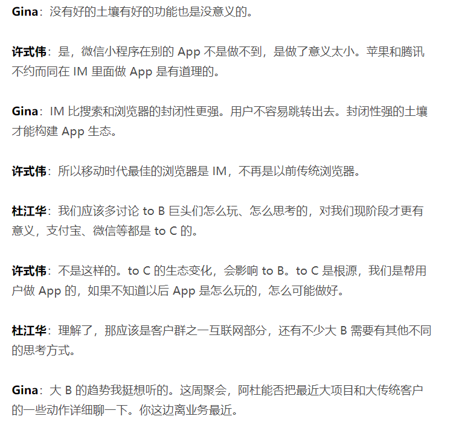</div>

##### 为什么微信小程序必然会成功？
因为，有 7 亿人同时使用的操作系统，很少。小程序变成了一支巨大的新兴力量，成为真正意义上的国产操作系统，对抗着 Android 和 iOS 两大移动操作系统生态。

##### 小程序生态仍然存在的诸多问题
* 最为关键的，是标准不统一。 虽然都叫小程序，但是它们的接口各自都在快速迭代，谈不上让开发者一次开发，到处可用。

##### 小程序和传统的 Web 开发有何不同？
其实有很大不同。小程序更像是 Native 程序在线化。 小程序是一个应用。
* 我们需要提交应用给微信或支付宝，它们掌控着 App 的生杀大权。
* 更牛的是，他们可以下线一个已经有千万甚至上亿级别用户的 App，让他们一无所有。

###### 这个风险如此之高，所有的厂商在拥抱微信的同时，必然时时刻刻想着如何逃离微信。

##### 思考： Facebook 扎克伯格的成功
```
在发布 Libra 的时候，他选择的是让一步，放弃 Control。
让一步，其实就是进一百步。
```

##### 24.3 PWA
—— 移动应用的在线化，Google 也同样在探索。

Google 的移动浏览器方案，叫 PWA，全称 “Progressive Web App”。

PWA 开始于 2015 年，比微信小程序早很多，并得到了苹果和微软的支持。从这个角度来说，PWA 的潜力不容小觑。

##### 怎么理解 PWA？
可以理解为海外版的小程序。

##### PWA 与小程序的差别在哪？
* 关注焦点不同。 PWA 更技术化，精力重心放在如何让 PWA 在断网情况下和本地应用有更一致的体验。小程序关注点在如何撬动这么庞大的用户市场。
* 演进思路不同。 PWA 基本上以兼容并对 Web 进行逐步改造升级为导向。
* PWA 并没有中心化的 AppStore，它更像是一项技术标准。

##### 怎么看待 PWA 的未来？
PWA 相比小程序来说太传统。 小程序符合现代操作系统的 “账号 (Account)- 支付 (Pay)- 应用市场 (AppStore)” 的商业闭环，但是 PWA 并没有账号，也没有支付。

#### 25. 跨平台与 Web 开发的建议

##### 25.1 跨平台桌面程序开发
跨平台的桌面程序开发是一个超级难题。无数人前仆后继，但至今为止，仍然没有称得上真正深入人心的解决方案。

原因如下，
* 操作系统。 不同的操作系统抽象的界面程序框架并不一致。
* 屏幕尺寸。 即使相同的操作系统，在不同尺寸的屏幕上，交互的范式也会存在很大的差异性。

放弃某个操作系统，就意味着放弃某个流量入口，也就意味着放弃这些用户。。。

##### 目前主流的跨平台方案
<div align="center">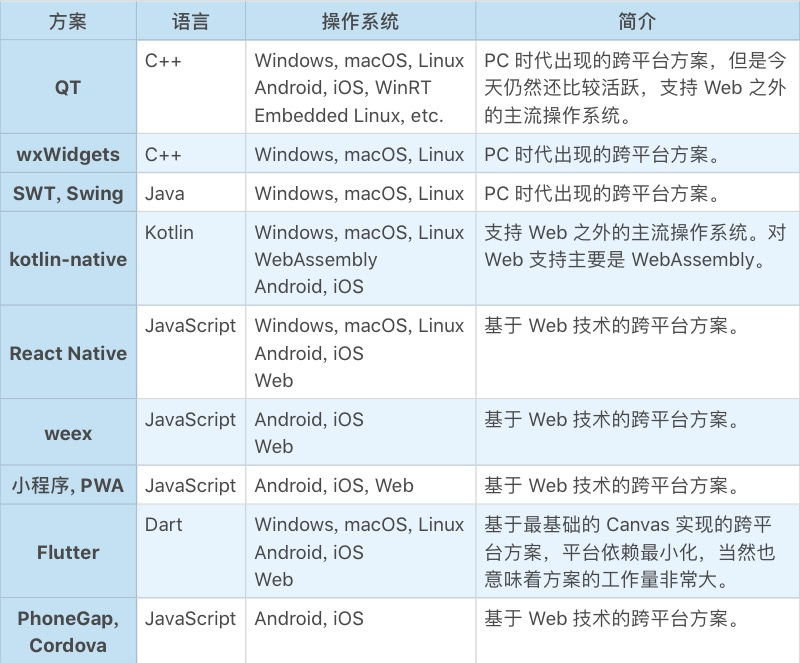</div>

目前来说，还很难说哪个方案会胜出。

###### 总之： “每一次统一的努力，都最终变成新的分裂”。

##### 25.2 Web 开发
Web 的 B/S 架构意味着编写软件有了更高的复杂性。 表现如下，
* 多用户。 用户的数据不再是保存在 Client（Browser）端，而是存储在 Server 端。
* 更高的数据可靠性要求。 数据在 Client 端，客户自己对数据的可靠性负责。数据在 Server 端，服务提供方对数据的可靠性负责。
* 更多可能的分工安排。 分为两大流派：胖前端与胖后端。

##### MVC 框架在浏览器下的样子
界面的局部更新是一个复杂的话题，浏览器通过引入 HTML+CSS 这样的 ViewModel 层把它解决了。

现在，MVC 模式变成了 MVMP 模式，全称为 “Model-ViewModel-Presenter”。
<div align="center">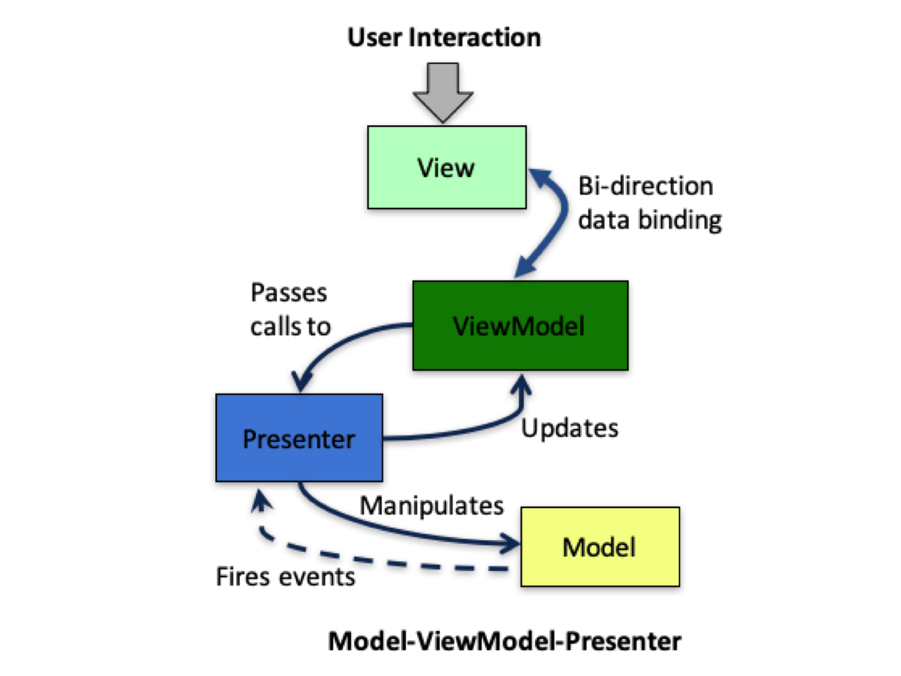</div>

* 事件响应过程。 浏览器的 View 收到用户的交互事件，它把事件委托给 ViewModel 层，并且通过 HTML DOM 暴露出来。
* Model 层的数据变化（DataChanged）事件。 Presenter 层更新界面（Update View）并不是操作 View，而是 ViewModel。

##### Server 端的架构
<div align="center">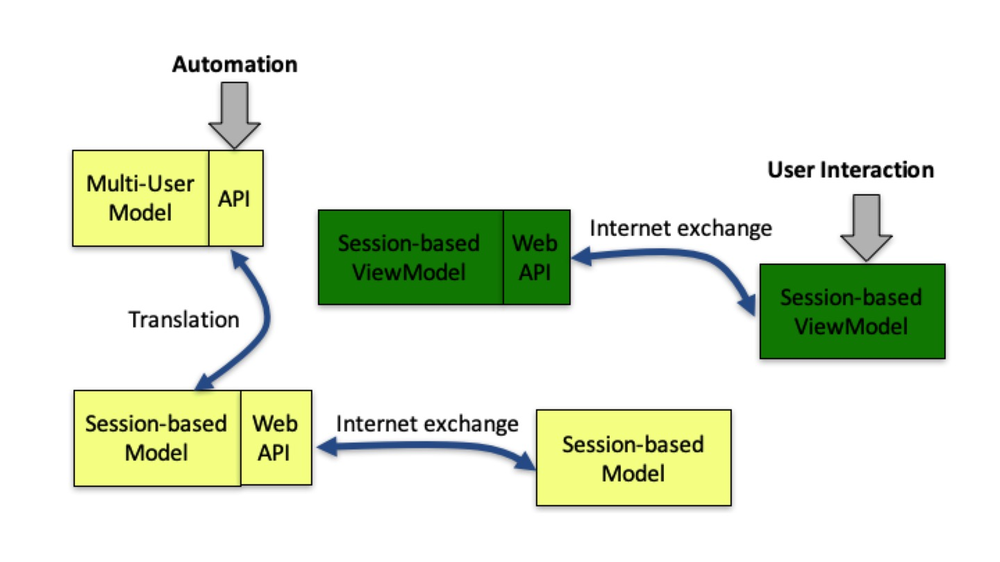</div>

到了 Web 开发，同样需要二次开发接口，只是，二次开发接口不再是在 Client 端完成，而是在 Server 端完成。
###### Server 端支持直接的 API 调用（Web API），以支持自动化（Automation）方面的需求。

注意，
* Web 层和 Model 层的假设不同，Web 层是基于会话的（Session-based），因为它负责用户的接入，每个用户登录后，会形成一个个会话（Session）。
* 在服务端，Session-based Model 和 Session-based ViewModel 并不发生直接关联，它们通过浏览器这一侧的 Model 和 ViewModel，响应用户的交互。

##### Session-based Model 是什么样的呢？
其实是 Multi-User Model 层的转译。把多租户的 API 转译成单租户的场景。

##### Session-based ViewModel
是一些 HTML+JavaScript+CSS 文件。它是真正的 Web 业务入口，通过互联网把自己的数据返回给浏览器，浏览器基于 ViewModel 渲染出 View。

##### 25.3 总结
从跨平台来说，这是桌面程序员（也叫“大前端”）永远的痛。
###### 计划赶不上变化，用来形容大前端程序员面临的窘境是一点都不过分的。

从 Web 开发来说，MVC 变成了 MVMP（Model-ViewModel-Presenter）。
###### MVMP 依旧需要认真对待 Model 层，认真思考它的使用接口是什么样的，把 Model 层做厚。

#### 26. 桌面开发的未来

##### 26.1 桌面平台的演进与未来
谈未来前，首先看看过去。
* PC 时代，本地桌面操作系统主流的有 Windows、MacOS、Linux。为了消除平台差异，出现了 QT、wxWidgets 这样的跨平台解决方案。
* PC 浏览器。 浏览器并不是为跨平台而来，但是除了干成了软件服务化外，也干成了跨平台这件事情。

（浏览器时代）在软件服务化和跨平台开发的双重优势下，软件厂商们趋之若鹜。

今天手表、电视机、汽车，以及各式各样的 IoT 传感设备，都需要操作系统的支持。这么多操作系统怎么搞呢？

###### 国内涌现了大量的小程序厂商，国外 Google 也在推 PWA。Facebook 意见不明，不知道会去支持 PWA，还是基于自己的 React-Native 技术搞一套新的移动浏览器标准。

由此，统一的 Web 分裂成多个技术阵营。

##### 新的跨平台定义
今天的跨平台，重点是要跨 Android、iOS、Web、小程序和 PWA。

##### 26.2 编程能力的未来
从终局的视角来看，桌面开发的终极目标，是让儿童可以轻松编写出生产级的应用。
这个目标与儿童编程教育相向而行，有一天必然汇聚于一点上。

#### 27. 实战（一）： 怎么设计一个“画图”程序？
一个 B/S 结构的 Web 程序，基本上分下面几块内容：
* Model 层： 一个多用户（Multi-User）的 Model 层，和单租户的 Session-based Model。 从服务端来说，Session-based Model 是一个很简单的转译层。从浏览器端来说，Session-based Model 是一个完整的单租户 DOM 模型。
* View 层： 实际是 ViewModel 层。ViewModel 只有 View 层的数据和可被委托的事件。
* Controller 层： 切记不要让 Controller 之间相互知道对方，更不要让 View 知道某个具体的 Controller 存在。

##### 27.1 Model 层 —— 浏览器端的 Model 层
```javascript
class QLineStyle {
properties:
  width: number
  color: string
methods:
  constructor(width: number, color: string)
}

class QLine {
properties:
  pt1, pt2: Points
  lineStyle: QLineStyle
methods:
  constructor(pt1, pt2: Point, lineStyle: QLineStyle)
  onpaint(ctx: CanvasRenderingContext2D): void
}

class QRect {
properties:
  x, y, width, height: number
  lineStyle: QLineStyle
methods:
   constructor(r: Rect, lineStyle: QLineStyle)
   onpaint(ctx: CanvasRenderingContext2D): void
}

class QEllipse {
properties:
  x, y, radiusX, radiusY: number
  lineStyle: QLineStyle
methods:
   constructor(x, y, radiusX, radiusY: number, lineStyle: QLineStyle)
   onpaint(ctx: CanvasRenderingContext2D): void
}

class QPath {
properties:
  points: []Point
  close: bool
  lineStyle: QLineStyle
methods:
   constructor(points: []Point, close: bool, lineStyle: QLineStyle)
   onpaint(ctx: CanvasRenderingContext2D): void
}

interface Shape {
  onpaint(ctx: CanvasRenderingContext2D): void
}

class QPaintDoc {
methods:
  addShape(shape: Shape): void
  onpaint(ctx: CanvasRenderingContext2D): void
}
```
目前这个 DOM 还是单机版本的，没有和服务端的 Session-based Model 连起来。

这个 Model 层的使用非常容易理解，也非常直观体现了业务。 主要支持的能力有以下两个：
* 添加图形（Shape）
* 绘制（onpaint）

##### 27.2 ViewModel 层 —— 浏览器端的 ViewModel 层
index.htm 文件和一个 view.js 文件。

index.htm 是总控文件，主要包含两个内容：
* 界面布局（Layout）
* 应用初始化（InitApplication），比如加载哪些 Controllers。

view.js 是 ViewModel 层的核心，代码如下，
```javascript
interface Controller {
  stop(): void
  onpaint(ctx: CanvasRenderingContext2D): void
}

class QPaintView {
properties:
  doc: QPaintDoc
  properties: {
    lineWidth: number
    lineColor: string
  }
  drawing: DOMElement
  controllers: map[string]Controller
methods:
  get currentKey: string
  get lineStyle: QLineStyle
  onpaint(ctx: CanvasRenderingContext2D): void
  invalidateRect(rect: Rect): void
  registerController(name: string, controller: Controller): void
  invokeController(name: string): void
  stopController(): void
  getMousePos(event: DOMEvent): Point
events:
  onmousedown: (event: DOMEvent):void
  onmousemove: (event: DOMEvent):void
  onmouseup: (event: DOMEvent):void
  ondblclick: (event: DOMEvent):void
  onkeydown: (event: DOMEvent):void
}

var qview = new QPaintView()
```
QPaintView 的内容有点多，
* 但和 Model 层相关的，就只有 doc: QPaintDoc 这个成员。有了它就可以操作 Model 层了。
* 属于 ViewModel 层自身的，数据上只有 properties 和 drawing。关于绘制的有 onpaint 和 invalidRect。
* 剩下来的就是 Controller 相关的了，
    * registerController，invokeController，stopController，View 层并不关心具体的 Controller 类型。
    * 事件委托（delegate）。
    * getMousePos 只是一个辅助方法，用来获取鼠标事件中的鼠标位置。

###### View 层在 MVC 里面是承上启下的桥梁作用。 View 层的边界设定非常关键。

平台兼容性问题，
* 屏蔽平台的差异。 Model 层很容易做到平台无关，Controller 层除了有少量的界面需要处理平台差异外，大部分代码都是响应事件处理业务逻辑。 另外，只要 View 对事件的抽象得当，也是跨平台的。
* 定义界面布局。 针对不同尺寸的设备，在 View 层来控制不同设备的整体界面布局比较妥当。

##### 27.3 Controller 层 —— 浏览器端的 Controller 层
* Menu, PropSelectors, MousePosTracker： accel/menu.js
* Create Path：creator/path.js
* Create FreePath：creator/freepath.js
* Create Line, Rect, Ellipse,Circle： creator/rect.js

一些 Controller 因为实现相近被合并到一个文件。

##### 27.4 总结
架构设计的第一步是需求分析，第二步则是：概要设计（也可以叫系统设计）。 该阶段的核心是分解子系统，MVC 是一个分解子系统的基本框架，它对于桌面程序尤为适用。

#### 28. 实战（二）： 怎么设计一个“画图”程序？
—— 上节内容的复盘和一次需求的迭代。

##### 28.1 MVP 版画图程序
—— 只能增加新图形，没法删除，也没法修改。

Model 和 View、Controllers 的耦合关系如下：
<div align="center">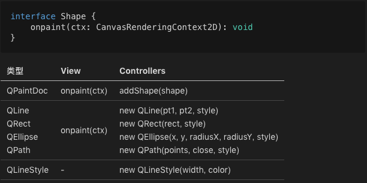</div>

View 层的内容：
<div align="center">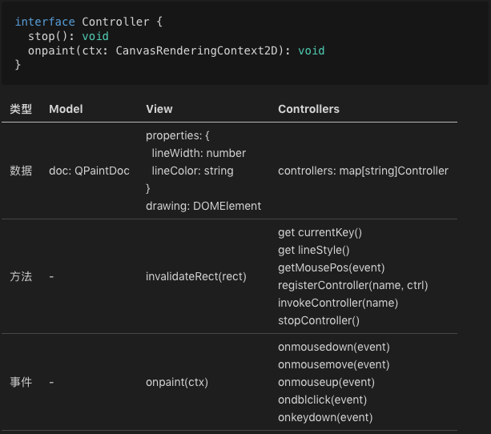</div>

Controller 位于 MVC 的最上层，因此，对它的关注点就不再是它的规格本身，因为没人去调用它的方法。
所以，把关注点放在了每个 Controller 都怎么用 Model 和 View。
<div align="center">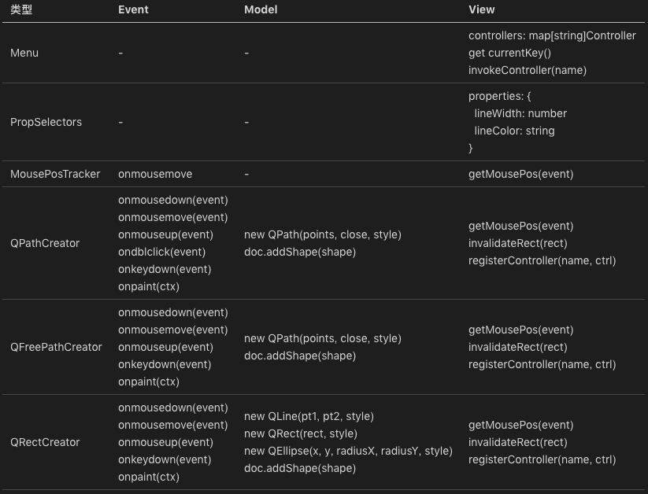</div>

通过以上三张表对照分析，可以清晰看出 Model、View、Controllers 是怎么关联起来的。

##### 28.2 改进版的画图程序
功能改进如下，
* 选择一个图形，允许删除、移动或者对其样式进行修改。
* 图形样式增加 fillColor（填充色）。
* 更加现代的交互范式： 默认处于 ShapeSelector 状态，创建完图形后自动回到此状态。
* 选择图形后，界面上的当前样式自动更新为被选图形的样式。

新的 Model 层
<div align="center">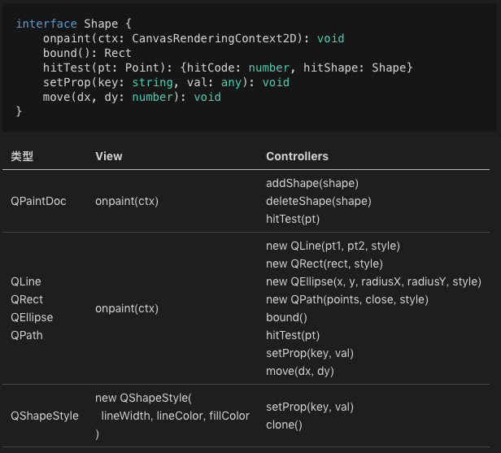</div>

注意，QLineStyle 改名为 QShapeStyle，且其属性 width、color 被改名为 lineWidth、lineColor。这相当于一次小重构。
###### 重构关键是要及时处理，把控质量。 为了保证质量仍然可控，最好辅以足够多的单元测试。

##### 此处的小重构引发的思考
最初设计 new QLine、QRect、QEllipse、QPath 的时候，传入的最后一个参数是 QLineStyle，从设计上这是一次失误，把最后一个参数改为 QShapeStyle，这从设计上就完备了。
由此，图形样式就算有更多的演进，也会集中到 QShapeStyle 这一个类上。

如果作为一个实实在在要去迭代的画图程序来说，上面这个 QShapeStyle 必然还会面临一次重构。变成如下这个样子：
```javascript
class QLineStyle {
  width: number
  color: string  
}

class QFillStyle {
  color: string  
}

class QShapeStyle {
  line: any
  fill: any
}
```

新的 View 层
<div align="center">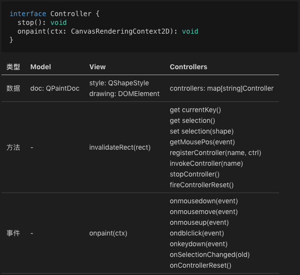</div>

新的 Controller 层
<div align="center">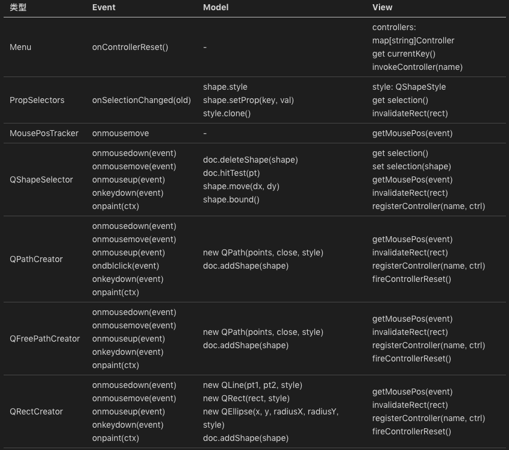</div>

#### 29. 实战（三）： 怎么设计一个“画图”程序？
—— 怎么和服务端连接。 （第一，浏览器端进行持久化）

##### 为什么需要在浏览器端进行持久化？
因为我们需要有更好的用户体验。在用户断网的情况下，这个画图程序还可以正常编辑，并且在恢复联网的情况下，能够把所有离线编辑的内容自动同步到服务端。

##### 29.1 基于传统的 localStorage 技术进行持久化
###### 最核心的变化是 Model 层。

##### 对象 ID
为了支持持久化，为每一个 Model 层 DOM 树的根 —— QPaintDoc 类引入了两个 ID，
* localID: string
* displayID: string

其中，displayID 前面带 t 开头，表示这篇文档从它被创建开始，从未与服务器同步过，是一篇临时的文档。

一旦它完成与服务端的同步后，就会改用服务端返回的文档 ID。

那么，localID 又是什么？
* localID 是这篇文档的本地 ID。 在文档还没有和服务端同步时，如果 displayID 是 t10001，则 localID 就是 10001。
* 但是，文档第一次保存到服务端后，它的 displayID 会变化，而 localID 则并不...

为了支持更新数据的粒度不是整个文档每次都保存一遍，存储分成 shape、document 两个级别。
###### 当 Shape 发生变化，比如修改图形式样、或移动时，shapeID 发生变化并对应一个新的 shapeJsonData，此时，它由 QPaintDoc.localID + “:” + shape.id 指示。

如果文档只有一个 ID，那么这个 ID 在同步前后发生变化，shapeJsonData 对应的完整 ID 索引也要跟着变化。。

##### 数据变更
我们把数据变更分为了两级，
* shapeChanged
* documentChanged

##### 存储的容量限制与安全
localStorage 的存储容量是有限制的，不同的浏览器并不一样，大部分在 5-10M 这个级别。
* 我们需要考虑数据清理的机制。淘汰掉最远创建的一篇文档。
* 安全问题。 解决这个问题最简单的方法是在用户帐号登出的时候，清空所有的 localStorage 中的文档。

#### 30. 实战（四）： 怎么设计一个“画图”程序？
—— 怎么和服务端连接。 （第二，考虑服务端）

##### 30.1 第一步，要考虑的是网络协议。（Web API）
暂时不考虑多租户带授权的场景。

在浏览器中，一个浏览器的页面编辑的是一个文档，不同页面编辑不同的文档。

但是，很显然，服务端和浏览器端这一点是不同的。如此服务端的功能基本上是以下这些：
* 创建新 drawing 文档；
* 获取 drawing 文档；
* 删除 drawing 文档；
* 在 drawing 文档中创建一个新 shape；
* 取 drawing 文档中的一个 shape；
* 修改 drawing 文档中的一个 shape，包括移动位置、修改图形样式；
* 修改 drawing 文档中的一个 shape 的 zorder 次序（浏览器端未实现）；
* 删除 drawing 文档的一个 shape。

完整的网络协议：
<div align="center">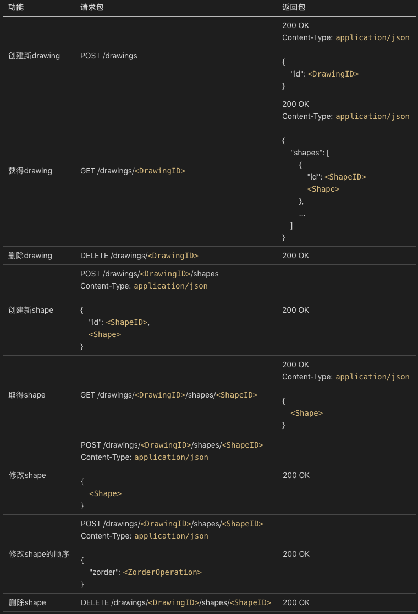</div>

整体来说，这套网络协议比较直白体现了其对应的功能含义。 该协议遵循的范式如下：
* 创建对象：POST /objects
* 修改对象：POST /objects/\<ObjectID>
* 删除对象：DELETE /objects/\<ObjectID>
* 查询对象：GET /objects/\<ObjectID>

还有一个列出对象的功能，只不过这里没有用到，
* 列出所有对象：GET /objects
* 列出符合条件的对象：GET /objects?key=value

##### 30.2 在网络设计时需要特别注意的点
**对重试的友好性。** (你以为只是重试，实际上是同一个操作执行了两遍。)
###### 所谓重试的友好性，是指同一个操作执行两遍，其执行结果和只执行一遍一致。

为什么我们必须要充分考虑重试的友好性？
* 因为网络是不稳定的。 这意味着，在发生一次网络请求失败时，在一些场景下你不一定能确定请求的真实状态。
* 在小概率的情况下，有可能服务端已经执行了预期的操作，只不过返还给客户端的时候网络出现了问题。

只读操作，比如查询对象或列出对象，毫无疑问显然是重试友好的。

创建对象（POST /objects）往往容易被实现为重试不友好，对比以下代码：
```javascript
POST /drawings  # 创建新 drawing

POST /drawings/<DrawingID>/shapes  # 创建新 shape
Content-Type: application/json

{
    "id": <ShapeID>,
    <Shape>
}
```
分析，
* 创建新 shape 时传入了 ShapeID，如果上一次服务端已经执行过该对象的创建，可以返回对象已经存在的错误。
* 创建新 drawing 并没有传入什么参数，重复调用不会发生什么冲突，并创建两个新 drawing。

##### 那么怎么解决这个问题？有这么几种可能：
* 客户端传 id（和上面创建新 shape 一样）；
* 客户端传 name；
* 客户端传 uuid。

当然这三种方式本质上的差别并不大。传 uuid 可以认为是一种常规重试友好的改造手法。
（uuid 可以是内容中的一个唯一序列号，也可以是网络请求的唯一序列号。两种选一即可，但后者更通用。）
```javascript
POST /drawings
Content-Type: application/json

{
    "uuid": <DrawingUUID>
}
或者
POST /drawings
Content-Type: application/json
X-Req-Uuid: <RequestUUID>
```
用请求序列号是有额外代价的，这意味着服务端要把最近执行成功的所有的请求序列号（RequestUUID）记录下来。。

##### 在网络协议的设计上，还有一个业务相关的细节值得一提：
请留意，Shape 的 json 表示，在网络协议和 localStorage 存储的格式并不同。

原因，
* 从结构化数据的 Schema 设计角度，localStorage 中的实现是无 Schema 模式，过于随意。
* 网络协议未来有可能作为业务的开放 API ，需要严谨对待！！

##### 30.3 版本升级
一些需要考虑的长远问题：
* 网络协议的版本管理问题；
* 网络协议是一组开放 API 接口，一旦放出去了就很难收回，需要考虑协议的兼容。

为了便于未来协议升级的边界，很多网络协议都会带上版本号。比如：
```html
POST /v1/objects
POST /v1/objects/<ObjectID>
DELETE /v1/objects/<ObjectID>
GET /v1/objects/<ObjectID>
GET /v1/objects?key=value
```
###### 在协议发生了不兼容的变更时，我们会倾向于升级版本，比如升为 v2 版本：
```html
POST /v2/objects
POST /v2/objects/<ObjectID>
DELETE /v2/objects/<ObjectID>
GET /v2/objects/<ObjectID>
GET /v2/objects?key=value
```
这么做有以下好处，
* 可以逐步下线旧版本的流量，一段时间内让两个版本的协议并存；
* 可以新老版本的业务服务器相互独立，前端由 nginx 或其他的应用网关来分派。

##### 30.4 第一个实现版本
##### 第一个实现版本怎么做？
* 方式 1 —— 常规的憋大招模式。 直接做业务架构设计、架构评审、编码、测试，并最后上线。
* 方式 2 —— 做一个 Mock 版本的服务端程序。

##### 两者有什么区别？
区别在于，
* 服务端程序从架构设计角度看，就算是非业务相关的通用型问题也是很多的，例如：
    * 高可靠 —— 高可靠是指数据不能丢。就算服务器的硬盘坏了，数据也不能丢。
    * 高可用 —— 高可用是指服务不能存在单点故障。任何一台甚至几台服务器停机了，用户还要能够正常访问。

在没有好的基础设施下，做好一个好的服务端程序并不那么容易。 因此，还是先做一个 Mock 版本的服务端程序。

这不是增加了工作量？有什么意义？
* 不同团队协作的基础是网络协议。一个快速被打造的 Mock 的最小化版本服务端，可以让前端不用等待后端。而后端则可以非常便捷地自主针对网络协议进行单元测试，做很高的测试覆盖率以保证质量。（前端组+测试组）
* 让业务逻辑最快被串联，快速验证网络协议的有效性。中途如果发现网络协议不满足业务需求，可以及时调整过来。（有效性测试）

所以，第一个版本一定是 Mock 的版本。Mock 版本不必考虑太多服务端领域的问题，它的核心价值就是串联业务。
###### 所以 Mock 版本的服务器甚至不需要依赖数据库，直接所有的业务逻辑基于内存中的数据结构就行。

##### 第一个版本的服务端程序 paintdom （Mock 版本）
从架构角度来说，这个 paintdom 程序分为两层：Model 层和 Controller 层。

* Model 层与网络无关，有的只是纯纯粹粹的业务核心逻辑。 它实现了一个多文档版本的画图程序，逻辑结构也是一棵 DOM 树，只不过比浏览器端多了一层。（Document => Drawing => Shape => ShapeStyle）
* Controller 层实现的是网络协议。 为什么会把网络协议层看作 Controller 层？MVC 中 View 层去了哪里？

首先，服务端程序大部分情况下并不需要显示模块，所以不存在 View 层。 其次，网络协议层为什么可以看作 Controller 层，是因为它负责接受用户输入。
###### 服务端的用户输入不是我们日常理解的用户交互，而是来自某个自动化控制（Automation）程序的 API 请求。

##### 30.5 再谈网络协议的重要性
网络协议的地位非常关键，它是一个 B/S 或 C/S 程序前后端耦合的使用界面，因而也是影响团队开发效率的关键点。

#### 31. 实战（五）： 怎么设计一个“画图”程序？
—— 前后端对接 + 总结

##### 31.1 宏观的系统架构
现在，我们有了 paintdom 和 paintweb 两大软件。 paintdom 监听的地址是 localhost:9999，而 paintweb 监听的地址是 localhost:8888。

应当注意，在实际业务中它们是不同的软件。 paintdom 和 paintweb 之间相互协作的基础，是它们之间所采用的网络协议。

##### 网络协议的两个层面的意思：
* 其一，就是我们网络协议的载体，也就是协议栈。（我们这里采纳的是 HTTP 协议，而 HTTP 协议又基于 TCP/IP 协议。）
* 其二，也就是我们网络协议承载的业务逻辑。

明确了网络协议后，我们实现了 Mock 版本的服务端程序 paintdom。在实际项目中，Mock 程序往往会大幅提速团队的开发效率。

##### 31.2 paintweb 与 paintdom 的对接
虽然 paintweb 没有对接服务端，但从文档编辑的角度来说，它的功能是非常完整的。

对接 paintdom 和 paintweb 的目的不是加编辑功能，而是让文档可以存储到服务端。

严谨来说，paintweb 没有服务端是不正确的，paintweb 本身是一个 B/S 结构，它有它自己的服务端。如下：
```go
var wwwServer = http.FileServer(http.Dir("www"))

func handleDefault(w http.ResponseWriter, req *http.Request) {
  if req.URL.Path == "/" {
    http.ServeFile(w, req, "www/index.htm")
	return
  }
  req.URL.RawQuery = "" // skip "?params"
  wwwServer.ServeHTTP(w, req)
}

func main() {
  http.HandleFunc("/", handleDefault)
  http.ListenAndServe(":8888", nil)
}
```
可以看出，paintweb 自己的服务端基本上没干什么事情，就是一个非常普通的静态文件下载服务器，提供给浏览器端下载 HTML + CSS + JavaScript 等内容。
###### 可见，paintweb 的服务端完全是“平庸”的，与业务无关。具体的业务，都是通过 www 目录里面的文件来做到的。

##### 那么 paintweb 怎么对接 paintdom 呢？
* 物理上的对接比较简单，只是个反向代理服务器而已，代码如下：
```go
func newReverseProxy(baseURL string) *httputil.ReverseProxy {
  rpURL, _ := url.Parse(baseURL)
  return httputil.NewSingleHostReverseProxy(rpURL)
}

var apiReverseProxy = newReverseProxy("http://localhost:9999")

func main() {
  http.Handle("/api/", http.StripPrefix("/api/", apiReverseProxy))
}
```
可见，paintweb 的服务端干的事情仍然是 “平庸” 的，只是把发往 http://localhost:8888/api/xxx 的请求，原封不动地发往 http://localhost:9999/xxx 而已。

###### 现实中，paintweb 的服务端干的事情稍微复杂一些。它背后不只是有业务服务器 paintdom，还有必不可少的帐号服务器（Account Service），用来支持用户登录/登出。
###### 帐号服务器是一个基础架构类的服务，与业务无关。 （请思考类比微信扫码登陆）

##### 最终，paintweb 自身的服务端仍是业务无关的。它做这样一些事情：
* Web 前端文件的托管（作为静态文件下载服务器）；
* 支持帐号服务，实现 Web 的用户登录；
* 做业务协议的转译，将 Session-based 的 API 请求转为 Multi-User 的 API 请求。

##### 补充： “胖前端” 与 “胖后端”
假设 Web 自身的业务逻辑都是通过 JavaScript 来实现的，这意味着我们是基于 “胖前端” 模式。
“胖后端” 模式，意味着大部分的前端用户行为，都是由后端支持的，缺点是没办法支持离线。
###### 在 “胖后端” 模式下，推荐基于类似 PHP 这种胶水语言来实现 Web 后端的业务代码。

##### 31.3 计算变更
—— 听起来挺简单一件事情？其实很复杂。

* 第一件要做的事情是： 怎么知道断网后离线编辑过的内容有哪些？
    * 思路一，每次都完整保存整篇文档。
    * 思路二，记录完整的编辑操作历史。
    * 思路三，给对象增加版本号。 通过对比整个文档的基版本，与某个对象的版本 ver。如果 ver > baseVer，说明上一次同步完成后，该对象发生了变更。

##### 31.4 同步变更
—— 有了变更的信息，怎么同步给服务端？

* 思路一，把变更还原为一条条编辑操作发给服务端。（还原过程过于复杂）
* 思路二，修改网络协议，增加同步接口。

###### 原则： 要一贯坚持的架构准则是不要烧脑。尤其对大部分非性能敏感的业务代码，简单易于实施为第一原则。

思考： 在我们讨论相互配合的接口时，我们非常尊重业务逻辑，定义了一系列的编辑操作。但是，**到最后却发现，它们统统不管用，我们要的是一个同步协议。**

##### 31.5 加载文档
这个过程的难点在于怎么根据服务端返回的 json 数据重建整个文档。

问题，
* 图形（Shape）的网络协议中的数据格式，和 localStorage 中是不同的。
* 从预测变更的角度，画图程序支持的图形（Shape）的种类会越来越多。

这两个事情一起看，为此我们做了一次重构。重构目标是：
* 统一 localStorage 和网络协议中的图形表示；
* 增加新的图形种类要很容易，代码非常内聚，不必到处修改代码。

###### 为此我们增加 qshapes: QSerializer 全局变量，允许各种图形类型注册自己的创建方法（creator）进去。示意代码如下：
```javascript
qshapes.register("rect", function(json) {
  return new QRect(json)
})
```

为了支持 QSerializer 类，每个图形需要增加两个方法：
```javascript
interface Shape {
  constructor(json: Object)
  toJSON(): Object
}
```
有了这个能力，我们加载文档就水到渠成了。

完整来说，加载文档的场景分为这样三类：
* _loadBlank，即加载新文档。
* _loadTempDoc，即加载一个临时文档。
* _loadRemote，即加载一个远程文档。

另外，加载文档结束后，QPaintDoc 会发出 onload 消息。这个消息当前会被 QPaintView 响应，用来刷新界面。

##### 31.6 Model 层的厚度
一个有趣的事实是，多个版本的迭代，基本上都是以变更 Model 层为多。

我们深刻思考这个问题的话，会有这样一个推论：
* 如果我们不是让 Model 层代码以内聚的方式放在一起，而是让它自由的散落于各处，那么我们的代码变更质量会非常不受控。
