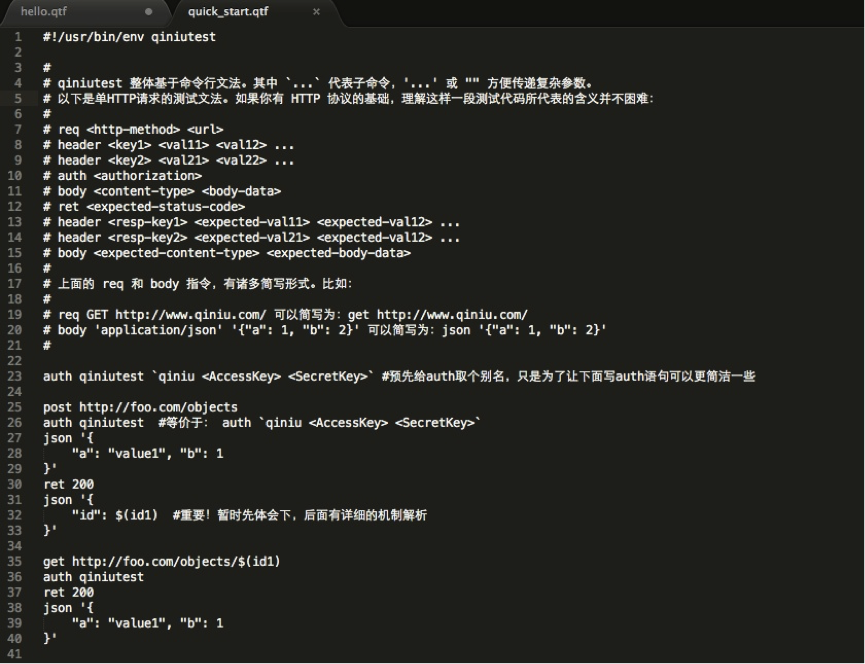

## 如何做 HTTP 服务的测试？

基于 HTTP 协议的好处：
* 现成的客户端、服务端框架。
* 在 HTTP 服务的调试、测试、监控、负载均衡等领域都有现成的相关工具。

相应的，我们需要思考如何更有效地进行 HTTP 服务的测试。

#### 1. 朴素的测试方案 
（所有公司的必经之路）

第一步先写好服务端，然后写一个客户端 SDK，再基于这个客户端 SDK 写测试案例。

优点：
* 符合常识理解。

弊端：
* 客户端 SDK 的修改可能会导致测试案例编不过。 （多一道分工，就多一道合作成本。）
* 客户端 SDK 通常是使用方友好，而不是测试方友好。
* 容易陷入“客户端 SDK 如何抽象更合理” 的细节，而不能专注于测试服务逻辑本身。

###### 精雕细琢意味着精力消耗。 警惕完美主义的陷阱，尤其是想做辅助工具的时候。 如何权衡看自己。

更常见的是什么情况？
* 一个直观的思路是直接基于 http.Client 类，直接写测试案例。

这种方式的问题是代码比较冗长，而且它的业务逻辑表达不直观，虽然可以写一些辅助函数来改观，但做多了就会逐渐有写测试专用 SDK 的倾向。
###### 这种做法看起来也不是很可取，毕竟为测试写一个专门的 SDK，看起来成本有些高了。

##### 总结
朴素方案 = 服务端、客户端 SDK、测试用 SDK、测试案例。

#### 2. httptest
httptest DSL 文法。 七牛为 HTTP 测试而写的领域专用语言。

DSL，即 domain-specific language 领域特定语言。 可以认为是一种自定义的语法。

##### httptest 工具
* https://github.com/qiniu/httptest （httptest 框架）
* https://github.com/qiniu/qiniutest （支持七牛帐号与授权机制的 httptest 工具）

##### 这套 DSL 的 “hello world” 程序
```bash
#!/usr/bin/env qiniutest

#
# 这个例子算是 qiniu httptest 工具的 hello world 程序。
# 执行预期： 下载 www.qiniu.com 首页，要求返回的 HTTP 状态码为 200。
# 如果返回非 200，测试失败； 否则测试通过，并打印返回的 response body。 
#   （response body 通常对测试来说无价值，更多是用于调试目的。） 
#

get http://www.qiniu.com/
ret 200
echo $(resp.body)
```

注意，输出 resp.body 的内容通常是调试需要，而不是测试需要。
###### 自动化测试是不需要向屏幕去输出什么的。

##### 再看该 DSL 的一个 “quick start（快速入门）” 样例
<div align="center"></div>

##### match 指令
所有 HTTP 返回包匹配的匹配文法，都可以用这个 match 来表达。

本质上来说，只需要一个不带参数的 ret，加上 match 指令，就可以搞定所有的返回包匹配过程。

#### 3. 测试环境的参数化
为了让测试案例更加通用，我们需要对测试依赖的环境进行参数化。

例如，
* 为了让测试脚本能够同时用于 stage 环境和 product 环境，需要把服务的 Host 信息参数化。
* 为了方便测试脚本入口，需要把 用户名 / 密码、AK/SK 等敏感性信息参数化，避免直接硬编码到测试案例中。

#### 4. 测试工具的重要性
测试是软件质量保障至关重要的一环。 同时，一个好的测试工具对提高开发效率的作用巨大。
###### 测试的便捷性直接决定着开发人员的开发效率。
