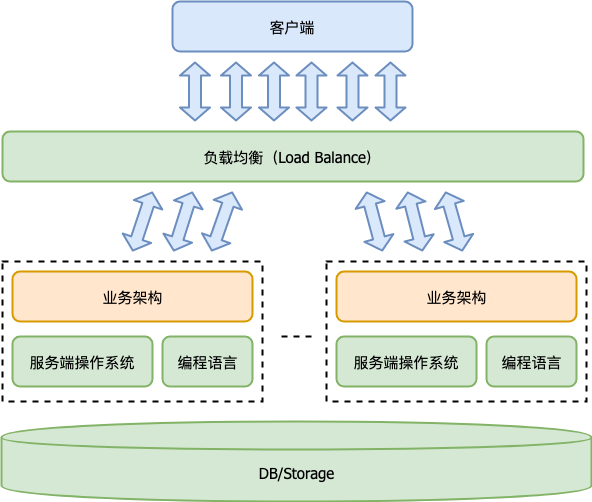

### Part III —— 服务端软件开发架构

#### 35. 服务端开发的宏观视角
服务端的诞生就是在 Internet 出现之后。服务端开发技术的迭代，一开始沿用了桌面操作系统的整套体系框架，现在，它正与桌面操作系统分道而行，转向数据中心操作系统（DCOS）之路。

##### 35.1 服务端程序的需求
—— 这些演进趋势的根源是什么？

* 规模。
* 连续服务时长。
* 质量要求。

从用户视角看，服务端程序 7x24 小时持续服务，任何时刻都不应该崩溃。就如同水电煤一样。

##### 35.2 服务端开发的体系架构
之前介绍的范式体系架构，是为了将桌面端与服务端统一。因此，仅仅是下图中虚线框内的部分。其实它只是服务端架构的一部分，是从服务端的单个实例看的。

一个服务端程序应该是一个多实例的分布式程序，其宏观体系架构如下：
<div align="center"></div>

相比桌面程序而言，服务端依赖的基础平台不只是操作系统和编程语言，多了两个重要的类：
* 负载均衡（Load Balance）；
* 数据库或其他形式的存储（DB/Storage）。

<br>

#### Part 3.1 —— 负载均衡 (***Load Balance***)

#### 36. 流量调度与负载均衡

##### 36.1 为什么会需要负载均衡（Load Balance）？ 什么是 “流量调度”？
首先，要了解以下概念
* 连接数
* IOPS
* 流量，入向流量和出向流量

###### 一个基本的服务端程序的服务请求，通常是由一个请求包（Request）和一个应答包（Response）构成。 这样一问一答就是一次完整的服务。

连接数 —— 又称 “并发数”，指的是同时在服务中的请求数。（指那些已经发送请求（Request），但是还没有收完应答（Response）的请求数量。）

IOPS —— 指的是平均每秒完成的请求（一问一答）的数量。 用来判断服务端程序的做事效率。

入向流量 —— 平均每秒收到的请求包（Request）数量 * 请求包平均大小。
出向流量 —— 平均每秒返回的应答包（Response）数量 * 应答包平均大小。
```
# 不考虑存在无效的请求包，也就是存在有问无答的情况的话。
● 入向流量 ≈ IOPS * 请求包平均大小
● 出向流量 ≈ IOPS * 应答包平均大小
```

所谓流量调度，就是把海量客户并发的请求包按特定策略分派到不同的服务端程序实例的过程。

##### 36.2 DNS 流量调度
* 什么是 DNS？ <br>
  Domain Name System，是域名解析系统，将域名映射为 IP 地址以便实现真正的网络访问。

* DNS 流量调度的精髓 <br>
  一个域名通过 DNS 解析到多个 IP，这样就实现了流量调度。

* DNS 流量调度的严重弊病 <br>
  1. 服务器升级不便。 要想升级 IP1 对应的服务端程序实例，必须先把 IP1 从 DNS 解析中去除。
  1. 流量调度不均衡。 域名解析均衡，并不代表真正的流量均衡。按域名解析做流量调度均衡，是非常粗糙的，实际结果并不可控。

##### 36.3 网络层（IP层）负载均衡
###### 案例： LVS (Linux Virtual Server，Linux虚拟服务器) —— 章文嵩
LVS 支持三种调度模式：
* VS/NAT： 通过网络地址转换（NAT）技术做调度。 请求和响应都会经过调度器中转，性能最差。
* VS/TUN： 把请求报文通过 IP 隧道转发至真实服务器，而真实服务器将响应直接返回给客户，调度器只处理请求报文。 这种做法性能比 VS/NAT 好很多。
* VS/DR： 通过改写请求报文的 MAC 地址，将请求发送到真实服务器，真实服务器将响应直接返回给客户。 相比 VS/TUN 少了 IP 隧道的开销，性能最好。

在网络层底层来做负载均衡，其特点是通用性强、性能优势高。但也有一些缺点。
```
思考： 假如某个业务服务器实例 RS 挂掉，但 LVS 调度器（Director Server）还没有感知到。。
## 在这个短周期内转发到该实例的请求都会失败。 这样的失败只能依赖客户端重试来解决。
```

##### 36.4 应用层负载均衡 （又称 “**应用网关**” “**反向代理**”）
—— 如何避免出现请求失败的情况？ 答案是：服务端重试。

###### Nginx 和 Apache 都是大家最为耳熟能详的 HTTP 应用网关。
HTTP 协议是应用最为广泛的应用层协议。 当前应用网关，绝大多数都是 HTTP 应用网关。

##### ● HTTP 网关的工作过程
HTTP 网关收到一个 HTTP 请求（Request）后，根据一定调度算法把请求转发给后端真实的业务服务器实例 RS（Real Server），收到 RS 的应答（Response）后，再把它转发给客户端。
（HTTP 反向代理）

##### ● HTTP 网关的重要优点 —— 服务端重试
重试非常好做。 在发现某个 RS 实例挂了后，HTTP 网关可以将同一个 HTTP 请求（Request）重新发给其他 RS 实例。

当然，为了能够支持重试，HTTP 请求（Request）需要被保存起来。

##### 36.5 优雅升级 （热更新）
有了负载均衡，不只是可以实现流量的均衡调度，连带业务服务器的升级也会方便很多。

###### 案例：前端是 HTTP 应用网关这种负载均衡的场景，升级的过程
* 升级系统通知升级的业务服务器（Real Server）实例退出。
* 要升级的 RS 实例进入退出状态，这时新请求进来直接拒绝（返回一个特殊的 Status Code），另外，等处理完所有处理中的请求后，RS 实例主动退出。
* 升级系统更新 RS 实例到新版本，并重启。

<br>

#### Part 3.2 —— 存储中间件

#### 37. 业务状态与存储中间件

##### 37.1 业务状态
思考： 桌面程序和服务端程序的相似之处在哪里，不同之处又在哪里？
* 一个桌面程序基本上是由一系列的 “用户交互事件” 所驱动。
* 一个服务端程序基本上是由 “网络 API 请求” 所驱动。

它们最大的差别是业务状态的表示不同。 桌面程序的业务状态是如何表示的？内存中的数据结构。

##### 37.2 存储中间件与容灾级别 —— 服务端程序的业务状态持久化

* 从历史上来看，第一个存储中间件是数据库，出现在 1974 年。

* 桌面程序很少用数据库。只有一些需要增量持久化业务状态的场景会被采用，比较典型的是微信。 采用的是嵌入式数据库，比如 **SQLite**。

对服务端开发来说，数据库的出现是革命性的，它大大提升了开发效率。

但在容灾级别这个事情上，随着互联网的普及，我们对它的要求越来越高。
* 首先，单机数据库是不够的，需要多机相互热备，这就是数据库主从结构的来由。
* 其次，单机数据库是不够的，单机存储量终归有上限，这也是分布式数据库的来由。
* 最后，单机房的可靠性也是不够的，于是就出现了“两地三中心”，跨机房容灾的数据灾备方案。

##### 37.3 “存储即数据结构” 的理念 —— 存储中间件
存储中间件是什么？存储中间件就是 “元数据结构”。

在内存中我们实现一个 KV 存储非常容易，很多语言都有 Dictionary 或者 Map 这样的数据结构来做这事。

但是，一个服务端的 KV 存储非常非常复杂，绝非一个人花上一天两天就可以干出来。 并且需要经过非常庞大的测试案例进行方方面面的验证，才敢投入生产环境。

###### 由此，对于服务端来说，所有业务需要涉及的数据结构都需要抽象出来，成为一个存储中间件。
存储中间件会有多少？ 这与服务端开发的模型抽象有关。

###### “元数据结构”
```
其含义是，
数据结构的种类是非常有限的，并且最好理论可被证明，
有了这样一些基本的数据结构，所有的业务需求都可以高效地实现。
```

##### 37.4 今天我们接触的存储中间件有哪些？
* 键值存储（KV-Storage）
* 对象存储（Object Storage）
* 数据库（Database）
* 消息队列（MQ）
* 倒排索引（SearchEngine）
* 等等

从目前看，存储中间件的种类是不可枚举的。 也许未来我们能够在这个问题上找到更加完美的答案。

#### 38. 键值存储与数据库

##### 38.1 数据库的种类
从使用界面（接口）的角度来说，
* 关系型数据库（Relational Database）
  ```
  以 MySQL、Oracle、SQLSever 为代表。
  # 特点：
    ● 每个条目（row）的数据分成多个项目（column）。
    ● 如果某个项目比较复杂，但从数据结构角度来说是一个结构体，就可以搞一个新的表（table）来存储它。
    ● 可以认为，主表只是存储一个 ID 来引用各个结构体（副表）。
  这类数据库的特点是强 schema，每个项目（column）有明确的数据类型。
  从业务状态的角度看，可以把一个表（table）理解为一个结构体。
  ```
* 文档型数据库（Document Database）
  ```
  以 MongoDB 为代表。
  # 特点：
    ● 每个条目（row）称为文档（document），每个文档用 JSON 或其他文档描述格式表示。
  文档型数据库大部分是无 schema 的，不对文档的数据格式的有效性进行检查。
  好处是，约束少，数据格式升级修改不受限。 坏处是，质量保障体系弱化，数据可能被弄脏而不自知。 “脏数据”
  ```
* 键值存储（KV Storage）
  ```
  以 Cassandra 为代表。
  # 特点：
    ● 键值存储明确只有唯一索引。
  MySQL 数据库是允许通过多个索引字段来检索的，
  因此，从使用角度来说，键值存储是数据库的特例。
  从底层实现技术角度，键值存储是数据库的基础。 每一组数据库的索引，往往背后就是一组键值存储。
  ```

##### 38.2 “事务” 的概念
无论是何种数据库，都面临一个重大选择：是否支持事务。

* 什么是事务？ <br>
  简单来说，事务就是把一系列数据库操作变成原子操作的能力。

* 事务的特性
    * 原子性（Atomicity）
    * 一致性（Consistency）
    * 隔离性（Isolation）
    * 持久性（Durability）

##### 乐观锁
先计算出所有修改的数据，然后最后一步统一提交修改。 提交时进行冲突检查。
###### 乐观锁让锁数据库的粒度降到最低。

##### 38.3 主从式结构
数据库必然考虑的三个问题
* 可用性（Availability），关注业务是否正常工作。
* 持久性（Durability），关注数据是否会被异常丢失。
* 一致性（Consistency），关注多个副本之间的数据更新一致。

##### 方案
解决这个问题的方法之一是采用主从（Master-Slave）结构。

主从结构采用的是一主多从模式，所有写操作都发往主（Master），所有从（Slave）都从主这边同步数据修改的操作。
###### 从（Slave）可以帮主（Master）分担一定的读压力。 但是不是所有的读操作都可以被分担。

##### 意义/核心
从（Slave）最重要的是和主（Master）形成了互备关系。在主挂掉的时候，某个从节点可以替代成为新的主节点。

##### 38.4 分布式结构
更加艰巨的问题
* 数据规模大到一定程度后，单个物理节点存放不了那么大的数据量。
* 主承受的读写压力太大，单台主节点承受不了这样高的 IOPS（吞吐能力）。

##### 方案
怎么解决？

分布式。 简单说，就是把数据分片存储到多台设备上的分片服务器一起构成一个单副本的数据库。 （“分片”）

分片的方式常见的有两种：
* 哈希分片（Hash based sharding）
* 范围分片（Range based sharding）

无论哪个分片方式，都会面临因为扩容缩容导致的重新分片过程。 重新分片意味着需要做数据的搬迁。

##### 意义/核心 —— 分片及 CAP 理论
在分布式存储领域，有一个著名（CAP）理论。
* 数据一致性 (Consistency)： 如果系统对一个写操作返回成功，那么之后的读请求都必须读到这个新数据，否则都不能读到新数据。
* 服务可用性 (Availability)： 所有读写请求在一定时间内必须得到响应，可终止、不会一直等待。
* 分区容错性 (Partition-tolerance)： 在网络分区的情况下，被分隔的节点仍能正常对外服务。
###### 分布式存储领域， C、A、P 三个目标不能兼得，我们同时只能取其二。

#### 39. 文件系统与对象存储

##### 39.1 异常处理才是存储的业务逻辑

存储为什么会复杂，需要从什么是存储谈起。
* 存储这个词非常平凡，“存储 + 计算” 构成了朴素的计算机模型，简单来说，存储就是负责维持计算系统的状态的单元。
* 从维持状态的角度，我们会有最朴素的可靠性要求。

###### 思考： 什么是最朴素的需求？
```
# 需求？ 需求之后的最朴素的夙愿 —— 可靠性。 所谓的 “靠谱”。
```

互联网时代，人们希望的服务是随时可获得并“靠谱”的。

##### 39.2 服务器程序怎么才能做到高可靠、高可用？
**答案是存储中间件。** 没有存储中间件，意味着所有的业务程序，都必须考虑每做一步就对状态进行持久化，以应对宕机等异常突发。

###### “业务逻辑上不宕机。”  “存储中间件” 的使用精髓 — 存储即数据结构！

对于大部分的业务程序（非存储系统相关）而言，你只需要重点关注业务的正常分支流程就行，对于出乎意料的情况，通常只需抛出一个错误，告诉用户你不该这么玩。

而存储系统解决的就是各种突发情况下的数据持久化和备份迁移，业务的正常分支就比较复杂难辨。

##### 39.3 从文件系统谈起
##### 多媒体文件（图片、音视频、Office 文档等）的保存
在服务端开发中，我们业务用到的多媒体，通常很少会去存储到数据库中，更多的是把它们放在文件系统里（服务器的磁盘上）。

文件系统的弊病：
* 伸缩性问题。 存储规模超过一台机器可管理的时候，应该怎么办。
* 性能瓶颈。 通常在文件数目达到临界点(一定数量)后，性能快速下降。
* 可靠性/持久性（Durability）。 单机文件系统通常只是单副本的方案，单副本已无法满足业务的持久性要求。
* 可用性要求。 单机文件系统通常只是单副本的方案，该机器出现问题将导致业务中断。

###### 数据需要有冗余（比较经典的做法是 3 副本），以便在磁盘损坏时及早修复丢失的数据，同时不影响业务。
```
在分布式存储系统出现前，有一些基于单机文件系统的改良版本被一些应用采纳。
比如：在单机文件系统上加 RAID5 做数据冗余。
 这种方案单机的可靠性大概是 100 年丢失一次数据。
但是，服务端存储只要规模够大，比如 10000 台，就会使得很多看起来是小概率的事件，变成必然事件。
```

##### 思考： 什么样的数据会有最大的存储规模？
答案是非结构化数据。 图片、音视频、Office 文档等多媒体文件，就是比较典型的非结构化数据。互联网上 90% 以上传输的数据量都是非结构化数据。

另外，这些数据不是以机器友好为目标，而是通常以用户体验友好为目标。 人们正在一步步把物理世界映射到数字世界。

##### 39.4 分布式存储
Google GFS 是很多人阅读的第一份分布式存储的论文，这篇论文奠定了 3 副本在分布式存储系统里的地位。随后 Hadoop 参考此论文实现了开源版的 GFS —— HDFS。

##### 39.5 对象存储
非结构化数据的存储方式，最理想的绝对不是分布式文件系统。

文件系统只是桌面操作系统为了方便用户手工管理数据而设计的产物。 对服务端体系架构来说，文件系统其实是一个过时的东西。

非结构化数据最佳的存储方式，还是键值存储（KV Storage）。 用于存储非结构化数据的 KV Storage，就叫 “对象存储”。
###### 对象存储的本质是 —— 键值存储。 但是，它和结构化数据的键值存储，实现机制上又有极大的差异。

``在对象存储中，并不存在目录（Directory）这样的概念。``
```
对象存储是一个键值存储，就意味着，可以通过对 Key 做 Hash，或者对 Key 按 Key Range 做分区，
从而，能够让请求快速定位到特定某一台存储机器上，转化为单机问题。
```

###### 补充话题： 为什么在数据库之后，会冒出来那么多 NoSQL 数据库。
```
数据库和文件系统一样，最早都是单机的，在伸缩性、性能瓶颈、可靠性、可用性上遇到了相同的麻烦。
# SQL 数据库，全称 关系型数据库。
  有关系意味着有多个索引，也就是有多个 Key，这对数据库转为分布式存储系统来说非常不利。
# NoSQL 数据库 —— KV Storage。
```

##### 39.6 “去关系/去目录” 和 一些其他考虑
文件系统的去关系，也就是去目录结构。 有目录意味着有父子关系。

针对对象存储及一些新兴的存储形式，放弃创建目录这样的想法是需要去适应的。
第一个大家公认的对象存储是 AWS S3，它最基本的访问接口如下：
```
func PutObject(bucket, key string, object io.Reader) (err error)
func GetObject(bucket, key string) (object io.ReadCloser, err error)
```

七牛云存储并不仅仅是简单的分布式存储，它需要额外考虑以下这些问题。
* 网络问题，也就是文件的上传下载问题。
    * 文件上传方面，需要考虑较差的网络条件下的文件上传和大文件的上传。
    * 文件下载方面，考虑到 CDN 已经发展了 10 多年的历史，决定基于 CDN 技术来做下载加速。
* 多媒体处理。
    * 图片缩略图相关的需求。
    * 音视频转码的需求。

``七牛云存储 = 对象存储 + 上传下载加速 + 多媒体处理``

##### 39.7 存储成本与持久性
存储作为一个服务被剥离出来，自然而然，最关心的就是单位存储成本问题。

通常我们用每 GB 每月花费多少钱来表示单位存储成本。

相应的，存储服务供应商也会考虑成本问题，其中最大的两个关联因素是
* 存储密度。 存储密度越高，单台机器的存储量越大，单位成本越低。
* 冗余度。 GFS 采用的是 3 副本冗余方案，实际上为了降低冗余度，通常采用的是纠删码（EC）这样的算术冗余方案。

#### 40. 存储与缓存

##### 40.1 缓存（Cache）是什么？
简单说，缓存是存储（Storage）的加速器。

缓存系统的一个核心指标是缓存命中率（Cache Hit Rate），即在一段时间内，FastF 缓存命中的次数 / 所有 FastF 的调用次数。
###### 在缓存未命中的情况下，缓存对存储系统是没有加速效果的，甚至增大系统开销。

什么情况下需要扩容？ 一旦缓存命中率趋势下降，且下降到某个阈值，就要考虑给缓存集群扩容。

##### 40.2 缓存 vs 存储
缓存的基础逻辑是非常简单的。 问题是：
* 缓存（Cache）和存储（Storage）是什么关系？
* 缓存也是一种存储中间件么？

答案： 既是也不是。

* 缓存和一般的存储中间件一样，也在实际维持着业务状态。 但是，缓存允许数据发生丢失，所以缓存通常是单副本的。
* 缓存数据丢失，这事可大可小。 只要不是发生大片大片的缓存数据丢失的情形，通常只是会造成后端存储（Storage）的短时压力变大。

缓存故障导致的雪崩(滚雪球)事件： <br>
``首先是部分缓存实例宕机，导致缓存命中率（Cache Hit Rate）下降，大量的请求落到后端存储上，紧接着导致后端存储过载，也出现宕机。``
``此时，就算后端存储重新启动起来，又会继续被巨大的用户请求压垮，形成雪崩现象。``

如何避免雪崩事件的发生？ 答案: 过载保护能力。
* 最简单的办法，是后端存储自己要有过载保护能力。 一旦并发的请求超过预期，就要丢弃部分请求，以减少压力。
* （所谓过载保护，就是随机丢弃服务请求）

缓存（Cache）和存储（Storage）到底是什么关系？
* 缓存其实应该被认为是存储的补丁。 如果存储本身非常匹配业务场景的话，它不应该需要缓存在它前面挡一道，或者说，内部自己就有缓存。
* 单独地添加缓存模块，更根本的原因还是存储和业务场景不那么直接匹配所致。

所以我们说，缓存是一个存储的补丁。

##### 40.3 著名地缓存系统
* memcached <br>
  https://memcached.org/
* groupcache <br>
  https://github.com/golang/groupcache

##### 40.4 Redis
谈到存储与缓存的关系，不能不提 Redis。

* Redis 可以当作缓存，因为它是基于内存的存储，数据是掉电丢失地。
* Redis 又可以看作是存储，因为它也支持定期写到外存中，虽然定期持久化不同于理想的持久化。
* 另外，Redis 支持多副本，但是，一般是同机房多台机器的多副本，仍然无法防止机房整体断电这类的故障。
* 最后，Redis 的重试友好性较差。 在重试时一个不小心，我们很可能就往列表中添加了多个相同的元素进去。

总结来说，Redis 如果我们把它作为存储的话，坑还是不少的。 （Redis 应该看作是和 memcached、groupcache 一样的缓存系统。）

##### 总结
Redis 和 memcached 都是实用型的瑞士军刀，很有用，但是，我们站在分布式系统的理论角度看时，它们都有那么一点不完美的地方。

<br>

#### Part 3.3 —— 业务架构（系统设计/子系统划分）
大方向来说，业务架构必然是领域性的，与你所从事的行业息息相关。但是，如同桌面程序有 MVC 模式一样，服务端的业务架构也会有自己的套路。

#### 41. 服务端的 “业务架构” 建议

##### 41.1 服务端的划分
一般把服务端划分成两层： Multi-User Model 层、Web 层。
* Web 层又进一步划分为： Session-based Model 和 Session-based ViewModel。

##### 41.2 开发范畴划分
一般认为，Session-based ViewModel 层属于桌面开发的范畴，哪怕是胖后端的模式下也会这样去归类。
``在胖后端的方式下，ViewModel 不再是由 JavaScript 完成，而是由类似 PHP 之类的语言完成。``

一般来说，Session-based Model 是一个非常简单的转译层。 因此，对于业务架构，主要谈的是 Multi-User Model 层。

##### 41.3 Multi-User Model 层
##### 41.3.1 网络协议
第一个重要话题是网络协议，它是服务端程序的使用界面（接口）。

什么是网络协议？
* 这一层网络协议往往提供的是 RESTful API，我们也会称其为 RESTful API 层。

###### 补充： 什么是 RESTful ？
```
RESTful 是一种风格的名字。 基于 HTTP，可以使用 XML 格式定义或 JSON 格式定义。
# REST (Representational State Transfer) 指的是一组架构约束条件和原则。
  ● 每一个 URI 代表 1 种资源；
  ● 客户端使用 GET、POST、PUT、DELETE 4 个表示操作方式的动词对服务端资源进行操作； （分别对应：获取、新建(也可用于更新)、更新、删除）
  ● 通过操作资源的表现形式来操作资源，资源的表现形式是 XML 或者 HTML；
  ● 客户端与服务端之间的交互在请求之间是无状态的。 （即：每个请求都必须包含理解请求所必需的所有信息。 “无会话（Session）”）
无 Session 的好处和意义： 服务器可以在请求之间的任何时间点重启，客户端不会得到通知。 （业务在逻辑上不宕机！！）
```

###### 补充： 再看 Model 层
```
对于 MVC 模式，无论是 桌面端 还是 服务端，Model 层提供核心业务，它不存在 “临时状态”，每一个对外提供的接口（API）都完成一项完整的业务。
## Model 层 每一个对外提供的接口（API）都完成一项完整的业务！！！
## “无会话（session）”的概念 可以实现就是因为这个特点。

再看 MVC，
    ▫ Model 层就是一个个完整的业务，原则是 “无会话（Session）”。
    ▫ View 层就是界面呈现和用户交互事件。 ViewModel 属于 View 层的辅助。
    ▫ 最后剩下的 Controller 层就是，用户交互事件翻译成业务 API 调用，以及 “临时状态(中间状态)” 的保存更新关联等等。
提示: 如果存在会话（Session），就意味着一定有 Controllers。
```

当然，除了 RESTful API 这一种 API 规范，还有基于 XML 的有 SOAP（简易对象访问协议）、WSDL（Web 服务描述语言）等。

另外，有人会觉得文本协议效率不够好，希望采用二进制的协议。 比如，Facebook 早年搞了个 thrift（已弃用），Google 也搞了个 protobuf 协议，并且基于 protobuf 搞了一个 grpc 框架。

还有一个选择是 GraphQL，针对企业在有多个业务的时候，又不想发布很多套 RESTful API。
（GraphQL 理念虽然先进，但是概念复杂，并不易于掌握，不温不火。）

###### 选择哪个？ 更倾向于 RESTful API。 只有 HTTP 协议，才有被广泛采纳的专门的应用层网关，比如 nginx 和 apache。这一点千万不要忘记。
```
Google 的 grpc 其实也是基于 HTTP 协议的，只不过它更推荐 HTTP 2.0，因为效率已经经过高度的优化。
虽然 protobuf 是二进制的，但它取代的不是 HTTP 协议，而是 json、xml 或 Web 表单（form）。
（凡是想对 HTTP 协议取而代之的，都会挂掉。）
```

##### 41.3.2 业务 API
一旦确定我们选用的网络协议规范，剩下的就是如何定义具体的业务 API 了。

##### 41.3.3 授权（Authorization）
我们第二个要考虑的是授权（Authorization）。 当前，主流的授权方式有两种：一种是基于 Token，一种是基于 AK/SK。

* 基于 AK/SK 的授权，多数发生在面向企业用户提供 API。即 To B 场景。 AK/SK 授权的背后是数字签名。
* 基于 Token 的授权，多数发生在面向终端用户的场景。To C 场景。 当前推荐的 Token 授权标准是 OAuth 2.0，它得到了广泛的支持。

授权这块的选择是相对简单的。 更多需要考虑的是： 如何构建业务无关的用户帐号体系和授权系统。
``它们隶属于通用的帐号与授权子系统，可以做到与业务无关。``

##### 41.3.4 RPC 框架
确定了业务 API，明确了授权机制，下面就是怎么实现的问题了。

* 如果业务 API 选择了基于 protobuf，那么 grpc 框架是个不错的选择。
* 对于 RESTful API，七牛云对外开源了一套非常精简的 restrpc 服务器框架 https://github.com/qiniu/http

restrpc 框架的使用样例 <br>
https://github.com/qiniu/http/tree/master/examples/authrestrpc

##### 41.3.5 单元测试
对业务 API 进行单元测试。

七牛开源的 httptest 框架。 https://github.com/qiniu/httptest

可以依葫芦画瓢，参考 https://github.com/qiniu/qiniutest 实现一个适合你们公司的授权机制下的 httptest 工具。

<br>

#### Part 3.4 —— 程序后端实战
对比服务端和桌面的内容，可以发现服务端开发和桌面端开发各自有各自的复杂性。
* 服务端开发，难在基础软件很多，对程序员和架构师的知识面和理解深度都有较高的要求。 相对的，服务端的业务逻辑相对简单。
* 桌面端开发则相反，它的难点在于用户交互逻辑复杂，代码量大，业务架构的复杂性高。

#### 42. 实战（一）：“画图”程序后端实战

##### 42.1 RPC 框架
第一步，引入 RPC 框架。

##### 42.2 业务逻辑的分层
服务端业务逻辑被分为两层：
* 一层是业务逻辑的实现层，Model 层。
* 另一层则是 RESTful API 层。 它负责接收用户的网络请求，并转为对底层 DOM 树（Model 层）的方法调用。

这样分层的原因是，我们实现核心业务逻辑的时候，并不会假设一定通过 RESTful API 暴露。

###### 解释
```
做个类比： 我们都知道 mysql 是通过 TCP 协议提供服务接口的，而 sqlite 是嵌入式数据库，通过本地函数调用提供服务接口。
那么，服务端的两层分层逻辑相当于：
我们去实现 mysql，先实现业务逻辑层，即嵌入式数据库 sqlite，然后再提供基于 TCP 协议的网络接口。
```
在需要同时支持多套网络接口的时候，这种分层的价值就体现出来了。

##### 42.3 单元测试
使用 httptest 测试框架。


#### 43. 实战（二）：“画图”程序后端实战

##### 43.1 使用界面（接口）
从 DOM 树的角度来说，它的逻辑结构如下：
* Document => Drawing => Shape

现在考虑： 在引入多租户之后的 DOM 树，会发生什么变化？
* 是这样么？ Document => User => Drawing => Shape

错。 多租户不应该影响 DOM 树的结构！！

##### 43.2 多租户
多租户不会导致 Model 层级发生变化，但是它会导致接口方法的变化。 ``通常我们应该把多租户看作某种程度的安全约定，避免访问到没有权限访问到的资源。``

例如： 多租户导致的 Document 类接口的变化
```go
# 不考虑多租户时的接口
func (p *Document) Add() (drawing *Drawing, err error)
func (p *Document) Get(dgid string) (drawing *Drawing, err error)
func (p *Document) Delete(dgid string) (err error)
```
```go
# 考虑多租户时的接口 （添加 uid）
// Add 创建新 drawing 时需要提供 uid。
func (p *Document) Add(uid UserID) (drawing *Drawing, err error)

// Get 获取 drawing。
// 我们会检查要获取的 drawing 是否为该 uid 所拥有，如果不属于则获取会失败。
func (p *Document) Get(uid UserID, dgid string) (drawing *Drawing, err error)

// Delete 删除 drawing。
// 我们会检查要删除的 drawing 是否为该 uid 所拥有，如果不属于删除会失败。
func (p *Document) Delete(uid UserID, dgid string) (err error)
```
传入 uid 是一种约束，不应该导致业务逻辑的变化和 Model 层的架构变化。

###### 另外，不要想当然就向接口添加 uid 约束，我们需要极力避免接口因为多租户而产生变化。 谨记 “奥卡姆剃刀原理”。

##### 43.3 数据结构 —— “定义表结构”
``程序 = 数据结构 + 算法`` —— 是一个很好的指导思想。

对于服务端程序，数据结构不完全是我们自己能够做主的。 服务端程序在数据结构这一点上，最为重要的一件事是选择合适的存储中间件。

然后我们再在该存储中间件之上组织我们的数据。

##### 为何是 mongodb，而不是某种关系型数据库？
最重要的理由，是因为图形（Shape）对象的开放性。 图形的种类很多，它的 Schema 不是我们今天所能够提前预期的。

##### “定义表结构”
表（Table）是在关系型数据库中的说法，对于非关系型数据库，数据的组织方式不同。

但是，出于惯例，我们很多时候还是以 “定义表结构” 一词来表达我们想干什么。

``对于数据结构，我们还是以结构体的模式来定义： 从 字段名、含义、索引、类型 几个方面考虑。``

我们需要重点关注索引的设计。 这是数据库的一个基本功能需求。

##### 43.4 算法 —— “接口调用最终的归宿”
算法是什么？
* 算法是用于解决问题的一系列明确的指令。

所以算法，最直白的含义，指的是用户故事背后的实现机制。 “接口调用最终的归宿。”

##### 43.4 网络协议
现在底层的业务逻辑实现层已经支持多租户，网络协议也需要做出相应的修改。

现在，我们先只考虑最简单的调整，引入一个 mock 的授权机制。

#### 44. 实战（三）：“画图”程序后端实战

##### 44.1 帐号（Account）
帐号，简单说就是某种表征用户身份的实体，它代表了一个“用户”。

``虽然一个物理的自然人用户可能会在同一个网站开多个帐号，但从业务角度，我们往往把这些帐号看作不同的用户。``

##### 44.2 授权（Authorization）
授权是帐号对服务的访问方式。

``有帐号，就会有授权。 但是帐号和授权并不是对应的，同一个帐号，可能会有多种授权。``

#### 45. 实战（四）：“画图”程序后端实战
—— 考虑如何让 QPaint 引入帐号与授权体系。

###### 比较理想的方式是我们基于 OpenID Connect 协议来提供帐号系统，基于 OAuth 2.0 协议来实现 Open API 体系。

##### 45.1 dex
https://github.com/dexidp/dex

dex 基于各类主流的 OpenID 来提供帐号系统，上游的 OpenID Provider 是以插件方式（Pluggable Connector）提供。 这也是为什么把它叫联邦 OpenID（federated OpenID）的原因。

最后，dex 再通过 OAuth 2.0 协议对客户端提供授权服务。

##### 45.2 提供 OpenID + OAuth 2.0 服务
dex 并不是一个包（package），而是一个可执行程序（application），它提供了帐号与授权服务。

##### 45.3 注意/谨记
**我们不只是用标准的协议，背后的实现也都是基于开源项目：CoreOS 团队开发的 dex。** “切记不要闭门造车”

<br>

#### Part 3.5 —— 怎么做详细设计？

一款产品的三个阶段：
* 需求分析。 ``需求分析并不是纯技术的东西，和编程这件事情无关。 它关乎的是用户需求的梳理、产品的清晰定义、可能的演变方向。``
  产品定义将明确产品的元素，明确产品的边界，与产业上下游、合作伙伴的分工。

* 概要设计。 ``一般以子系统为维度来阐述系统各个角色之间的关系。``
  该阶段的核心意图并不是确定系统完整的模块列表，焦点是整个系统如何被有效地串联起来。 （概要设计阶段需要有 Mock 版产出）

* 详细设计阶段。 ``各个子系统或模块的负责人，对他负责的部分进行进一步的细化。``
  这个阶段就是我们常规认为的 “公司”。

请记住，详细设计并不是只谈实现就完事，更不是一个架构图。

###### 解释
```
一般意义上，当我们参与一项工作时，都是参与到 “详细设计阶段”。 而忽略或者不知需求分析和概要设计的内容。
仔细品味 “详细设计并不只是谈实现就完事，更不是一个架构图。”
```

#### 46. 架构：怎么做详细设计？

##### 46.1 现状与需求
现在在哪里，遇到了什么问题，要做何改进。

从逻辑自洽的角度，任何行动的开始，首先关注的都应该是要解决的问题与目标。

##### 46.2 需求满足方式
* 要做成啥样？ 交付物的规格，或者说使用界面（接口）。
* 怎么做到？ 交付物的实现原理。

在做这些工作的时候，也要考虑对之后的发展有自然的延续性。

##### 46.3 实现：数据结构 + 算法
当我们谈论数据结构时，谈论的应该是表结构设计。

表结构，核心需要包含以下内容：
* 字段名；
* 类型；
* 字段含义； 是否指向另一个表的某个字段；
* 索引。

定义表结构和定义内存数据结构本质是完全一致的。 只是在学习内存数据结构时，不考虑索引需求。

算法，最直白的含义，指的是用户故事背后的实现机制。
* 时序图。 流程不长时，可视化效果更利于展示。 https://www.websequencediagrams.com/
* 伪代码。 在逻辑较为复杂时，伪代码往往有更好的呈现效果。

<br>

#### Part 3.6 —— 回顾与总结

#### 47. 服务端开发篇：回顾与总结

* 桌面的领域特征是强交互，以事件为输入，GDI 为输出。 桌面技术的迭代，是交互的迭代，是人机交互的革命。
* 服务端技术的迭代，有一些和服务端开发相关，会影响到业务架构。而更多则和业务架构无关，属于服务治理的范畴。

整体来说，尽管服务端开发所需要的知识面更广，但是就开发本身的工作量和难度而言，服务端开发要大大低于桌面开发。

但是，将服务端程序开发出来只是个开始。 如何让服务稳定健康地运行，是一个复杂的话题。

##### 一些值得重点关注的技术：
* Docker & Kubernetes。
* Go 语言。
* LVS & Nginx。
* MySQL & MongoDB。
* 对象存储。
* 网络协议。 RESTful API
* RPC 框架。 （远程过程调用协议RPC（Remote Procedure Call Protocol)，RPC是指远程过程调用。）
* HTTP 测试。
