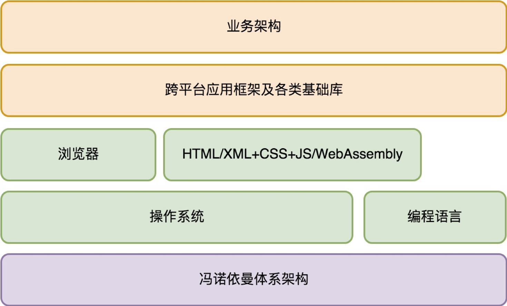
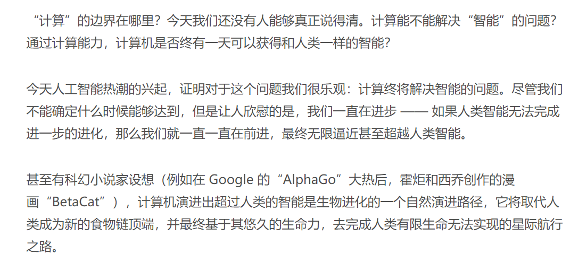

#### 1. 怎样成长为优秀的软件架构师？
程序员的三个层次
* 搬砖师
* 工程师  
  —— 致力于不断提升软件代码的工程质量的程序员。
* 架构师

代码质量的评判
* 可阅读性 （方便代码流转）
* 可扩展性 / 可维护性 （方便修改功能，添加新功能）
* 可测试性（质量管理）
* 可复用性（简化后续功能开发的难度）

###### 大部分商业软件都是一项极其复杂的工程，它们远比很多传统的建筑工程复杂得多，无论是涉及的人力、时间还是业务的变数都要多很多。

###### 光靠把控软件工程师的水平，依赖他们自觉保障的工程质量，是远远不够的。

##### 1.1 架构师团队
软件工程是一项非常复杂的系统工程，它需要依赖一个能够掌控整个工程全局的团队，来规划和引导整个系统的演变过程。这个团队就是架构师团队。

##### 1.2 架构师的责任
软件架构师的职责，并不单单是我们通常理解的，对软件系统进行边界划分和模块规格的定义。

从根本目标来说，软件架构师要对软件工程的执行结果负责，这包括：按时按质进行软件的迭代和发布、敏捷地响应需求变更、防范软件质量风险（避免发生软件质量事故）、降低迭代维护成本。

##### 1.3 根基
核心在于对知识脉络的体系化梳理。这是架构能力构建和全面提升的关键。

#### 2. 架构设计的宏观视角

##### 2.1 操作系统
它首先要解决的是软件治理的问题。它要建立安全保护机制，确保你的电脑免受恶意软件侵害。同时，它也要建立软件之间的协作秩序，让大家按照期望的方式进行协作。

其次解决的是基础编程接口问题。 这些编程接口一方面简化了软件开发，另一方面提供了多软件共存（多任务）的环境，实现了软件治理。

##### 2.2 完整的程序架构是怎样的？
###### 服务端应用程序架构体系

###### 客户端应用程序架构体系

#### 3. 大厦基石：无生有，有生万物
—— 冯·诺依曼体系结构

##### 3.1 解剖架构的关键点是什么？
* 需求。
  1. 这个零部件的作用是什么？它能被用来做哪些事情？（某种意义上来说更重要的是）它不会被用来做哪些事情？
  1. 难点： “为什么?” 为何这个零件被设计成用来干这些事情的，而不是多干一点事情，或者为什么不是少干某些事情？
* 规格。
  1. 这个零部件接口是什么样的？它如何与其他零件连接在一起的？ (规格是零部件的连接需求的抽象。)
  1. 规格的约束条件会非常多样化，可能是外观（比如形状和颜色），可能是交互方式（比如用键盘、鼠标，或者语音和触摸屏），也可能是质量（比如硬度、耐热性等等）。

##### 3.2 为“解决一切的问题”而生
冯·诺依曼体系结构的迷人之处在于，从需求来说，它想解决一切问题。解决一切可以用“计算”来解决的问题。

“计算”的边界在哪里？  
今天我们还没有人能够真正说得清。

##### 3.3 冯·诺依曼体系的规格
冯·诺依曼引入了三类基础零部件：
* 中央处理器
* 存储
* 输入输出设备

##### 中央处理器
它负责程序（指令序列）的执行。指令序列在哪里？也存放在存储里面。计算机加电启动后，中央处理器从一个固定的存储地址开始执行。

##### 存储
存储可简单分为两类：
* 一类是内置支持的存储，通过常规的处理器指令可直接访问，比如寄存器、内存、计算机主板的 ROM。
* 一类是外置存储，它们属于输入输出设备。中央处理器本身并不能直接读写其中的数据。

冯·诺依曼体系中涉及的“存储”，指的是中央处理器内置支持的存储。

##### 输入输出设备
它是计算机开放性的体现，大大拓展了计算机的能力。每个设备通过一个端口与中央处理器连接。

通过这个端口地址，中央处理器可以和设备进行数据交换。数据交换涉及的数据格式由设备定义，中央处理器并不理解。

###### 和 “解决一切可以用‘计算’来解决的问题” 这个伟大的目标相比，冯·诺依曼体系的三类零部件的规格设计显得如此精简。

##### 3.4 需求是怎么被满足的？
* 需求的变化点在于，要解决的问题是五花八门包罗万象的。 如何以某种稳定但可扩展的架构来支持这样的变化？
* 需求的稳定之处在于，电脑的核心能力是固定的。 怎么表达电脑的核心能力？

电脑的核心能力是“计算”。 什么是计算？计算就是对一个数据（输入）进行变换，变为另一个数据（输出）。在数学中我们把它叫“函数”。

next，
* 数据物理上在哪里？
* 一个具体的计算怎么表达？
* 如何和现实世界发生交互？

##### 输入输出设备从根本上解决的问题是什么？
是电脑无限可能的扩展能力。 最重要的一点，输入输出设备和电脑是完全异构的。输入输出设备对电脑来说就只是实现了某项能力的黑盒子。

##### 3.5 架构思维上我们学习到什么？
架构的第一步是需求分析。
* 从需求分析角度来说，关键要抓住需求的稳定点和变化点。
* 需求的稳定点，往往是系统的核心价值点。 (我)
* 需求的变化点，则往往需要相应去做开放性设计。 (供应商)

计算机加电启动后，中央处理器并不是按自己固有的“计算”过程进行，而是从一个固定的存储地址加载指令序列执行。

这样一来，“计算”需求的多样性只需要通过调整计算机主板上的 BIOS 程序，乃至外置存储中的操作系统启动程序就可以实现，而不必去修改中央处理器本身。 (接口的价值)

###### 当我们把所有的变化点从电脑的最核心部件中央处理器剥离后，中央处理器的需求变得极其稳定，可独立作为产品进行其核心价值的演进。 (生态)

#### 4. 
