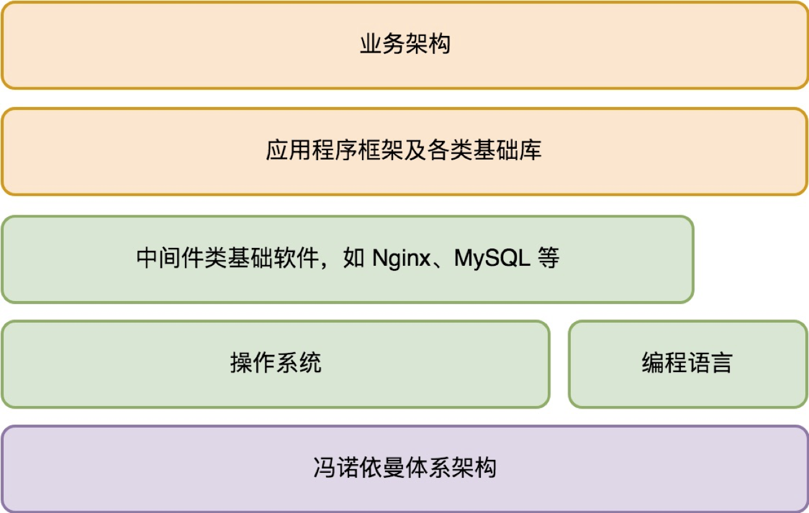
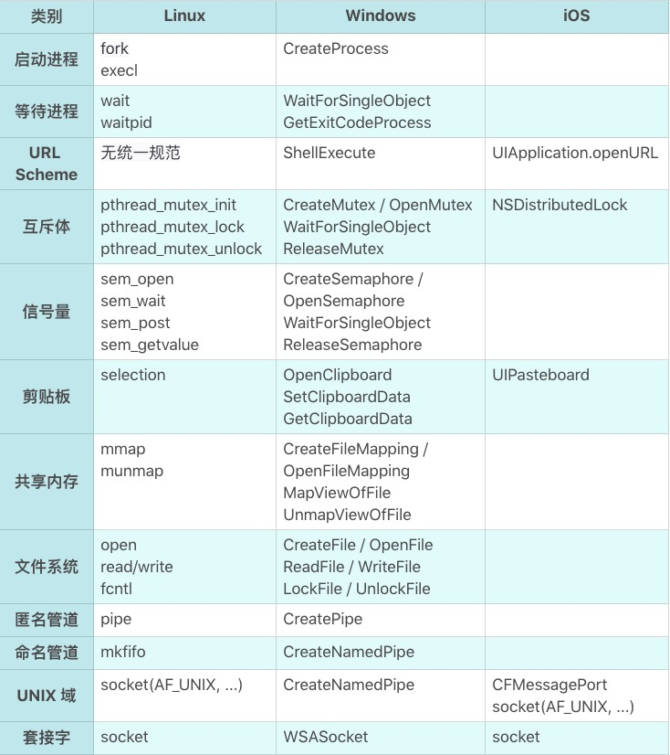
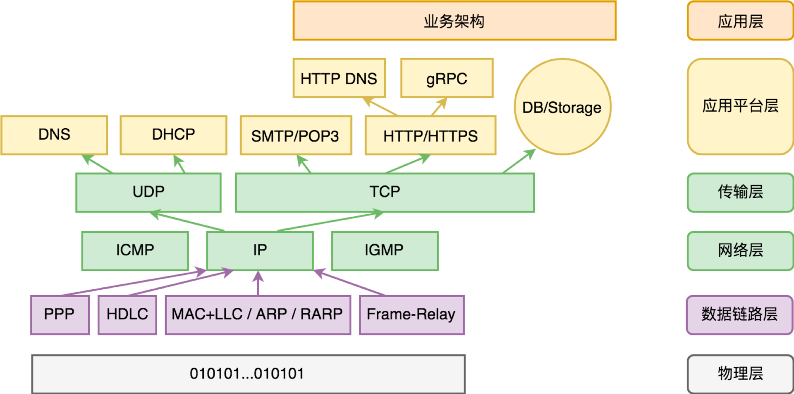

#### 1. 怎样成长为优秀的软件架构师？
程序员的三个层次
* 搬砖师
* 工程师 <br>
  —— 致力于不断提升软件代码的工程质量的程序员。
* 架构师

代码质量的评判
* 可阅读性 （方便代码流转）
* 可扩展性 / 可维护性 （方便修改功能，添加新功能）
* 可测试性（质量管理）
* 可复用性（简化后续功能开发的难度）

###### 大部分商业软件都是一项极其复杂的工程，它们远比很多传统的建筑工程复杂得多，无论是涉及的人力、时间还是业务的变数都要多很多。

###### 光靠把控软件工程师的水平，依赖他们自觉保障的工程质量，是远远不够的。

##### 1.1 架构师团队
软件工程是一项非常复杂的系统工程，它需要依赖一个能够掌控整个工程全局的团队，来规划和引导整个系统的演变过程。这个团队就是架构师团队。

##### 1.2 架构师的责任
软件架构师的职责，并不单单是我们通常理解的，对软件系统进行边界划分和模块规格的定义。

从根本目标来说，软件架构师要对软件工程的执行结果负责，这包括：按时按质进行软件的迭代和发布、敏捷地响应需求变更、防范软件质量风险（避免发生软件质量事故）、降低迭代维护成本。

##### 1.3 根基
核心在于对知识脉络的体系化梳理。这是架构能力构建和全面提升的关键。

<br>

### Part I —— 基础篇

#### 2. 架构设计的宏观视角

##### 2.1 操作系统
它首先要解决的是软件治理的问题。它要建立安全保护机制，确保你的电脑免受恶意软件侵害。同时，它也要建立软件之间的协作秩序，让大家按照期望的方式进行协作。

其次解决的是基础编程接口问题。 这些编程接口一方面简化了软件开发，另一方面提供了多软件共存（多任务）的环境，实现了软件治理。

##### 2.2 完整的程序架构是怎样的？
###### 服务端应用程序架构体系
<div align="center"></div>

###### 客户端应用程序架构体系
<div align="center"></div>

#### 3. 大厦基石：无生有，有生万物
—— 冯·诺依曼体系结构

##### 3.1 解剖架构的关键点是什么？
* 需求。
  1. 这个零部件的作用是什么？它能被用来做哪些事情？（某种意义上来说更重要的是）它不会被用来做哪些事情？
  1. 难点： “为什么?” 为何这个零件被设计成用来干这些事情的，而不是多干一点事情，或者为什么不是少干某些事情？
* 规格。
  1. 这个零部件接口是什么样的？它如何与其他零件连接在一起的？ (规格是零部件的连接需求的抽象。)
  1. 规格的约束条件会非常多样化，可能是外观（比如形状和颜色），可能是交互方式（比如用键盘、鼠标，或者语音和触摸屏），也可能是质量（比如硬度、耐热性等等）。

##### 3.2 为“解决一切的问题”而生
冯·诺依曼体系结构的迷人之处在于，从需求来说，它想解决一切问题。解决一切可以用“计算”来解决的问题。

“计算”的边界在哪里？ <br>
今天我们还没有人能够真正说得清。
<div align="center"></div>

##### 3.3 冯·诺依曼体系的规格
冯·诺依曼引入了三类基础零部件：
* 中央处理器
* 存储
* 输入输出设备

##### 中央处理器
它负责程序（指令序列）的执行。指令序列在哪里？也存放在存储里面。计算机加电启动后，中央处理器从一个固定的存储地址开始执行。

##### 存储
存储可简单分为两类：
* 一类是内置支持的存储，通过常规的处理器指令可直接访问，比如寄存器、内存、计算机主板的 ROM。
* 一类是外置存储，它们属于输入输出设备。中央处理器本身并不能直接读写其中的数据。

冯·诺依曼体系中涉及的“存储”，指的是中央处理器内置支持的存储。

##### 输入输出设备
它是计算机开放性的体现，大大拓展了计算机的能力。每个设备通过一个端口与中央处理器连接。

通过这个端口地址，中央处理器可以和设备进行数据交换。数据交换涉及的数据格式由设备定义，中央处理器并不理解。

###### 和 “解决一切可以用‘计算’来解决的问题” 这个伟大的目标相比，冯·诺依曼体系的三类零部件的规格设计显得如此精简。

##### 3.4 需求是怎么被满足的？
* 需求的变化点在于，要解决的问题是五花八门包罗万象的。 如何以某种稳定但可扩展的架构来支持这样的变化？
* 需求的稳定之处在于，电脑的核心能力是固定的。 怎么表达电脑的核心能力？

电脑的核心能力是“计算”。 什么是计算？计算就是对一个数据（输入）进行变换，变为另一个数据（输出）。在数学中我们把它叫“函数”。

next，
* 数据物理上在哪里？
* 一个具体的计算怎么表达？
* 如何和现实世界发生交互？

##### 输入输出设备从根本上解决的问题是什么？
是电脑无限可能的扩展能力。 最重要的一点，输入输出设备和电脑是完全异构的。输入输出设备对电脑来说就只是实现了某项能力的黑盒子。

##### 3.5 架构思维上我们学习到什么？
架构的第一步是需求分析。
* 从需求分析角度来说，关键要抓住需求的稳定点和变化点。
* 需求的稳定点，往往是系统的核心价值点。 (我)
* 需求的变化点，则往往需要相应去做开放性设计。 (供应商)

计算机加电启动后，中央处理器并不是按自己固有的“计算”过程进行，而是从一个固定的存储地址加载指令序列执行。

这样一来，“计算”需求的多样性只需要通过调整计算机主板上的 BIOS 程序，乃至外置存储中的操作系统启动程序就可以实现，而不必去修改中央处理器本身。 (接口的价值)

###### 当我们把所有的变化点从电脑的最核心部件中央处理器剥离后，中央处理器的需求变得极其稳定，可独立作为产品进行其核心价值的演进。 (生态)

#### 4. 汇编：编程语言的诞生
##### 4.1 编程的史前时代
人们只能通过理解 CPU 指令的二进制表示，将程序以二进制数据方式刻录到存储（比如 ROM 或硬盘）上。
这个时期的编程无疑是痛苦的，效率是极其低下的，仅仅将我们的想法表达出来就极其困难。

##### 4.2 与机器对话
汇编语言的出现，让写程序（编程）成为一个纯软件行为（出现“程序员”这个分工的标志）。

在表达能力上，汇编语言主要做了如下效率优化：
* 指令相关
    * 用文本符号（symbol）表达机器指令。
* 地址相关
    * 用文本符号（symbol）表达要操作的内存地址，并支持内存地址的自动分配。
    * 用文本符号（symbol）表达要调用的函数（function，也叫“过程 -procedure”）地址。
    * 用文本符号（symbol）表达要跳转的目标地址。

总结来说，汇编从指令能力上来说，和机器指令并无二致，它只不过把人们从物理硬件地址中解脱出来，以便专注于程序逻辑的表达。

汇编语言的出现要早于操作系统。操作系统的核心目标是软件治理，只有在计算机需要管理很多的任务时，才需要有操作系统。

#### 5. 编程语言的进化
编程语言在信息科技发展中的位置，如同人类文明中语言所在的位置。而编程语言写出来的软件（及其源代码），如同人类文明中不断被传承下来的图书典籍。

##### 5.1 软件是活的书籍
软件人类知识传承能力的一次伟大进化。
* 表达方式的多样性
  * 书籍只能通过文字描述来进行表达，这种表达方式依赖于人们对文字的理解，以及人的想象能力对场景进行还原。
  * 软件除了能够通过文字，还能够通过超链接、声音、动画、视频、实时的交互反馈等方式来还原场景。
* 对技术的现场还原
  * 书籍只能通过文字来描述技术，这可能导致技术的传承会出现偏差。
  * 软件对技术的还原可以是精确的，甚至软件本身可以是技术的一部分。 (除非技术本身适应不了潮流，退出了历史舞台。)

如果希望能够站在职业发展的至高点，你就需要理解和计算机沟通的语言，也就需要理解软件工程师们的语言。
无论你从事什么职业。

##### 如果你把编程语言升华为人类知识传承能力的进化，你就更能够清晰地预判到这样的未来：
###### 每一个小孩的基础教育中一定会有编程教育，就如同每一个小孩都需要学习物理和数学一样。

##### 5.2 编程范式的进化
编程语言从汇编开始，到今天还只有六十多年的历史，但是迭代之迅速，远超自然语言的迭代速度。

从思想表达的角度，有以下常见编程范式
* 过程式
* 函数式 <br>
  (如果你想用函数式编程，你需要重修数据结构这门课程，大学里面学的数据结构是不顶用了。)
* 面向对象 <br>
  面向对象主张尽可能把方法（其实就是过程）归纳到合适的对象（类）上，不主张全局函数（过程）。

##### 从 “面向对象” 到 “面向连接”
—— 面向对象的核心思想是引入**契约**，基于对象这样一个概念对代码的使用界面进行抽象和封装。

面向对象的优点：
* **清晰的使用界面。** 某种类型的对象有哪些方法一目了然，而不像过程式编程，数据结构和过程的关系是非常松散的。
* **信息的封装。** 不主张绕过对象的使用接口侵入到对象的内部实现细节。
* **多态。** 通过接口，我们可以优雅地实现过程式编程中很费劲才能做到的一个能力：多态。

“继承”概念的褒贬不一 <br>
虽然继承带来了编码上的便捷性，但也带来了不必要的心智负担： 本来复合对象的唯一构造方法是组合，现在多了一个选择，继承。😊

不同编程范式并不是互斥的
* Java 是纯正的面向对象语言。
* C++ 明确主张说自己是多范式的。 (其实 C++ 的复杂性和多范式并没有什么关系)

##### 什么是面向连接的语言？
—— 所谓面向连接就是朴素的组合思想。

研究连接，就是研究人与人如何组合，研究代码与代码之间怎么组合。

面向对象创造性地把契约的重要性提高到了非常重要的高度，但这还远远不够。 并不是只有对象需要契约，语言设计的方方面面都需要契约。
* 代码规范约束了人的行为，是人与人的连接契约。
* 如果大家写代码的方式(实现方式)很不一样，语言就可能存在很多种方言，这对达成共识十分不利。 （消除实现方式引起的内部消耗，专注于意图的表达。）

###### 消除实现方式/方言引起的内部消耗，专注于意图的表达。 更低的沟通/连接内耗。

##### 5.3 其他方面的进化
从工程化能力的角度，工程化能力体现如下：
* 包（package），即代码的发布单元。
* 版本（version），即包的依赖管理。
* 文档生成（doc）。
* 单元测试（test）。

从语言的执行器的行为，语言划分为：
* 编译的目标文件为可执行程序。
* 生成跨平台的虚拟机字节码，有独立的执行器（虚拟机）执行字节码。
* 直接解释执行。

##### 5.4 语言对架构的影响是什么？
无论服务端，还是客户端，我们可以统一将其架构图简化为下图所示
<div align="center"></div>

其中，
* 淡紫色是硬件层次的依赖，是程序工作的物理基础。
* 淡绿色的是软件层次的依赖，是程序工作的生态环境。
* 桔色的是库或源代码层次的依赖，是程序本身的组成部分。

##### 业务架构
从软件的业务架构来说，本身应该怎么拆分模块，每个模块具体做什么样的事情（业务边界是什么），这是业务需求本身决定的，和编程语言并没有关系。

但是，在描述每个模块的规格时，规格描述语言会面临如下两种选择：
* 选择某种语言无关的接口表示。
* 选择团队开发时采用的语言来描述接口。

本着 “如无必要勿增实体” 的原则，倾向于后者，用开发语言来做接口表示。

##### 其他影响
* 开发效率
* 后期维护

###### 要想有所突破，需要建立批判性思维。一种新思潮的兴起过程很容易用力过猛。 面向对象是一个很好的例子。面向对象是非常重要的进步，但是继承是一个过度设计。

#### 6. 如何实现可自我迭代的计算机？
当第一台以 “键盘+显示器” 为标准输入输出的现代计算机出现后，一个最小的功能集，但计算能力可自我迭代的计算机应该是什么样的？

从需求考虑，它应该有如下能力：
* 键盘和显示器的驱动程序
* 当时最主流的外置存储设备的驱动程序 （不一定是现代的硬盘）
* 汇编程序编辑器
* 汇编编译器
* 支持执行一段保存在外置存储设备中的机器代码程序！！ （现在的 BIOS 任务）

##### 6.1 需求陈列之后的需求分析
—— 优秀的架构师需要 “在心里对需求反复推敲”，同时对客户反馈的尊重。

###### 稳定点往往是系统的核心能力，而变化点则需要对应地去考虑扩展性上的设计。

##### 变化点和稳定点
* 计算机分为三大类的零部件： 中央处理器、存储、输入输出设备。
* 中央处理器作为“计算”能力的核心，工作范畴清晰。
* 存储，一方面作为“计算”的输入输出，另一方面作为“计算”本身的承载（也就是程序），主要的变数在后者。
    * 计算机主板 ROM 上的启动程序（BIOS）
    * 外置存储上的软件
* 输入输出设备，除了键盘和显示器外，还有外置存储。 主要的变数在外置存储上。外置存储的数据格式设计成什么样？

##### BIOS 需要负责的事情
* 键盘和显示器的驱动程序
* 外置存储设备的驱动程序
* 支持执行外置存储中引导区的机器代码程序
* 跳转到外置存储的固定地址，把执行权交给该地址上的引导程序

引导程序拿到执行权后，我们不管它额外做了哪些事情，最终它要把执行权交给 sh 程序。

##### 需求的变化点
* 外置存储的数据格式。
* 用户最终拿到这个计算机后，会迭代出什么能力。 为此，设计了 sh 程序，让它支持在外置存储上执行任何应用程序。
* 编辑器的交互范式。 为此，设计了 vi 程序，让它迭代编辑器的能力。
* 汇编语言的使用范式。 为此，设计了 asm 程序，让它响应 CPU 指令集的迭代，以及汇编语言进化的迭代。

最终的架构如下
<div align="center"></div>

#### 7. 操作系统
在编程语言出现后，软件生产效率得到了大幅度的提升。随着越来越多软件的出现，自然而然就诞生了多个软件如何共处，也就是软件治理的需求。

几大需求
* 多任务需求
* 内存管理、文件系统的需求
* 设备管理的需求
* 进程间通讯、共享内存的需求
* 安全管理的需求 (病毒、恶意软件如何治理)

###### 如果没有一个中间的协调方，软件与软件之间并不知道彼此的存在。
—— 操作系统对于软件而言，它像一个大法官，制定规则并据此约束大家的行为。

##### 7.1 操作系统的启动过程
—— 操作系统是怎么获得执行权的？

计算机加电启动后，中央处理器（CPU）会从一个固定的存储地址加载指令序列执行。
通常，这个固定的存储地址指向计算机主板的 ROM 上的一段启动程序（BIOS）。

##### BIOS 包含的内容
* 存储设备的驱动程序，用以识别常规的外置存储设备。 (比如硬盘、光驱、U 盘)
* 基础外部设备的驱动程序。 (比如键盘、鼠标、显示器)
* 设备和启动配置的基础管理能力。
* 支持执行外置存储中引导区的机器代码程序。 (引导区代码执行)
* 跳转到外置存储引导区的固定地址，把执行权交给该地址上的引导程序。 (执行权转交)

注意，
* 引导区的引导程序有长度限制，因此只能做非常少的事情。
* 常规情况下，引导区程序只是简单地跳转到真正的操作系统的启动程序，如果是双系统，则进入系统选择菜单。

##### 7.2 操作系统的需求演进
早期，计算机还是单任务的，以计算为主，软件为操作硬件服务。提供计算机的“基础编程接口”，降低软件开发的负担，是操作系统更为原始的需求。

PC 时代，分别诞生了 UNIX 和 DOS 这两个影响深远的操作系统。

(微软 DOS 系统通过推动 PC 兼容机的发展，让操作系统不再依赖特定的硬件设备，也就因此脱离了 IBM 的臂膀，自己一飞冲天。—— 核心/稳定需求剥离的重要性)

此时，操作系统的需求要从 “客户价值” 和 “商业价值” 两个维度考虑。

##### 客户价值(围绕的核心能力)
* 进程管理、存储管理、输入设备管理、输出设备管理、网络管理、安全管理等。 (软件治理)
* 简化软件开发，提供运行环境。 (基础编程接口问题)

##### 商业价值(承载体)
* 操作系统成为基础的刚需软件，随着采购需求的急速增加而获利。
* **操作系统也是核心的流量入口。**

###### 为什么是 DOS/Windows 赢得了市场，这无关技术优劣，关键在于两者的商业路线差异。

##### 思考1：流量入口
```
为什么当年网景推 Netscape 浏览器的时候，微软很紧张？
浏览器是另一个软件治理的入口，本质上是操作系统之上的操作系统。
如果软件都运行在浏览器上，那么本地操作系统就沦为和硬件一般无二的管道了。
```
##### 思考2：流量变现的方式
```
苹果的 iOS 操作系统开启了新的玩法(收税模式)，它构建了新的商业闭环： 账号（Account）、支付（Pay）、应用市场（AppStore）。
* 帐号(互联网账号)是整个模式的前提，用于记录用户购买记录以及进行支付。
* 应用市场解决了两个问题：
    a. 应用的分发，解决了系统功能的无限扩展问题(客户价值)。
    b. 预装软件的软件个数总归有限的问题（商业价值）。
* 支付则是整个模式的承载体，无论是下载应用收费，还是应用内购买内容收费，都可以通过这个关卡去收税。
```
##### 思考3：现代操作系统的商业闭环
```
无论是本地操作系统 iOS 和 Android，还是 Web 操作系统（浏览器）如微信小程序，
都实现了 “帐号 - 支付 - 应用市场” 这样的商业闭环。
```

##### 7.3 操作系统的边界在哪里？
架构的第一步是需求分析。 架构也关乎用户需求，作为架构师我们不只是要知道当前的用户需求是什么，我们还要预测需求未来可能的变化，预判什么会发生，而什么一定不会发生。

要回答这个问题，需要看清楚三个角色的关系：
* 硬件（个人计算机、手机或其他）
* 操作系统
* 浏览器

早期，PC 兼容机的发展对 DOS/Windows 的发展有着至关重要的支撑意义。它让操作系统厂商有了独立的生存空间。

但是，移动时代，Google 收购 Android 后，通过免费策略占领移动操作系统的大半江山，一定程度上复制了微软的过程，但实际上并没有那么理想。
* Android 是免费的，Google 并没有从中收取软件 License 费用。
* 只能借助 Android 的市场占有率来推动 Google 的服务（例如搜索、Gmail 等等），通过 Google 服务来获取商业回报。
* iOS 操作系统引入的 “账号 - 支付 - 应用市场” 的收税模式，受益方是硬件（手机）厂商，而非操作系统厂商。 (所有手机厂商都不接受交出支付(Pay)这个核心系统给 Google)
* 一旦手机厂商长大立足 ，Google 服务也会被逐步替换。

Google 和 Android 手机厂商之间的联盟并不可靠，养肥的手机厂商会不断试探 Google 的底线，，而 Google 也会尝试去收紧政策，双方在博弈中达到平衡。

##### Google 博弈的原因
* 历史是不可复制的，人们对操作系统的重要性认知已经非常充分。
* 手机是个性化产品，硬件上并没有 PC 那么标准化。 个人计算机有兼容机，而手机并没有所谓的标准化硬件。

##### 操作系统与浏览器的博弈
起初，操作系统和浏览器看起来至少需求上是有差异化的：
* 操作系统，是以管理本地软件和内容为主（对内）。
* 浏览器，是以管理互联网内容为主（对外）。

但，这个边界必然会越来越模糊。
* 操作系统不涉足互联网内容？这是不可能的。 应用市场（AppStore）其实就是典型的互联网内容。
* 浏览器的生态里也有一些特殊的角色... 网址导航、搜索引擎、Web 应用市场...

那么，
* 操作系统、浏览器、（互联网）搜索引擎的关系是什么?
* 移动时代的浏览器会是什么样的；它和操作系统的关系又如何相处？

#### 8. 软件运行机制及内存管理
内存作为计算机最基础的硬件资源，有着非常特殊的位置。 CPU 可以直接访问的存储资源非常少，只有：寄存器、内存（RAM）、主板上的 ROM。

##### 寄存器
大部分程序员不直接打交道，而是由编程语言的编译器根据需要自动选择寄存器来优化程序的运行。

##### 主板上的 ROM
非易失的只读存储。 ROM 非易失和只读的特点，决定了它非常适合存储计算机的启动程序（BIOS）。

##### 内存(RAM)
内存是唯一的 CPU 内置支持，且和程序员直接会打交道的基础资源。

##### 8.1 计算机运行全过程
从操作系统的视角来看，计算机的运行时序如下：
<div align="center"></div>

在整个过程中，有多少个 “子计算过程(软件)”，它并不关心。

注意，
* BIOS 程序没有固化在 CPU 中，而是独立放到主板的 ROM 上，以应对计算机输入输出设备的变化。 (CPU 与输入输出设备解耦)
* 引导区引导程序，则是程序从内置存储（ROM）转到外置存储的边界。
* 引导区引导程序不固化在 BIOS 中，而是写在外置存储的引导区，是为了避免 BIOS 程序需要经常性修改。 (操作系统与输入输出设备解耦)
* BIOS - Basic Input Output System，其主要功能是为计算机提供最底层的、最直接的硬件设置和控制。

OS(Operating System) 引导程序，则是外置存储(RAM)接手计算机控制权的真正开始。 这个过程发生了很多很多事情，最终操作系统会把执行权交给 OS Shell 程序。

##### 8.2 计算机是如何运行外置存储(RAM)上的软件的？
这和内存管理有关。 结合内存的作用，谈内存管理，需要谈清楚两个问题：
* 如何分配内存（给运行中的软件，避免它们发生资源争抢）
* 如何运行外置存储（比如硬盘）上的软件

##### 前提背景知识 —— CPU 的实模式和保护模式
两个模式下，CPU 对内存的操作方式完全不同:
* 实模式下，CPU 直接通过物理地址访问内存。
* 保护模式下，CPU 通过一个地址映射表把虚拟的内存地址转为物理的内存地址，然后再去读取数据。

##### 实模式下的内存管理
在实模式操作系统下，所有软件包括操作系统本身，都在同一个物理地址空间下。在 CPU 看来，它们是同一个程序。

操作系统如何分配内存？ 至少有两种可行的方法。
* 其一，把内存管理相关的函数地址，放到一个大家公认的地方（比如 0x10000 处），每个软件要想申请内存就到这个地方取得内存管理函数并调用它。
* 其二，把内存管理功能设计为一个中断请求。 CPU 提供了指令允许软件触发一个中断，我们把它叫软中断。 比如我们约定 77 号中断为内存管理中断，在操作系统初始化时把自己的内存管理函数写到中断向量表的第 77 项。

##### 补充知识 —— 中断
所谓中断，是 CPU 响应硬件设备事件的一个机制。
```
当某个输入输出设备发生了一件需要 CPU 来处理的事情，它就会触发一个中断。
例如：
    内存的全局有一个中断向量表，本质上就是在一个大家公认的地方放一堆函数地址。
比如键盘按了一个键，它会触发 9 号中断。 此时 CPU 会先停下手头的活，到中断向量表
找到第 9 项对应的函数地址并去执行它，完成后再回去干原来的活。
```

在实模式下，操作系统如何运行外置存储（比如硬盘）上的软件？
* 就是把软件完整从外置存储读入到内存然后执行它。
* 不过，在执行前它干了一件事情，把浮动地址固定下来。 为什么会有浮动地址？因为软件还没有加载到内存的时候，并不知道自己会在哪里。

实模式下的问题：
* 安全性。 操作系统以及所有软件都运行在一起，相互之间可以随意修改对方的数据甚至程序指令。
* 支持的软件复杂性低。 同时可运行的软件数量少。

##### 保护模式下的内存管理
保护模式下，内存访问不再是直接通过物理内存，而是基于虚拟内存。
* 虚拟内存模式下，整个内存空间被分成很多个连续的内存页。每个内存页大小是固定的，比如 64K。
* 当然，可能某一个内存页对应的物理内存地址还不存在，这种情况叫缺页，没法读取数据，这时 CPU 就会发起一个缺页的中断请求。

发生缺页时，操作系统会为这个(逻辑)内存页分配物理的内存，并恢复这个内存页的数据。
如果没有空闲的物理内存可以分配，它就会选择一个最久没有被访问的内存页进行淘汰。

<div align="center"></div>

通过这个虚拟内存的机制，操作系统并不需要一上来就把整个软件装进内存中，而是通过缺页中断按需加载对应的程序代码片段。

操作系统如何分配内存给运行中的软件？
* 反正内存地址空间是虚拟的，操作系统可以一上来就给要运行的软件分配超级大的内存，软件如果不用某个内存页，什么都不发生。
* 每个运行中的软件，我们把它叫进程，都有自己的地址映射表。
* 也就是说，虚拟地址并不是全局的，而是每个进程有一个自己独立的虚拟地址空间。

在保护模式下，计算机的基础架构体系和操作系统共同在努力做的一件事情，就是让每个软件“感觉”自己在独占整个计算机的资源。独立的虚拟地址空间很好地伪装了这一点。
而在实模式下，所有进程都在同在物理内存的地址空间里。

##### 思考：进程注入
```
由保护模式的特性可知，进程注入是需要首先获得目标进程的虚拟地址空间，
通过访问虚拟地址空间从而实现的数据数据修改，其中涉及的缺页中断会帮助访问到实际的物理内存。
注意，进程的虚拟内存表是由操作系统维护的。 操作系统是把虚拟内存地址分页，引入缺页中断。
```

#### 9. 操作系统内核与编程接口
—— 软件如何利用它所依赖的基础架构

一个软件依赖的基础架构：
* 冯·诺依曼计算机体系
* 编程语言 (编程语言面向人类，CPU 指令面向机器)
* 系统调用

##### 9.1 系统调用
操作系统与冯·诺依曼计算机体系和编程语言非常不同。
* 软件都是某种编程语言写成的，而 CPU 和编程语言的能力，统一以语言的语法或者库体现。
* **操作系统则属于基础软件，它和我们编写的软件并不在同一个进程。**

由此，
* 实模式下的操作系统，大家都在同一个地址空间下，只需要知道操作系统的接口函数地址，理论上就可以直接访问。
* **操作系统和软件不在同一个进程，软件怎么才能使用操作系统的能力呢？**

它应该是一种成本非常非常低的方案，性能上要接近函数调用，否则我们为保护模式付出的成本就太高了。
它是所有软件进程使用操作系统能力的基础，包括进程与进程之间通讯的机制，也是建立在这个基础之上。

##### 中断
大部分情况下，操作系统的能力通过软中断向我们写的软件开放，为此还专门引入了一个术语叫 “系统调用（syscall）”。

##### 9.2 系统调用是怎么工作的？
在保护模式下，CPU 引入了 “保护环（Protection Rings）” 的概念。说白了，代码有执行权限等级的，如果权限不够，有一些 CPU 指令就不能执行。

##### 操作系统内核
其实就是指那些会向我们写的应用程序提供系统服务的子系统的集合，它们管理着计算机的所有硬件资源，也管理着所有运行中的应用软件（进程）。

* 操作系统内核的执行权限等级，和我们常规的软件进程不同。
* 由此，系统调用所基于的软中断，不只是“函数调用”，更重要的是改变了执行权限，从用户态跃迁到了内核态。
* 另外，操作系统与我们编写的软件并不同属一个进程(独立的内存地址空间)，我们系统调用请求是过去了，但是我们传给操作系统的内存地址，对它真的有意义吗？

答案，
* **从虚拟内存机制的视角，操作系统内核和所有进程都在同一个地址空间！！**
* 可以认为，操作系统内核，它是所有进程共享的内存。

<div align="center"></div>

这非常有趣。 操作系统内核的代码和数据，不只为所有进程所共享，而且在所有进程中拥有相同的地址。 因此，
###### 无论哪个进程请求过来，对内核来说看起来都是一次本进程内的请求。

* 从单个进程的视角，中断向量表的地址，以及操作系统内核的地址空间是一个契约。
* 有了中断向量表的地址约定，用户态函数就可以发起一次系统调用（软中断）。

##### 思考： 既然操作系统内核和我同属一个地址空间，我是否可以跳过中断，直接访问调用内核函数？
答案是：不能。 这不单单是执行权限的问题。这涉及虚拟内存中的内存页保护机制。

操作系统内核虽然和用户进程同属一个地址空间，但是被设置为 “不可读、不可写、不可执行”。 虽然这段地址空间是有内容的，但是对于用户来说是个黑洞。

##### 9.3 编程接口
系统调用最原始的调用方式，是用软中断指令。在汇编语言里面通常是：
```
int < 中断号 > ; // 对每个操作系统来说中断号是固定的，比如 Linux 是 0x80
// 注意，此处的 int 不是 integer，而是 interrupt 的缩写。
```

当然用汇编语言来写软件并不是一个好主意。大部分高级语言都实现了操作系统编程接口的封装。

##### 操作系统（内核）有六大子系统
* 存储管理
* 输入设备管理
* 输出设备管理
* 进程管理
* 网络管理
* 安全管理

除了安全管理是一个“润物细无声”的能力外，其他子系统都会有所包装(API)。

##### 9.4 动态库
从操作系统的角度来说，它仅仅提供最原始的系统调用是不够的，有很多业务逻辑的封装，在用户态来做更合适。

同时，操作系统也无法去穷举所有的编程语言，去针对它们逐个开发基础库，因此，聪明的操作系统设计者们想了一个好办法：动态库。
* 动态库本质上是实现了一个语言无关的代码复用机制。 它是二进制级别的复用。

##### 动态库的原理其实很简单，核心考虑两个东西。
* 浮动地址。 动态库本质上是在一个进程地址空间中动态加载程序片段，这个程序片段的地址显然在编译阶段是没法确定的。
* 导出函数表。 动态库需要记录有哪些函数被导出（export），这样用户就可以通过函数的名字来取得对应的函数地址。

有了动态库，编程语言的设计者实现其标准库来说就多了一个选择： 直接调用动态库的函数并进行适度的语义包装，而不是直接用系统调用。 (实际上大家也是这么干的...)

##### 9.5 操作系统与编程语言
##### a. 先有编程语言，还是先有操作系统？
先有编程语言。
* 大部分人习惯认为运行软件是操作系统的责任。实际上软件跑起来是很容易的，关键看 BIOS 程序把控制权交给哪个软件。
* 实际上常见的系统级语言（比如 C 语言）都是可以编写出不依赖任何内核的程序的。

##### b. 编程语言怎么做到自举的？
编译器的进化史应该是这样的： 先用机器码直接写第一个汇编语言的编译器，然后汇编语言编译器编出第一个 C 语言编译器。
有了 C 语言编译器后，可以反过来用 C 语言重写汇编语言编译器和 C 语言编译器，做更多的功能增强。

##### c. 操作系统能够做到自身迭代本操作系统（自举）么？
当然可以。 通常一门新的操作系统开发之初，会用交叉编译技术先干出来，等到新操作系统稳定到一定程度后再实现自举。

交叉编译
```
所谓交叉编译就是在一种 “CPU + 操作系统” 架构下，生成另一种 “CPU + 操作系统” 架构下的软件。
```

#### 10. 外存管理与文件系统

##### 10.1 外存的分类
从经济效益上，新的存储设备会不断涌现，
* 更低的单位能耗（存储量 / 每日能源消耗成本）
* 更低的单位存储成本（存储量 / 可存储的时间 / 设备价格）
* 更高的访问性能。

从功能特性，
* 顺序读写型。 (磁带)
* 随机只读型。 (光盘)
* 随机读写型。 (盘、硬盘、U 盘、SSD 等)

适用场景划分
* 顺序读写型的外置存储（如磁带）我们日常并不常见，它的主要应用场景是归档，也就是数据备份。
* 随机只读型的外置存储（如光盘）我们日常有较多应用，常见的应用场景是资料分发和归档。
* 随机读写型的外置存储最为常见，存在于所有“能够称得上叫电脑”的设备上。

##### 10.2 外存的数据格式
外置存储和内存最大的区别是什么？
* 外置存储是持久存储，它的目的是用来存储资料的。
* 内存是临时存储，虽然是存储，但是它实质上是为 CPU 的计算服务的。

##### 外部存储的管理
直接基于物理的存储地址进行读写肯定是行不通的，过上几个月你自己可能都不记得什么数据写到哪里了。

因此，
* 我们希望这些写到外存中的数据是 “自描述” 的某种数据格式。
* 文件系统把存储设备中的数据组织成为了一棵树(目录树)。

尽管几乎所有文件系统的接口是非常一致的，但文件系统的实现却有很多。 不同外置存储的文件系统有不同的国际标准及多种底层实现。

例如，随机读写型的存储（如硬盘），常见的文件系统有如下这些：
* FAT32 —— 微软制定
* NTFS —— 微软制定
* HFS/HFS+ —— 苹果制定
* EXT3/EXT4 —— Linux 开源
* BTRFS —— 甲骨文(Oracle)
* JFS2 —— IBM 制定

从文件系统格式的设计角度来说，它和架构关联性不大，更多的是数据结构与算法的问题。

大部分现代文件系统都基于日志（journal）来改善文件系统的防灾难能力（比如突然断电，或不正常的 unmount 行为），基于 B 树(Balanced Tree)或 B+ 树组织元数据。

##### 外存分区
分区是一个非常简单而容易理解的行为，本质上只是把一个存储设备模拟成多个存储设备来使用而已。

##### 分区格式化
所谓格式化就是给这个分区生成文件系统的初始状态。格式化最重要的是标记分区的文件系统格式，并且生成文件系统的根目录。

##### 10.3 外存的使用接口
* 最简单的方式是用操作系统提供的命令行工具。
* 最原始的方式是 “系统调用”。 大部分编程语言对此都有相应的封装。

有意思的是，在早期，操作系统试图将所有的输入输出设备的接口都统一以 “文件” 来抽象它。 (例如：stdin 代表键盘，stdout 代表显示器。)
在 UNIX 系里面有个 “一切皆文件” 的口号，便由此而来。

但事实证明 UNIX 错了。 输入输出设备太多样化了，所谓的 “一切皆文件” 不过是象牙塔式的理想。
图形界面时代到来，编程接口产生颠覆性的变化。

##### 10.4 虚拟内存的支持
在物理内存不足的时候，操作系统会利用外存把一些很久没有使用的内存页的数据，保存到外存以进行淘汰。
* 在 UNIX 系的操作系统中，操作系统为此分配了一个磁盘分区叫 swap 分区。
* 在 Windows 操作系统中则通过一个具有隐藏属性的 .swp 文件来实现。

在缺页发生比较频繁时，内存页的数据经常性发生保存和恢复，这会发生大量的磁盘 IO 操作，非常占用 CPU 时间，能够非常明显感觉到计算机变得很慢。
###### 这也是将系统装在 SSD 上，明显感觉流畅的原因。 此时，增大物理内存或使用 SSD，最好两者同时。

如希望进一步研究某个文件系统的具体实现细节，推荐一个开源项目： BPL 语言（Binary Processing Language，二进制处理语言）。 <br>
https://github.com/qiniu/bpl

BPL 语言主要用于分析二进制数据格式。 应用场景包括：文件格式分析（含磁盘分区格式，因为一个磁盘分区可以把它理解为一个大文件）、网络协议分析。

#### 11. 输入和输出设备：交互的演进
人机交互在往越来越自然的方向发展。所谓自然，就是越来越接近于两个人直接的面对面沟通。

##### 11.1 输入设备
键盘、鼠标、麦克风、摄像头。

##### 键盘
键盘输入的管理机制和窗口系统的设计密切相关。为了让用户清楚键盘输入的目的地，窗口系统往往会有一个焦点窗口。

大部分情况下，键盘输入的事件会先发给焦点窗口，焦点窗口不处理则发给其父窗口，按此传递，直到有人处理了该按键事件，或者直到顶层窗口。

键盘从功能上来说，有两个不同的能力：
* 输入文本
* 触发命令

从触发命令的角度来说，命令的响应并不一定是在焦点窗口，甚至不一定在活跃窗口。 比如： Windows 下热键（HotKey）的概念。

##### 鼠标
鼠标输入的管理机制和键盘一样，和窗口系统的设计密切相关。但因为有位置，确定鼠标事件的目的地相比键盘事件要简单的多。

##### 麦克风
麦克风是一个非常有潜力的下一代输入设备。

语音交互今天仍然还很不成熟，究其原因，还停留在触发命令为主。 对于文本输入，其主要优势还在日常用语和长文本，在个性化场景如“输入人名之类”，较难达到好的结果。

###### 交互方式不管怎么变化，其核心需要实现的都是这样的两大能力： 输入文本和触发命令，这一点是不变的。

##### 摄像头
摄像头作为交互设备，引入了手势、表情。 从表达能力来说，这是最为丰富也是最为自然的一种表达方法。但是技术所限，只在萌芽阶段。

##### 11.2 输出设备
显示器（显卡）、音箱（声卡）、打印机。 输出设备的演化并不大，最主要的输出设备还是以显示器为主。

##### 显示器
显示器虽然经历了 CRT 到液晶屏多代更新，但也只是支持的色彩更多（从黑白到彩色到真彩色），分辨率越来越高。

除了窗口系统，显示设备管理的另一大挑战是绘制子系统，在操作系统中，有一个独立的子系统（通常叫 GDI）。 通常涉及以下概念：
* 2D 图形相关。 Path(路径)、Brush(画刷)、Pen(画笔) 等概念。
* 3D 图形相关。 Model(模型)、Material(材质)、Lighting(光照) 等概念。
* 文本相关。 Font(字体) 等概念。
* 图像处理相关。 Bitmap(位图) 对象及常见图像格式的编解码器 (Encoder/Decoder)。

##### 音箱
相比显示器的管理，音箱的设备管理要简单得多。

##### 打印机
打印机的管理方式又很不一样，软件使用打印机的过程基本上是互斥的。

软件操作打印机的时候，并不是等待打印机真把内容打印出来，而是把文档打印到打印缓冲中就完成打印。

#### 12. 多任务：进程、线程与协程
##### 多任务与执行体
多任务的需求是随处可见的。 分时系统的原理说起来比较简单，把当前任务状态先保存起来，把另一个任务的状态恢复，并把执行权交给它即可。这里面涉及的问题有：
* 任务是什么，怎么抽象任务这样一个概念
* 任务的状态都有什么？怎么保存与恢复
* 什么时机会发生任务切换？

从今天的现实看，任务的抽象并不是唯一的。大部分操作系统提供了两套：进程和线程。 <br>
有的操作系统还会提供第三套叫协程（也叫纤程）。

任务的状态都有什么？
* 寄存器。 寄存器的数量很少且可枚举。
* 内存(RAM)数据。 在保护模式下，不同任务有不同的地址空间，相互独立。主要通过不同的地址映射表来体现。

怎么切换地址映射表？还是寄存器。 因此，
* 执行体的上下文，就是一堆寄存器的值。 无论是进程、线程还是协程，都是如此。

##### 12.1 进程与线程
* 进程是操作系统从安全角度来说的隔离单位。 (独立的地址空间，严格的交互条件)
* 线程的出现，则是因为操作系统发现同一个软件内还是会有多任务的需求，这些任务处在相同的地址空间，彼此之间相互信任。

早期操作系统中没有线程的概念，也不会有人想到要搞两套执行体。 进程实际上承担了一部分来自线程的需求：线程是需要父进程的环境的。
（fork 的渊源）

###### 说明：UNIX 家族的 fork（分叉）弊病
```
在创建一个进程这个事情上，fork 就是先 clone 然后再分支，父子进程各干各的。
为什么进程 fork 是糟糕的？ 这是因为：
    进程是操作系统最基本的隔离单元，我们怕的就是摘不清楚，但是 fork 偏偏要藕断丝连。
这一点 Windows 要清晰很多，哪些文件句柄在子进程中还要用到，一一明确点名，而不是 fork
一下糊里糊涂就继承过去了。
```

##### 12.2 协程与 goroutine
协程并不是操作系统内核提供的，它也被称为用户态线程。

##### 为什么会出现协程？
答案： 为实现高性能的网络服务器的需要。

对于常规的桌面程序来说，进程 + 线程绰绰有余。 但对于一个网络服务器，大量的来自客户端的请求包和服务器的返回包，都是网络IO。

操作系统提供的标准网络 IO 有以下这些成本：
* 系统调用机制产生的开销。
* 数据多次拷贝的开销。 (数据总是先写到操作系统缓存再到用户传入的内存)
* 因没有数据而阻塞，产生调度重新获得执行权，产生时间成本。
* 线程的空间成本和时间成本。 (标准 IO 请求都是同步调用，要想 IO 请求并行只能使用更多线程)

为了改进网络服务器的吞吐能力，现在主流的做法是用 epoll（Linux）或 IOCP（Windows）机制。 这两个机制颇为类似。

机制如下：
* 都是在需要 IO 时登记一个 IO 请求，然后统一在某个线程查询谁的 IO 先完成了，谁先完成了就让谁处理。
* 从系统调用次数的角度，epoll 或 IOCP 都是产生了更多次数的系统调用。
* 从内存拷贝来说也没有减少。
* 但是，真正最有意义的事情是：减少了线程的数量。

既然不希望用太多的线程，网络服务器就不能用标准的同步 IO（read/write）来写程序。 知名的异步 IO 网络库 libevent 就是对 epoll 和 IOCP
包装了一套跨平台的异步 IO 编程模型。

###### NodeJS 一炮而红，也是因为把 JavaScript 的低门槛和 libevent 的高性能结合起来，给了前端程序员一个 “我也能搞高性能服务器” 的梦想。

##### 线程的成本高在哪里？
时间成本
* 执行体切换本身的开销。 (状态保存与恢复)
* 执行体的调度开销。 (从大量线程中选择某一个，并给予执行权)
* 执行体之间的同步与互斥成本。

空间成本(需要的存储空间)
* 执行体的执行状态。 
* TLS（线程局部存储）。
* 执行体的堆栈。

空间成本是第一大成本，其最大的成本是堆栈。如果一个线程 1MB，那么有 1000 个线程就已经到 GB 级别。
其次，执行体的调度开销，以及执行体之间的同步与互斥成本，也是一个不可忽略的成本。

虽然单位成本看起来还好，但是盖不住次数实在太多。

##### 协程的出现
协程是为了两个目的而来：
* 回归到同步 IO 的编程模式
* 降低执行体的空间成本和时间成本

一个完备的协程库你可以把它理解为用户态的操作系统，而协程就是用户态操作系统里面的 “进程”。

目前只有 2 个完备的协程库，Erlang 和 Go 语言。 
* Erlang 语言基于虚拟机。
* Go 语言里面的用户态 “进程” 叫 goroutine。
    * 堆栈开始很小（只有 4K），但可按需自动增长。
    * 坚决干掉了 “线程局部存储（TLS）” 特性的支持。
    * 提供了同步、互斥和其他常规执行体间的通讯手段。
    * 提供了几乎所有重要的系统调用（尤其是 IO 请求）的包装。

##### 12.3 总结
多任务的需求非常复杂。 人们不只发明了三套执行体：进程、线程和协程，还发明了各种五花八门的执行体间的通讯机制。

操作系统内核之中，不乏无数精妙的设计思想。但是，前辈们也并非圣贤，也可能会出现一些决策上失误，留下了诸多后遗症。

#### 13. 进程内协同：同步、互斥与通讯
进程内的执行体有两类： 用户态的协程（以 Go 语言的 goroutine 为代表）、操作系统的线程。
<div align="center"></div>

##### 13.1 原子操作
需要注意的是，原子操作是 CPU 提供的能力，与操作系统无关。

##### 13.2 执行体的互斥
互斥体也叫锁。锁用于多个执行体之间的互斥访问，避免多个执行体同时操作一组数据产生竞争。

###### 锁的使用范式比较简单：在操作需要互斥的数据前，先调用 Lock，操作完成后就调用 Unlock。 (但总是存在一些不求甚解的人，对锁存在各种误解。)

##### 误区： “锁慢，channel 快” 这种错觉
锁的确会导致代码串行执行，所以在某段代码并发度非常高的情况下，串行执行的确会导致性能的显著降低。
但平心而论，相比其他的进程内通讯的原语来说，锁并不慢。
* 从进程内通讯来说，比锁快的东西，只有原子操作。

##### 那么锁的问题在哪里？
锁的最大问题在于不容易控制。锁 Lock 了但是忘记 Unlock 后是灾难性的，相当于服务器挂了。

案例：
```c++
mutex.Lock()
doSth()
mutex.Unlock()
```
这段代码是不安全的! 如果 doSth 抛出了异常，那么服务器就会出现问题。

为此 Go 语言还专门发明了一个 defer 语法来保证配对:
```c++
mutex.Lock()
defer mutex.Unlock()
doSth()
```

如果语言不支持 defer，而是支持 try … catch，那么代码可能是这样的：
```c++
mutex.Lock()
try { 
    doSth()
} catch (e Exception) {
    mutex.Unlock()
    throw e
}
mutex.Unlock()
```

另外，锁不容易控制的另一个表现是锁粒度的问题。

案例： 如果 doSth 函数里面调用了网络 IO 请求，而网络 IO 请求在少数特殊情况下可能会出现慢请求，要好几秒才返回。 此时，这几秒对服务器来说就好像挂了。

###### 请牢记箴言： 不要在锁里面执行费时操作。

##### 锁的最佳编程实践
如果明确一组数据的并发访问符合 “绝大部分情况下是读操作，少量情况有写操作”，这种 “读多写少” 特征，那么应该用读写锁。
注意！ 读写锁分为读操作和写操作两种，对应调用不同的互斥操作。
```
读操作不阻止读操作，阻止写操作；
写操作阻止一切，不管读操作还是写操作。
```
由此，
* 请只在明确的 “读多写少” 特征下，使用锁特性。
* 其余情况，还是考虑别的不易出错的特性吧。

##### 13.3 执行体的同步
所谓同步，即把一个大任务分解为 n 个小任务，分配给 n 个执行体并行去做，等待它们一起做完。 (同步机制我们叫 “等待组”)

条件变量（Condition Variable）是一个更通用的同步原语，设计精巧又极为强大。
##### 怎么用条件变量？
条件变量初始化的时候需要传入一个互斥体，它可以是普通锁（Mutex)，也可以是读写锁（RWMutex）。
```go
var mutex sync.Mutex // 也可以是 sync.RWMutex
var cond = sync.NewCond(&mutex)
```

为什么传入锁？因为 cond.Wait() 的需要。 Wait 的内部逻辑：
```go
把自己加入到挂起队列
mutex.Unlock()
等待被唤醒 // 挂起的执行体会被后续的 cond.Broadcast 或 cond.Signal() 唤醒
mutex.Lock()
```

条件变量的用法有一个标准化的模板：
```go
mutex.Lock()
defer mutex.Unlock()
for conditionNotMetToDo {
    cond.Wait()
}
doSomething
if conditionNeedNotify {
    cond.Broadcast()
    // 有时可以优化为 cond.Signal()
}
```
一个小细节，
* 注意用的是 for 循环，而不是 if 语句。 因为 cond.Wait() 得到了执行权后不代表我们想做的事情就一定能够干了，要再重新判断一次。
* cond.Broadcast 比较粗暴，它唤醒了所有在这个条件变量挂起的执行体，而 cond.Signal 则只唤醒其中的一个。

案例： 使用条件变量，实现一个 Go 语言的 channel。 （具有同步和互斥机制的队列）
```go
type Channel struct {
    mutex sync.Mutex  // 锁
    cond *sync.Cond   // 条件变量
    queue *Queue      // 队列
    n int             // 队列长度
}

func NewChannel(n int) *Channel {
    if n < 1 {
        panic("todo: support unbuffered channel")
    }
    c := new(Channel)
    c.cond = sync.NewCond(&c.mutex)
    c.queue = NewQueue()
    // 这里 NewQueue 得到一个普通的队列
    // 代码从略
    c.n = n
    return c
}

func (c *Channel) Push(v interface{}) {
    c.mutex.Lock()
    defer c.mutex.Unlock()
    for c.queue.Len() == c.n { // 等待队列不满
        c.cond.Wait()
    }
    if c.queue.Len() == 0 { // 原来队列是空的，可能有人等待数据，通知它们
        c.cond.Broadcast()
    }
    c.queue.Push(v)
}

func (c *Channel) Pop() (v interface{}) {
    c.mutex.Lock()
    defer c.mutex.Unlock()
    for c.queue.Len() == 0 { // 等待队列不空
        c.cond.Wait()
    }
    if c.queue.Len() == c.n { // 原来队列是满的，可能有人等着写数据，通知它们
        c.cond.Broadcast()
    }
    return c.queue.Pop()
}

func (c *Channel) TryPop() (v interface{}, ok bool) {
    c.mutex.Lock()
    defer c.mutex.Unlock()
    if c.queue.Len() == 0 { // 如果队列为空，直接返回
        return
    }
    if c.queue.Len() == c.n { // 原来队列是满的，可能有人等着写数据，通知它们
        c.cond.Broadcast()
    }
    return c.queue.Pop(), true
}

func (c *Channel) TryPush(v interface{}) (ok bool) {
    c.mutex.Lock()
    defer c.mutex.Unlock()
    if c.queue.Len() == c.n { // 如果队列满，直接返回
        return
    }
    if c.queue.Len() == 0 { // 原来队列是空的，可能有人等待数据，通知它们
        c.cond.Broadcast()
    }
    c.queue.Push(v)
    return true
}
```

##### 13.4 执行体的通讯
—— 怎么在执行体间收发消息。
* 管道是大家都很熟知的执行体间的通讯机制。

用法上，先得到管道的写入端和读出端，分别传给两个并行执行的执行体。 (注意，管道是单向的，如果是双向则需要两个管道。)

##### 13.5 总结
执行体间的协同机制： 原子操作、同步、互斥、通讯。
* 锁在一些人心中是有误解的，但实际上锁在服务端编程中的比重并不低，需要特别重视和花费精力。
* 条件变量是最复杂的同步原语，功能强大。 但，直接使用条件变量的机会不是太多，早已被封装在更高阶的原语中。

#### 14. 进程间的同步互斥、资源共享与通讯
进程间的协同机制： 互斥、同步、资源共享、通讯。
<div align="center"></div>

##### 思考： 从需求角度来讲，进程内协同与进程间协同有何不同？
早期，操作系统还只有进程这个唯一的执行体。 现今，进程内的执行体（线程与协程）被发明出来并蓬勃发展。

##### 14.1 启动进程 —— 在一个进程中启动另一个进程
通常有两种方法：
* 创建子进程
* 让 Shell 配合执行某个动作

特别说明，iOS 很有意思，它并不支持创建子进程。 一个进程要调用另一个进程的能力，不是去创建它，而是基于 URL Scheme 去打开它。

URL Scheme 机制并不是 iOS 的发明，它应该是浏览器出现后形成的一种扩展机制。Windows 和 Linux 的桌面也支持类似的能力。

##### 14.2 同步与互斥
进程间协同来说，主流操作系统支持了： 锁（Mutex）、信号量（Semaphore）。 (Windows 还额外支持了事件（Event）同步原语)

* 进程间的锁（Mutex），语义上和进程内没有什么区别。 (背后实现上可能都是基于共享内存)
* 信号量（Semaphore）。 信号量本身是一个整型数值，代表着某种共享资源的数量。

进程间的同步与互斥原语并没有进程内那么丰富，甚至没那么牢靠。

##### Why?
因为进程可能会异常挂掉，这会导致同步和互斥的状态发生异常。 锁和信号量的状态都会由此发生异常，玩完。。。

##### 14.3 资源共享
进程之间都有哪些共享的存储型资源？比较典型的是：
* 文件系统
* 剪贴板

和文件系统相关的进程间协同机制有：
* 文件
* 文件锁
* 管道（包括匿名管道和命名管道）
* 共享内存

##### 共享内存
共享内存其实是虚拟内存机制的自然结果。

虚拟内存本来就需要在内存页与磁盘文件之间进行数据的保存与恢复。只需要让两个进程的内存页关联到同一个文件句柄，即可完成进程间的数据共享。
（这可能是性能最高的进程间数据通讯手段了。）

真正值得注意的是 iOS，你会发现基于文件系统的进程间通讯机制，一律不支持。
##### Why?
iOS 操作系统做了一个极大的改变：软件被装到了一个沙箱（Sandbox）里面，不同进程间的存储完全隔离。

存储分为内存和外存。内存通过虚拟内存机制实现跨进程的隔离，现在 iOS 更进一步，外存的文件系统也相互独立。

##### 剪贴板
剪贴板并不是一个常规的进程间通讯方式。 剪贴板只有一个，有人共享数据上去，就会把别人存放的数据覆盖掉。

另外，它更可能被恶意程序所利用。比如，写个木马程序来监听剪贴板。

##### 14.4 收发消息
除了基于文件系统和剪贴板，还有其他的通讯机制么？
* 基于网络

###### 这些进程同在一台机器上，同在一个局域网中。

套接字作为网络通讯的抽象，本身就是最强大的通讯方式，没有之一。

UNIX 还发明了一个专门用于本地通讯的套接字： UNIX 域。 Windows 的命名管道和 UNIX 域在能力上是等价的。

##### 14.5 总结
###### 创新性的系统往往有其颠覆性，带着批判吸收的精神而来，做的是大大的减法。

并不是早期操作系统的设计者们喜欢过度设计。 实际上这是因为有了线程和协程这样的进程内多任务设施之后，进程的边界已经发生了极大的变化。

现在看来，进程间协同只需要有另一个进程能力的调用，而无需有复杂的高频协作、高度耦合的配合需求。

##### 架构上的思考
架构的第一步是做需求分析。 那么需求分析之后呢？
* 是概要设计。

##### 什么是概要设计？
是做子系统的划分。它包括这样一些内容：
* 子系统职责范围的定义。 （7 大设计原则之首，单一职责原则）
* 子系统的规格（接口），子系统与子系统之间的边界。
* 需求分解与组合的过程，系统如何满足需求、需求适用性（变化点）的应对策略。 (7 大设计原则之二，开闭原则)

特别提醒，
* 从架构角度来看，规格强调的是自然体现需求，所以规格是稳定的，是子系统的契约。
* 实现框架是技巧，是不稳定的，也许下次重构的时候实现框架就改变了。

#### 15. IP 网络：连接世界的桥梁
网络连接一切。它连接了人（个人和企业）、服务（由软件系统构建的服务接口）和物（大自然产物和智能终端）。

在互联网出现之前，旧的商业文明我们可以一言以蔽之：
* 一手交钱，一手交货。

在互联网之上的新商业文明，我们：
* 一手下单付款，一手收钱发货。

##### 15.1 数据的封包过程
网络和其他所有的输入输出设备一样，只是交换数据。

网络协议是计算机与计算机远程沟通的数据格式。（双方沟通的语言共识）

作为类比，可以看看实物快递的物流协议是什么样的。 其中，寄件人信息、收件人信息、物流订单号、信封袋、包装箱，都不是寄件人要邮寄的内容，而是物流系统对物流协议所产生的需求。

另外，
* 为了支持整个物流系统的不间断运转，会有很多不同的部门。有负责最后一公里的快递员，也有负责骨干线路的航空运输部门、火车货运部门等等。

同样，网络系统也有很多不同的部门
* 负责最后一公里的局域网（LAN）。
* 负责骨干线路的广域网（WAN）。

##### 15.2 网络协议模型
<div align="center"></div>

###### 网络单次能够传递的数据大小是有限的。从物理网络视角看，数据并不是流（stream），而是一个个大小有明确限制的数据包。

* 传输层。它主要是为了解决传输可靠性的问题。
* 网络层。它主要是为了在广域网（WAN）上流转。
* 数据链路层(MAC)。 完全是具体负责这段路程的物流公司说了算。数据链路层的网络协议非常多样化。

##### 与数据传输这件事本身有关的网络协议
<div align="center"></div>

从图中可知，链路层协议最为复杂，MAC+LLC、PPP、HDLC、Frame-Replay，这些是目前最为常见的。未来也必然会出来很多新的网络通讯技术。

除了 ICMP 和 IGMP 协议，这些协议都和网络地址的解析有关。

##### 网络地址的层级
* 最底下的是链路层地址。不同链路层协议的地址表示非常不同。 比如，局域网所采纳的以太网（Ethernet）协议用的是 MAC 地址。
* 位于第二层的 IP 地址，是我们常规理解的网络地址。
* IP 地址并不容易记忆，所以就有了第三层的网络地址：域名。

##### 理解了网络地址，现在来看各协议的用途
* DNS 协议。 主要负责 “域名” => “IP 地址” 的查询。
* DHCP 协议。 计算机刚开始就只有网卡的 MAC 地址，通过 DHCP 可以给它分配 IP 地址，并得到默认网关地址（此时才是真正意义的联上网）和 DNS 服务器的地址。
* ARP 协议。 我们平常应用程序连接目标计算机进行网络通讯时，只是提供了域名或 IP 地址。在以太网中，ARP 协议负责解析远程主机 IP 地址对应的 MAC 地址。
* RARP 协议。 顾名思义，它和 ARP 协议相反，负责的是 MAC 地址到 IP 地址的转换。 （RARP 协议已经被上面的 DHCP 协议所取代）
* ICMP 协议。 检测网路的连线状况，以保证连线的有效性。基于这个协议实现的常见程序有两个：ping 和 traceroute，可用于网络诊断。
* IGMP 协议。 负责 IP 组播（Multicast）成员管理。 略过。

##### 15.3 数据传输过程
* 情形一，源主机和目标主机在同一个局域网内，中间通过交换机连接，采用了最常见的以太网协议。
* 情形二，源主机和目标主机都有公网 IP 地址，它们中间经过若干交换机和路由器相连。
* 情形三，源主机和目标主机至少有一方在局域网内且只有私有 IP 地址，它们中间经过若干交换机和路由器相连。

常规来说，只有私有 IP 而没有公网 IP 的主机只能和局域网内的主机通讯，而无法和 Internet 上的其他主机相互通讯。

但这一点又和我们日常的感受不符：比如家庭用户往往网络结构是一个 WiFi 路由器连接公网，所有设备都以 WiFi 路由器为网关构成一个局域网。

答案是：NAT（Network Address Translation，网络地址转换）技术。

##### NAT（Network Address Translation，网络地址转换）
其原理比较简单，假设我们现在源主机用的 IP + Port 为 iAddr:port1，经过 NAT 网关后，源主机的 IP 换成公网 IP eAddr，端口随机分配一个，比如 port2，转换后为： eAddr：port2。

此时，对于目标主机来说，这个数据包看起来是来自于 eAddr:port2。

然后，目标主机把数据包回复到 eAddr:port2，NAT 网关再把它转发给 iAddr:port1。

（总结： NAT 网关临时建立了一个双向的映射表 iAddr:port1 <=> eAddr:port2。）

##### 最极端的情形，源主机和目标主机在不同的局域网内，且都没有公网 IP，它们是否可以通讯呢？
答案是： 不确定。 
* 在这种情况下，源主机和目标主机没法直接通讯，需要中间人去帮忙搭建通讯的链路。
* 怎么做呢？ 找一个有公网 IP 的主机作为中间人服务器。
* 首先，目标主机向它发包，这样，在目标主机的 NAT 网关就形成了一对双向的映射表。
* 然后，中间人服务器再把 NAT 映射表信息告诉源主机。

###### 注意： 不少 P2P 软件就利用了这个技术实现 NAT 穿透，让两台不同内网的计算机相互能够直接通讯。

不确定又是为什么？
* 因为，上面这个机制只有在目标主机的 NAT 网关是 Full cone NAT，即一对一（one-to-one）NAT 网关时才成立。

##### 什么是 Full cone NAT？
是指 NAT 网关临时建立了 iAddr:port1 <=> eAddr:port2 双向映射后，任何主机给 eAddr:port2 发送数据包，都会被转给 iAddr:port1，不局限于构建这个映射时数据包发送的目标主机是谁。

在非 Full cone NAT 网关下，一般都对回包的主机 IP 地址有约束。双向映射表是因为哪个目标主机建立的，那么回包也必须来自哪台主机。

此时，数据包必须要由中间人服务器来中转。

#### 16. 可编程的互联网世界
##### 网络应用程序的全视图
<div align="center"></div>

它并不代表所有的网络应用程序，但这并不影响借此来解释网络世界是怎么划分子系统的。

* 第一层 - 物理层。 可理解为网络设备的原生能力，定义了硬件层次来看的基础网络协议。
* 第二层 - **数据链路层**。 负责局部网络世界的数据传输能力。网络数据传输技术会层出不穷，今天主流有固网、WiFi、3G/4G，明天有 5G/6G，未来也必然还会出现更快速的网络新技术。
* 第三层 - IP 网络层。 负责的是互联网世界的一体化。 IP 网络是互联网的核心。
* 第四层 - TCP/UDP 传输层。 和 IP 网络一起构成互联网的内核。解决互联网通讯可信赖的问题，降低开发负担。

其上，则是无穷无尽的应用层协议。 但是，要说当前最主流的应用层协议，无疑当属 HTTP 协议和 SMTP/POP3 协议。

##### HTTP 协议
HTTP 是冲着传输静态网页而去的。但是由于设计上的开放性，几经演进到今天，已经俨然成为一个通用传输协议了。

##### SMTP/POP3 协议
该协议是电子邮件（Email）应用所采用的，没有像 HTTP 协议那么被广泛借用，只是局限于电子邮件应用领域。但电子邮箱的重要性，使其使用仍然极为广泛。

##### 其他应用层协议
比如 FTP、NFS、Telnet 等等。它们大都应用范围相对小，甚至有一些渐渐有被 HTTP 协议替代的趋势。

##### 16.1 应用层协议与网关
NAT 网关本质上是一个透明代理（中间人），工作在网络协议的第四层，即传输层，基于 TCP/UDP 协议。

如果，限定传输的数据包一定是某种应用层协议时，就会出现所谓的应用层网关。
* 我们熟知的 Nginx、Apache 都可以用作应用层网关。
* 应用层协议通常我们采用的是 HTTP/HTTPS 协议。

##### 为什么 HTTP 协议这么受欢迎，甚至获得传输层协议才有的待遇，出现专用的网关？
HTTP 协议好在哪里？
* 最关键的是它的协议头设计。用户还是可以加自己的字段。
* 规范了业务的表达范式。在 HTTP 协议中以 “资源路径” 表达资源，以 PUT-POST-GET-DELETE 表达操作。 （业务千千万，实质上不外乎有什么资源，是对资源增删修除。）
* 规范了应用层的路由方式。在 HTTP 协议头中，有一个字段是强制的，那就是 Host 字段，它用来表征请求的目标主机。

对应用层而言，“域名 + 资源路径” 是更好的路由依据，方便进行业务的切分。

###### HTTP 协议逐渐地成为了网络应用层协议的模板。无论业务具体是什么样子的，都可以基于 HTTP 协议表达自己的业务逻辑。

##### 16.2 TCP/IP 层编程接口
从编程接口来说，网络的可编程性是从网络层 IP 协议开始。

在 IP 协议的基础上定义了两套传输层的协议：UDP 和 TCP 协议。它们都引入了端口（port）的概念。很好地解决了软件间的冲突问题。

##### 为什么需要有多套传输层的协议（TCP 和 UDP）呢？
因为应用需求是多样的。
* TCP 协议包含了 IP 数据包的序号、重传次数等信息，解决丢包重传，纠正乱序，确保了数据传输的可靠性。
* TCP 协议对传输协议的可靠性保证，对某些应用场景来说并不是一个好特性。 比如：音视频的传输。 (在网络比较差的情况下，我们往往希望丢掉一些帧，而 TCP 的重传反而加剧网络拥塞。)

##### 16.3 HTTP 层编程接口
尽管基于 TCP/IP 层编程是一个选择，但是，当前如果没有特殊的理由，架构师做业务架构的时候，往往还是优先选择基于 HTTP 协议。

对于 HTTP 客户端，使用上要比 TCP/UDP 简单得多，常见情况下直接调用 Get、Post 这些函数调用就满足业务需求。

如果需要在 HTTP 协议头写一些额外字段的，会略微麻烦一点，但还是比 TCP/UDP 简单。

###### 基于 HTTP 协议的编程接口，和基于 TCP/IP 协议裸写业务，其复杂程度完全不可同日而语。 前者，一个程序的架子已经呈现，基本上只需要填写业务逻辑就好。

#### 17. 安全管理：数字世界的守护
做好安全的基本逻辑是：不要开太多的门和窗。 要想构建一个安全可靠的环境，从最底层就开始设计显然是最好的。所以安全管理是一个基础架构问题。

##### 17.1 病毒与木马
早期，还是实模式的操作系统，以微软的 DOS 系统为代表。每个软件进程都可以访问到其它软件进程（包括操作系统）的内存数据，这个时期的计算机是非常脆弱的，它选择的是信任模式：我相信你不会搞破坏。

好在这个时期网络还并不发达，这一时期恶意软件以计算机病毒为主，其特征主要是繁衍自己（复制自己），对计算机系统本身做某种程度的破坏。

计算机的联网，一下子让安全问题变得严峻起来。 这一时期恶意软件开始以木马为主，它较少以破坏计算机的运行为目的，相反它默默隐藏起来，窃取着你的隐私。

##### 哪些信息是木马感兴趣的？
* 键盘按键
* 剪贴板的内容
* 内存数据
* 文件系统中关键文件的内容
* .....

##### 不是说保护模式已经把内存数据隔离了么，为什么木马还是能够取到内存数据？
跨进程已经无法取得数据，但是木马把自己伪装成正常软件的一部分。这样，木马程序和正常的软件代码同属于一个进程内。

##### 数字签名
为了彻底阻止木马程序篡改正常的应用程序，聪明的操作系统创造者们想到了好方法：数字签名。

所有正常发布的软件都到操作系统厂商那里登记一下。这样，一旦木马去修改软件，把自己附加上去，这个软件的签名验证就通不过，也就直接暴露了。

##### 数字签名下的木马注入
虽然不容易，但是通过感染开发人员的软件开发环境，还是可以在软件编译或其它环节中把木马注入到要发布的软件中。

iOS 和 Android 系统的厂商对软件进行数字签名前，往往会对其进行安全扫描，以发现各种潜在的安全风险。通过这些机制，木马很难再有机会得到传播。

###### 疑问： 数字签名的结果是什么形式？

##### 17.2 软件的信息安全
在移动设备上，安全问题的大环境发生了巨大的变化。有很多新增的敏感信息是 PC 时代所不具备的，例如：
* 通讯录和通话记录
* 短信
* 个人照片和视频
* 个人地理位置（GPS）信息
* 移动支付的支付密码、支付验证码
* 录像和录音权限
* 通话权限
* .....

操作系统正变得越来越安全，但我们面临的安全威胁却也在日趋严重。

由此可见，iOS 操作系统在安全管理上的考虑不可谓不周全。
* ios 引入了沙盒系统（Sandbox），确保软件之间文件系统隔离。
* 数字签名机制，让病毒和木马无法传播繁衍。
* 对涉及敏感信息的系统权限进行管控。

##### 17.3 网络环境的信息安全
我们上网产生的所有数据包，都经由一系列的中间节点，有交换机，有路由器。
意味着我们有以下三个级别的安全风险：
* 被窃听的风险。
* 被篡改的风险。
* 被钓鱼的风险。 (冒充你要访问的服务提供方和你通讯。)

中间节点由网络运营商提供，刨除节点被黑客所黑的情形，运营商修改中转的数据包这样的事情是干得出来的，例如：
* 在正常的 HTML 页面插入广告
* 修改用户下载的 apk 文件，替换成自己想分发的 apk 文件
* 修改 404 类型的 HTML 页面，替换成自己的搜索引擎的搜索页
* .....

另外，WiFi 路由器因为其提供方鱼龙混杂，天生是安全问题的大户。运营商能够干的事情它全都可以干。

##### 怎么解决中间人问题？
首先是怎么防篡改。 <br>
—— 一些场景中(如：邮件公告)，不在乎内容是否有人看到，在乎的是内容是不是真的是某个人写的。
* 解决方法是数字签名技术。

一般来说，一个受数字签名保护的文档可示意如下：
<div align="center"></div>

大部分情况下，数字签名的信息摘要算法会选择 HMAC MD5 或者 HMAC SHA1。

###### 如果我们希望更彻底的隐私保护，避免被窃听、被篡改、被钓鱼，那么数字签名就不顶用了，而需要对内容进行加密。

##### 对称加密和非对称加密
对称加密是指用什么样的密钥（key）加密，就用什么样的密钥解密，比较符合大家惯常的思维。

非对称加密有一对钥匙，分私钥（private key）和公钥（public key）。 私钥自己拿着，永远不要给别人知道。公钥顾名思义是可以公开的，任何人都允许拿。
* 通过公钥加密的文本，只有私钥才能解得开。 (定向发送信息一定是安全的)
* 私钥拥有人可以用私钥对信息进行数字签名（防止篡改），所有有公钥的人都可以验证签名，以确认信息的确来自私钥的拥有者，解决了请求来源验证的问题。

##### 案例： A、B 两个人怎么才能进行安全通讯呢？
* A、B 两人都要有自己的公私钥，并把公钥发给对方。

非对称加密机制非常有效地解决了在不可信的网络环境下的安全通讯问题。 但是它也有一个缺点，那就是慢。

所以，一个改善思路是结合两者。非对称加密仅用于传输关键信息。

##### 思考： B 如何把自己的 B-public-key 交给对方的？
在假设网络不可信的前提下，这似乎是个难题。。。

##### HTTPS 协议
在 HTTPS 协议中，第一步是 A 作为客户端（Client）去获取 B 作为网站的公钥（B-public-key）。

怎么获取？
* 如果我们认为网络不可信，那么我们就需要找一个可信的中间人，第三方权威机构。
* 也意味着网站 B 不能直接返回自己的公钥（B-public-key）给客户端 A，而是返回由权威机构 G 做了数字签名的公证书（简称数字证书）。
* 数字证书里面记录了网站 B 的域名（domain），和对应的公钥（B-public-key），还有证书的颁发人 G 的代号。

注意，HTTPS 并不能完全解决钓鱼问题。它假设用户对要访问的网站域名（domain）可靠性有自己的判断力。 （例如：www.baidu.com 与 www.baidu.cn 请自行判断真伪）

##### 17.4 更多的信息安全话题
以上，更多是从服务终端用户角度，其他涉及信息安全的问题有：
* 服务器的安全问题（DDOS 攻击、漏洞与入侵）
* 企业信息安全 (信息被企业泄露)
* 社会工程学的安全问题
* .....

##### 17.5 总结
今天主流的假设是网络链路是不可信的，在不可信的网络之上如何去做安全的通讯，做到防窃听、防篡改、防钓鱼。
这也是苹果前几年强制要求 iOS App 必须走 HTTPS 协议的原因。

<br>

### Part II —— 基础篇核心总结回顾
