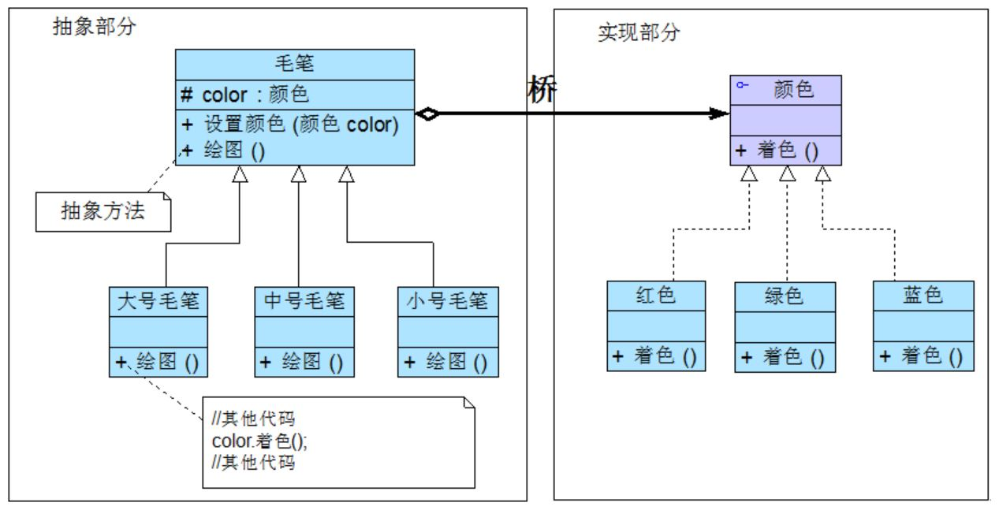
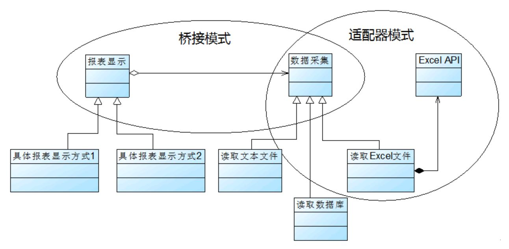

## 桥接模式
假如我们需要大中小 3 种型号的画笔，能够绘制 12 种不同的颜色。
```
使用蜡笔，需要准备 3×12 = 36 支笔。
使用毛笔，需要提供 3 种型号的毛笔，外加 12 个颜料盒。 涉及对象个数 3+12 = 15 。
```
分析
```
颜色和型号是两个不同的变化维度。
使用软件工程中的术语，可以认为： 在蜡笔中颜色和型号之间存在较强的耦合性，而毛笔很好地将二者解耦。
```

#### 1. 案例： 跨平台图像浏览系统
一个跨平台图像浏览系统，要求该系统能够显示 BMP、JPG、GIF、PNG 等多种格式的文件，并且能够在 Windows、Linux、Unix 等多个操作系统上运行。
<div align="center"></div>

分析：
```
以上设计方案，使用了一种多层继承结构：
▪ Image 是抽象父类，而每一种类型的图像类，如 BMPImage、JPGImage 等作为其直接子类。
▪ BMPWindowsImp、BMPLinuxImp 和 BMPUnixImp 作为直接子类 BMPImage 的三个子类。
存在的主要问题/缺点：
▪ 系统中类的个数急剧增加。
▪ 系统扩展麻烦，任一维度上的内容扩展，导致需要添加很多个具体类。
另外，具体类 BMPWindowsImp、BMPLinuxImp 和 BMPUnixImp 等违反了 “单一职责原则”，
因为不止一个引起它们变化的原因，它们将图像文件解析（文件格式）和像素矩阵显示（操作系统）这两种完全不同的职责融合在一起。
```

#### 2. 桥接模式
如果软件系统中某个类存在两个独立变化的维度，通过该模式可以将这两个维度分离出来，使两者可以独立扩展，让系统更加符合“单一职责原则”。

##### 2.1 特征
```
桥接模式用一种巧妙的方式处理多层继承存在的问题，用抽象关联取代了传统的多层继承。 静态继承关系转换为动态的对象组合关系。
它是一种对象结构型模式，又称为柄体 (Handle and Body) 模式或接口 (Interface) 模式。
```
<div align="center"></div>

```
桥接模式是一个非常有用的模式，在桥接模式中体现了很多面向对象设计原则的思想，
包括 “单一职责原则” 、 “开闭原则” 、 “合成复用原则” 、 “里氏代换原则” 、 “依赖倒转原则” 等。
```

##### 2.2 代码框架
在使用桥接模式时，我们首先应该识别出一个类所具有的两个独立变化的维度，将它们设计为两个独立的继承等级结构，为两个维度都提供抽象层，并建立抽象耦合。

通常情况下，我们将业务相关的维度设计为“抽象类”层次结构，将另一个维度设计为“实现类”层次结构。
<div align="center"></div>

```java
// 注意，首先需要针对两个不同的维度提取抽象类和实现类接口，并建立一个抽象关联关系。

# 1. 抽象类部分的接口定义

abstract class Abstraction {
	// 一般将该对象的可见性定义为 protected，以便在其子类中访问 Implementor 的方法 ！！！
	protected Implementor impl; //定义实现类接口对象
	
	public void setImpl(Implementor impl) {
		this.impl=impl;
	}
	
	public abstract void operation();  //声明抽象业务方法
}

# 2. 实现类部分的接口定义

interface Implementor {
	public void operationImpl();
}

# 3. 扩充抽象类或细化抽象类 (Refined Abstraction)

class RefinedAbstraction extends Abstraction {
	public void operation() {
		//业务代码
		impl.operationImpl();  //调用实现类的方法
		//业务代码
	}
}
```

#### 3. 使用桥接模式重构跨平台图像浏览系统
Image 充当抽象类，其子类 JPGImage、 PNGImage、 BMPImage 和 GIFImage 充当扩充抽象类； ImageImp 充当实现类接口，其子类 WindowsImp、 LinuxImp 和 UnixImp 充当具体实现类。
<div align="center"></div>

代码框架
```java
# 1. 数据类 （基础、辅助类）

// 像素矩阵类：辅助类，各种格式的文件最终都被转化为像素矩阵，不同的操作系统提供不同的方式显示像素矩阵
class Matrix {
	//此处代码省略
}

# 2. 抽象部分接口定义 （抽象类）

// 抽象图像类：抽象类
abstract class Image {
	// **一般将该对象的可见性定义为 protected，以便在其子类中访问 Implementor 的方法。**
	protected ImageImp imp;
 
	public void setImageImp(ImageImp imp) {
		this.imp = imp;
	} 
 
	public abstract void parseFile(String fileName);
}

# 3. 实现部分接口定义 （实现类）

// 抽象操作系统实现类：实现类接口
interface ImageImp {
	public void doPaint(Matrix m);  //显示像素矩阵m
} 

# 4. 具体实现类

// Windows 操作系统实现类：具体实现类
class WindowsImp implements ImageImp {
    public void doPaint(Matrix m) {
    	// 调用Windows系统的绘制函数绘制像素矩阵
    	System.out.print("在Windows操作系统中显示图像：");
    }
}
 
// Linux 操作系统实现类：具体实现类
class LinuxImp implements ImageImp {
    public void doPaint(Matrix m) {
    	// 调用Linux系统的绘制函数绘制像素矩阵
    	System.out.print("在Linux操作系统中显示图像：");
    }
}
 
// Unix 操作系统实现类：具体实现类
class UnixImp implements ImageImp {
    public void doPaint(Matrix m) {
    	//调用Unix系统的绘制函数绘制像素矩阵
    	System.out.print("在Unix操作系统中显示图像：");
    }
}

# 5. 扩充抽象类

// JPG 格式图像：扩充抽象类
class JPGImage extends Image {
	public void parseFile(String fileName) {
        //模拟解析JPG文件并获得一个像素矩阵对象m;
        Matrix m = new Matrix(); 
        imp.doPaint(m);
        System.out.println(fileName + "，格式为JPG。");
    }
}
 
// PNG 格式图像：扩充抽象类
class PNGImage extends Image {
	public void parseFile(String fileName) {
        //模拟解析PNG文件并获得一个像素矩阵对象m;
        Matrix m = new Matrix(); 
        imp.doPaint(m);
        System.out.println(fileName + "，格式为PNG。");
    }
}
 
// BMP 格式图像：扩充抽象类
class BMPImage extends Image {
	public void parseFile(String fileName) {
        //模拟解析BMP文件并获得一个像素矩阵对象m;
        Matrix m = new Matrix(); 
        imp.doPaint(m);
        System.out.println(fileName + "，格式为BMP。");
    }
}
 
// GIF 格式图像：扩充抽象类
class GIFImage extends Image {
	public void parseFile(String fileName) {
        //模拟解析GIF文件并获得一个像素矩阵对象m;
        Matrix m = new Matrix(); 
        imp.doPaint(m);
        System.out.println(fileName + "，格式为GIF。");
    }
}

# 6. 工具类 XMLUtil 和配置文件

<?xml version="1.0"?>
<config>
	<!--RefinedAbstraction-->
	<className>JPGImage</className> 
	<!--ConcreteImplementor-->
	<className>WindowsImp</className>
</config>

import javax.xml.parsers.*;
import org.w3c.dom.*;
import org.xml.sax.SAXException;
import java.io.*;
public class XMLUtil {
	//该方法用于从 XML 配置文件中提取具体类类名，并返回一个实例对象
	public static Object getBean(String args) {
		try {
			//创建文档对象
			DocumentBuilderFactory dFactory = DocumentBuilderFactory.newInstance();
			DocumentBuilder builder = dFactory.newDocumentBuilder();
			Document doc;							
			doc = builder.parse(new File("config.xml")); 
			NodeList nl=null;
			Node classNode=null;
			String cName=null;
			nl = doc.getElementsByTagName("className");
			
			if(args.equals("image")) {
				//获取第一个包含类名的节点，即扩充抽象类
				classNode=nl.item(0).getFirstChild(); 
			}
			else if(args.equals("os")) {
				//获取第二个包含类名的节点，即具体实现类
				classNode=nl.item(1).getFirstChild();
			}
			
			cName=classNode.getNodeValue();
			//通过类名生成实例对象并将其返回
			Class c=Class.forName(cName);
			Object obj=c.newInstance();
			return obj;		
		}   
		catch(Exception e) {
			e.printStackTrace();
			return null;
		}
	}
}

# 7. 主程序 （main）

class Client {
	public static void main(String args[]) {
		Image image;
		ImageImp imp;
		image = (Image)XMLUtil.getBean("image");
		imp = (ImageImp)XMLUtil.getBean("os");
		image.setImageImp(imp);
		image.parseFile("小龙女");
	}
}
```

#### 4. 适配器模式与桥接模式的联用
桥接模式和适配器模式用于设计的不同阶段，桥接模式用于系统的初步设计，对于存在两个独立变化维度的类可以将其分为抽象化和实现化两个角色，使它们可以分别进行变化；
而在初步设计完成之后，当发现系统与已有类无法协同工作时，可以采用适配器模式。
但有时候在设计初期也需要考虑适配器模式，特别是那些涉及到大量第三方应用接口的情况（已有且不可更改）。
<div align="center"></div>

#### 5. 本模式优缺点
桥接模式是设计 Java 虚拟机和实现 JDBC 等驱动程序的核心模式之一，应用较为广泛。
桥接模式为多维度变化的系统提供了一套完整的解决方案，并且降低了系统的复杂度。
```
优：
▪ 分离抽象接口及其实现部分。
▪ 在很多情况下，桥接模式可以取代多层继承方案。 多层继承方案违背了“单一职责原则”，复用性较差。
缺：
▪ 增加系统的理解与设计难度，同时要求开发者一开始就针对抽象层进行设计与编程。
▪ 要求正确识别出系统中两个独立变化的维度。
```
适用场景
```
▫ 一个类存在两个（或多个）独立变化的维度，且这两个（或多个）维度都需要独立进行扩展。
▫ 不希望使用多层继承，或者因为多层继承导致系统类的个数急剧增加的情况。
```
