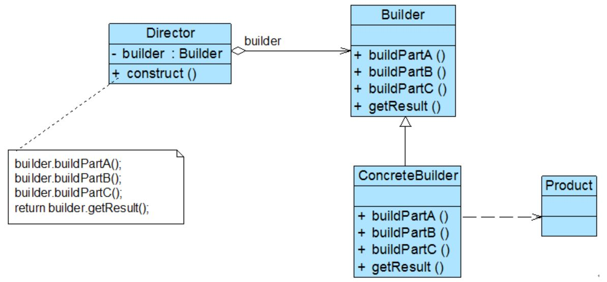
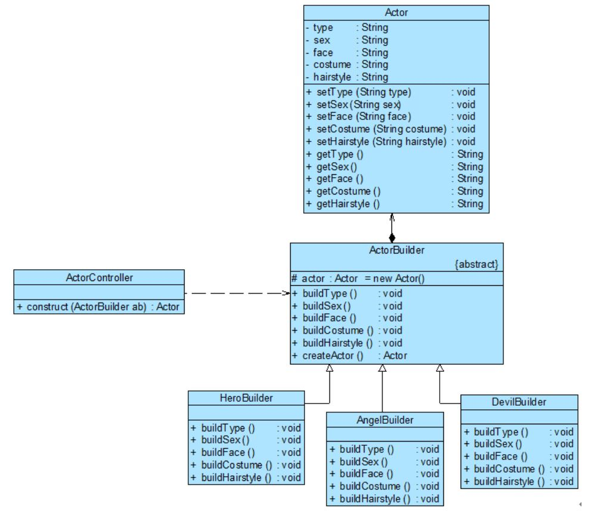

## 建造者模式
建造者模式又称“生成器模式”，它是一种较为复杂、使用频率也相对较低的创建型模式。 建造者模式为客户端返回的不是一个简单的产品，而是一个由多个部件组成的复杂产品。
（“整车厂”模式的抽象，OEM->ODM。 OEM(simple product factory)-ODM(solution/complex product)-OBM(service)）

#### 1. 案例： 游戏角色设计
游戏角色作为 RPG(Role Playing Game，角色扮演游戏) 游戏的一个重要组成部分，分析发现，游戏角色是一个复杂对象，它包含性别、脸型等多个组成部分。
<div align="center"></div>

分析
```
无论是何种造型的游戏角色，它的创建步骤都大同小异，都需要逐步创建其组成部分，再将各组成部分装配成一个完整的游戏角色。
如何一步步创建一个包含多个组成部分的复杂对象，建造者模式为解决此类问题而诞生。
```

#### 2. 建造者模式 (Builder)
建造者模式是较为复杂的创建型模式，它将客户端（client）与包含多个组成部分的复杂对象(a set of low-level products/complex product)的创建过程分离。
(建造者模式是一种对象创建型模式。)
<div align="center"></div>

代码框架
```java
# 1. 复杂对象定义 （a set of low-level products/complex product）
    (没有 builder 作用的话，这个所谓的复杂对象只是一个简单的集合。)

class Product  {
       private  String partA; //定义部件，部件可以是任意类型，包括值类型和引用类型
       private  String partB;
       private  String partC;

       // partA的Getter方法和Setter方法省略
       // partB的Getter方法和Setter方法省略
       // partC的Getter方法和Setter方法省略
}

# 2. 抽象建造者 （abstract builder）

abstract class Builder {
       protected  Product product = new Product(); //创建产品对象

       public  abstract void buildPartA();  // 资源整合方法
       public  abstract void buildPartB();
       public  abstract void buildPartC();

       //返回产品对象
       public  Product getResult() {
              return  product;
       }
}

# 3. 具体建造者

class ConcreteBuilder implements Builder {
        // 实现 buildPartX() 方法 (此处省略)
}

# 4. 指挥官 （Director 包含 construct() 工厂方法)
    （一方面它隔离了客户与产品创建过程；另一方面它通过 builder/designer 控制产品的创建过程）

class Director {
       private  Builder builder;  // 建造者

       public  Director(Builder builder) {
              this.builder = builder;
       }

       public  void setBuilder(Builder builder) {
              this.builder = builer;
       }

       // 产品构建与组装方法
       public Product construct() {
              builder.buildPartA();
              builder.buildPartB();
              builder.buildPartC();
              return builder.getResult();
       }
}

# 5. 主程序 （main）

……
Builder  builder = new ConcreteBuilder(); //可通过配置文件实现
Director director = new Director(builder);
Product product = director.construct();
……
```

##### 2.1 特点
```
抽象工厂模式可以看成一个大型汽车配件生产厂，生成不同类型的汽车配件 （针对一个复杂产品的 low-level 产品族），
而建造者模式是一个汽车组装厂，通过对配件进行组装返回一辆完整的汽车 （builder/designer）。
```

##### 2.2 思考
```
如果没有指挥者类 Director，客户端将如何构建复杂产品？
```

#### 3. 建造者模式实现游戏角色创建
ActorController 充当指挥者，ActorBuilder 充当抽象建造者，Actor充当复杂产品。
<div align="center"></div>

代码框架
```java
# 1. 复杂产品定义

// Actor 角色类：复杂产品，考虑到代码的可读性，只列出部分成员属性，且成员属性的类型均为 String，
   真实情况下，有些成员属性的类型需自定义
class Actor
{
       private  String type; //角色类型
       private  String sex; //性别
       private  String face; //脸型
       private  String costume; //服装
       private  String hairstyle; //发型
       
       // Set
       public  void setType(String type) {
              this.type  = type;
       }
       public  void setSex(String sex) {
              this.sex  = sex;
       }
       public  void setFace(String face) {
              this.face  = face;
       }
       public  void setCostume(String costume) {
              this.costume  = costume;
       }
       public  void setHairstyle(String hairstyle) {
              this.hairstyle  = hairstyle;
       }

       // Get
       public  String getType() {
              return  (this.type);
       }
       public  String getSex() {
              return  (this.sex);
       }
       public  String getFace() {
              return  (this.face);
       }
       public  String getCostume() {
              return  (this.costume);
       }
       public  String getHairstyle() {
              return  (this.hairstyle);
       }
}

# 2. 抽象建造者定义

// 角色建造器：抽象建造者
abstract class ActorBuilder
{
       protected  Actor actor = new Actor(); //创建 Actor 对象

       public  abstract void buildType();
       public  abstract void buildSex();
       public  abstract void buildFace();
       public  abstract void buildCostume();
       public  abstract void buildHairstyle();

       //工厂方法，返回一个完整的游戏角色对象
       public Actor createActor()
       {
              return actor;
       }
}

# 3. 具体建造者

// 英雄角色建造器：具体建造者
class HeroBuilder extends ActorBuilder
{
       public  void buildType()
       {
              actor.setType("英雄");
       }

       public  void buildSex()
       {
              actor.setSex("男");
       }

       public  void buildFace()
       {
              actor.setFace("英俊");
       }

       public  void buildCostume()
       {
              actor.setCostume("盔甲");
       }

       public  void buildHairstyle()
       {
              actor.setHairstyle("飘逸");
       }    
}

// 天使角色建造器：具体建造者
class AngelBuilder extends ActorBuilder
{
       public  void buildType()
       {
              actor.setType("天使");
       }

       public  void buildSex()
       {
              actor.setSex("女");
       }

       public  void buildFace()
       {
              actor.setFace("漂亮");
       }

       public  void buildCostume()
       {
              actor.setCostume("白裙");
       }

       public  void buildHairstyle()
       {
              actor.setHairstyle("披肩长发");
       }    
}

// 恶魔角色建造器：具体建造者
class DevilBuilder extends ActorBuilder
{
       public  void buildType()
       {
              actor.setType("恶魔");
       }

       public  void buildSex()
       {
              actor.setSex("妖");
       }

       public  void buildFace()
       {
              actor.setFace("丑陋");
       }

       public  void buildCostume()
       {
              actor.setCostume("黑衣");
       }

       public  void buildHairstyle()
       {
              actor.setHairstyle("光头");
       }    
}

# 4. 指挥者定义 (包含 construct() 工厂方法)

// 游戏角色创建控制器：指挥者
class ActorController
{
       //逐步构建复杂产品对象
       public Actor construct(ActorBuilder ab)
       {
              Actor actor;

              ab.buildType();
              ab.buildSex();
              ab.buildFace();
              ab.buildCostume();
              ab.buildHairstyle();
              actor = ab.createActor();

              return actor;
       }
}

# 5. 主程序 （main）

class Client
{
       public  static void main(String args[])
       {
              ActorBuilder ab; //针对抽象建造者编程
              ab =  (ActorBuilder)XMLUtil.getBean(); //反射生成具体建造者对象

              ActorController ac = new ActorController();

              Actor actor;
              actor = ac.construct(ab); //通过指挥者创建完整的建造者对象

              String  type = actor.getType();
              System.out.println(type  + "的外观：");
              System.out.println("性别：" + actor.getSex());
              System.out.println("面容：" + actor.getFace());
              System.out.println("服装：" + actor.getCostume());
              System.out.println("发型：" + actor.getHairstyle());
       }
}

# 6. 配置文件

<?xml version="1.0"?>
<config>
       <className>AngelBuilder</className>
</config> 

# 7. 工具类 XMLUtil

import javax.xml.parsers.*;
import org.w3c.dom.*;
import org.xml.sax.SAXException;
import java.io.*;

class XMLUtil
{
       //该方法用于从 XML 配置文件中提取具体类类名，并返回一个实例对象

       public  static Object getBean()
       {
              try
              {
                     //创建文档对象
                     DocumentBuilderFactory dFactory = DocumentBuilderFactory.newInstance();
                     DocumentBuilder builder = dFactory.newDocumentBuilder();
                     Document doc;                                                
                     doc = builder.parse(new File("config.xml"));
             
                     //获取包含类名的文本节点
                     NodeList  nl = doc.getElementsByTagName("className");
                     Node classNode = nl.item(0).getFirstChild();
                     String cName = classNode.getNodeValue();

                     //通过类名生成实例对象并将其返回
                     Class c = Class.forName(cName);
                     Object obj = c.newInstance();

                     return obj;
              }
              catch(Exception e)
              {
                     e.printStackTrace();
                     return null;
              }
       }
}
```
说明
```
建造者模式中，客户端代码 （client） 需要实例化指挥者类 (new Director())，
具体的角色建造者类 （ConcreteBuilder） 通过配置文件传入。
```

#### 4. 关于 Director 的进一步讨论
指挥者类 Director 在建造者模式中扮演非常重要的作用，定义具体建造者 Builder 如何构建产品。

##### 4.1 省略 Director
在有些情况下，为了简化系统结构，可以将 Director 和抽象建造者 Builder 进行合并，
在 Builder 中提供逐步构建复杂产品对象的 construct() 方法。
```java
# 新的建造者类A (static construct() 工厂方法)

abstract class ActorBuilder
{
       protected static Actor actor = new  Actor();
      
       public  abstract void buildType();
       public  abstract void buildSex();
       public  abstract void buildFace();
       public  abstract void buildCostume();
       public  abstract void buildHairstyle();

       public static Actor construct(ActorBuilder ab) // static 成员
       {
              ab.buildType();
              ab.buildSex();
              ab.buildFace();
              ab.buildCostume();
              ab.buildHairstyle();
              return actor;
       }
}

# 主程序 （main）

……
ActorBuilder  ab;
ab  = (ActorBuilder)XMLUtil.getBean();
Actor  actor;
actor =  ActorBuilder.construct(ab);
……


# 新的建造者类B (非 static construct() 工厂方法)

abstract class ActorBuilder
{
       protected Actor actor = new Actor();     

       public abstract void buildType();
       public abstract void buildSex();
       public abstract void buildFace();
       public abstract void buildCostume();
       public abstract void buildHairstyle();

       public Actor construct() // 非 static 成员
       {
              this.buildType();
              this.buildSex();
              this.buildFace();
              this.buildCostume();
              this.buildHairstyle();
              return actor;
       }
}

# 主程序 （main）

……
ActorBuilder  ab;
ab  = (ActorBuilder)XMLUtil.getBean();
Actor  actor;
actor = ab.construct();
……
```
说明
```
如果 construct() 方法较为复杂，待构建产品的组成部分较多，建议还是将 construct() 方法单独封装在 Director 中，
这样做更符合“单一职责原则”。
```

##### 4.2 钩子方法的引入
增加一类称之为钩子方法 (HookMethod) 的特殊方法来控制是否对某个 buildPartX() 的调用。
钩子方法的返回类型通常为 boolean 类型，方法名一般为 isXXX()，钩子方法定义在抽象建造者类 Builder 中。
```java
# 带钩子方法 （Hook Method） 的建造者 Builder

abstract class ActorBuilder
{
       protected  Actor actor = new Actor();     

       public  abstract void buildType();
       public  abstract void buildSex();
       public  abstract void buildFace();
       public  abstract void buildCostume();
       public  abstract void buildHairstyle();

       // 钩子方法
       public boolean isBareheaded()
       {
              return false;
       }

       public  Actor createActor()
       {
              return  actor;
       }
}
```
钩子的意义
```
如果某个角色无须构建头发部件，例如 “恶魔(Devil)”，则对应的具体建造器 DevilBuilder 将覆盖 isBareheaded() 方法，
并将返回值改为 true。
通过引入钩子方法，我们可以在 Director 中对复杂产品的构建进行精细的控制，不仅指定 buildPartX() 方法的执行顺序，
还可以控制是否需要执行某个 buildPartX() 方法。
```
带钩子方法的具体建造者/指挥官/客户端代码
```java
# 带钩子方法的具体建造者

class DevilBuilder extends ActorBuilder
{
       public  void buildType()
       {
              actor.setType("恶魔");
       }

       public  void buildSex()
       {
              actor.setSex("妖");
       }

       public  void buildFace()
       {
              actor.setFace("丑陋");
       }

       public  void buildCostume()
       {
              actor.setCostume("黑衣");
       }

       public  void buildHairstyle()
       {
              actor.setHairstyle("光头");
       }

       // 覆盖钩子方法
       public boolean isBareheaded()
       {
              return true;
       }
}

# 考虑钩子方法的指挥官

class ActorController
{
       public Actor construct(ActorBuilder ab)
       {
              Actor actor;

              ab.buildType();
              ab.buildSex();
              ab.buildFace();
              ab.buildCostume();

              // 通过钩子方法来控制产品的构建
              if(!ab.isBareheaded())
              {
                     ab.buildHairstyle();
              }

              actor = ab.createActor();
              return actor;
       }
}

# 主程序 （main）
……
ActorBuilder ab;
ab =  (ActorBuilder)XMLUtil.getBean(); //反射生成具体建造者对象
ActorController ac = new ActorController(); //指挥官（hardcode）
Actor actor;
actor = ac.construct(ab);
……
```

#### 5. 本模式优缺点
建造者模式的核心在于如何一步步构建一个包含多个组成部件的完整对象。
```
优：
▪ 隐藏产品内部组成/搭建的细节，将产品本身与产品的创建过程解耦。
▪ 将复杂产品的创建步骤分解在 builder 的不同方法中，然后在 construct() 方法中精细控制产品的创建过程。
缺：
▪ 如果产品之间的差异性很大，不适合使用建造者模式。 （所谓的复杂产品是有条件的复杂。）
▪ 如果产品的内部变化复杂，会导致需要定义很多具体建造者类，系统变得很庞大。
```
适应场景
```
▫ 需要生成的产品对象有复杂的内部结构，对象的属性相互依赖，需要指定其生成顺序。
▫ 将对象的创建过程独立于创建该对象的类。将创建过程封装在指挥者类中，而不是在建造者类和客户类中。
▫ 需要将创建过程单独隔离出来的情形。
```
