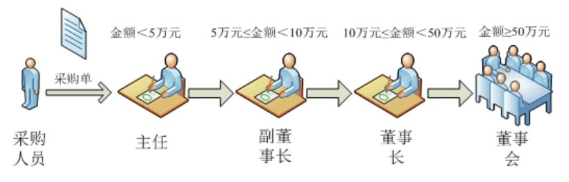
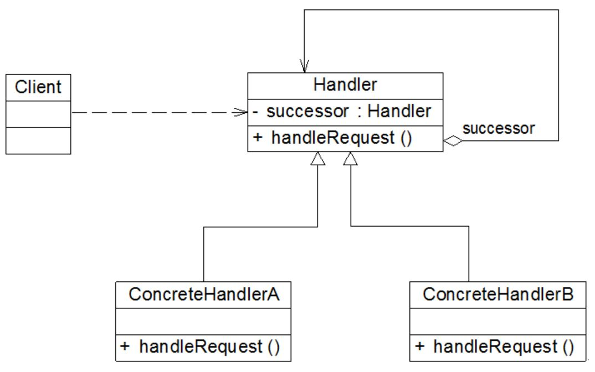
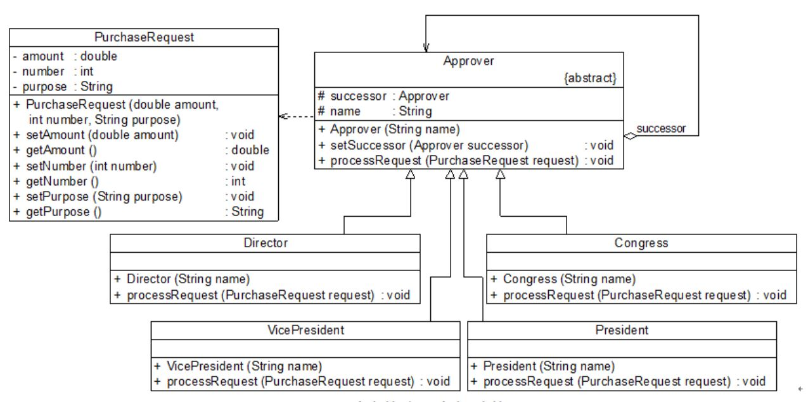

## 职责链模式
纸牌游戏： <br>
一对二”， “过”， “过” ...

#### 1. 案例： SCM (Supply Chain Management，供应链管理) 系统
<div align="center"></div>

```java
// 采购单处理类
class PurchaseRequestHandler {
	//递交采购单给主任
	public void sendRequestToDirector(PurchaseRequest request) {
		if (request.getAmount() < 50000) {
			//主任可审批该采购单
			this.handleByDirector(request);
		}
		else if (request.getAmount() < 100000) {
			//副董事长可审批该采购单
			this.handleByVicePresident(request);
		}
		else if (request.getAmount() < 500000) {
			//董事长可审批该采购单
			this.handleByPresident(request);
		}
		else {
			//董事会可审批该采购单
			this.handleByCongress(request);
		}
	}
	
	//主任审批采购单
	public void handleByDirector(PurchaseRequest request) {
		//代码省略
	}
	
	//副董事长审批采购单
	public void handleByVicePresident(PurchaseRequest request) {
		//代码省略
	}
	
	//董事长审批采购单
	public void handleByPresident(PurchaseRequest request) {
		//代码省略
	}
	
	//董事会审批采购单
	public void handleByCongress(PurchaseRequest request) {
		//代码省略
	}
}
```

分析：
```
该方案存在以下问题：
(1) PurchaseRequestHandler 类较为庞大，各个级别的审批方法都集中在一个类中，违反了“单一职责原则”。
(2) 增、删一个新的审批手续必须修改源代码，违反了“开闭原则”。
(3) 审批流程的设置缺乏灵活性，调整审批顺序依旧需要修改源代码，违反了“开闭原则”。
```

#### 2. 职责链模式
很多情况下，一个软件系统中可以处理某个请求的对象不止一个。 （职责链可以是一条直线、一个环或者一个树形结构，最常见的职责链是直线型，即沿着一条单向的链来传递。）

##### 2.1 特征
```
客户端无须关心请求的处理细节以及请求的传递，只需将请求发送到链上即可，实现请求发送者和请求处理者解耦。
注意：
职责链模式并不创建职责链，职责链的创建工作必须由系统的其他部分来完成，一般是在使用该职责链的客户端中创建职责链。
```
<div align="center"></div>

```
核心：
▪ Handler （抽象处理者） - 定义了一个处理请求的接口。
▪ successor - 对下家的引用。
```

##### 2.2 代码框架
```java
# 1. 抽象处理者

abstract class Handler {
	//维持对下家的引用 （protected 成员，子类可访问。）
	protected Handler successor;
	
	public void setSuccessor(Handler successor) {
		this.successor = successor;
	}
	
	public abstract void handleRequest(String request);
}

# 2. 具体处理者

class ConcreteHandler extends Handler {
	public void handleRequest(String request) {
		if (请求满足条件) {
			//处理请求
		}
		else {
			this.successor.handleRequest(request);  //转发请求
		}
	}
}
```

#### 3. 使用职责链模式重构 SCM 系统
Approver 充当抽象处理者，Director、VicePresident、President 和 Congress 充当具体处理者，PurchaseRequest 为请求类（定义请求）。
<div align="center"></div>

代码框架
```java
# 1. 请求类 （定义请求）

// 采购单：请求类
class PurchaseRequest {
	private double amount;  //采购金额
	private int number;  //采购单编号
	private String purpose;  //采购目的
	
	public PurchaseRequest(double amount, int number, String purpose) {
		this.amount = amount;
		this.number = number;
		this.purpose = purpose;
	}
	
	public void setAmount(double amount) {
		this.amount = amount;
	}
	
	public double getAmount() {
		return this.amount;
	}
	
	public void setNumber(int number) {
		this.number = number;
	}
	
	public int getNumber() {
		return this.number;
	}
	
	public void setPurpose(String purpose) {
		this.purpose = purpose;
	}
	
	public String getPurpose() {
		return this.purpose;
	}
}

# 2. 抽象处理者

// 审批者类：抽象处理者
abstract class Approver {
	protected Approver successor; //定义后继对象
	protected String name; //审批者姓名
	
	public Approver(String name) {
		this.name = name;
	}
 
	//设置后继者
	public void setSuccessor(Approver successor) { 
		this.successor = successor;
	}
 
	//抽象请求处理方法
	public abstract void processRequest(PurchaseRequest request);
}

# 3. 具体处理者

// 主任类：具体处理者
class Director extends Approver {
	public Director(String name) {
		super(name);
	}
	
 	//具体请求处理方法
 	public void processRequest(PurchaseRequest request) {
 		if (request.getAmount() < 50000) {
 			System.out.println("主任" + this.name + "审批采购单：" + request.getNumber() + "，金额：" + request.getAmount() + "元，采购目的：" + request.getPurpose() + "。");  //处理请求
 		}
 		else {
 			this.successor.processRequest(request);  //转发请求
 		}	
 	}
}
 
// 副董事长类：具体处理者
class VicePresident extends Approver {
	public VicePresident(String name) {
		super(name);
	}
	
 	//具体请求处理方法
 	public void processRequest(PurchaseRequest request) {
 		if (request.getAmount() < 100000) {
 			System.out.println("副董事长" + this.name + "审批采购单：" + request.getNumber() + "，金额：" + request.getAmount() + "元，采购目的：" + request.getPurpose() + "。");  //处理请求
 		}
 		else {
 			this.successor.processRequest(request);  //转发请求
 		}	
 	}
}
 
// 董事长类：具体处理者
class President extends Approver {
	public President(String name) {
		super(name);
	}
	
 	//具体请求处理方法
 	public void processRequest(PurchaseRequest request) {
 		if (request.getAmount() < 500000) {
 			System.out.println("董事长" + this.name + "审批采购单：" + request.getNumber() + "，金额：" + request.getAmount() + "元，采购目的：" + request.getPurpose() + "。");  //处理请求
 		}
 		else {
 			this.successor.processRequest(request);  //转发请求
 		}
 	}
}
 
// 董事会类：具体处理者
class Congress extends Approver {
	public Congress(String name) {
		super(name);
	}
	
 	//具体请求处理方法
 	public void processRequest(PurchaseRequest request) {
 		System.out.println("召开董事会审批采购单：" + request.getNumber() + "，金额：" + request.getAmount() + "元，采购目的：" + request.getPurpose() + "。");  //处理请求
 	}    
}

# 4. 主程序 （main）

class Client {
	public static void main(String[] args) {
		Approver wjzhang,gyang,jguo,meeting;
		wjzhang = new Director("张无忌");
		gyang = new VicePresident("杨过");
		jguo = new President("郭靖");
		meeting = new Congress("董事会");
	
		//创建职责链
		wjzhang.setSuccessor(gyang);
		gyang.setSuccessor(jguo);
		jguo.setSuccessor(meeting);
		
		//创建采购单
		PurchaseRequest pr1 = new PurchaseRequest(45000,10001,"购买倚天剑");
		wjzhang.processRequest(pr1);
		
		PurchaseRequest pr2 = new PurchaseRequest(60000,10002,"购买《葵花宝典》");
		wjzhang.processRequest(pr2);
	
		PurchaseRequest pr3 = new PurchaseRequest(160000,10003,"购买《金刚经》");
		wjzhang.processRequest(pr3);
 
		PurchaseRequest pr4 = new PurchaseRequest(800000,10004,"购买桃花岛");
		wjzhang.processRequest(pr4);
	}
}
```

#### 4. 纯与不纯的职责链模式

##### 4.1 纯的职责链模式
```
▪ 一个具体处理者对象只能在两个行为中选择一个：
    承担全部责任 or 将责任推给下家。
▪ 一个请求最终必须被某一个处理者对象所接收，不能出现某个请求未被任何一个处理者对象处理的情况。
```

##### 4.2 不纯的职责链模式
```
▪ 允许某个请求被一个具体处理者部分处理后再向下传递，
  一个具体处理者处理完某请求后其后继处理者可以继续处理该请求。
▪ 一个请求可以最终不被任何处理者对象所接收。
（Exception 编程即为不纯的职责链模式， 又叫 **事件浮升** (Event Bubbling) 机制。）
```

#### 5. 本模式优缺点
```
优：
▪ 仅维持一个指向其后继者的引用，简化对象的相互连接，降低了系统的耦合度。
▪ 增加一个新的具体请求处理者时无须修改原有系统的代码，只需要在客户端重新建链即可，
  从这一点来看还是符合“开闭原则”的。
缺：
▪ 一个请求可能因职责链没有被正确配置而得不到处理。
▪ 代码调试不便。
▪ 如果建链不当，可能会造成循环调用，将导致系统陷入死循环。
```
适用场景
```
▫ 有多个对象可以处理同一个请求。
```
