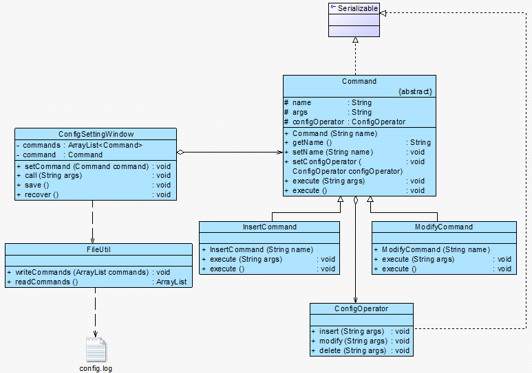

## 命令模式
电器开关： <br>
在购买开关时，我们并不知道它将来到底用于控制什么电器，也就是说，开关与电灯、排气扇并无直接关系。 开关与设备的对应关系通过电线来确定。

开关可以理解成一个请求的发送者，用户通过它来发送一个“开灯”请求，而电灯是“开灯”请求的最终接收者和处理者，
开关和电灯之间并不存在直接耦合关系，它们通过电线连接在一起。更换一根电线，相同的发送者（开关）即可对应不同的接收者（电器）。

#### 1. 案例： 自定义功能按键设计
```java
// FunctionButton： 功能按键类，请求发送者
class FunctionButton {
	private HelpHandler help; //HelpHandler：帮助文档处理类，请求接收者
	
	//在FunctionButton的onClick()方法中调用HelpHandler的display()方法
	public void onClick() {
		help = new HelpHandler();
		help.display(); //显示帮助文档
	}
}
```
分析：
```
该方案存在以下问题：
(1) 更换请求接收者必须修改发送者的源代码，违背了“开闭原则”。
(2) FunctionButton 类在设计和实现时功能已被固定，增加新的控制功能，
    需要增加一个新的与 FunctionButton 功能类似的类，导致系统中类的个数急剧增加。
(3) 无法自定义 FunctionButton 的功能，缺乏灵活性。
```

#### 2. 命令模式
有时，我们并不知道请求的接收者是谁，同时也不知道被请求的操作是什么 （对比与职责链模式的差别）。 命令模式 (Command Pattern)，将一个请求封装为一个对象，
用不同的请求对客户进行参数化，对请求排队或记录请求，以及支持可撤销。命令模式又称为 动作 (Action) 模式 或 事务 (Transaction) 模式。
<div align="center"></div>

##### 2.1 特征
```
▪ 命令模式的核心在于引入命令类，通过命令类来降低发送者和接收者的耦合度，
  请求发送者只需指定一个命令对象(具体命令类对象)，之后，命令对象会调用请求接收者的特定处理方法。
  （命令模式无法解决系统中类的个数增加的问题）
▪ 命定对象的统一执行接口为 execute()。
▪ 核心类： Command （抽象命令类）、 Invoker （调用者，以调用具体命令对象的 execute() 方法）。
注意：
请求的一方（客户端）不知道接收方的接口，更不知道请求如何被接收、操作是否被执行、何时执行，以及怎么执行。
```

##### 2.2 代码框架
```java
# 1. 抽象命令类  （主要声明 execute() 接口）

abstract class Command {
	public abstract void execute();
}

# 2. 调用者类  （命令对象的注入与发射）

class Invoker {
	private Command command;
	
	//构造注入
	public Invoker(Command command) {
		this.command = command;
	}
	
	//设值注入
	public void setCommand(Command command) {
		this.command = command;
	}
	
	//业务方法，用于调用命令类的execute()方法
	public void call() {
		command.execute();
	}
}

# 3. 具体命令类

class ConcreteCommand extends Command {
	private Receiver receiver; //维持一个对请求接收者对象的引用
 
	public void execute() {
		receiver.action(); //调用请求接收者的业务处理方法action()
	}
}

# 4. 一个接收者类

class Receiver {
	public void action() {
		//具体操作
	}
}
```
思考
```
一个请求发送者能否对应多个请求接收者？
```

#### 3. 使用命令模式重构自定义功能按键设计
FunctionButton 充当调用者，Command 充当抽象命令类，MinimizeCommand 和 HelpCommand 充当具体命令类，WindowHanlder 和 HelpHandler 充当请求接收者。
<div align="center"></div>

代码框架
```
# 1. 抽象命令类

// 抽象命令类
abstract class Command {
	public abstract void execute();
}

# 2. 调用者 （自定义功能键）

// 功能键类：请求发送者
class FunctionButton {
	private String name; //功能键名称
	private Command command; //维持一个抽象命令对象的引用
	
	public FunctionButton(String name) {
		this.name = name;
	}
	
	public String getName() {
		return this.name;
	}
	
	//为功能键注入命令
	public void setCommand(Command command) {
		this.command = command;
	}
	
	//发送请求的方法
	public void onClick() {
		System.out.print("点击功能键：");
		command.execute();
	}
}

# 3. 具体命令类

// 帮助命令类：具体命令类
class HelpCommand extends Command {
	private HelpHandler hhObj; //维持对请求接收者的引用
	
	public HelpCommand() {
		hhObj = new HelpHandler();
	}
	
	//命令执行方法，将调用请求接收者的业务方法
	public void execute() {
		hhObj.display();
	}
}
 
// 最小化命令类：具体命令类
class MinimizeCommand extends Command {
	private WindowHanlder whObj; //维持对请求接收者的引用
	
	public MinimizeCommand() {
		whObj = new WindowHanlder();
	}
	
	//命令执行方法，将调用请求接收者的业务方法
	public void execute() {
		whObj.minimize();
	}
}

# 4. 接收者

// 窗口处理类：请求接收者
class WindowHanlder {
	public void minimize() {
		System.out.println("将窗口最小化至托盘！");
	}
}
 
// 帮助文档处理类：请求接收者
class HelpHandler {
	public void display() {
		System.out.println("显示帮助文档！");
	}
}

# 5. 主界面 （Main Form）

// 功能键设置窗口类
class FBSettingWindow {
	private String title; //窗口标题
	//定义一个ArrayList来存储所有功能键
	private ArrayList<FunctionButton> functionButtons = new ArrayList<FunctionButton>();
	
	public FBSettingWindow(String title) {
		this.title = title;
	}
	
	public void setTitle(String title) {
		this.title = title;
	}
	
	public String getTitle() {
		return this.title;
	}
	
	public void addFunctionButton(FunctionButton fb) {
		functionButtons.add(fb);
	}
	
	public void removeFunctionButton(FunctionButton fb) {
		functionButtons.remove(fb);
	}
	
	//显示窗口及功能键
	public void display() {
		System.out.println("显示窗口：" + this.title);
		System.out.println("显示功能键：");
		for (Object obj : functionButtons) {
			System.out.println(((FunctionButton)obj).getName());
		}
		System.out.println("------------------------------");
	}	
}

# 6. 工具类 XMLUtil 及配置文件

<?xml version="1.0"?>
<config>
	<className>HelpCommand</className>
    <className>MinimizeCommand</className>
</config>

import javax.xml.parsers.*;
import org.w3c.dom.*;
import org.xml.sax.SAXException;
import java.io.*;
 
public class XMLUtil {
//该方法用于从XML配置文件中提取具体类类名，并返回一个实例对象，可以通过参数的不同返回不同类名节点所对应的实例
	public static Object getBean(int i) {
		try {
			//创建文档对象
			DocumentBuilderFactory dFactory = DocumentBuilderFactory.newInstance();
			DocumentBuilder builder = dFactory.newDocumentBuilder();
			Document doc;							
			doc = builder.parse(new File("config.xml")); 
		
			//获取包含类名的文本节点
			NodeList nl = doc.getElementsByTagName("className");
			Node classNode = null;
			if (0 == i) {
				classNode = nl.item(0).getFirstChild();
			}
			else {
				classNode = nl.item(1).getFirstChild();
			} 
 
			String cName = classNode.getNodeValue();
            
			//通过类名生成实例对象并将其返回
			Class c = Class.forName(cName);
			Object obj = c.newInstance();
			return obj;
		}   
		catch(Exception e){
			e.printStackTrace();
			return null;
		}
	}
}

# 7. 主程序 （main）

class Client {
	public static void main(String args[]) {
		FBSettingWindow fbsw = new FBSettingWindow("功能键设置");
			
		FunctionButton fb1,fb2;
		fb1 = new FunctionButton("功能键1");
		fb2 = new FunctionButton("功能键1");
		
		Command command1,command2;
		//通过读取配置文件和反射生成具体命令对象
		command1 = (Command)XMLUtil.getBean(0);
		command2 = (Command)XMLUtil.getBean(1);
	    
		//将命令对象注入功能键
		fb1.setCommand(command1);
		fb2.setCommand(command2);
		
		fbsw.addFunctionButton(fb1);
		fbsw.addFunctionButton(fb2);
		fbsw.display();
		
		//调用功能键的业务方法
		fb1.onClick();
		fb2.onClick();
	}
}
```

#### 4. 命令队列的实现
有时候需要将多个请求排队，这些请求将逐个被执行。 此时，可以通过\*\*命令队列\*\*来负责存储多个命令对象。
```
在增加了命令队列类 CommandQueue 以后，请求发送者类 Invoker 将针对 CommandQueue 编程。
```
```java
# 1. 命令队列 （队列存储结构）

class CommandQueue {
	//定义一个ArrayList来存储命令队列
	private ArrayList<Command> commands = new ArrayList<Command>();
	
	public void addCommand(Command command) {
		commands.add(command);
	}
	
	public void removeCommand(Command command) {
		commands.remove(command);
	}
	
	//循环调用每一个命令对象的execute()方法
	public void execute() {
		for (Object command : commands) {
			((Command)command).execute();
		}
	}
}

# 2. 发送者/调用者

class Invoker {
	private CommandQueue commandQueue; //维持一个CommandQueue对象的引用
	
	//构造注入
	public Invoker(CommandQueue commandQueue) {
		this. commandQueue = commandQueue;
	}
	
	//设值注入
	public void setCommandQueue(CommandQueue commandQueue) {
		this.commandQueue = commandQueue;
	}
	
	//调用CommandQueue类的execute()方法
	public void call() {
		commandQueue.execute();
	}
}
```
说明
```
命令队列与我们常说的 “批处理” 有点类似。 批处理，顾名思义，可以对一组对象（命令）进行批量处理，
当一个发送者发送/发射请求（调用 call/on Click 方法）后，一组命令逐个（或乱序并发）执行。
```

#### 5. 撤销操作的实现
在命令模式中，通过调用一个命令对象的 execute() 方法来实现对请求的处理，如果需要撤销 (Undo) 请求，可通过在命令类中增加一个逆向操作来实现。 
还可以通过保存对象的历史状态来实现撤销，后者可使用备忘录模式 (Memento Pattern) 来实现。

##### 案例： 支持撤销操作的计算器
计算器界面类 CalculatorForm 充当请求发送者 (Invoker)，实现数据求和功能的加法类 Adder 充当请求接收者，
Adder 的 add() 方法实现加法运算，同时提供了可撤销加法运算的 undo() 方法。
<div align="center"></div>

代码结构
```java
# 1. 抽象命令类

//抽象命令类
abstract class AbstractCommand {
	public abstract int execute(int value);  //声明命令执行方法execute()
	public abstract int undo();  //声明撤销方法undo()
}

# 2. 具体命令类

//具体命令类
class ConcreteCommand extends AbstractCommand {
	private Adder adder = new Adder();
	private int value;
		
	//实现抽象命令类中声明的execute()方法，调用加法类的加法操作
	public int execute(int value) {
		this.value=value;
		return adder.add(value);
	}
	
	//实现抽象命令类中声明的undo()方法，通过加一个相反数来实现加法的逆向操作
	public int undo() {
		return adder.add(-value);
	}
}

# 3. 请求发送者 （Invoker）

//计算器界面类：请求发送者
class CalculatorForm {
	private AbstractCommand command;
	
	public void setCommand(AbstractCommand command) {
		this.command = command;
	}
	
	//调用命令对象的execute()方法执行运算
	public void compute(int value) {
		int i = command.execute(value);
		System.out.println("执行运算，运算结果为：" + i);
	}
	
	//调用命令对象的undo()方法执行撤销
	public void undo() {
		int i = command.undo();
		System.out.println("执行撤销，运算结果为：" + i);
	}
}

# 4. 请求接收者

//加法类：请求接收者
class Adder {
	private int num=0; //定义初始值为0
	
	//加法操作，每次将传入的值与num作加法运算，再将结果返回
	public int add(int value) {
		num += value;
		return num;
	}
}

# 5. 主程序 （main）

class Client {
	public static void main(String args[]) {
		CalculatorForm form = new CalculatorForm();
		AbstractCommand command;
		command = new ConcreteCommand();
		form.setCommand(command);  //向发送者(Invoker)注入命令对象(command)
		
		form.compute(10);
		form.compute(5);
		form.compute(10);
		form.undo();  // Undo
	}
}
```
思考
```
如果连续调用 “form.undo()” 两次，预测客户端代码的输出结果。
注意，
本实例中只能实现一步撤销操作，因为没有保存命令对象的历史状态，可以通过引入一个命令集合或其他方式来存储每一次操作时命令的状态，
从而实现多次撤销操作。 除了 Undo 操作外，还可以采用类似的方式实现恢复 (Redo) 操作，即恢复所撤销的操作 （或称为二次撤销）。
```

#### 6. 请求日志
请求日志就是将请求的历史记录保存下来，通常以日志文件(Log File)的形式永久存储在计算机中。

请求日志文件可以实现很多功能，常用功能如下：
* 一旦系统发生故障，日志文件可以为系统提供一种恢复机制。
* 实现批处理，在一个请求日志文件中可以存储一系列命令对象。
* 使用日志文件保存命令队列中的所有命令对象，每执行一个命令则从日志文件中删除一个对应的命令对象，
防止因为断电或者系统重启等原因造成请求丢失，同时避免重新发送全部请求时造成某些命令的重复执行。

```
在实现请求日志时，将命令对象通过序列化写到日志文件中。
```

##### 案例： 网站配置文件管理工具
<div align="center"></div>

代码框架
```java
# 1. 抽象命令类 (Command)

//抽象命令类， 注意： 由于需要将命令对象写入文件，因此它实现了Serializable接口！
abstract class Command implements Serializable {
	protected String name; //命令名称
	protected String args; //命令参数
	protected ConfigOperator configOperator; //维持对接收者对象的引用
	
	public Command(String name) {
		this.name = name;
	}
	
	public String getName() {
		return this.name;
	}
	
	public void setName(String name) {
		this.name = name;
	}
	
	public void setConfigOperator(ConfigOperator configOperator) {
		this.configOperator = configOperator;
	}
	
	//声明两个抽象的执行方法execute()
	public abstract void execute(String args);
	public abstract void execute();
}

# 2. 具体命令类

//增加命令类：具体命令
class InsertCommand extends Command {
	public InsertCommand(String name) {
		super(name);
	}
	
	public void execute(String args) {
		this.args = args;
		configOperator.insert(args);
	}
	
	public void execute() {
		configOperator.insert(this.args);
	}
}
 
//修改命令类：具体命令
class ModifyCommand extends Command {
	public ModifyCommand(String name) {
		super(name);
	}
	
	public void execute(String args) {
		this.args = args;
		configOperator.modify(args);
	}
	
	public void execute() {
		configOperator.modify(this.args);
	}
}
 
//省略了删除命令类DeleteCommand

# 3. 请求接收者 (Receiver)

//配置文件操作类：请求接收者。 由于ConfigOperator类的对象是Command的成员对象，
//注意， 它也将随Command对象一起写入文件，因此ConfigOperator也需要实现Serializable接口
class ConfigOperator implements Serializable {
	public void insert(String args) {
		System.out.println("增加新节点：" + args);
	}
	
	public void modify(String args) {
		System.out.println("修改节点：" + args);
	}
	
	public void delete(String args) {
		System.out.println("删除节点：" + args);
	}
}

# 4. 请求发送者 （Invoker）

//配置文件设置窗口类：请求发送者
class ConfigSettingWindow {
	//定义一个集合来存储每一次操作时的命令对象
	private ArrayList<Command> commands = new ArrayList<Command>();
	private Command command; 
 
	//注入具体命令对象
	public void setCommand(Command command) {
		this.command = command;
	}
	
	//执行配置文件修改命令，同时将命令对象添加到命令集合中
	public void call(String args) {
		command.execute(args);
		commands.add(command);  //记录
	}
	
	//记录请求日志，生成日志文件，将命令集合写入日志文件
	public void save() {
		FileUtil.writeCommands(commands);
	}
	
	//从日志文件中提取命令集合，并循环调用每一个命令对象的execute()方法来实现配置文件的重新设置
	public void recover() {
		ArrayList list;
		list = FileUtil.readCommands();
		
		for (Object obj : list) {
			((Command)obj).execute();
		}
	}
}

# 5. 文件操作

//工具类：文件操作类
class FileUtil {
	//将命令集合写入日志文件
	public static void writeCommands(ArrayList commands) {
		try {
    			FileOutputStream file = new FileOutputStream("config.log");
    			//创建对象输出流用于将对象写入到文件中
     			ObjectOutputStream objout = new ObjectOutputStream(new BufferedOutputStream(file));
    			//将对象写入文件
    			objout.writeObject(commands);
    			objout.close();
		}
		catch(Exception e) {
    			System.out.println("命令保存失败！");	
    			e.printStackTrace();
		}
	}
	
	//从日志文件中提取命令集合
	public static ArrayList readCommands() {
		try {
    			FileInputStream file = new FileInputStream("config.log");
    			//创建对象输入流用于从文件中读取对象
    			ObjectInputStream objin = new ObjectInputStream(new BufferedInputStream(file));
			
    			//将文件中的对象读出并转换为ArrayList类型
    			ArrayList commands = (ArrayList)objin.readObject();
    			objin.close();
    			return commands;
		}
		catch(Exception e) {
    			System.out.println("命令读取失败！");
    			e.printStackTrace();
    			return null;	
		}		
	}
}

# 6. 主程序 （main）

class Client {
	public static void main(String args[]) {
		ConfigSettingWindow csw = new ConfigSettingWindow(); //定义请求发送者
		Command command; //定义命令对象
		ConfigOperator co = new ConfigOperator(); //定义请求接收者
		
		//四次对配置文件的更改
		command = new InsertCommand("增加");
		command.setConfigOperator(co);
		csw.setCommand(command);
		csw.call("网站首页");
		
		command = new InsertCommand("增加");
		command.setConfigOperator(co);
		csw.setCommand(command);
		csw.call("端口号");
		
		command = new ModifyCommand("修改");
		command.setConfigOperator(co);
		csw.setCommand(command);
		csw.call("网站首页");
		
		command = new ModifyCommand("修改");
		command.setConfigOperator(co);
		csw.setCommand(command);		
		csw.call("端口号");
		
		System.out.println("----------------------------");
		System.out.println("保存配置");
		csw.save();
			
		System.out.println("----------------------------");	
		System.out.println("恢复配置");
		System.out.println("----------------------------");	
		csw.recover();	
	}
}
```

#### 7. 宏命令
宏命令 (Macro Command) 又称为组合命令，它是组合模式和命令模式联用的产物。 宏命令是一个具体命令类，它拥有一个集合属性，在该集合中包含了对其他命令对象的引用。
```
当调用宏命令的 execute() 方法时，将递归调用它所包含的每个成员命令的 execute() 方法。
```

#### 8. 本模式优缺点
命令模式是一种使用频率非常高的设计模式，实现请求发送者与接收者解耦。 在基于 GUI 的软件开发中，无论是电脑桌面应用还是移动应用，命令模式都得到了广泛的应用。
```
优：
▪ 降低系统的耦合度。 相同的接收者可供不同的请求者使用。
▪ 新的命令可以很容易地加入到系统中。 满足“开闭原则”的要求。
▪ 较容易地设计一个命令队列或宏命令（组合命令）。
▪ 为请求的撤销 (Undo) 和恢复 (Redo) 操作提供了一种设计和实现方案。
缺：
▪ 使用命令模式可能会导致某些系统有过多的具体命令类。
原因： 针对每一个对请求接收者的调用操作都需要设计一个具体命令类。
```
适用场景
```
▫ 请求调用者和请求接收者解耦。
▫ 在不同的时间指定请求、将请求排队和执行请求。
▫ 换言之，最初的请求发出者可能已经不在了，而命令对象本身仍然是活动的。
  支持命令的撤销 (Undo) 操作和恢复 (Redo) 操作。
▫ 宏命令。
```
