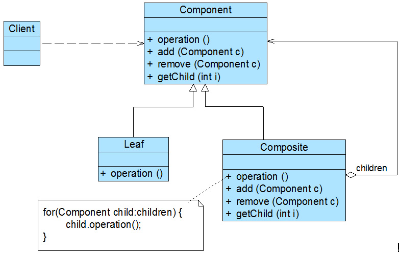

## 组合模式
树形结构在软件中随处可见，如何运用面向对象的方式来处理这种树形结构是组合模式需要解决的问题。

#### 1. 案例： 杀毒软件的框架结构
该杀毒软件既可以对某个文件夹(Folder)杀毒，也可以对某个指定的文件(File)进行杀毒，还可以根据各类文件的特点，为不同类型的文件提供不同的杀毒方式。
```java
// 杀毒的过程也是对文件夹目录树(文件夹、图像文件、文本文件)处理的过程

# 1. 叶子节点 （ImageFile、 TextFile）

//为了突出核心框架代码，我们对杀毒过程的实现进行了大量简化
import java.util.*;

// 图像文件类
class ImageFile {
	private String name;
 
	public ImageFile(String name) {
		this.name = name;
	}
 
	public void killVirus() {
		//简化代码，模拟杀毒
		System.out.println("----对图像文件'" + name + "'进行杀毒");
	}
}
 
// 文本文件类
class TextFile {
	private String name;
 
	public TextFile(String name) {
		this.name = name;
	}
 
	public void killVirus() {
		//简化代码，模拟杀毒
		System.out.println("----对文本文件'" + name + "'进行杀毒");
	}
}

# 2. 容器 （Container）

// 文件夹类
class Folder {
	private String name;
	
	//定义集合folderList，用于存储Folder类型的成员
	private ArrayList<Folder> folderList = new ArrayList<Folder>();
	//定义集合imageList，用于存储ImageFile类型的成员
	private ArrayList<ImageFile> imageList = new ArrayList<ImageFile>();
	//定义集合textList，用于存储TextFile类型的成员
	private ArrayList<TextFile> textList = new ArrayList<TextFile>();
	
	public Folder(String name) {
		this.name = name;
	}
	
	//增加新的Folder类型的成员
	public void addFolder(Folder f) {
		folderList.add(f);
	}
	
	//增加新的ImageFile类型的成员
	public void addImageFile(ImageFile image) {
		imageList.add(image);
	}
	
	//增加新的TextFile类型的成员
	public void addTextFile(TextFile text) {
		textList.add(text);
	}
		
	//需提供三个不同的方法removeFolder()、removeImageFile()和removeTextFile()来删除成员，代码省略
 
	//需提供三个不同的方法getChildFolder(int i)、getChildImageFile(int i)和getChildTextFile(int i)来获取成员，代码省略
 
	public void killVirus() {
		System.out.println("****对文件夹'" + name + "'进行杀毒");  //模拟杀毒
		
		//如果是Folder类型的成员，递归调用Folder的killVirus()方法
		for(Object obj : folderList) {
			((Folder)obj).killVirus();
		}
		
		//如果是ImageFile类型的成员，调用ImageFile的killVirus()方法
		for(Object obj : imageList) {
			((ImageFile)obj).killVirus();
		}
		
		//如果是TextFile类型的成员，调用TextFile的killVirus()方法
		for(Object obj : textList) {
			((TextFile)obj).killVirus();
		}
	} 
}

# 3. 主程序 （main）

class Client {
	public static void main(String args[]) {
		Folder folder1,folder2,folder3;
		folder1 = new Folder("Sunny的资料");
		folder2 = new Folder("图像文件");
		folder3 = new Folder("文本文件");
		
		ImageFile image1,image2;
		image1 = new ImageFile("小龙女.jpg");
		image2 = new ImageFile("张无忌.gif");
		
		TextFile text1,text2;
		text1 = new TextFile("九阴真经.txt");
		text2 = new TextFile("葵花宝典.doc");
		
		folder2.addImageFile(image1);
		folder2.addImageFile(image2);
		folder3.addTextFile(text1);
		folder3.addTextFile(text2);
		folder1.addFolder(folder2);
		folder1.addFolder(folder3);
		
		folder1.killVirus();
	}
}
```
分析：
```
(1) Folder 类的设计和实现都非常复杂，需要定义多个集合存储不同类型的成员，而且需要针对不同的成员
    提供增加、删除和获取等管理和访问成员的方法，存在大量的冗余代码，系统维护较为困难。
(2) 系统没有提供抽象层，因此必须却别对待充当容器的 Folder 和充当叶子的 ImageFile 和 TextFile。
(3) 系统的灵活性和可扩展性极差，增加新型叶子或容器类时，需要修改原有代码。
```

#### 2. 组合模式
组合模式为处理树形结构提供了一种较为完美的解决方案，它描述了如何将容器和叶子进行递归组合，使得用户在使用时无须对它们进行区分，可以一致地对待容器和叶子。 组合模式又可以称为 “整体—部分” (Part-Whole) 模式，它是一种对象结构型模式。

##### 2.1 特征
```
组合模式中引入了抽象构件类 Component，它是所有容器类和叶子类的公共父类，客户端针对 Component 进行编程。
```
<div align="center"></div>

##### 2.2 代码框架
```java
# 1. 抽象构件

abstract class Component {
	public abstract void add(Component c); //增加成员
	public abstract void remove(Component c); //删除成员
	public abstract Component getChild(int i); //获取成员
	public abstract void operation();  //业务方法
}

# 2. 叶子构件

class Leaf extends Component {
	public void add(Component c) { 
		//异常处理或错误提示 
	}	
		
	public void remove(Component c) { 
		//异常处理或错误提示 
	}
	
	public Component getChild(int i) { 
		//异常处理或错误提示
		return null; 
	}
	
	public void operation() {
		//叶子构件具体业务方法的实现
	} 
}

# 3. 容器构件

class Composite extends Component {
	private ArrayList<Component> list = new ArrayList<Component>();
	
	public void add(Component c) {
		list.add(c);
	}
	
	public void remove(Component c) {
		list.remove(c);
	}
	
	public Component getChild(int i) {
		return (Component)list.get(i);
	}
	
	public void operation() {
		//容器构件具体业务方法的实现
		//递归调用成员构件的业务方法
		for(Object obj:list) {
			((Component)obj).operation();
		}
	}
}
```

#### 3. 使用组合模式重构杀毒软件系统的框架
AbstractFile 充当抽象构件类，Folder 充当容器构件类，ImageFile、 TextFile 和 VideoFile 充当叶子构件类。
<div align="center"></div>

代码框架
```java
import java.util.*;

# 1. 抽象构件类

// 抽象文件类：抽象构件
abstract class AbstractFile {
	public abstract void add(AbstractFile file);
	public abstract void remove(AbstractFile file);
	public abstract AbstractFile getChild(int i);
	public abstract void killVirus();
}

# 2. 叶子构件类

// 图像文件类：叶子构件
class ImageFile extends AbstractFile {
	private String name;
	
	public ImageFile(String name) {
		this.name = name;
	}
	
	public void add(AbstractFile file) {
		System.out.println("对不起，不支持该方法！");
	}
	
	public void remove(AbstractFile file) {
		System.out.println("对不起，不支持该方法！");
	}
	
	public AbstractFile getChild(int i) {
		System.out.println("对不起，不支持该方法！");
		return null;
	}
	
	public void killVirus() {
		//模拟杀毒
		System.out.println("----对图像文件'" + name + "'进行杀毒");
	}
}

// 文本文件类：叶子构件
class TextFile extends AbstractFile {
	private String name;
	
	public TextFile(String name) {
		this.name = name;
	}
	
	public void add(AbstractFile file) {
		System.out.println("对不起，不支持该方法！");
	}
	
	public void remove(AbstractFile file) {
		System.out.println("对不起，不支持该方法！");
	}
	
	public AbstractFile getChild(int i) {
		System.out.println("对不起，不支持该方法！");
		return null;
	}
	
	public void killVirus() {
		//模拟杀毒
		System.out.println("----对文本文件'" + name + "'进行杀毒");
	}
}
 
// 视频文件类：叶子构件
class VideoFile extends AbstractFile {
	private String name;
	
	public VideoFile(String name) {
		this.name = name;
	}
	
	public void add(AbstractFile file) {
		System.out.println("对不起，不支持该方法！");
	}
	
	public void remove(AbstractFile file) {
		System.out.println("对不起，不支持该方法！");
	}
	
	public AbstractFile getChild(int i) {
		System.out.println("对不起，不支持该方法！");
		return null;
	}
	
	public void killVirus() {
		//模拟杀毒
		System.out.println("----对视频文件'" + name + "'进行杀毒");
	}
}

# 3. 容器构件类

// 文件夹类：容器构件
class Folder extends AbstractFile {
	//定义集合fileList，用于存储AbstractFile类型的成员
	private ArrayList<AbstractFile> fileList=new ArrayList<AbstractFile>();
	private String name;
		
	public Folder(String name) {
		this.name = name;
	}
	
	public void add(AbstractFile file) {
		fileList.add(file);	
	}
	
	public void remove(AbstractFile file) {
		fileList.remove(file);
	}
	
	public AbstractFile getChild(int i) {
		return (AbstractFile)fileList.get(i);
	}
	
	public void killVirus() {
		System.out.println("****对文件夹'" + name + "'进行杀毒");  //模拟杀毒
		
		//递归调用成员构件的killVirus()方法
		for(Object obj : fileList) {
			((AbstractFile)obj).killVirus();
		}
	}
}

# 4. 主程序 （main）

class Client {
	public static void main(String args[]) {
		//针对抽象构件编程
		AbstractFile file1,file2,file3,file4,file5,folder1,folder2,folder3,folder4;
		
		folder1 = new Folder("Sunny的资料");
		folder2 = new Folder("图像文件");
		folder3 = new Folder("文本文件");
		folder4 = new Folder("视频文件");
		
		file1 = new ImageFile("小龙女.jpg");
		file2 = new ImageFile("张无忌.gif");
		file3 = new TextFile("九阴真经.txt");
		file4 = new TextFile("葵花宝典.doc");
		file5 = new VideoFile("笑傲江湖.rmvb");
 
		folder2.add(file1);
		folder2.add(file2);
		folder3.add(file3);
		folder3.add(file4);
		folder4.add(file5);
		folder1.add(folder2);
		folder1.add(folder3);
		folder1.add(folder4);
		
		//从“Sunny的资料”节点开始进行杀毒操作
		folder1.killVirus();
	}
}
```

#### 4. 透明组合模式与安全组合模式
由于在 AbstractFile 中声明了大量用于管理和访问成员构件的方法，例如 add()、 remove() 等方法。
任一新增的文件类（叶子）都需要实现这些方法，提供对应的错误提示和异常处理，降低开发效率。

方案一： 将叶子的 add()、 remove() 等方法的实现代码移至 AbstractFile 类。
```java
// 提供默认实现的抽象构件类
abstract class AbstractFile {
	public void add(AbstractFile file) {
		System.out.println("对不起，不支持该方法！");
	}
	
	public void remove(AbstractFile file) {
		System.out.println("对不起，不支持该方法！");
	}
	
	public AbstractFile getChild(int i) {
		System.out.println("对不起，不支持该方法！");
		return null;
	}
	
	public abstract void killVirus();
}
```
方案二： 在抽象构件 AbstractFile 中不声明任何用于访问和管理成员构件的方法。
```java
abstract class AbstractFile {
	public abstract void killVirus();
}
```

##### 4.1 透明组合模式
透明组合模式中，抽象构件 Component 中声明了所有用于管理成员对象的方法，包括 add()、 remove() 以及 getChild() 等方法。
这样做的好处是确保所有的构件类都有相同的接口，在客户端看来，叶子对象与容器对象所提供的方法是一致的。
（透明组合模式也是组合模式的标准形式。）
<div align="center"></div>

特点：
```
透明组合模式的缺点是不够安全，叶子对象提供 add()、 remove() 以及 getChild() 等方法是没有意义的，
同时，如果调用这些方法可能会出错。
```

##### 4.2 安全组合模式
安全组合模式中，在抽象构件 Component 中没有声明任何用于管理成员对象的方法，而是在 Composite 类中声明并实现这些方法。
<div align="center"></div>

特点：
```
安全组合模式的缺点是不够透明，叶子构件和容器构件具有不同的方法，
容器构件中那些用于管理成员对象的方法没有在抽象构件类中定义，
因此客户端不能完全针对抽象编程，必须有区别地对待叶子构件和容器构件。
```

#### 5. 本模式优缺点
由于在软件开发中存在大量的树形结构，因此组合模式是一种使用频率较高的结构型设计模式。 组合模式为树形结构的面向对象实现提供了一种灵活的解决方案。
```
优：
▪ 清楚地定义分层次的复杂对象，客户端可以一致地使用容器和叶子（成员）。
▪ 在组合模式中增加新的容器构件和叶子构件都很方便，无须对现有类库进行任何修改，符合“开闭原则”。
缺：
▪ 有时候我们希望一个容器中只能有某些特定类型的对象，例如在某个文件夹中只能包含文本文件，
使用组合模式时，不能依赖类型系统来施加这些约束，只能通过在运行时进行类型检查来实现，这个实现过程较为复杂。
```
适用场景
```
▫ 在一个层次结构中需要忽略整体与部分的差异。
▫ 需要处理一个树形结构。
▫ 一个系统中能够分离出叶子对象和容器对象，系统的扩展性（添加新类型）需求较高时。
```
