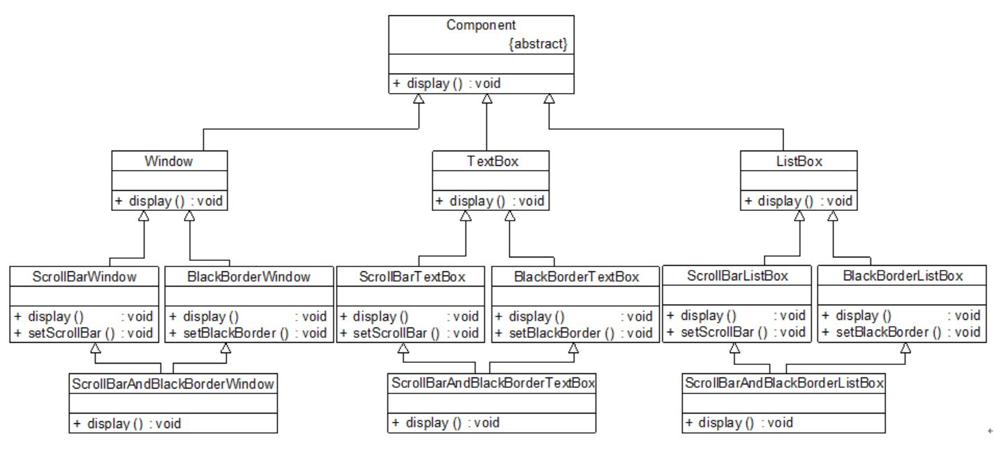
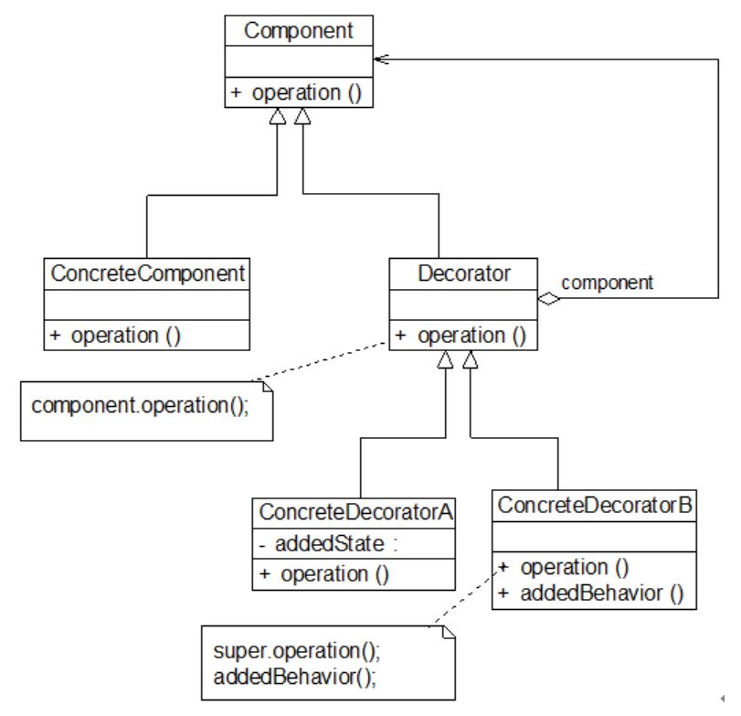
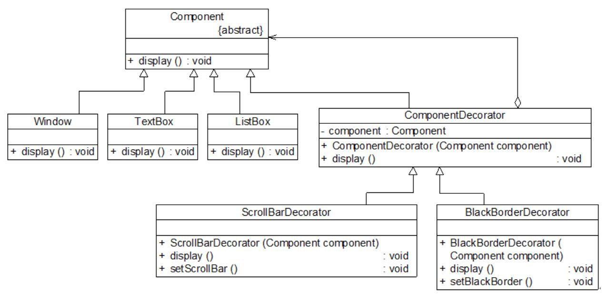
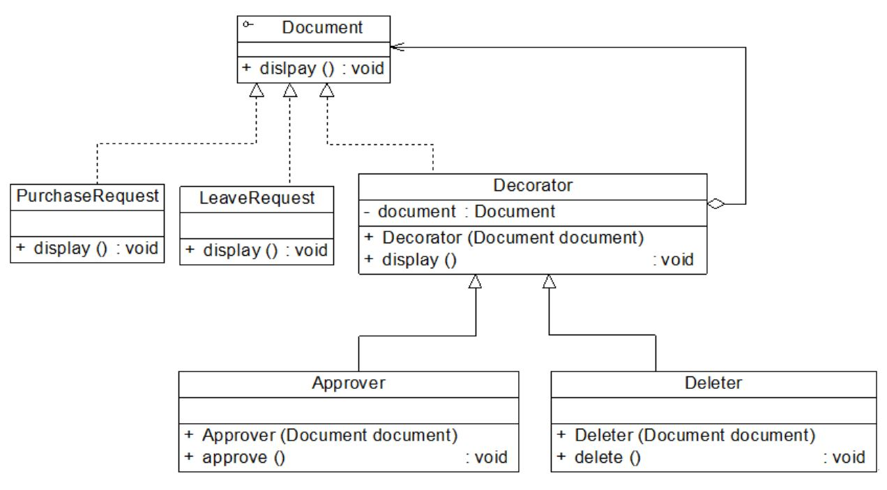

## 装饰模式
在软件设计中，有一种类似新房装修的技术可以对已有对象（新房）的功能进行扩展（装修），以获得更加符合用户需求的对象。

#### 1. 案例： 图形界面构件库
标准构件库提供了大量基本构件，如窗体、文本框、列表框等。由于在使用该构件库时，用户经常要求定制一些特效显示效果，如带滚动条的窗体、带黑色边框的文本框、既带滚动条又带黑色边框的列表框等等。
因此经常需要对该构件库进行扩展以增强其功能。
```
如何提高图形界面构件库的可扩展性（翻新/修改）并降低其维护成本成为必须面对的问题。
```
<div align="center"></div>

分析：
```
以上基于继承复用的方案，存在以下问题：
(1) 系统扩展麻烦，对于不支持多重类继承的编程语言，无法实现以上设计。
(2) 代码重复，相同功能在多个类的实现中重复出现。
(3) 类的数目庞大。
问题的根源：
    ▪ 复用机制的不合理。 （根据“合成复用原则”，在实现功能复用时，我们要多用关联，少用继承。）
```

#### 2. 装饰模式
在不改变一个对象本身功能的基础上给对象增加额外的新行为。 装饰模式是一种用于替代继承的技术。
<div align="center"></div>

##### 2.1 特征
```
装饰器模式的重要组成： 抽象构件类 + 抽象装饰器类 （抽象构件的子类！）
```

##### 2.2 代码框架
```java
# 1. 抽象装饰类定义 （抽象构件类的子类！）

class Decorator implements Component
{
       private Component component;  //维持一个对抽象构件对象的引用

       public Decorator(Component component)  //注入一个抽象构件类型的对象
       {
              this.component=component;
       }

       public void operation()  //实现抽象构件类的对外接口 （新）
       {
              component.operation();  //调用原有业务方法
       }
}

# 2. 具体装饰类

class ConcreteDecorator extends Decorator
{
       public ConcreteDecorator(Component component)
       {
              super(component);
       }

       public void operation()  //继承接口并扩展
       {
              super.operation();  //调用原有业务方法
              addedBehavior();  //调用新增业务方法
       }

       //新增业务方法
       public void addedBehavior()
       {
              ……
       }
}
```
思考
```
能否在装饰模式中找出两个独立变化的维度？
比较装饰模式和桥接模式的相同之处和不同之处？
```

#### 3. 使用装饰模式重构图形界面构件库
Component 充当抽象构件类，其子类 Window、 TextBox、 ListBox 充当具体构件类，Component 类的另一个子类 ComponentDecorator 充当抽象装饰类。
ComponentDecorator 的子类 ScrollBarDecorator 和 BlackBorderDecorator 充当具体装饰类。
<div align="center"></div>

代码框架：
```java
# 1. 抽象构件类

//抽象界面构件类：抽象构件类，为了突出与模式相关的核心代码，对原有控件代码进行了大量的简化
abstract class Component
{
       public abstract void display();
}

# 2. 抽象装饰类 （Component 的子类）

//构件装饰类：抽象装饰类
class ComponentDecorator extends Component
{
       private Component component;  //维持对抽象构件类型对象的引用

       public ComponentDecorator(Component component)  //注入抽象构件类型的对象
       {
              this.component = component;
       }

       public void display()  //Component的对外接口
       {
              component.display();
       }
}

# 3. 具体构件类

//窗体类：具体构件类
class Window extends Component
{
       public void display()
       {
              System.out.println("显示窗体！");
       }
}

//文本框类：具体构件类
class TextBox extends Component
{
       public void display()
       {
              System.out.println("显示文本框！");
       }
}

//列表框类：具体构件类
class ListBox extends Component
{
       public void display()
       {
              System.out.println("显示列表框！");
       }
}

# 4. 具体装饰类

//滚动条装饰类：具体装饰类
class ScrollBarDecorator extends ComponentDecorator
{
       public ScrollBarDecorator(Component  component)
       {
              super(component);
       }

       public void display()
       {
              this.setScrollBar();
              super.display();
       }

       public void setScrollBar()
       {
              System.out.println("为构件增加滚动条！");
       }
}

//黑色边框装饰类：具体装饰类
class BlackBorderDecorator extends ComponentDecorator
{
       public BlackBorderDecorator(Component component)
       {
              super(component);
       }

       public void display()
       {
              this.setBlackBorder();
              super.display();
       }

       public void setBlackBorder()
       {
              System.out.println("为构件增加黑色边框！");
       }
}

# 5. 主程序 （main）

class Client
{
       public static void main(String args[])
       {
              Component component,componentSB,componentBB; //使用抽象构件定义
              component = new Window(); //定义具体构件
              componentSB = new ScrollBarDecorator(component); //定义装饰后的构件
              componentBB = new BlackBorderDecorator(componentSB); //将装饰了一次之后的对象继续注入到另一个装饰类中，进行第二次装饰
              componentBB.display();
       }
}
```

#### 4. 透明装饰模式与半透明装饰模式
客户端希望单独调用具体装饰类新增的方法，而不想通过抽象构件中声明的方法来调用。

案例： 采购单 (PurchaseRequest) 和请假条 (LeaveRequest) 等文件对象都具有显示功能，现在要为其增加审批、删除等功能，使用装饰模式进行设计。
<div align="center"></div>

```java
# 1. 抽象装饰类

//抽象装饰类
class Decorator implements Document
{
      private Document document;

      public Decorator(Document document)
      {
             this.document = document;
      }

      public void display()
      {
             document.display();
      }
}

# 2. 具体装饰类

//具体装饰类
class Approver extends Decorator
{
      public Approver(Document document)
      {
             super(document);
             System.out.println("增加审批功能！");
      }

      public void approve()
      {
             System.out.println("审批文件！");
      }
}

# 3. 主程序 （main）

Document  doc; //使用抽象构件类型定义
doc = new PurchaseRequest();
Approver newDoc; //使用具体装饰类型定义
newDoc = new Approver(doc);
newDoc.display();//调用原有业务方法
newDoc.approve();//调用新增业务方法
```

##### 4.1 透明装饰模式
透明装饰模式中，要求客户端完全针对抽象编程。客户端程序不应该将对象声明为具体构件类型或具体装饰类型，而应该全部声明为抽象构件类型。
```java
Component  c, c1; //使用抽象构件类型定义对象
c = new ConcreteComponent()；
c1 = new ConcreteDecorator(c)；
```

##### 4.2 半透明装饰模式
对于客户端而言，具体构件类型无须关心，是透明的；但是具体装饰类型必须指定，这是不透明的。
```java
……
Document  doc; //使用抽象构件类型定义
doc = new PurchaseRequest();
Approver newDoc; //使用具体装饰类型定义
newDoc = new Approver(doc);
……
```
半透明模式的限制：
```
半透明模式下，不能实现对同一个对象的多次装饰，而且客户端需要有区别地对待装饰之前的对象和装饰之后的对象。
```

#### 5. 注意事项
```
▪ 尽量保持装饰类的接口与被装饰类的接口相同。 （即尽量使用透明装饰模式）
▪ 尽量保持具体构件类 ConcreteComponent 是一个 “轻” 类，多余行为置于装饰类。
▪ 如果只有一个具体构件类，那么抽象装饰类可以作为该具体构件类的直接子类 （此时无需定义抽象构件类）。
```

#### 6. 本模式优缺点
装饰模式降低了系统的耦合度，在职能维度进行动态增加或删除，实现两个维度（基础职能/扩展职能）的独立变化。
```
优：
▪ 对于扩展一个对象的功能，装饰模式比继承更加灵活性，不会导致类的个数急剧增加。
▪ 可以对一个对象进行多次装饰，并具有多种排列组合可选。
▪ 提供符合“开闭原则”的扩展功能。
缺：
▪ 使用装饰模式进行系统设计时将产生很多小对象，占用更多的系统资源，在一定程序上影响程序的性能。
▪ 比继承更加易于出错，排错也很困难，对于多次装饰的对象，调试时寻找错误可能需要逐级排查，较为繁琐。
```
适用场景
```
▫ 以动态、透明的方式给单个对象添加职责。
▫ 不能采用继承的情况下，进行扩展。
```
