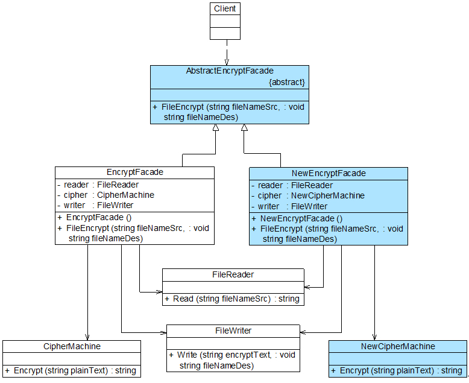

## 外观模式
外观模式是一种使用频率非常高的结构型设计模式，它通过引入一个外观角色来简化客户端与子系统之间的交互，为复杂的子系统调用提供一个统一的入口，降低子系统与客户端的耦合度。

#### 1. 案例： 门店服务
比较自己泡茶和去茶馆喝茶的区别。自己泡茶需要自行准备茶叶、茶具和开水，而去茶馆喝茶，最简单的方式就是跟茶馆服务员说想要一杯什么样的茶，是铁观音、碧螺春还是西湖龙井。

在软件开发中，有时一个客户类需要和多个业务类交互，而这些需要交互的业务类经常会作为一个整体出现。 可以考虑引入一个“服务员”，来避免繁琐的直接交互。

#### 2. 外观模式
在外观模式中，那些需要交互的业务类被称为子系统 (Subsystem)。如果没有外观类，那么每个客户类需要和多个子系统之间进行复杂的交互，系统的耦合度将很大。

##### 2.1 特征
```
外观模式又称为门面模式，它是一种对象结构型模式。 外观模式是“迪米特法则”的一种具体实现。
```
<div align="center"></div>

说明
```
(1) 在面向对象软件系统中，类与类之间的关系越多，不能表示系统设计得越好，
    反而表示系统中类之间的耦合度太大，这样的系统在维护和修改时都缺乏灵活性。
(2) 外观模式在一定程度上并不符合开闭原则，增加新的子系统需要对原有系统进行
    一定的修改，虽然这个修改工作量不大。
```

##### 2.2 代码框架
```java
# 1. 子系统 （它可以是一个类、一个功能模块、系统的一个组成部分或者一个完整的系统）

class SubSystemA
{
    public void MethodA()
    {
        //业务实现代码
    }
}
 
class SubSystemB
{
    public void MethodB()
    {
        //业务实现代码
     }
}
 
class SubSystemC
{
    public void MethodC()
    {
        //业务实现代码
    }
}

# 2. 外观类 （客户端与子系统业务类之间的交互统一）

class Facade
{
    private SubSystemA obj1 = new SubSystemA();
    private SubSystemB obj2 = new SubSystemB();
    private SubSystemC obj3 = new SubSystemC();
 
    public void Method()
    {
        obj1.MethodA();
        obj2.MethodB();
        obj3.MethodC();
    }
}

# 3. 主程序 （main）

class Program
{
    static void Main(string[] args)
    {
        Facade facade = new Facade();
        facade.Method();
    }
}
```

#### 3. 案例2： 文件加密模块
文件加密具体的流程包括三个部分，分别是读取源文件、加密、保存加密之后的文件。 其中，三个操作相对独立，为了实现代码的独立重用，让设计更符合单一职责原则，这三个操作的业务代码封装在三个不同的类中。
<div align="center"></div>

代码框架
```java
# 1. 子系统

// FileReader.cs
using System;
using System.Text;
using System.IO;
 
namespace FacadeSample
{
    class FileReader
    {
        public string Read(string fileNameSrc) 
        {
            Console.Write("读取文件，获取明文：");
            FileStream fs = null;
            StringBuilder sb = new StringBuilder();
            try
            {
                fs = new FileStream(fileNameSrc, FileMode.Open);
                int data;
                while((data = fs.ReadByte())!= -1) 
                {
                    sb = sb.Append((char)data);
                }
                fs.Close();
                Console.WriteLine(sb.ToString());
            }
            catch(FileNotFoundException e) 
            {
                Console.WriteLine("文件不存在！");
            }
            catch(IOException e) 
            {
                Console.WriteLine("文件操作错误！");
            }
            return sb.ToString();
        }
    }
}

// CipherMachine.cs
using System;
using System.Text;
 
namespace FacadeSample
{
    class CipherMachine
    {
       public string Encrypt(string plainText) 
       {
            Console.Write("数据加密，将明文转换为密文：");
            string es = "";
            char[] chars = plainText.ToCharArray();
            foreach(char ch in chars) 
            {
                string c = (ch % 7).ToString();
                es += c;
            }
            Console.WriteLine(es);
            return es;
       }
    }
}

// FileWriter.cs
using System;
using System.IO;
using System.Text;
 
namespace FacadeSample
{
    class FileWriter
    {
        public void Write(string encryptStr,string fileNameDes) 
        {
            Console.WriteLine("保存密文，写入文件。");
            FileStream fs = null;
            try
            {
                fs = new FileStream(fileNameDes, FileMode.Create);
                byte[] str = Encoding.Default.GetBytes(encryptStr);
                fs.Write(str,0,str.Length);
                fs.Flush();
                fs.Close();
            }	
            catch(FileNotFoundException e) 
            {
                Console.WriteLine("文件不存在！");
            }
            catch(IOException e) 
            {
                Console.WriteLine(e.Message);
                Console.WriteLine("文件操作错误！");
            }		
        }
    }
}

# 2. 外观类

// EncryptFacade.cs
namespace FacadeSample
{
    class EncryptFacade
    {
        //维持对其他对象的引用
        private FileReader reader;
        private CipherMachine cipher;
        private FileWriter writer;
 
        public EncryptFacade()
        {
            reader = new FileReader();
            cipher = new CipherMachine();
            writer = new FileWriter();
        }
 
        //调用其他对象的业务方法
        public void FileEncrypt(string fileNameSrc, string fileNameDes)
        {
            string plainStr = reader.Read(fileNameSrc);
            string encryptStr = cipher.Encrypt(plainStr);
            writer.Write(encryptStr, fileNameDes);
        }
    }
}

# 3. 主程序 （main）

// Program.cs
using System;
 
namespace FacadeSample
{
    class Program
    {
        static void Main(string[] args)
        {
            EncryptFacade ef = new EncryptFacade();
            ef.FileEncrypt("src.txt", "des.txt");
            Console.Read();
        }
    }
}
```

#### 4. 抽象外观类
标准的外观模式设计，如果需要增加、删除或更换与外观类交互的子系统类，必须修改外观类或客户端的源代码，这将违背“开闭原则”。
引入抽象外观类之后，客户端可以针对抽象外观类进行编程，对于新的业务需求，不需要修改原有外观类，增加新的具体外观类完成任务。

案例： 使用抽象外观类重构文件加密模块
<div align="center"></div>

代码框架
```java
# 1. 抽象外观类

namespace FacadeSample
{
    abstract class AbstractEncryptFacade
    {
        public abstract void FileEncrypt(string fileNameSrc, string fileNameDes);
    }
}

# 2. 具体外观类

namespace FacadeSample
{
    class NewEncryptFacade : AbstractEncryptFacade
    {
        private FileReader reader;
        private NewCipherMachine cipher;
        private FileWriter writer;
 
        public NewEncryptFacade()
        {
            reader = new FileReader();
            cipher = new NewCipherMachine();
            writer = new FileWriter();
        }
 
        public override void FileEncrypt(string fileNameSrc, string fileNameDes)
        {
            string plainStr = reader.Read(fileNameSrc);
            string encryptStr = cipher.Encrypt(plainStr);
            writer.Write(encryptStr, fileNameDes);
        }
    }
}

# 3. 主程序 （main）

using System;
using System.Configuration;
using System.Reflection;
 
namespace FacadeSample
{
    class Program
    {
        static void Main(string[] args)
        {
            AbstractEncryptFacade ef; //针对抽象外观类编程
            //读取配置文件
            string facadeString = ConfigurationManager.AppSettings["facade"];
            //反射生成对象
            ef = (AbstractEncryptFacade)Assembly.Load("FacadeSample"). CreateInstance (facadeString);
            ef.FileEncrypt("src.txt", "des.txt");
            Console.Read();
        }
    }
}
```

#### 5. 本模式优缺点
外观模式并不给系统增加任何新功能。几乎所有的软件中都能够找到外观模式的应用，如绝大多数B/S系统都有一个首页或者导航页面，大部分C/S系统都提供了菜单或者工具栏，在这里，首页和导航页面就是B/S系统的外观角色，而菜单和工具栏就是C/S系统的外观角色。
```
优：
▪ 对客户端屏蔽子系统组件。
▪ 实现子系统与客户端之间的松耦合。 （前后端分离）
缺：
▪ 如果设计不当，违背开闭原则。
```
适用场景
```
▫ 所有涉及到与多个业务对象交互的场景都可以考虑使用外观模式进行重构。
▫ 在层次化结构中，可以使用外观模式定义系统中每一层的入口，层与层之间不直接产生联系，
  而通过外观类建立联系，降低层之间的耦合度。
```
