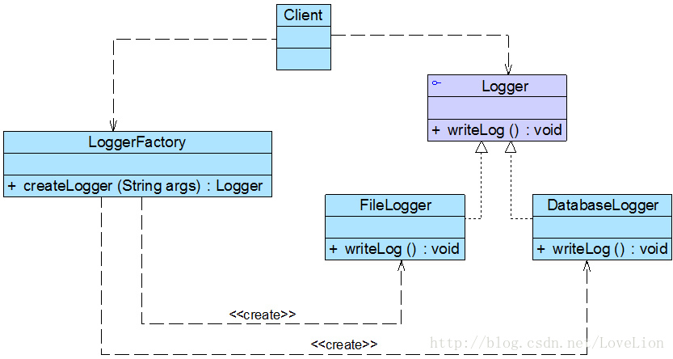

## 工厂方法模式
当系统中需要引入新产品时，（简单工厂模式）必定要修改工厂类的静态工厂方法，将违背 “开闭原则”。 工厂方法模式应运而生。

#### 1. 案例： 日志记录器 （logger）
记录器可以通过多种途径保存系统的运行日志，如通过文件记录或数据库记录。如何封装不同记录器的复杂初始化过程并保证多种记录器切换的灵活性。
<div align="center"></div>

```java
//日志记录器工厂
class LoggerFactory {
    //静态工厂方法
	public static Logger createLogger(String args) {
		if(args.equalsIgnoreCase("db")) {
			//连接数据库，代码省略
			//创建数据库日志记录器对象
			Logger logger = new DatabaseLogger(); 
			//初始化数据库日志记录器，代码省略
			return logger;
		}
		else if(args.equalsIgnoreCase("file")) {
			//创建日志文件
			//创建文件日志记录器对象
			Logger logger = new FileLogger(); 
			//初始化文件日志记录器，代码省略
			return logger;			
		}
		else {
			return null;
		}
	}
}
```

分析：
```
1. 工厂类过于庞大，包含了大量的 if…else… 代码，导致维护和测试难度增大。
2. 扩展不灵活，如果增加新类型的日志记录器，必须修改静态工厂方法的业务逻辑，违反了“开闭原则”。
```

#### 2. 解决思路： 工厂方法模式
不再提供一个统一的工厂类来创建所有的产品对象，而是针对不同的产品提供不同的工厂。 提供一个与产品等级结构对应的工厂等级结构。
```
工厂方法模式提供一个抽象工厂接口来声明抽象工厂方法，然后针对不同的产品定义不同的具体工厂类。
```

##### 2.1 特征
```
定义一个用于创建对象的接口，工厂方法模式让一个类的实例化延迟到其子类。 而客户端针对抽象工厂编程。
```
核心： 抽象工厂接口 （声明一个抽象工厂方法，即：改 static 为抽象）
<div align="center"></div>

##### 2.2 代码框架
工厂方法模式最重要的区别是引入了抽象工厂角色，抽象工厂可以是接口，也可以是抽象类或者具体类。
```java
# 1. 抽象工厂定义

interface Factory {
    public Product factoryMethod();
}

# 2. 具体工厂定义

class ConcreteFactory implements Factory {
    public Product factoryMethod() {
        return new ConcreteProduct();
    }
}

# 3. 主程序 （main）

……
Factory factory;
factory = new ConcreteFactory(); //可通过配置文件实现
Product product;
product = factory.factoryMethod();
……
```

#### 3. 重构
Logger 接口充当抽象产品， LoggerFactory 接口充当抽象工厂。 （依赖倒转原则 - 要针对接口编程。）
<div align="center"></div>

代码框架：
```java
# 1. 抽象产品类定义

//日志记录器接口：抽象产品
interface Logger {
	public void writeLog();
}

# 2. 具体产品类定义

//数据库日志记录器：具体产品
class DatabaseLogger implements Logger {
	public void writeLog() {
		System.out.println("数据库日志记录。");
	}
}
 
//文件日志记录器：具体产品
class FileLogger implements Logger {
	public void writeLog() {
		System.out.println("文件日志记录。");
	}
}

# 3. 抽象工厂类定义

//日志记录器工厂接口：抽象工厂
interface LoggerFactory {
	public Logger createLogger();
}

# 4. 具体工厂类定义

//数据库日志记录器工厂类：具体工厂
class DatabaseLoggerFactory implements LoggerFactory {
	public Logger createLogger() {
			//连接数据库，代码省略
			//创建数据库日志记录器对象
			Logger logger = new DatabaseLogger(); 
			//初始化数据库日志记录器，代码省略
			return logger;
	}	
}
 
//文件日志记录器工厂类：具体工厂
class FileLoggerFactory implements LoggerFactory {
	public Logger createLogger() {
            //创建文件日志记录器对象
			Logger logger = new FileLogger(); 
			//创建文件，代码省略
			return logger;
	}	
}

# 5. 主程序 （main）

class Client {
	public static void main(String args[]) {
		LoggerFactory factory;
		Logger logger;
		factory = new FileLoggerFactory(); //可引入配置文件实现
		logger = factory.createLogger();
		logger.writeLog();
	}
}
```

#### 4. 进一步改进 （以满足开闭原则）
当前存在的问题：
```
    更换新的日志记录方式，需要修改客户端代码 factory = new FileLoggerFactory()。
```
解决方案：
```
配置文件 + 配置文件工具类 + Java 的反射机制，根据类名字符串生成对象。
```
将配置参数存储在 XML 或 properties 格式的配置文件中，如下 config.xml 所示。
```java
<!— config.xml -->
<?xml version="1.0"?>
<config>
	<className>FileLoggerFactory</className>
</config>
```
Java 反射 (Java Reflection)
```java
   //通过类名生成实例对象并将其返回
   Class c = Class.forName("String");
   Object obj = c.newInstance();
   return obj;
```

##### 客户端代码重构
```java
# 1. 配置文件工具类 XMLUtil

/工具类XMLUtil.java
import javax.xml.parsers.*;
import org.w3c.dom.*;
import org.xml.sax.SAXException;
import java.io.*;
 
public class XMLUtil {
//该方法用于从XML配置文件中提取具体类类名，并返回一个实例对象
	public static Object getBean() {
		try {
			//创建DOM文档对象
			DocumentBuilderFactory dFactory = DocumentBuilderFactory.newInstance();
			DocumentBuilder builder = dFactory.newDocumentBuilder();
			Document doc;							
			doc = builder.parse(new File("config.xml")); 
		
			//获取包含类名的文本节点
			NodeList nl = doc.getElementsByTagName("className");
			Node classNode=nl.item(0).getFirstChild();
			String cName=classNode.getNodeValue();
			
			//通过类名生成实例对象并将其返回
			Class c=Class.forName(cName);
			Object obj=c.newInstance();
			return obj;
		}
		catch(Exception e) {
		        e.printStackTrace();
		        return null;
		}
	}
}

# 2. 主程序 （main）

class Client {
	public static void main(String args[]) {
		LoggerFactory factory;
		Logger logger;
		factory = (LoggerFactory)XMLUtil.getBean(); //getBean()的返回类型为Object，需要进行强制类型转换
		logger = factory.createLogger();
		logger.writeLog();
	}
}
```

#### 5. 思考 （没有绝对完美的方案）
```
有人说：可以在客户端代码中直接通过反射机制来生成产品对象，在定义产品对象时使用抽象类型，同样可以确保系统的灵活性和可扩展性，
      增加新的具体产品类无须修改源代码，只需要将其作为抽象产品类的子类再修改配置文件即可，根本不需要抽象工厂类和具体工厂类。

试思考这种做法的可行性？ 如果可行，这种做法是否存在问题？为什么？
(工厂方法中，除了创建对象，还有具体的初始化代码块。)
```

#### 6. 变形形式
##### 6.1 重载的工厂方法 (引入重载方法)
```java
在抽象工厂中定义多个重载的工厂方法，在具体工厂中实现了这些工厂方法，这些方法可以包含不同的业务逻辑，
以满足对不同产品对象的需求。

# 1. 包含重载方法的抽象工厂类

interface LoggerFactory {
	public Logger createLogger();
	public Logger createLogger(String args);
	public Logger createLogger(Object obj);
}

# 2. 包含重载方法的具体工厂类

class DatabaseLoggerFactory implements LoggerFactory {
	public Logger createLogger() {
			//使用默认方式连接数据库，代码省略
			Logger logger = new DatabaseLogger(); 
			//初始化数据库日志记录器，代码省略
			return logger;
	}
 
	public Logger createLogger(String args) {
			//使用参数args作为连接字符串来连接数据库，代码省略
			Logger logger = new DatabaseLogger(); 
			//初始化数据库日志记录器，代码省略
			return logger;
	}	
 
	public Logger createLogger(Object obj) {
			//使用封装在参数obj中的连接字符串来连接数据库，代码省略
			Logger logger = new DatabaseLogger(); 
			//使用封装在参数obj中的数据来初始化数据库日志记录器，代码省略
			return logger;
	}	
}
 
//其他具体工厂类代码省略
```
##### 6.2 将工厂方法隐藏
通过将业务方法的调用移入工厂类，可以直接使用工厂对象来调用产品对象的业务方法。
<div align="center"></div>

```
为了进一步简化客户端的使用，还可以对客户端隐藏工厂方法，此时，在工厂类中将直接调用产品类的业务方法。
（客户端无须显示调用工厂方法创建产品。）

# 1. 包含业务方法的抽象工厂

//改为抽象类
abstract class LoggerFactory {
    //在工厂类中直接调用日志记录器类的业务方法writeLog()
	public void writeLog() {
		Logger logger = this.createLogger();
		logger.writeLog();
	}
	
	public abstract Logger createLogger();	
}

# 2. 主程序 （main）

class Client {
	public static void main(String args[]) {
		LoggerFactory factory;
		factory = (LoggerFactory)XMLUtil.getBean();
		factory.writeLog(); //直接使用工厂对象来调用产品对象的业务方法
	}
}
```

#### 7. 本模式优缺点
工厂方法模式是简单工厂模式的延伸。工厂方法模式是使用频率最高的设计模式之一，是很多开源框架和 API 类库的核心模式。
```
优：
▪ 隐藏了具体产品类细节，甚至无须知道具体产品类的类名，只需关心产品对应的工厂类型。
▪ （产品与工厂都有多态性）工厂方法模式之所以又被称为多态工厂模式，就正是因为所有的具体工厂类都具有同一抽象父类。
▪ 扩展性好。当加入新产品时，只要添加一个具体工厂和具体产品，完全符合“开闭原则”。
缺：
▪ 添加新产品时，需要同时添加具体产品类与对应工厂类，类的个数将成对增加，增加了系统的复杂度。
▪ 引入抽象层，客户端代码中均使用抽象层进行定义，增加了系统的抽象性和理解难度。
▪ 还需要用到 DOM、反射等技术，增加了系统的实现难度。
```
适用场景
```
客户端不能永久/长期确定它所需要的对象的类。
```
