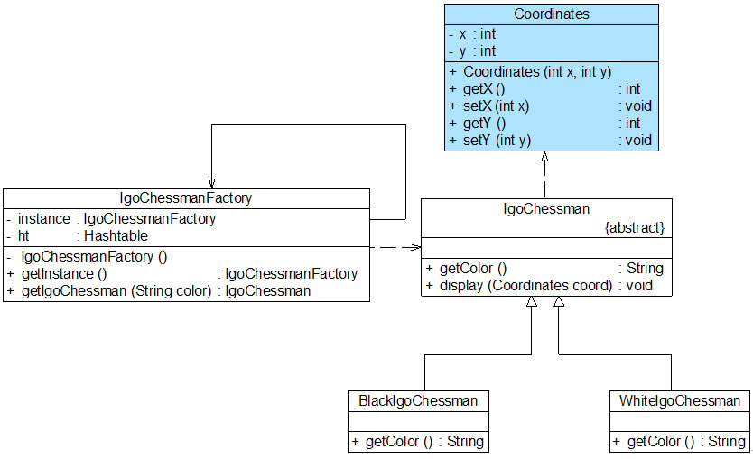
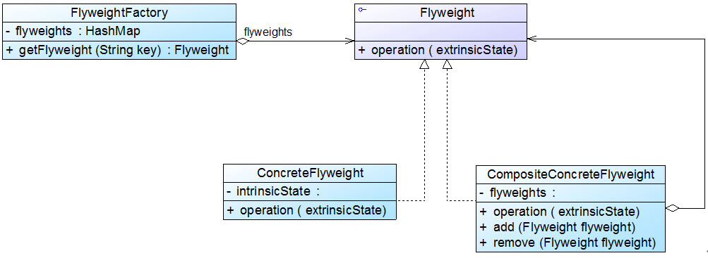

## 享元模式
当一个软件系统在运行时产生的对象数量太多，将导致运行代价过高，带来系统性能下降等问题。

```
享元对象能做到共享的关键是区分了 内部状态 (Intrinsic State) 和 外部状态 (Extrinsic State)。
 (1) 内部状态是存储在享元对象内部并且不会随环境改变而改变的状态，内部状态可以共享。
 (2) 外部状态是随环境改变而改变的、不可以共享的状态。 （通过注入函数Setter注入）
```

#### 1. 享元模式
享元模式结构较为复杂，一般结合工厂模式一起使用。 (享元工厂类的作用在于提供一个用于存储享元对象的享元池，
当用户需要对象时，首先从享元池中获取，否则，在享元池中添加新对象并返回。)
<div align="center"></div>

代码框架
```java
# 1. 享元工厂 （简单工厂模式）

class FlyweightFactory {
       //定义一个HashMap用于存储享元对象，实现享元池
       private HashMap flyweights = newHashMap();

       public Flyweight getFlyweight(String key){
              //如果对象存在，则直接从享元池获取
              if(flyweights.containsKey(key)){
                     return(Flyweight)flyweights.get(key);
              }
              //如果对象不存在，先创建一个新的对象添加到享元池中，然后返回
              else {
                     Flyweight fw = newConcreteFlyweight();
                     flyweights.put(key,fw);
                     return fw;
              }
       }
}

# 2. 享元类 （内部状态成员 + 外部状态注入函数）

class Flyweight {
       //内部状态intrinsicState作为成员变量，同一个享元对象其内部状态是一致的
       private String intrinsicState;

       public Flyweight(String intrinsicState) {
              this.intrinsicState = intrinsicState;
       }

        //外部状态extrinsicState在使用时由外部设置，不保存在享元对象中，
        //即使是同一个对象，在每一次调用时也可以传入不同的外部状态 （注入函数）
       public void operation(String extrinsicState) {
              ......
       }     
}
```

#### 2. 案例： 围棋游戏设计
IgoChessman 充当抽象享元类， BlackIgoChessman 和 WhiteIgoChessman 充当具体享元类， IgoChessmanFactory 充当享元工厂类。
<div align="center"></div>

代码框架
```java
# 1. 抽象享元定义

import java.util.*;
// 围棋棋子类：抽象享元类
abstract class IgoChessman {
	public abstract String getColor();
 
	public void display() {
		System.out.println("棋子颜色：" + this.getColor());	
	}
}

# 2. 具体享元定义

// 黑色棋子类：具体享元类
class BlackIgoChessman extends IgoChessman {
	public String getColor() {
		return "黑色";
	}	
}
 
// 白色棋子类：具体享元类
class WhiteIgoChessman extends IgoChessman {
	public String getColor() {
		return "白色";
	}
}

# 3. 享元工厂

// 围棋棋子工厂类：享元工厂类，使用单例模式进行设计
class IgoChessmanFactory {
	private static IgoChessmanFactory instance = new IgoChessmanFactory();
	private static Hashtable ht; //使用Hashtable来存储享元对象，充当享元池
	
	private IgoChessmanFactory() {
		ht = new Hashtable();
		IgoChessman black,white;
		black = new BlackIgoChessman();
		ht.put("b",black);
		white = new WhiteIgoChessman();
		ht.put("w",white);
	}
	
	//返回享元工厂类的唯一实例
	public static IgoChessmanFactory getInstance() {
		return instance;
	}
	
	//通过key来获取存储在Hashtable中的享元对象
	public static IgoChessman getIgoChessman(String color) {
		return (IgoChessman)ht.get(color);	
	}
}

# 4. 主程序 （main）

class Client {
	public static void main(String args[]) {
		IgoChessman black1,black2,black3,white1,white2;
		IgoChessmanFactory factory;
        
		//获取享元工厂对象
		factory = IgoChessmanFactory.getInstance();
 
		//通过享元工厂获取三颗黑子
		black1 = factory.getIgoChessman("b");
		black2 = factory.getIgoChessman("b");
		black3 = factory.getIgoChessman("b");
		System.out.println("判断两颗黑子是否相同：" + (black1==black2));
 
		//通过享元工厂获取两颗白子
		white1 = factory.getIgoChessman("w");
		white2 = factory.getIgoChessman("w");
		System.out.println("判断两颗白子是否相同：" + (white1==white2));
 
		//显示棋子
		black1.display();
		black2.display();
		black3.display();
		white1.display();
		white2.display();
	}
}
```

#### 3. 带外部状态的解决方案
将棋子的位置定义为棋子的一个外部状态，增加了一个新的类 Coordinates（坐标/状态类）。 抽象享元类 IgoChessman 中的 display() 方法也将对应增加一个 Coordinates 类型的参数，用于外部状态注入。
<div align="center"></div>

代码框架
```java
# 1. 外部状态类

// 坐标类：外部状态类
class Coordinates {
	private int x;
	private int y;
	
	public Coordinates(int x,int y) {
		this.x = x;
		this.y = y;
	}
	
	public int getX() {
		return this.x;
	}
	
	public void setX(int x) {
		this.x = x;
	}
	
	public int getY() {
		return this.y;
	}
	
	public void setY(int y) {
		this.y = y;
	}
} 

# 2. 抽象享元

// 围棋棋子类：抽象享元类
abstract class IgoChessman {
	public abstract String getColor();
	
	public void display(Coordinates coord){  // 注入外部状态
		System.out.println("棋子颜色：" + this.getColor() + "，棋子位置：" + coord.getX() + "，" + coord.getY() );	
	}
}

# 3. 主程序 （main）

class Client {
	public static void main(String args[]) {
		IgoChessman black1,black2,black3,white1,white2;
		IgoChessmanFactory factory;
        
		//获取享元工厂对象
		factory = IgoChessmanFactory.getInstance();
 
		//通过享元工厂获取三颗黑子
		black1 = factory.getIgoChessman("b");
		black2 = factory.getIgoChessman("b");
		black3 = factory.getIgoChessman("b");
		System.out.println("判断两颗黑子是否相同：" + (black1==black2));
 
		//通过享元工厂获取两颗白子
		white1 = factory.getIgoChessman("w");
		white2 = factory.getIgoChessman("w");
		System.out.println("判断两颗白子是否相同：" + (white1==white2));
 
		//显示棋子，同时设置棋子的坐标位置 （外部状态注入）
		black1.display(new Coordinates(1,2));
		black2.display(new Coordinates(3,4));
		black3.display(new Coordinates(1,3));
		white1.display(new Coordinates(2,5));
		white2.display(new Coordinates(2,4));
	}
}
```

#### 4. 单纯享元模式和复合享元模式
标准的享元模式结构图中既包含可以共享的具体享元类，也包含不可以共享的非共享具体享元类。

##### 4.1 单纯享元模式
所有的具体享元类都是可以共享的，不存在非共享具体享元类。
<div align="center"></div>

##### 4.2 复合享元模式
将一些单纯享元对象使用组合模式（composite pattern）加以组合，还可以形成复合享元对象。 (复合享元对象本身不能共享，但是它们可以分解成单纯享元对象，而后者则可以共享。)
<div align="center"></div>

#### 5. 关于享元模式的几点补充

##### 5.1 与其他模式的联用
```
几种常见的联用方式:
▪ 享元模式中的享元工厂类，提供一个静态的工厂方法用于返回享元对象。 （简单工厂模式）
▪ 通常只有唯一一个享元工厂。 （单例模式进行享元工厂类的设计）
▪ 享元模式可以结合组合模式形成复合享元模式，统一对多个享元对象设置外部状态。 （composite patter）
```

##### 5.2 享元模式与 String 类
JDK 类库中的 String 类使用了享元模式。

#### 6. 本模式优缺点
当系统中存在大量相同或者相似的对象时，享元模式是一种较好的解决方案。 相比其他结构型设计模式，享元模式的使用频率并不算太高。
```
优：
▪ 可以极大减少内存中对象的数量，节约系统资源，提高系统性能。
▪ 提供一种共享实现方案。
缺：
▪ 系统逻辑复杂，需要分离出内部状态和外部状态。
▪ 享元对象的部分状态外部化，读取外部状态将使得运行时间变长。
```
适用场景
```
▫ 大量相同或者相似的对象，造成内存的大量耗费。
▫ 对象部分状态外部化。
▫ 使用享元模式时需要维护一个存储享元对象的享元池，在需要多次（大量）重复使用享元对象时才值得使用享元模式。
```
