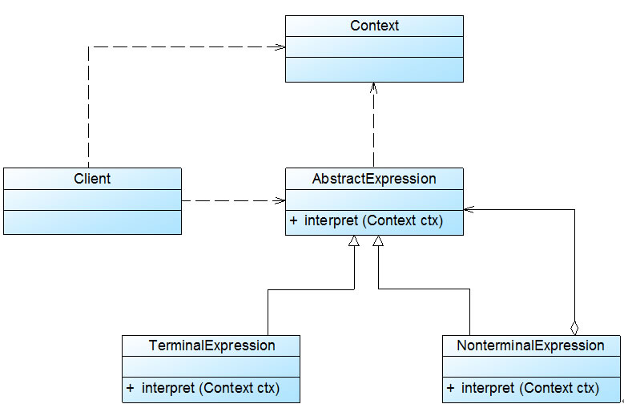
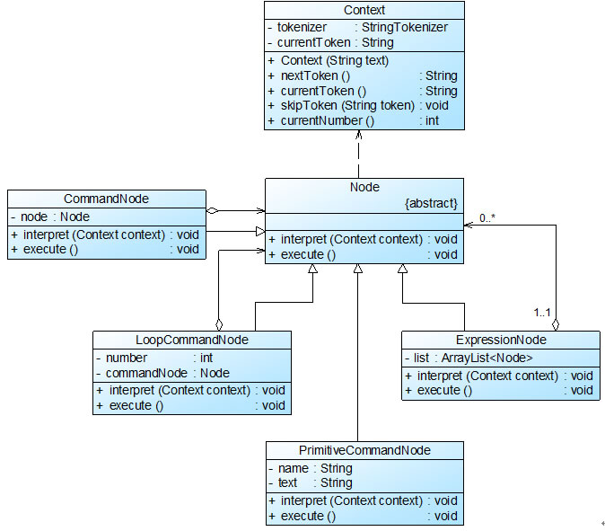

## 解释器模式
C++、 Java 和 C# 等语言无法直接解释类似 “1+ 2 + 3 – 4 + 1” 这样的字符串（如果直接作为数值表达式时可以解释），
此时，必须自己定义一套文法规则来实现对这些语句的解释，即设计一个\*\*自定义语言\*\*。

在实际开发中，这些简单的自定义语言可以基于现有的编程语言来设计，如果所基于的编程语言是面向对象语言，此时可以使用解释器模式来实现自定义语言。

#### 1. 案例： 机器人控制程序
某玩具公司希望开发一套机器人控制程序，在该机器人控制程序中包含一些简单的英文控制指令，每一个指令对应一个表达式 (expression)，
该表达式可以是简单表达式也可以是复合表达式，每一个简单表达式由移动方向 (direction)，移动方式 (action) 和移动距离 (distance) 三部分组成。

例如： “down  run 10 and left move 20” - “向下快速移动10个单位再向左移动20个单位”

##### 1.1 文法规则
用形式化语言来表示该简单语言的文法规则如下：
```
expression ::= direction action distance | composite    //表达式
composite ::= expression 'and' expression               //复合表达式
direction ::= 'up' | 'down' | 'left' | 'right'          //移动方向
action ::= 'move' | 'run'                               //移动方式
distance ::= an integer                                 //移动距离
```
上述语言一共定义了五条文法规则，分为两类：
* 终结符（也称为终结符表达式），例如 direction、 action 和 distance，它们是语言的最小组成单位，不能再进行拆分。
* 非终结符（也称为非终结符表达式），例如 expression 和 composite，它们都是一个完整的句子，包含一系列终结符或非终结符。

#### 2. 文法规则和抽象语法树
为实现对语句的解释，可以使用解释器模式，在解释器模式中每一个文法规则都将对应一个类，扩展、改变文法以及增加新的文法规则都很方便。
```
在文法规则定义中，可以使用一些符号来表示不同的含义，
    如使用 “|” 表示或，
    使用 “{” 和 “}” 表示组合，
    使用 “*” 表示出现0次或多次，
    使用 “::=” 表示“定义为”的意思。
```

除了可以使用文法规则来定义一个语言，在解释器模式中还可以通过一种称之为抽象语法树 (Abstract Syntax Tree, AST) 的图形方式来直观地表示语言的构成，每一棵抽象语法树对应一个语言实例。

例如： 语句 “1 + 2 + 3 - 4 + 1” 的抽象语法树
<div align="center"></div>
在抽象语法树中，终结符表达式类的实例作为树的叶子节点，而非终结符表达式类的实例作为非叶子节点。

#### 3. 解释器模式

##### 3.1 特征
```
解释器模式是一种使用频率相对较低但学习难度较大的设计模式，
它用于描述如何使用面向对象语言构成一个简单的语言解释器。
```
什么是一门语言？
```
在某些情况下，为了更好地**描述**某一些特定类型的问题，我们创建一种新的语言。
    一种语言拥有自己的**表达式**和**结构**，即文法规则。
```

##### 3.2 代码框架
```
解释器模式的结构与组合模式的结构有些类似。 （树）
```
<div align="center"></div>

```
Context （环境类）： 环境类又称为上下文类，它用于存储解释器之外的一些全局信息，
                  通常它临时存储了需要解释的语句。
```

代码框架
```java
# 1. 抽象表达式类 （终结符与非终结符的公共父类）

abstract class AbstractExpression {
       public  abstract void interpret(Context ctx);
}

# 2. 终结符表达式

class TerminalExpression extends  AbstractExpression {
       public  void interpret(Context ctx) {
              //终结符表达式的解释操作
       }
}

# 3. 非终结符表达式 (以二叉树为例)

class NonterminalExpression extends  AbstractExpression {
       private  AbstractExpression left;
       private  AbstractExpression right;

       public  NonterminalExpression(AbstractExpression left,AbstractExpression right) {
              this.left=left;
              this.right=right;
       }

       public void interpret(Context ctx) {
              //递归调用每一个组成部分的interpret()方法
              //在递归调用时指定组成部分的连接方式，即非终结符的功能
       }     
}

# 4. 环境/上下文类

class Context {
     private HashMap map = new HashMap();

     public void assign(String key, String value) {
         //往环境类中设值
     }

     public String lookup(String key) {
         //获取存储在环境类中的值
     }
}
```

#### 4. 使用解释器模式实现机器人控制程序
AbstractNode 充当抽象表达式角色，DirectionNode、 ActionNode 和 DistanceNode 充当终结符表达式角色，AndNode 和 SentenceNode 充当非终结符表达式角色。
<div align="center"></div>

代码框架：
```java
# 1. 抽象表达式

//抽象表达式
abstract class AbstractNode {
	public abstract String interpret();
}

# 2. 终结符表达式

//方向解释：终结符表达式
class DirectionNode extends AbstractNode {
	private String direction;
	
	public DirectionNode(String direction) {
		this.direction = direction;
	}
	
	//方向表达式的解释操作
	public String interpret() {
		if (direction.equalsIgnoreCase("up")) {
			return "向上";
		}
		else if (direction.equalsIgnoreCase("down")) {
			return "向下";
		}
		else if (direction.equalsIgnoreCase("left")) {
			return "向左";
		}
		else if (direction.equalsIgnoreCase("right")) {
			return "向右";
		}
		else {
			return "无效指令";
		}
	}
}
 
//动作解释：终结符表达式
class ActionNode extends AbstractNode {
	private String action;
	
	public ActionNode(String action) {
		this.action = action;
	}
	
	//动作（移动方式）表达式的解释操作
	public String interpret() {
		if (action.equalsIgnoreCase("move")) {
			return "移动";
		}
		else if (action.equalsIgnoreCase("run")) {
			return "快速移动";
		}
		else {
			return "无效指令";
		}
	}
}
 
//距离解释：终结符表达式
class DistanceNode extends AbstractNode {
	private String distance;
	
	public DistanceNode(String distance) {
		this.distance = distance;
	}
	
	//距离表达式的解释操作
	public String interpret() {
		return this.distance;
	}	
}

# 3. 非终结符表达式

//And解释：非终结符表达式
class AndNode extends AbstractNode {
	private AbstractNode left; //And的左表达式
	private AbstractNode right; //And的右表达式
 
	public AndNode(AbstractNode left, AbstractNode right) {
		this.left = left;
		this.right = right;
	}
    
	//And表达式解释操作
	public String interpret() {
		return left.interpret() + "再" + right.interpret();
	}
}
 
//简单句子解释：非终结符表达式
class SentenceNode extends AbstractNode {
	private AbstractNode direction;
	private AbstractNode action;
	private AbstractNode distance;
 
	public SentenceNode(AbstractNode direction,AbstractNode action,AbstractNode distance) {
		this.direction = direction;
		this.action = action;
		this.distance = distance;
	}
    
	//简单句子的解释操作
	public String interpret() {
		return direction.interpret() + action.interpret() + distance.interpret();
	}	
}

# 4. 指令处理类 （指令解析： 一条字符串语句 -> 一棵语法树）
    **解释器模式仅仅介绍了文法规则的表示形式，指令的处理类（解释翻译过程）也很重要**

//指令处理类：工具类
class InstructionHandler {
	private String instruction;
	private AbstractNode node;
    
	public void handle(String instruction) {
		AbstractNode left = null, right = null;
		AbstractNode direction = null, action = null, distance = null;
		Stack stack = new Stack();  //声明一个栈对象用于存储抽象语法树
		String[] words = instruction.split(" ");  //以空格分隔指令字符串
		//语句切分后解析	
		for (int i = 0; i < words.length; i++) {
			//本实例采用栈的方式来处理指令，如果遇到“and”，则将其后的三个单词作为三个终结符表达式连成一个简单句子SentenceNode作为“and”的右表达式，
			//而将从栈顶弹出的表达式作为“and”的左表达式，最后将新的“and”表达式压入栈中。
			if (words[i].equalsIgnoreCase("and")) {
				left = (AbstractNode)stack.pop();  //弹出栈顶表达式作为左表达式
				String word1= words[++i];
				direction = new DirectionNode(word1);
				String word2 = words[++i];
				action = new ActionNode(word2);
				String word3 = words[++i];
				distance = new DistanceNode(word3);
				right = new SentenceNode(direction,action,distance); //右表达式
				stack.push(new AndNode(left,right)); //将新表达式压入栈中
			}
			//如果是从头开始进行解释，则将前三个单词组成一个简单句子SentenceNode并将该句子压入栈中
			else {
				String word1 = words[i];
				direction = new DirectionNode(word1);
				String word2 = words[++i];
				action = new ActionNode(word2);
				String word3 = words[++i];
				distance = new DistanceNode(word3);
				left = new SentenceNode(direction,action,distance);
				stack.push(left); //将新表达式压入栈中
			}
		}
		this.node = (AbstractNode)stack.pop(); //将全部表达式从栈中弹出
	}
	
	public String output() {
		String result = node.interpret(); //解释表达式
		return result;
	}
}

# 5. 主程序 （main）

class Client {
	public static void main(String args[]) {
		String instruction = "up move 5 and down run 10 and left move 5";
		InstructionHandler handler = new InstructionHandler();
		handler.handle(instruction);
		String outString;
		outString = handler.output();
		System.out.println(outString);
	}
}
```

#### 5. 谈谈 Context 的作用
环境类 Context 用于存储解释器之外的一些全局信息，它通常作为参数被传递到所有表达式的解释方法 interpret() 中，
可以在 Context 对象中存储和访问表达式解释器的状态，向表达式解释器提供一些全局的、公共的数据，此外还可以在 Context 中增加一些所有表达式解释器都共有的功能，减轻解释器的职责。

案例：
```
expression ::= command*                                //表达式，一个表达式包含多条命令
command ::= loop | primitive                           //语句命令
loop ::= 'loop number' expression 'end'                //循环命令，其中number为自然数
primitive ::= 'printstring' | 'space' | 'break'        //基本命令，其中string为字符串
```

<div align="center"></div>

代码框架
```java
# 1. 环境角色

//环境类：用于存储和操作需要解释的语句，
//在本实例中每一个需要解释的单词可以称为一个动作标记(Action Token)或命令。
class Context {
	private StringTokenizer tokenizer; //StringTokenizer类，用于将字符串分解为更小的字符串标记(Token)，默认情况下以空格作为分隔符
	private String currentToken; //当前字符串标记
	
	public Context(String text) {
		tokenizer = new StringTokenizer(text); //通过传入的指令字符串创建StringTokenizer对象
		nextToken();
	}
	
	//返回下一个标记
	public String nextToken() {
		if (tokenizer.hasMoreTokens()) {
			currentToken = tokenizer.nextToken();
		}
		else {
			currentToken = null;
		}
		return currentToken;
	}
	
	//返回当前的标记
	public String currentToken() {
		return currentToken;
	}
	
	//跳过一个标记
	public void skipToken(String token) {
		if (!token.equals(currentToken)) {
			System.err.println("错误提示：" + currentToken + "解释错误！");
			}
		nextToken();
	}
	
	//如果当前的标记是一个数字，则返回对应的数值
	public int currentNumber() {
		int number = 0;
		try{
			number = Integer.parseInt(currentToken); //将字符串转换为整数
		}
		catch(NumberFormatException e) {
			System.err.println("错误提示：" + e);
		}
		return number;
	}
}

# 2. 抽象表达式

//抽象节点类：抽象表达式
abstract class Node {
	public abstract void interpret(Context text); //声明一个方法用于解释语句
	public abstract void execute(); //声明一个方法用于执行标记对应的命令
}

# 3. 非终结符

//表达式节点类：非终结符表达式
class ExpressionNode extends Node {
	private ArrayList<Node> list = new ArrayList<Node>(); //定义一个集合用于存储多条命令
	
	public void interpret(Context context) {
		//循环处理Context中的标记
		while (true){
			//如果已经没有任何标记，则退出解释
			if (context.currentToken() == null) {
				break;
			}
			//如果标记为END，则不解释END并结束本次解释过程，可以继续之后的解释
			else if (context.currentToken().equals("END")) {
				context.skipToken("END");
				break;
			}
			//如果为其他标记，则解释标记并将其加入命令集合
			else {
				Node commandNode = new CommandNode();
				commandNode.interpret(context);
				list.add(commandNode);
			}
		}
	}
	
	//循环执行命令集合中的每一条命令
	public void execute() {
		Iterator iterator = list.iterator();
		while (iterator.hasNext()){
			((Node)iterator.next()).execute();
		}
	}
}
 
//语句命令节点类：非终结符表达式
class CommandNode extends Node {
	private Node node;
	
	public void interpret(Context context) {
		//处理LOOP循环命令
		if (context.currentToken().equals("LOOP")) {
			node = new LoopCommandNode();
			node.interpret(context);
		}
		//处理其他基本命令
		else {
			node = new PrimitiveCommandNode();
			node.interpret(context);
		}
	}
	
	public void execute() {
		node.execute();
	}
}
 
//循环命令节点类：非终结符表达式
class LoopCommandNode extends Node {
	private int number; //循环次数
	private Node commandNode; //循环语句中的表达式
	
	//解释循环命令
	public void interpret(Context context) {
		context.skipToken("LOOP");
		number = context.currentNumber();
		context.nextToken();
		commandNode = new ExpressionNode(); //循环语句中的表达式
		commandNode.interpret(context);
	}
	
	public void execute() {
		for (int i=0;i<number;i++)
			commandNode.execute();
	}
}

# 4. 终结符

//基本命令节点类：终结符表达式
class PrimitiveCommandNode extends Node {
	private String name;
	private String text;
	
	//解释基本命令
	public void interpret(Context context) {
		name = context.currentToken();
		context.skipToken(name);
		if (!name.equals("PRINT") && !name.equals("BREAK") && !name.equals ("SPACE")){
			System.err.println("非法命令！");
		}
		if (name.equals("PRINT")){
			text = context.currentToken();
			context.nextToken();
		}
	}
	
	public void execute(){
		if (name.equals("PRINT"))
			System.out.print(text);
		else if (name.equals("SPACE"))
			System.out.print(" ");
		else if (name.equals("BREAK"))
			System.out.println();
	}
}

# 5. 主程序 （main）

class Client{
	public static void main(String[] args){
		String text = "LOOP 2 PRINT 杨过 SPACE SPACE PRINT 小龙女 BREAK END PRINT 郭靖 SPACE SPACE PRINT 黄蓉";
		Context context = new Context(text);
			
		Node node = new ExpressionNode();
		node.interpret(context);
		node.execute();
	}
}
```
说明
```
在本实例代码中，环境类 Context 类似一个工具类，它提供了用于处理指令的方法，如 nextToken()、 currentToken()、 skipToken() 等，
同时它存储了需要解释的指令并记录了每一次解释的当前标记 (Token)，而具体的解释过程交给表达式解释器类来处理。
```

#### 6. 本模式优缺点
解释器模式的使用频率不是特别高，但在正则表达式、XML文档解释等领域还是得到了广泛使用。 与解释器模式类似，目前还诞生了很多基于抽象语法树的源代码处理工具，例如 Eclipse 中的 Eclipse AST，它可以用于表示 Java 语言的语法结构，用户可以通过扩展其功能，创建自己的文法规则。
```
优：
▪ 易于改变和扩展文法。
缺：
▪ 对于复杂文法难以维护。
▪ 执行效率较低，代码的调试过程也比较麻烦。
```
适用场景
```
对于一些重复出现的问题可以用一种简单的语言来进行表达。（文法较为简单，不强调执行效率。）
```
