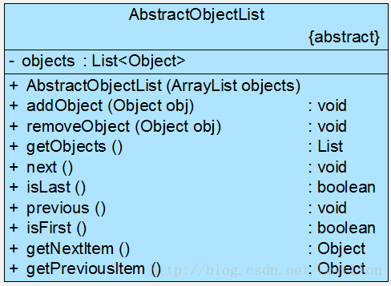
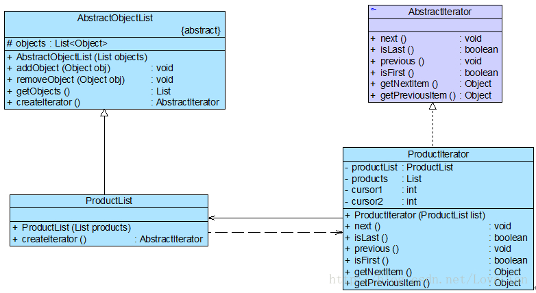

## 迭代器模式
遍历聚合对象中的元素。 （意义：更加方便地操作聚合对象，同时可以灵活地为聚合对象增加不同的遍历方法。）
迭代器别名为游标 (Cursor)。

#### 1. 案例： 销售管理系统的数据遍历
一套销售管理系统，经常需要对系统中的商品数据、客户数据等进行遍历。 （数据遍历、遍历代码的复用问题由此产生。） 开发人员设计了一个抽象的数据集合类 AbstractObjectList，
将其他的具体数据存储类作为其子类。
<div align="center"></div>

此方案存在的问题：
```
1. addObject()、removeObject()等方法用于管理数据，而next()、isLast()、previous()、isFirst()等方法用于遍历数据。
   存储管理与遍历职责结合，职责过重，违反“单一职责原则”。
2. 此处将抽象聚合类声明为了一个接口，同时该接口又包含了太多的方法（存储相关、遍历相关），违反“接口隔离原则”。
3. 遍历操作由子类实现，必然导致暴露 AbstractObjectList 的内部存储细节，向子类公开自己的私有属性。
```

#### 2. 迭代器模式

##### 2.1 关注点
聚合对象

##### 2.2 聚合对象的两个职责
* 存储（聚合）
* 遍历

从依赖性分析，存储是聚合对象的基本职责；遍历既是可变化的，又是可分离的。

##### 2.3 迭代器模式
迭代器模式结构中包含聚合和迭代器两个层次结构，考虑到灵活性和可扩展性，在迭代器模式中应用了工厂方法模式。
<div align="center"></div>

代码框架
```java
# 1. 迭代器接口

interface Iterator {
	public void first(); //将游标指向第一个元素
	public void next(); //将游标指向下一个元素
	public boolean hasNext(); //判断是否存在下一个元素
	public Object currentItem(); //获取游标指向的当前元素
}
说明： 适合使用抽象类来设计抽象迭代器，即每一个方法都提供一个空的默认实现。
（1.充分满足各种遍历操作的接口需求（声明的接口数量足够）；
 2.不能同时包含太多方法的实现代码，子类的实现代码简短易读。）

# 2. 具体迭代器

class ConcreteIterator implements Iterator {
	private ConcreteAggregate objects; //维持一个对具体聚合对象的引用，以便于访问存储在聚合对象中的数据
	private int cursor; //定义一个游标，用于记录当前访问位置
	
	public ConcreteIterator(ConcreteAggregate objects) {
		this.objects=objects;
	}
 
	public void first() {  ......  }
		
	public void next() {  ......  }
 
	public boolean hasNext() {  ......  }
	
	public Object currentItem() {  ......  }
}

# 3. 聚合类

interface Aggregate {
	Iterator createIterator();
}

# 4. 具体聚合类

class ConcreteAggregate implements Aggregate {	
	......	
	public Iterator createIterator() {
		return new ConcreteIterator(this);
	}
	......
}
```
思考：
```
具体聚合类与具体迭代器类之间存在的依赖关系.
```

#### 3. 使用迭代器模式重构销售管理系统
将 AbstractObjectList 类重构为抽象聚合类，添加 AbstractIterator 抽象迭代器类。ProductList 充当具体聚合类，ProductIterator 充当具体迭代器。
<div align="center"></div>

代码框架
```java
# 1. 抽象迭代器

//抽象迭代器
interface AbstractIterator {
	public void next(); //移至下一个元素
	public boolean isLast(); //判断是否为最后一个元素
	public void previous(); //移至上一个元素
	public boolean isFirst(); //判断是否为第一个元素
	public Object getNextItem(); //获取下一个元素
	public Object getPreviousItem(); //获取上一个元素
}

# 2. 抽象聚合类

//抽象聚合类
abstract class AbstractObjectList {
	protected List<Object> objects = new ArrayList<Object>();  //存储
 
	public AbstractObjectList(List objects) {
		this.objects = objects;
	}
	
	public void addObject(Object obj) {
		this.objects.add(obj);
	}
	
	public void removeObject(Object obj) {
		this.objects.remove(obj);
	}
	
	public List getObjects() {
		return this.objects;
	}
	
	//声明创建迭代器对象的抽象工厂方法
	public abstract AbstractIterator createIterator();
}

# 3. 具体聚合类

//商品数据类：具体聚合类
class ProductList extends AbstractObjectList {
	public ProductList(List products) {
		super(products);
	}
	
	//实现创建迭代器对象的具体工厂方法
	public AbstractIterator createIterator() {
		return new ProductIterator(this);
	}
} 

# 4. 具体迭代器

//商品迭代器：具体迭代器
class ProductIterator implements AbstractIterator {
	private ProductList productList;  //**聚合对象**
	private List products;  //**聚合对象的集合对象**
	private int cursor1; //定义一个游标，用于记录正向遍历的位置
	private int cursor2; //定义一个游标，用于记录逆向遍历的位置
	
	public ProductIterator(ProductList list) {
		this.productList = list;
		this.products = list.getObjects(); //获取集合对象
		cursor1 = 0; //设置正向遍历游标的初始值
		cursor2 = products.size() -1; //设置逆向遍历游标的初始值
	}
	
	public void next() {
		if(cursor1 < products.size()) {
			cursor1++;
		}
	}
	
	public boolean isLast() {
		return (cursor1 == products.size());
	}
	
	public void previous() {
		if (cursor2 > -1) {
			cursor2--;
		}
	}
	
	public boolean isFirst() {
		return (cursor2 == -1);
	}
	
	public Object getNextItem() {
		return products.get(cursor1);
	} 
		
	public Object getPreviousItem() {
		return products.get(cursor2);
	} 	
}

# 5. 主程序 （main）

class Client {
	public static void main(String args[]) {
		List products = new ArrayList();
		products.add("倚天剑");
		products.add("屠龙刀");
		products.add("断肠草");
		products.add("葵花宝典");
		products.add("四十二章经");
			
		AbstractObjectList list;
		AbstractIterator iterator;
		
		list = new ProductList(products); //创建聚合对象
		iterator = list.createIterator();	//创建迭代器对象
		
		System.out.println("正向遍历：");	
		while(!iterator.isLast()) {
			System.out.print(iterator.getNextItem() + "，");
			iterator.next();
		}
		System.out.println("-----------------------------");
		System.out.println("逆向遍历：");
		while(!iterator.isFirst()) {
			System.out.print(iterator.getPreviousItem() + "，");
			iterator.previous();
		}
	}
}
```

#### 4. 通过内部类(或者friend)机制来实现迭代器
具体迭代器类和具体聚合类之间存在双重关系。（1.聚合类包含迭代器类的工厂方法；2.迭代器包含聚合对象的引用--以访问聚合对象的存储。）

* 使用 inner class 机制实现迭代器
```java
# 1. 抽象聚合类

public abstract class AbstractList<E> extends AbstractCollection<E> implements List<E> {
	......
	private class Itr implements Iterator<E> {
		int cursor = 0;
		......
	}
	......
}

# 2. 具体聚合类

//商品数据类：具体聚合类
class ProductList extends AbstractObjectList {
	public ProductList(List products) {
		super(products);
	}
	
	public AbstractIterator createIterator() {
		return new ProductIterator();
	}
	
	//商品迭代器：具体迭代器，内部类实现
	private class ProductIterator implements AbstractIterator {
		private int cursor1;
		private int cursor2;
		
		public ProductIterator() {
			cursor1 = 0;
			cursor2 = objects.size() -1;
		}
		
		public void next() {
			if(cursor1 < objects.size()) {
				cursor1++;
			}
		}
		
		public boolean isLast() {
			return (cursor1 == objects.size());
		}
		
		public void previous() {
			if(cursor2 > -1) {
				cursor2--;
			}
		}
		
		public boolean isFirst() {
			return (cursor2 == -1);
		}
		
		public Object getNextItem() {
			return objects.get(cursor1);
		} 
			
		public Object getPreviousItem() {
			return objects.get(cursor2);
		} 	
	}
}
```

#### 5. JDK 内置迭代器
为了让开发人员更加方便地操作聚合对象，在 Java、 C# 等编程语言中都提供了内置迭代器。

常用的 List 和 Set 等聚合类都继承（或实现）了 java.util.Collection 接口，在 Collection 接口中声明了如下方法（部分代码）：
```java
# 抽象聚合类

public interface Collection<E> extends Iterable<E> {
    ……
    boolean add(Object c);
    boolean addAll(Collection c);
    boolean remove(Object o);
    boolean removeAll(Collection c);
    boolean remainAll(Collection c); 
    Iterator iterator();
    ……
}

# 抽象迭代器

public interface Iterator<E> {
    boolean hasNext();
    E next();
    void remove();
}
```
在 JDK 中，Collection 接口和 Iterator 接口充当了迭代器模式的抽象层。

#### 6. 本模式优缺点
迭代器模式是一种使用频率非常高的设计模式。 （聚合对象一定存在遍历需求。） 很多编程语言的类库都已经实现了迭代器模式，通常我们只需要直接使用 Java、 C# 等语言已定义好的迭代器即可。
```
优：
▪ 支持不同的遍历方式。（使用新的迭代器类型替换原有迭代器） “开闭原则”
▪ 使聚合类的职责更单一。 “单一职责原则”
缺：
▪ 增加新的聚合类需要对应增加新的迭代器类。
▪ 抽象迭代器的设计难度大，在自定义迭代器时，创建一个考虑全面的抽象迭代器并不是件容易的事情。
```
适用场景
```
▫ 涉及聚合对象的访问。
▫ 为聚合对象提供多种遍历方式。
```
