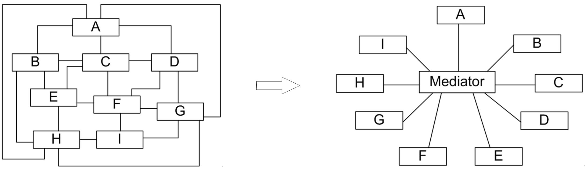

## 中介者模式
通常用户与用户之间存在多对多的联系，因此系统中用户之间的关系非常复杂。通过引入群的机制，将极大减少系统中用户之间的两两通信。（“迪米特法则”）
```
全连接模式 -> 中转站模式（电话运营商的接线员）
```

#### 1. 案例： 客户信息管理
客户信息管理系统中，一般存在列表和详情显示。当我们删除一个客户时，列表栏中的信息要及时删除更新，详情栏中的信息也需要及时删除更新。
由此，组件之间具有了多对多的联系，组件间的连接方式/交互过程需要考虑。

例如： 全连接模式交互的方式/过程如下所示
<div align="center"></div>

代码框架
```java
# 1. 按钮

//按钮类
class Button {
	private List list;
	private ComboBox cb;
	private TextBox tb;
	......
 
	//界面组件的交互
	public void change() {
		list.update();
		cb.update();
		tb.update();
	}
 
	public void update() {
		......
	}
	......
}

# 2. 列表栏

//列表框类
class List {
	private ComboBox cb;
	private TextBox tb;
	......
 
	//界面组件的交互
	public void change() {
		cb.update();
		tb.update();
	}
 
	public void update() {
		......
	}
	......	
}

# 3. 详情栏

//组合框类
class ComboBox {
	private List list;
	private TextBox tb;
	......
 
	//界面组件的交互
	public void change() {
		list.update();
		tb.update();
	}
 
	public void update() {
		......
	}
	......	
}

# 4. 文本栏（控制台）

//文本框类
class TextBox {
	public void update() {
		......
	}
	......	
}
```
问题分析
```
1. 系统结构复杂且耦合度高。  （结构-包含 has a）
2. 代码可重用性差。
3. 可扩展性差。
```

#### 2. 中介者模式
如果一个系统中多个部分之间连接成网状结构，系统的描述/梳理将非常复杂。这个系统就是一个过度耦合的系统，这些相互联系的对象又称为\*\*同事对象\*\*。
当引入中介者对象，系统的网状结构将变成以中介者为中心的星形结构（以中介者为节点的树形结构）。
<div align="center"></div>

##### 2.1 特点
```
中介者模式将复杂的连接/交互逻辑集中封装在一个中介者对象之中。 （中心化-去中心化； 集中式-分布式）
```

##### 2.2 框架
中介者模式通常会提供抽象中介者。
<div align="center"></div>

在中介者模式中，中介者类承担了两方面的职责:
* 中转作用（结构性） - 由直接相连的路径变为间接相连的最短路径。（由 has a 变为 has a channel）
* 协调作用（行为性） - 同事们可以一致的和中介者进行交互，中介者根据封装在自身内部的协调逻辑，对同事的请求进行进一步处理。

代码框架
```java
# 1. 抽象中介者

abstract class Mediator {
	protected ArrayList<Colleague> colleagues; //用于存储同事对象
 
	//注册方法，用于增加同事对象
	public void register(Colleague colleague) {
		colleagues.add(colleague);
	}
 
	//声明抽象的业务方法
	public abstract void operation();
}

# 2. 具体中介者

class ConcreteMediator extends Mediator {
	//实现业务方法，封装同事之间的调用
	public void operation() {
		......
		((Colleague)(colleagues.get(0))).method1(); //通过中介者调用同事类的方法
		......
	}
}

# 3. 抽象同事 
（切记每个同事是要关联一个经理的！
 1. 自身方法(Self-Method) - 自身行为
 2. 依赖方法(Depend-Method) - 请求节点转接）

abstract class Colleague {
	protected Mediator mediator; //维持一个抽象中介者的引用 （自己的经理）
	
	public Colleague(Mediator mediator) {
		this.mediator=mediator;
	}
	
	public abstract void method1(); //声明自身方法，处理自己的行为
	
	//定义依赖方法，与中介者进行通信
	public void method2() {
		mediator.operation();
	}
}

# 4. 具体同事

class ConcreteColleague extends Colleague {
	public ConcreteColleague(Mediator mediator) {
		super(mediator);
	}
	
	//实现自身方法
	public void method1() {
		......
	}
}
```
思考
```
1. 职场中，中介者模式对新人/老人的吸引力各如何？（解决问题的可能性（渠道）与执行效率的较量）
2. 上层组织架构者与行动人的较量。（中心化的清晰思路-去中心化后的管制难）
```

#### 3. 使用中介者模式重构客户信息管理
Component 充当抽象同事类，Button、 List、 ComboBox 和 TextBox 充当具体同事类，Mediator 充当抽象中介者类，ConcreteMediator 充当具体中介者类，ConcreteMediator 维持了对具体同事类的引用。
<div align="center"></div>

代码框架
```java
# 1. 抽象中介者

//抽象中介者
abstract class Mediator {
	public abstract void componentChanged(Component c);
}

# 2. 具体中介者

//具体中介者
class ConcreteMediator extends Mediator {
	//维持对各个同事对象的引用
	public Button addButton;
	public List list;
	public TextBox userNameTextBox;
	public ComboBox cb;
 
	//封装同事对象之间的交互
	public void componentChanged(Component c) {
		//单击按钮
		if(c == addButton) {
			System.out.println("--单击增加按钮--");
			list.update();
			cb.update();
			userNameTextBox.update();
		}
		//从列表框选择客户
		else if(c == list) {
			System.out.println("--从列表框选择客户--");
			cb.select();
			userNameTextBox.setText();
		}
		//从组合框选择客户
		else if(c == cb) {
			System.out.println("--从组合框选择客户--");
			cb.select();
			userNameTextBox.setText();
		}
	}
}

# 3. 抽象同事

//抽象组件类：抽象同事类
abstract class Component {
	protected Mediator mediator;//中介者引用
	
	public void setMediator(Mediator mediator) {
		this.mediator = mediator;
	}
 
	//转发调用
	public void changed() {
		mediator.componentChanged(this);
	}
	
	public abstract void update();	
}

# 4. 具体同事


//按钮类：具体同事类
class Button extends Component {
	public void update() {
		//按钮不产生交互
	}
}
 
//列表框类：具体同事类
class List extends Component {
	public void update() {
		System.out.println("列表框增加一项：张无忌。");
	}
	
	public void select() {
		System.out.println("列表框选中项：小龙女。");
	}
}
 
//组合框类：具体同事类
class ComboBox extends Component {
	public void update() {
		System.out.println("组合框增加一项：张无忌。");
	}
	
	public void select() {
		System.out.println("组合框选中项：小龙女。");
	}
}
 
//文本框类：具体同事类
class TextBox extends Component {
	public void update() {
		System.out.println("客户信息增加成功后文本框清空。");
	}
	
	public void setText() {
		System.out.println("文本框显示：小龙女。");
	}
}

# 5. 主程序 （main）

class Client {
	public static void main(String args[]) {
		//定义中介者对象
		ConcreteMediator mediator;
		mediator = new ConcreteMediator();
		
		//定义同事对象
		Button addBT = new Button();
		List list = new List();
		ComboBox cb = new ComboBox();
		TextBox userNameTB = new TextBox();
 
		//中介者与同事们双向关联
		addBT.setMediator(mediator);
		list.setMediator(mediator);
		cb.setMediator(mediator);
		userNameTB.setMediator(mediator);
 
		mediator.addButton = addBT;
		mediator.list = list;
		mediator.cb = cb;
		mediator.userNameTextBox = userNameTB;
		
		//works
		addBT.changed();
		System.out.println("-----------------------------");
		list.changed();
	}
}
```
说明
```
在本实例中不同的组件类（即不同的同事类）所拥有的方法并不完全相同，
因此中介者类没有针对抽象同事类编程。
```

#### 4. 中介者与同事类的扩展
当我们的窗口组件发生变更时，系统需要对应的变更。（比如增加一个 label 组件）两种变更方案如下：
##### 方案1： 修改代码
增加一个界面组件类 Label，修改原有的具体中介者类 ConcreteMediator，增加一个对 Label 对象的引用，然后修改 componentChanged() 方法的业务处理代码，另外更新客户端代码。
##### 方案2： 开闭原则
增加一个 Label 类，但不修改原有具体中介者类 ConcreteMediator 的代码，增加一个 ConcreteMediator 的子类 SubConcreteMediator 来实现对 Label 对象的引用，在新增的中介者类 SubConcreteMediator 中通过覆盖 componentChanged() 方法来更新业务逻辑，同时更新客户端代码。

#### 5. 本模式优缺点
中介者模式将一个网状的系统结构变成一个以中介者对象为中心的星形结构。
```
优：
▪ 简化了同事之间的连接/交互管理。
▪ 将各同事对象解耦。
缺：
▪ 中介者内部包含了大量的同事间交互细节，导致具体中介者类非常复杂。
```
适用场景
```
▫ 多个对象（同事）之间出现了复杂的引用关系，导致系统结构混乱。
```
