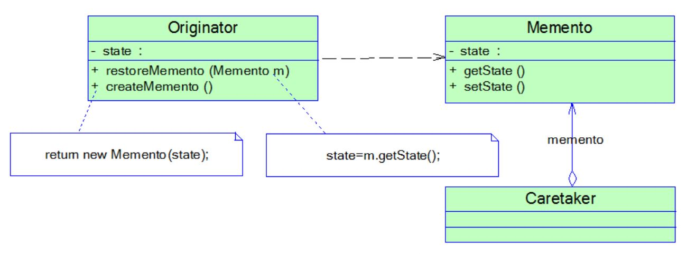
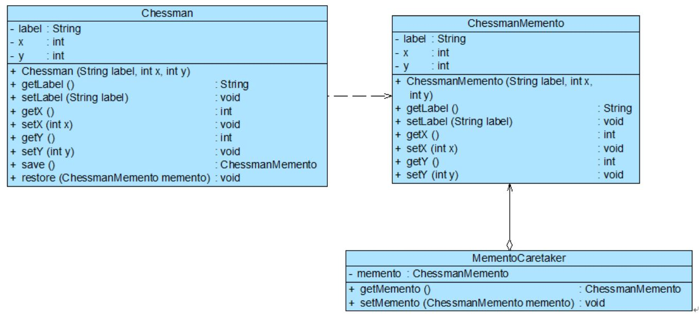

## 备忘录模式
别名为 **Token**。

#### 1. 案例： 可悔棋的中国象棋
“悔棋”就是让系统恢复到某个历史状态，在很多软件中通常称之为“撤销”。在实现撤销时，首先必须保存软件系统的历史状态。

#### 2. 备忘录模式
备忘录模式提供了一种\*\*状态恢复\*\*的实现机制。由此将出现两个问题：1.捕获（存储）一个对象的内部状态；2.状态注入。

##### 2.1 组成
* Originator（原发器）- 一个普通类，创建/加载备忘录，存储当前的备忘录的状态。
* Memento（备忘录) - 提供了与原发器相对应的属性，用于存储原发器的瞬刻状态。
* Caretaker（负责人） - 存储一个或多个备忘录对象，不能对备忘录的内容进行操作或检查。
<div align="center"></div>

##### 2.2 代码框架
```java
# 1. 原发器
（在真实业务中，原发器类是一个具体的业务类。）

//原发器类
public class Originator {
	private String state;//状态成员
 
	public Originator(){}
 
	// 创建一个备忘录对象
	public Memento createMemento() {
		return new Memento(this);
	}
 
	// 根据备忘录对象恢复原发器状态
	public void restoreMemento(Memento m) {
		state = m.state;
	}
 
	public void setState(String state) {
		this.state=state;
	}
 
	public String getState() {
		return this.state;
	}
}

# 2. 备忘录
（提供了与原发器相对应的属性 state 成员，用于瞬态存储。）

//备忘录类，默认可见性，包内可见 （不带 public 关键字）
class Memento {
	private String state;
 
	public Memento(Originator o) {
		state = o.getState();
	}
 
	public void setState(String state) {
		this.state=state;
	}
 
	public String getState() {
		return this.state;
	}
}

# 3. 负责人
（存储多个瞬态的备忘录，用于返回某一时刻）

//负责人类
public class Caretaker {
	private Memento memento;
 
	public Memento getMemento() {
		return memento;
	}
 
	public void setMemento(Memento memento) {
		this.memento=memento;
	}
}
```
说明
```
在使用 Java 语言实现备忘录模式时，一般将 Memento 类与 Originator 类定义在同一个包 (package) 中来实现封装，
在 Java 语言中使用默认访问标识符来定义 Memento 类，即仅保证其包内可见。 （没有 public 关键字。）
```

#### 3. 使用备忘录模式实现象棋软件
Chessman 充当原发器，ChessmanMemento 充当备忘录，MementoCaretaker 充当负责人。
<div align="center"></div>

代码框架
```java
# 1. 原发器

//象棋棋子类：原发器
class Chessman {
	private String label;
	private int x;
	private int y;
 
	public Chessman(String label,int x,int y) {
		this.label = label;
		this.x = x;
		this.y = y;
	}
 
	public void setLabel(String label) {
		this.label = label; 
	}
 
	public void setX(int x) {
		this.x = x; 
	}
 
	public void setY(int y) {
		this.y = y; 
	}
 
	public String getLabel() {
		return (this.label); 
	}
 
	public int getX() {
		return (this.x); 
	}
 
	public int getY() {
		return (this.y); 
	}
	
	//保存状态
	public ChessmanMemento save() {
		return new ChessmanMemento(this.label,this.x,this.y);
	}
	
	//恢复状态
	public void restore(ChessmanMemento memento) {
		this.label = memento.getLabel();
		this.x = memento.getX();
		this.y = memento.getY();
	}
}

# 2. 备忘录

//象棋棋子备忘录类：备忘录
class ChessmanMemento {
	private String label;
	private int x;
	private int y;
 
	public ChessmanMemento(String label,int x,int y) {
		this.label = label;
		this.x = x;
		this.y = y;
	}
 
	public void setLabel(String label) {
		this.label = label; 
	}
 
	public void setX(int x) {
		this.x = x; 
	}
 
	public void setY(int y) {
		this.y = y; 
	}
 
	public String getLabel() {
		return (this.label); 
	}
 
	public int getX() {
		return (this.x); 
	}
 
	public int getY() {
		return (this.y); 
	}	
}

# 3. 负责人

//象棋棋子备忘录管理类：负责人
class MementoCaretaker {
	private ChessmanMemento memento;
 
	public ChessmanMemento getMemento() {
		return memento;
	}
 
	public void setMemento(ChessmanMemento memento) {
		this.memento = memento;
	}
}

# 4. 主程序 （main）

class Client {
	public static void main(String args[]) {
		MementoCaretaker mc = new MementoCaretaker();
		Chessman chess = new Chessman("车",1,1);
		display(chess);
		mc.setMemento(chess.save()); //保存状态		
		chess.setY(4);
		display(chess);
		mc.setMemento(chess.save()); //保存状态
		display(chess);
		chess.setX(5);
		display(chess);
		System.out.println("******悔棋******");	
		chess.restore(mc.getMemento()); //恢复状态
		display(chess);
	}
	
	public static void display(Chessman chess) {
		System.out.println("棋子" + chess.getLabel() + "当前位置为：" + "第" + chess.getX() + "行" + "第" + chess.getY() + "列。");
	}
}
```

#### 4. 实现多次撤销
在负责人类中定义一个集合来存储多个备忘录，每个备忘录负责保存一个历史状态，在撤销时可以对备忘录集合进行逆向遍历，回到一个指定的历史状态，而且还可以对备忘录集合进行正向遍历，实现重做(Redo)操作，即取消撤销。

代码框架
```java
# 负责人

class MementoCaretaker {
	//定义一个集合来存储多个备忘录
	private ArrayList mementolist = new ArrayList();
 
	public ChessmanMemento getMemento(int i) {
		return (ChessmanMemento)mementolist.get(i);
	}
 
	public void setMemento(ChessmanMemento memento) {
		mementolist.add(memento);
	}
}

# 主程序 （main）

class Client {
	private static int index = -1; //定义一个索引来记录当前状态所在位置
	private static MementoCaretaker mc = new MementoCaretaker(); //负责人
 
	public static void main(String args[]) {
		Chessman chess = new Chessman("车",1,1);
		play(chess);		
		chess.setY(4);
		play(chess);
		chess.setX(5);
		play(chess);	
		undo(chess,index);
		undo(chess,index);	
		redo(chess,index);
		redo(chess,index);
	}
	
	//下棋
	public static void play(Chessman chess) {
		mc.setMemento(chess.save()); //保存备忘录
		index ++; 
		System.out.println("棋子" + chess.getLabel() + "当前位置为：" + "第" + chess.getX() + "行" + "第" + chess.getY() + "列。");
	}
 
	//悔棋
	public static void undo(Chessman chess,int i) {
		System.out.println("******悔棋******");
		index --; 
		chess.restore(mc.getMemento(i-1)); //撤销到上一个备忘录
		System.out.println("棋子" + chess.getLabel() + "当前位置为：" + "第" + chess.getX() + "行" + "第" + chess.getY() + "列。");
	}
 
	//撤销悔棋
	public static void redo(Chessman chess,int i) {
		System.out.println("******撤销悔棋******");	
		index ++; 
		chess.restore(mc.getMemento(i+1)); //恢复到下一个备忘录
		System.out.println("棋子" + chess.getLabel() + "当前位置为：" + "第" + chess.getX() + "行" + "第" + chess.getY() + "列。");
	}
}
```
提示
```
思考： 如果在撤销到某个历史状态之后，用户再修改对象状态，此后执行 Undo 操作时可能会发生对象状态错误。
在实际开发中，可以使用链表或者堆栈来处理有分支的对象状态改变。
```

#### 5. 谈谈备忘录的封装
备忘录是一个很特殊的类，只有原发器对它拥有控制的权力，负责人只负责管理，而其他类无法访问到备忘录。

以上约束的实现方法因编程语言的不同而有所差异，在 C++ 中可以使用 friend 关键字，让原发器类和备忘录类成为友元类，互相之间可以访问对象的一些私有的属性；
在 Java 中可以将原发器类和备忘录类放在一个包中，让它们之间满足默认的包内可见性，也可以将备忘录类作为原发器类的内部类。

#### 6. 本模式优缺点
在应用软件开发中，备忘录模式的使用频率并不太高，因为现在很多基于窗体和浏览器的应用软件并没有提供撤销操作。
如果需要为软件提供撤销功能，备忘录模式无疑是一种很好的解决方案。
```
优：
▪ 提供一种状态恢复的实现机制。
缺：
▪ 如果需要保存的原发器类的成员变量太多，就不可避免需要占用大量的存储空间。
```
适用场景
```
▫ 实现撤销操作。
```
