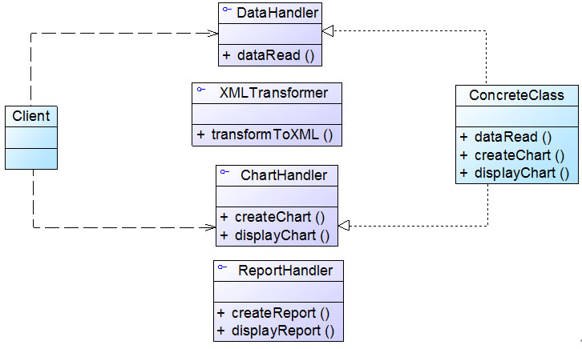
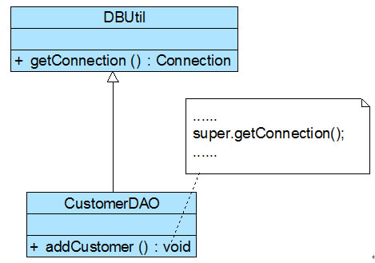

## 面向对象设计原则

###### 如何同时提高一个软件系统的可维护性和可复用性是面向对象设计需要解决的核心问题之一。
```
▪ 单一职责原则 (Single Responsibility Principle, SRP)
    一个类只负责一个功能领域中的相应职责。
▪ 开闭原则 (Open-Closed Principle, OCP)
    软件实体应对扩展开放，而对修改关闭。
▪ 里氏代换原则 (Liskov Substitution Principle, LSP)
    所有引用基类对象的地方能够透明地使用其子类的对象。
▪ 依赖倒转原则 (Dependence  Inversion Principle, DIP)
    抽象不应该依赖于细节，细节应该依赖于抽象。
▪ 接口隔离原则 (Interface Segregation Principle, ISP)
    使用多个专门的接口，而不使用单一的总接口。
▪ 合成复用原则 (Composite Reuse Principle, CRP)
    尽量使用对象组合，而不是继承来达到复用的目的。
▪ 迪米特法则 (Law of Demeter, LoD)
    一个软件实体应当尽可能少地与其他实体发生相互作用
```


#### 1. 单一职责原则

###### 单一职责原则，用于控制类的粒度大小。 “就一个类而言，应该只有一个引起它代码变化的原因。”
```
单一职责原则是实现高内聚、低耦合的指导方针，它是最简单但又最难运用的原则。
```

实例： 客户关系管理系统中，客户信息图形统计模块 <br>
<div align="center"></div>

其中，getConnection() 方法用于连接数据库，findCustomers() 用于查询所有的客户信息，createChart() 用于创建图表，displayChart() 用于显示图表。
```
无论是修改数据库连接方式还是修改图表显示方式都需要修改该类，它不止一个引起它代码变化的原因，违背了单一职责原则。
因此需要对该类进行拆分：
    将类 CustomerDataChart 拆分为如下三个类
    ▪ DBUtil：负责连接数据库，包含数据库连接方法 getConnection()。
    ▪ CustomerDAO：负责操作数据库中的 Customer 表，包含对 Customer 表的增删改查等方法，如 findCustomers()。
    ▪ CustomerDataChart：负责图表的生成和显示，包含方法 createChart() 和 displayChart()。
```
<div align="center"></div>


#### 2. 开闭原则

###### 开闭原则，可复用设计的第一块基石，最重要的面向对象设计原则。
```
软件实体应尽量在不修改原有代码的情况下进行扩展。
```
```
任何软件都需要面临一个很重要的问题，即它们的需求会随时间的推移而发生变化。
为了满足开闭原则，需要对系统进行抽象化设计，抽象化是开闭原则的关键。
在 Java、C# 等编程语言中，为系统定义一个相对稳定的抽象层，而将不同的实现行为移至具体的实现层中完成。
```

实例： 客户关系管理系统中，图表 <br>
<div align="center"></div>

```java
......
if (type.equals("pie")) {
PieChart chart = new PieChart();
chart.display();
}
else if (type.equals("bar")) {
BarChart chart = new BarChart();
chart.display();
}
......
```
```
当前的实现方式，如果需要增加一个新的图表类，如折线图 LineChart，则需要修改 ChartDisplay 类
的 display() 方法的源代码，增加新的判断逻辑。违反了开闭原则。
    通过抽象化的方式进行重构
    ▪ 增加一个抽象图表类 AbstractChart，将各种具体图表类作为其子类。
    ▪ ChartDisplay类针对抽象图表类进行编程，由客户端来决定使用哪种具体图表。
```
<div align="center"></div>

```
注意： 如果一个系统在扩展时只涉及到修改配置文件，而原有的 Java 代码或 C# 代码没有做任何修改，该系统即可认为是一个符合开闭原则的系统。
```


#### 3. 里氏代换原则

###### 在软件中将一个基类对象替换成它的子类对象，程序将不会产生任何错误和异常，反过来则不成立，如果一个软件实体使用的是一个子类对象的话，那么它不一定能够使用基类对象。
```
里氏代换原则是实现开闭原则的重要方式之一。在程序中尽量使用基类类型来对对象进行定义。
```

实例： 客户关系管理系统中，不同类型客户的Email功能
<div align="center"></div>

其中，无论是普通客户还是 VIP 客户，发送邮件的过程都是相同的，也就是说两个 send() 方法中的代码重复，而且在本系统中还将增加新类型的客户。
```
让系统具有更好的扩展性，同时减少代码重复，考虑增加一个新的抽象客户类 Customer，而将 CommonCustomer 
和 VIPCustomer 类作为其子类，邮件发送类 EmailSender 类针对抽象客户类 Customer 编程。
    ▪ 根据里氏代换原则，能够接受基类对象的地方必然能够接受子类对象，
    因此将 EmailSender 中的 send() 方法的参数类型改为 Customer。
```
<div align="center"></div>

```
在本实例中，在传递参数时使用基类对象，除此以外，在定义成员变量、定义局部变量、确定方法返回类型时都可使用里氏代换原则。
```


#### 4. 依赖倒转原则

###### 依赖倒转原则，系统抽象化（开闭原则）的具体实现。 “换言之，要针对接口编程，而不是针对实现编程。”
```
在程序代码中传递参数时或在关联关系中，使用接口和抽象类进行变量类型声明、参数类型声明、方法返回类型声明，以及数据类型的转换等。
一个具体类应当只实现接口或抽象类中声明过的方法，而不要给出多余的方法！！！

在实现依赖倒转原则时，我们需要针对抽象层编程，而将具体类的对象通过依赖注入的方式注入到其他对象中。
    依赖注入：
    ▪ 构造注入
    ▪ 设值注入（Setter注入）
    ▪ 接口注入
构造注入是指通过构造函数来传入具体类的对象，设值注入是指通过Setter方法来传入具体类的对象，而接口注入是指通过在接口中声明的业务方法来传入具体类的对象。
```

实例： 客户关系管理系统中，TXT 或 Excel 数据格式转换及数据库转存
<div align="center"></div>

```
由于每次转换数据时数据来源不一定相同，因此需要更换数据转换类，如有时候需要将 TXTDataConvertor 改为 ExcelDataConvertor，
此时，需要修改 CustomerDAO 的源代码。违反了开闭原则。
    ▪ 根据依赖倒转原则，引入抽象数据转换类 DataConvertor，CustomerDAO 针对抽象类 DataConvertor 编程，
    而将具体数据转换类名存储在配置文件中。
```
<div align="center"></div>

```
在上述重构过程中，我们使用了开闭原则、里氏代换原则和依赖倒转原则，在大多数情况下，这三个设计原则会同时出现，
开闭原则是目标，里氏代换原则是基础，依赖倒转原则是手段。
```


#### 5. 接口隔离原则

###### 使用多个专门的接口，而不使用单一的总接口。 “客户端不应该依赖那些它不需要的接口。”
```
“接口”的含义：
    ▪ 指一个类型所具有的方法特征的集合，仅仅是一种逻辑上的抽象。
    ▪ 指某种语言具体的“接口”定义，有严格的定义和结构，比如 Java 语言中的 interface。
=>
    ▪ 可以把接口理解成角色，一个接口只能代表一个角色，每个角色都有它特定的一个接口，此时，这个原则可以叫做 “角色隔离原则”。
    ▪ 实现一个接口就需要实现该接口中定义的所有方法，接口应该尽量细化，同时接口中的方法应该尽量少，每个接口中只包含一个客
      户端（如：子模块或业务逻辑类）所需的方法即可，这种机制也称为 “定制服务”。
```

实例： 客户关系管理系统中，客户数据显示模块接口 <br>
<div align="center"></div>

```
如果一个具体的数据显示类无须进行数据转换，但由于实现了该接口，将不得不实现其中声明的 transformToXML() 方法
（至少需要提供一个空实现）。 违反了接口隔离原则。
接口 CustomerDataDisplay 中定义了太多方法，即该接口承担了太多职责。
    ▪ 根据接口隔离原则和单一职责原则进行重构，将其中的一些方法封装在不同的小接口中。
```
<div align="center"></div>

```
使用接口隔离原则时，我们需要注意控制接口的粒度，接口不能太小，如果太小会导致系统中接口泛滥，不利于维护；
接口也不能太大，太大的接口将违背接口隔离原则，灵活性较差，使用起来很不方便。
```


#### 6. 合成复用原则

###### 尽量使用对象组合，而不是继承来达到复用的目的。“复用准则 （Has-A 优先）”
```
在一个新的对象里通过关联关系，使用一些已有的对象，使之成为新对象的一部分。
    ▪ “白箱”复用 - 继承复用 （实现细节可见，与基类的方法实现/成员强绑定，复杂耦合）
    ▪ “黑箱”复用 - 组合复用 （实现细节不可见，仅与开放接口交互，耦合度低）
```

实例： 客户关系管理系统中，数据库操作功能复用 <br>
<div align="center"></div>

```
与数据库操作有关的类，如： CustomerDAO 等都需要连接数据库，而连接数据库的方法 getConnection() 封装在 DBUtil 类中。
由于需要重用 DBUtil 类的 getConnection() 方法，设计人员将 CustomerDAO 作为 DBUtil 类的子类。
现在，系统决定从 MySQL 升级为 Oracle 数据库，因此需要增加一个新的 OracleDBUtil 类来连接 Oracle 数据库。

由于初始设计方案中 CustomerDAO 和 DBUtil 之间是继承关系，因此在更换数据库连接方式时需要修改 CustomerDAO 类的源代码，
将 CustomerDAO 作为 OracleDBUtil 的子类，这将违反开闭原则。
【 当然也可以修改 DBUtil 类的源代码，同样会违反开闭原则。 】
    ▪ 根据合成复用原则，使用关联复用来取代继承复用，进行重构。
```
<div align="center"></div>

```
CustomerDAO 和 DBUtil 之间的关系由继承关系变为关联关系，采用依赖注入的方式将 DBUtil 对象注入到 CustomerDAO 中，
可以使用构造注入，也可以使用Setter注入。如果需要对 DBUtil 的功能进行扩展，可以通过其子类来实现，如通过子类 OracleDBUtil
来连接 Oracle 数据库。
```
```
在使用继承时，需要严格遵循里氏代换原则，有效使用继承会有助于对问题的理解，降低复杂度，
而滥用继承反而会增加系统构建和维护的难度以及系统的复杂度，因此需要慎重使用**继承复用**。
```


#### 7. 迪米特法则

###### 迪米特法则又称为最少知识原则 (LeastKnowledge Principle, LKP)。 “通信准则 （不要和“陌生人”说话）”
```
如果一个系统符合迪米特法则，那么当其中某一个模块发生修改时，就会尽量少地影响其他模块，扩展会相对容易，这是对软件实体之间
通信的限制，迪米特法则要求限制软件实体之间通信的宽度和深度。 一个软件实体应当尽可能少地与其他实体发生相互作用。
在迪米特法则中，对于一个对象，其朋友（“自己人”）包括以下几类：
    ▪ 当前对象本身 (this)。
    ▪ 以参数形式传入到当前对象方法中的对象。
    ▪ 当前对象的成员对象。
    ▪ 如果当前对象的成员对象是一个集合，那么集合中的元素也都是朋友。
    ▪ 当前对象所创建的对象。
```

实例： 客户关系管理系统中，界面控件之间的交互 <br>
<div align="center"></div>

```
当一个按钮 (Button) 被单击时，对应的列表框 (List)、组合框 (ComboBox)、文本框 (TextBox)、文本标签 (Label) 等都将发生改变。
由于界面控件之间的交互关系复杂，导致在增加新的界面控件时，需要修改与之交互的其他控件的源代码。
    ▪ 根据迪米特法则，“一个软件实体应当尽可能少地与其他实体发生相互作用”。 引入中间类之后，
      界面控件之间不再发生直接引用，而是将请求先转发给中间类。 由中间类来完成对其他控件的调用。
当需要增加或删除新的控件时，只需修改中间类（中的交互代码）即可。
```
<div align="center"></div>

```
迪米特法则要求我们在设计系统时，如果两个对象之间可以不直接通信，那么这两个对象就不应当发生任何直接的相互作用。
通过引入一个合理的第三者（调度者/协调者）来降低现有对象之间（一个集合/一个team）的耦合度。
```
