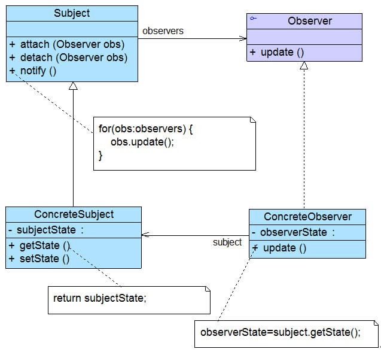
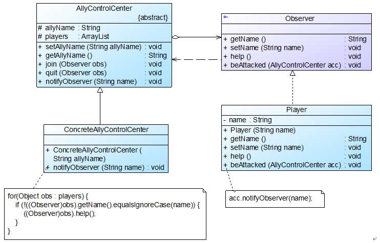

## 观察者模式
根据信号（指示）行事是我们在生活中时常经历的，观察者模式就是为了更好的描述对象之间的联动行为。

**观察者模式的几个别名：**
* 发布-订阅 （Publish/Subscribe） 模式
* 模型-视图 （Model/View） 模式
* 源-监听器 （Source/Listener） 模式
* 从属者 （Dependents） 模式

#### 1. 案例： 多人联机对战游戏
联盟成员受到攻击 --> 发送通知给盟友 --> 盟友作出响应

开发人员决定引入一个新的角色—“战队控制中心”—来负责维护和管理每个战队所有成员的信息。当一个联盟成员受到攻击时，将向相应的战队控制中心发送求助信息，战队控制中心再逐一通知每个盟友。（“中介者模式”）

#### 2. 观察者模式
观察者模式是使用频率最高的设计模式之一。 在观察者模式中，发生改变的对象称为观察目标，而被通知的对象称为观察者，观察者之间没有任何相互联系，根据需要增加和删除观察者来扩展系统。

##### 2.1 组成
* Subject （观察目标） <br>
观察目标中包含了一个观察者集合，可以添加和移除观察者对象，同时定义了通知方法 notify()。
* Observer （观察者） <br>
对观察目标的改变做出反应，一般定义为接口，该接口声明了更新数据的方法 update()。
* ConcreteSubject （具体观察目标） <br>
实现业务逻辑，当它的状态发生改变时，向它的各个观察者发出通知。
* ConcreteObserver （具体观察者）

<div align="center"></div>

##### 2.2 代码框架
```java
# 1. 观察目标

//抽象观察目标类
abstract class Subject {
	//定义一个观察者集合用于存储所有观察者对象
	protected ArrayList observers<Observer> = new ArrayList();
 
	//注册方法，用于向观察者集合中增加一个观察者
	public void attach(Observer observer) {
		observers.add(observer);
	}
 
	//注销方法，用于在观察者集合中删除一个观察者
	public void detach(Observer observer) {
		observers.remove(observer);
	}
 
	//声明抽象通知方法
	public abstract void notify();
}

# 2. 观察者

//抽象观察者类
interface Observer {
	//声明响应方法
	public void update();
}

# 3. 具体观察目标

//具体观察目标类
class ConcreteSubject extends Subject {
	//实现通知方法
	public void notify() {
		//遍历观察者集合，调用每一个观察者的响应方法
		for(Object obs:observers) {
			((Observer)obs).update();
		}
	}	
}

# 4. 具体观察者

//具体观察者类
class ConcreteObserver implements Observer {
	//实现响应方法
	public void update() {
		//具体响应代码
	}
}
```

##### 2.3 具体观察者需要双向关联具体观察目标的情况
```
在一些复杂的情况下，ConcreteObserver 的 update() 方法在执行时，需要使用到 ConcreteSubject 中的状态（属性）。
此时，需要在 ConcreteObserver 中维持一个 ConcreteSubject 实例的引用，通过该实例获取存储在 ConcreteSubject 中的状态。
```
此时系统的扩展性将受到一定影响，增加新的具体观察目标类时，可能要修改原有的观察者类（关联需要），在一定程度上违反了“开闭原则”。

#### 3. 使用观察者模式重构多人联机对战游戏
AllyControlCenter 充当目标类，Observer 充当抽象观察者，ConcreteAllyControlCenter 充当具体目标类，Player充当具体观察者。
<div align="center"></div>

代码框架
```java
# 1. 观察者

//抽象观察者类
interface Observer {
	public String getName();
	public void setName(String name);
	public void help(); //声明支援盟友方法
	public void beAttacked(AllyControlCenter acc); //声明遭受攻击方法
}

# 2. 观察目标

//战队控制中心类：目标类
abstract class AllyControlCenter {
	protected String allyName; //战队名称
	protected ArrayList<Observer> players = new ArrayList<Observer>(); //定义一个集合用于存储战队成员
	
	public void setAllyName(String allyName) {
		this.allyName = allyName;
	}
	
	public String getAllyName() {
		return this.allyName;
	}
	
	//注册方法
	public void join(Observer obs) {
		System.out.println(obs.getName() + "加入" + this.allyName + "战队！");
		players.add(obs);
	}
	
	//注销方法
	public void quit(Observer obs) {
		System.out.println(obs.getName() + "退出" + this.allyName + "战队！");
		players.remove(obs);
	}
	
	//声明抽象通知方法
	public abstract void notifyObserver(String name);
}

# 3. 具体观察者

//战队成员类：具体观察者类
class Player implements Observer {
	private String name;
 
	public Player(String name) {
		this.name = name;
	}
	
	public void setName(String name) {
		this.name = name;
	}
	
	public String getName() {
		return this.name;
	}
	
	//支援盟友方法的实现
	public void help() {
		System.out.println("坚持住，" + this.name + "来救你！");
	}
	
	//遭受攻击方法的实现，当遭受攻击时将调用战队控制中心类的通知方法notifyObserver()来通知盟友
	public void beAttacked(AllyControlCenter acc) {
		System.out.println(this.name + "被攻击！");
		acc.notifyObserver(name);		
	}
}

# 4. 具体观察目标

//具体战队控制中心类：具体目标类
class ConcreteAllyControlCenter extends AllyControlCenter {
	public ConcreteAllyControlCenter(String allyName) {
		System.out.println(allyName + "战队组建成功！");
		System.out.println("----------------------------");
		this.allyName = allyName;
	}
	
	//实现通知方法
	public void notifyObserver(String name) {
		System.out.println(this.allyName + "战队紧急通知，盟友" + name + "遭受敌人攻击！");
		//遍历观察者集合，调用每一个盟友（自己除外）的支援方法
		for(Object obs : players) {
			if (!((Observer)obs).getName().equalsIgnoreCase(name)) {
				((Observer)obs).help();
			}
		}		
	}
}

# 5. 主程序 （main）

class Client {
	public static void main(String args[]) {
		//定义观察目标对象
		AllyControlCenter acc;
		acc = new ConcreteAllyControlCenter("金庸群侠");
		
		//定义四个观察者对象
		Observer player1,player2,player3,player4;
		
		player1 = new Player("杨过");
		acc.join(player1);
		player2 = new Player("令狐冲");
		acc.join(player2);
		player3 = new Player("张无忌");
		acc.join(player3);
		player4 = new Player("段誉");
		acc.join(player4);
		
		//某成员遭受攻击
		Player1.beAttacked(acc);
	}
}
```
思考
```
观察者模式与中介者模式的区别？
抽象同事必须维持一个抽象中介者的引用。 （双向关联（内部直接包含引用）-单向关联（中介者在调用时注入））
```

#### 4. JDK 对观察者模式的支持
观察者模式在 Java 语言中的地位非常重要。 JDK 的 java.util 包提供了 Observable 类以及 Observer 接口，对观察者模式进行支持。
<div align="center"></div>

在 Java 中，可以直接使用 Observer 接口 java.util.Observer 和 Observable 类 java.util.Observable 来作为观察者模式的抽象层，再自定义具体观察者类和具体观察目标类。

#### 5. 观察者模式与 Java 事件处理
JDK 1.0 及更早版本的事件模型基于职责链模式，在 JDK 1.1 及以后的各个版本中，事件处理模型采用基于观察者模式的委派事件模型 (Delegation Event Model, DEM)，
即一个 Java 组件所引发的事件并不由引发事件的对象自己来负责处理，而是委派（中介）给独立的事件处理对象负责。

1. 在 DEM 模型中，目标角色（界面组件）负责发布事件，而观察者角色（事件处理者）可以向目标角色订阅它所感兴趣的事件。

2. 事件的发布者称为事件源 (Event Source)，而订阅者称为事件监听器 (Event Listener)。

3. 在 DEM 模型中，可以通过事件对象 (Event Object) 来传递与事件相关的信息。（“命令模式？”）

```
观察者模式+命令模式：

发送者（invoke） -> 具体命令对象(execute) -> 具体观察目标(notify) -> 具体观察者(update)
or
具体观察者（notify/invoke） -> 具体命令对象（execute） -> 具体观察者（update）
```
事件源对象、事件监听对象（事件处理对象）和事件对象构成了 Java 事件处理模型的三要素。

案例： 登陆按钮事件处理
<div align="center"></div>

*  LoginEvent (事件类) <br>
用于封装与事件有关的信息。它不是观察者模式的一部分，但是可以在目标对象和观察者对象之间传递数据。
* LoginBean (具体目标类) <br>
其中定义了抽象观察者 LoginEventListener 类型的对象 lel 和事件对象 le，注册方法 addLoginEventListener() 用于添加观察者。
通知方法 fireLoginEvent() 在 Java 事件处理模型中称为“点火方法”。
* LoginEventListener (观察者类) <br>
响应方法 validateLogin() 用于处理事件，事件类型的对象作为其参数，用于传输数据。（并非“命令模式”。）

#### 6. 观察者模式与 MVC
MVC 是一种架构模式，其应用了观察者模式。 Model 对应观察目标，View 对应观察者，Controller 充当两者之间的中介者。

MVC 的效果： 当模型层的数据发生改变时，视图层将自动改变其显示内容。

###### reference
MVC 扩展知识： 《Java SE Application Design With MVC》
http://www.oracle.com/technetwork/articles/javase/index-142890.html

#### 7. 本模式优缺点
观察者模式是一种使用频率非常高的设计模式，无论是移动应用、Web 应用或者桌面应用，观察者模式几乎无处不在。
各种编程语言的 GUI 事件处理的实现，基于事件的 XML 解析技术（如SAX2）以及 Web 事件处理都使用了观察者模式。
```
优：
▪ 实现表示层和数据逻辑层的分离。（定义了稳定的消息更新传递机制。）
▪ 事件处理任务的优秀解决方案。
缺：
▪ 如果观察者和观察目标之间存在循环依赖，系统可能发生循环调用。
▪ 观察者仅仅知道观察目标发生了变化，变化内容不透明。
```
适用场景
```
▫ 一个对象的改变将导致一个或多个其他对象也发生改变。
```
