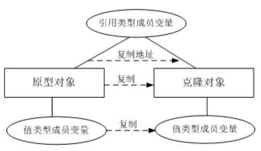
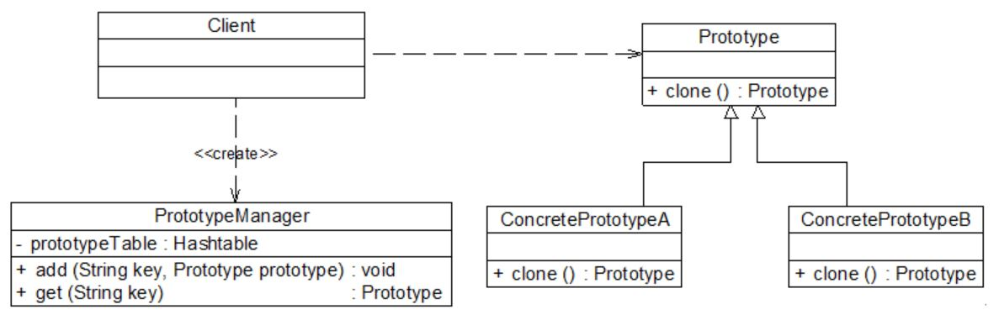

## 原型模式
“复制” “克隆” “拷贝” （Ctrl + C、 Ctrl + V）
```
如何在一个面向对象系统中实现对象的复制和粘贴呢？
```

#### 1. 案例： 大同小异的工作周报
人们普遍使用 OA (Office Automatic，办公自动化)系统进行日常工作办理。越来越多的人对工作周报的创建和编写模块产生了抱怨，
默认创建的周报都是空白报表，用户只能通过重新输入或不断复制粘贴来填写重复的周报内容，极大降低了工作效率，浪费宝贵的时间。
<div align="center"></div>

设计思路
```
(1) 允许用户创建新周报（空周报），还允许用户将创建好的周报保存为模板。
(2) 用户再次创建周报时，可以创建全新的周报，还可以选择合适的模板复制生成一份相同的周报，
    然后对新生成的周报根据实际情况进行修改，产生新的周报。
```

#### 2. 原型模式
使用原型实例指定创建对象的种类，并且通过拷贝这些原型创建新的对象。 （试想，如果连它的模样/实体都不知道，怎么复制）

##### 2.1 特征
```
原型模式是一种 “另类” 的创建型模式，创建克隆对象的工厂就是原型类自身，工厂方法由克隆方法来实现。 (所谓的深拷贝)
```
原型模式的核心在于如何实现克隆 (clone) 方法。
<div align="center"></div>

##### 2.2 代码框架
clone() 方法的通用实现
```java
实例化一个与自身类型相同的对象，将相关的参数传入新创建的对象中，保证它们的成员属性相同。

# 1. 具体原型类定义 （包含 clone() 方法的类）

class ConcretePrototype implements Prototype
{
    private String  attr; //成员属性

    public void  setAttr(String attr)
    {
        this.attr = attr;
    }

    public String  getAttr()
    {
        return this.attr;
    }

    public Prototype  clone() //克隆方法
    {
        Prototype  prototype = new ConcretePrototype(); //创建新对象
        prototype.setAttr(this.attr);
        return prototype;
    }
}

# 2. 主程序 （main）

……
Prototype obj1  = new ConcretePrototype();
obj1.setAttr("Sunny");
Prototype obj2  = obj1.clone(); // 原型模式的特点（深拷贝）
……
```
Java 语言提供的 clone() 方法
```java
所有的 Java 类都继承自 java.lang.Object。 事实上，Object 类提供一个 clone() 方法，可以将一个 Java 对象复制一份。
需要注意的是，能够实现克隆的 Java 类必须实现一个标识接口 Cloneable。

# 1. 具体原型类定义 （包含 clone() 方法的类）

class ConcretePrototype implements Cloneable
{
    ……
    public Prototype  clone()
    {
　　      Object object = null;

　　      try 
　　      {
                object = super.clone();
　　      }
　　      catch (CloneNotSupportedException exception)
　　      {
                System.err.println("Not support cloneable");
　　      }
　　      return (Prototype )object;
    }
    ……
}

# 2. 主程序 （main）

……
Prototype obj1  = new ConcretePrototype();
Prototype obj2  = obj1.clone(); // 原型模式的特点（深拷贝）
……
```

#### 3. 工作周报的原型模式实现
WeeklyLog 充当具体原型类，Object 类充当抽象原型类，clone() 方法为原型方法（工厂方法）。
<div align="center"></div>

代码框架：
```java
# 1. 抽象原型类 （此处为 Object 类， 故省略）

# 2. 具体原型类

//工作周报 WeeklyLog： 具体原型类，考虑到代码的可读性和易理解性，只列出部分与模式相关的核心代码
class WeeklyLog implements Cloneable
{
       private  String name;
       private  String date;
       private  String content;

       public  void setName(String name) {
              this.name  = name;
       }

       public  void setDate(String date) {
              this.date  = date;
       }

       public  void setContent(String content) {
              this.content  = content;
       }

       public  String getName() {
              return  (this.name);
       }

       public  String getDate() {
              return  (this.date);
       }

       public  String getContent() {
              return  (this.content);
       }

       // 克隆方法 clone()，此处使用 Java 语言提供的克隆机制
       public WeeklyLog clone()
       {
              Object obj = null;

              try 
              {
                     obj = super.clone();
                     return (WeeklyLog)obj;     
              }
              catch(CloneNotSupportedException e)
              {
                     System.out.println("不支持复制！");
                     return null;
              }
       }
}

# 3. 主程序 （main）

class Client
{
       public  static void main(String args[])
       {
              WeeklyLog log_previous = new WeeklyLog();  //创建原型对象
              log_previous.setName("张无忌");
              log_previous.setDate("第12周");
              log_previous.setContent("这周工作很忙，每天加班！");

              System.out.println("****周报****");
              System.out.println("周次：" +  log_previous.getDate());
              System.out.println("姓名：" +  log_previous.getName());
              System.out.println("内容：" +  log_previous.getContent());

              System.out.println("--------------------------------");

              WeeklyLog  log_new;
              log_new  = log_previous.clone(); //调用克隆方法创建克隆对象
              log_new.setDate("第13周");

              System.out.println("****周报****");
              System.out.println("周次：" + log_new.getDate());
              System.out.println("姓名：" + log_new.getName());
              System.out.println("内容：" + log_new.getContent());
       }
}
```

#### 4. 带附件的周报 (浅克隆，深克隆)
在 Java 语言中，数据类型分为值类型 （基本数据类型） 和引用类型 （引用类型包括：类、接口、数组等复杂类型）。 浅克隆和深克隆的主要区别在于是否支持引用类型的成员变量的复制。

##### 4.1 浅克隆
在浅克隆中，如果原型对象的成员变量是值类型，将复制一份给克隆对象；如果原型对象的成员变量是引用类型，则将引用对象的地址复制一份给克隆对象。
（引用类型的成员对象并没有复制。）
<div align="center"></div>

在 Java 语言中，通过覆盖 Object 类的 clone() 方法可以实现浅克隆
<div align="center"></div>

代码框架：
```java
# 1. 附件类 （Attachment）

class Attachment
{
       private  String name; //附件名

       public  void setName(String name)
       {
              this.name  = name;
       }

       public  String getName()
       {
              return  this.name;
       }

       public void download()
       {
              System.out.println("下载附件，文件名为" + name);
       }
}

# 2. 具体原型类 WeeklyLog

class WeeklyLog implements Cloneable
{
     //为了简化设计和实现，假设一份工作周报中只有一个附件对象，实际情况中可以包含多个附件，可以通过 List 等集合对象来实现
       private Attachment attachment;
       private String name;
       private  String date;
       private  String content;

       public void setAttachment(Attachment  attachment) {
              this.attachment = attachment;
       }

       public  void setName(String name) {
              this.name  = name;
       }

       public  void setDate(String date) {
              this.date  = date;
       }

       public  void setContent(String content) {
              this.content  = content;
       }

       public Attachment  getAttachment(){
              return (this.attachment);
       }

       public  String getName() {
              return  (this.name);
       }

       public  String getDate() {
              return  (this.date);
       }

       public  String getContent() {
              return  (this.content);
       }

       // 使用 clone() 方法实现浅克隆
       public WeeklyLog clone()
       {
              Object obj = null;

              try
              {
                     obj = super.clone();
                     return (WeeklyLog)obj;
              }
              catch(CloneNotSupportedException  e)
              {
                     System.out.println("不支持复制！");
                     return null;
              }
       }
}

# 3. 主程序 （main）

class Client
{
       public  static void main(String args[])
       {
              WeeklyLog  log_previous, log_new;

              log_previous  = new WeeklyLog(); //创建原型对象
              Attachment  attachment = new Attachment(); //创建附件对象
              log_previous.setAttachment(attachment);  //将附件添加到周报中

              log_new  = log_previous.clone(); //调用克隆方法创建克隆对象

              //比较周报
              System.out.println("周报是否相同？ " + (log_previous ==  log_new));
              //比较附件
              System.out.println("附件是否相同？ " +  (log_previous.getAttachment() == log_new.getAttachment()));
       }
}
```

##### 4.2 深克隆
在深克隆中，无论原型对象的成员变量是值类型还是引用类型，都将复制一份给克隆对象。
<div align="center"></div>

在 Java 语言中，如果需要实现深克隆，可以通过序列化 (Serialization) 等方式来实现。
序列化就是将对象写到流的过程，写到流中的对象是原有对象的一个拷贝，而原对象仍然存在于内存中。
通过序列化实现的拷贝不仅可以复制对象本身，而且可以复制其引用的成员对象。
（能够实现序列化的对象其类必须实现 Serializable 接口。）
<div align="center"></div>

代码框架：
```java
# 1. 附件类 （Attachment）

import  java.io.*;
class  Attachment implements Serializable
{
       private  String name; //附件名

       public  void setName(String name)
       {
              this.name  = name;
       }

       public  String getName()
       {
              return  this.name;
       }

       public void download()
       {
              System.out.println("下载附件，文件名为" + name);
       }
}

# 2. 具体原型类 WeeklyLog

import  java.io.*;
class  WeeklyLog implements Serializable
{
       private  Attachment attachment;
       private  String name;
       private  String date;
       private  String content;

       public  void setAttachment(Attachment attachment) {
              this.attachment  = attachment;
       }

       public  void setName(String name) {
              this.name  = name;
       }

       public  void setDate(String date) {
              this.date  = date;
       }

       public  void setContent(String content) {
              this.content  = content;
       }

       public  Attachment getAttachment(){
              return  (this.attachment);
       }

       public  String getName() {
              return  (this.name);
       }

       public  String getDate() {
              return  (this.date);
       }

       public  String getContent() {
              return  (this.content);
       }

       // 使用序列化技术实现深克隆
       public WeeklyLog deepClone()
         throws  IOException, ClassNotFoundException, OptionalDataException
       {
              //将对象写入流中
              ByteArrayOutputStream bao = new  ByteArrayOutputStream();
              ObjectOutputStream oos = new  ObjectOutputStream(bao);
              oos.writeObject(this);

              //将对象从流中取出
              ByteArrayInputStream bis = new  ByteArrayInputStream(bao.toByteArray());
              ObjectInputStream ois = new  ObjectInputStream(bis);
              
              return  (WeeklyLog)ois.readObject();
       }
}

# 3. 主程序 （main）

class Client
{
       public  static void main(String args[])
       {
              WeeklyLog  log_previous, log_new = null;

              log_previous  = new WeeklyLog(); //创建原型对象
              Attachment  attachment = new Attachment(); //创建附件对象
              log_previous.setAttachment(attachment);  //将附件添加到周报中

              try
              {
                     log_new =  log_previous.deepClone(); //调用深克隆方法创建克隆对象
              }
              catch(Exception e)
              {
                     System.err.println("克隆失败！");
              }

              //比较周报
              System.out.println("周报是否相同？ " + (log_previous ==  log_new));

              //比较附件
              System.out.println("附件是否相同？ " +  (log_previous.getAttachment() == log_new.getAttachment()));
       }
}
```
说明
```
Java 语言提供的 Cloneable 接口和 Serializable 接口的代码非常简单，它们都是空接口，这种空接口也称为标识接口。
标识接口中没有任何方法的定义，其作用是告诉 JRE 这些接口的实现类是否具有某个功能。
```

#### 5. 原型管理器 （Prototype Manager） 的引入和实现
原型管理器是将多个原型对象存储在一个集合中供客户端使用，即：一个专门负责克隆对象的工厂。
（包含一个集合成员变量，存储了多个原型对象，通过复制集合中对应的原型对象来获得新对象。）
<div align="center"></div>

##### 5.1 原型管理器案例： 公文管理器实现
日常办公中有许多具体公文类需要处理，例如 《可行性分析报告》、《立项建议书》、《软件需求规格说明书》、《项目进展报告》等。 （新需求：公文模板的统一管理）
<div align="center"></div>

代码框架：
```java
# 1. 抽象公文原型类 （abstract prototype）

import java.util.*;
//抽象公文接口，也可定义为抽象类，提供 clone() 方法的实现，将业务方法声明为抽象方法
interface OfficialDocument extends  Cloneable
{
       public  OfficialDocument clone();
       public  void display();
}

# 2. 具体公文原型类 (concrete prototype)

//可行性分析报告 (Feasibility Analysis Report) 类
class FAR implements OfficialDocument
{
       public  OfficialDocument clone()
      {
              OfficialDocument  far = null;

              try
              {
                     far  = (OfficialDocument)super.clone();
              }
              catch(CloneNotSupportedException  e)
              {
                      System.out.println("不支持复制！");
              }

              return  far;
       }

       public  void display()
       {
              System.out.println("《可行性分析报告》");
       }
}

//软件需求规格说明书 (Software Requirements Specification) 类
class SRS implements OfficialDocument
{
       public  OfficialDocument clone()
       {
              OfficialDocument  srs = null;

              try
              {
                     srs  = (OfficialDocument)super.clone();
              }
              catch(CloneNotSupportedException  e)
              { 
                     System.out.println("不支持复制！");
              }

              return  srs;
       }

       public  void display()
       {
              System.out.println("《软件需求规格说明书》");
       }
}

# 3. 原型管理器 （Prototype Manager） - 对手：工厂方法模式的工厂 （针对一个继承系列创建）
（使用饿汉式单例实现）

class  PrototypeManager
{
       //定义一个 Hashtable，用于存储原型对象
       private Hashtable ht = new Hashtable();

       private static PrototypeManager pm =  new PrototypeManager();
      
       //为 Hashtable 增加公文对象   
       private  PrototypeManager()
       {
              ht.put("far", new FAR()); //具体公文类 1 （空模板）
              ht.put("srs", new SRS()); //具体公文类 2 （空模板）
       }

       //增加新的公文对象 （自定义模板）
       public void addOfficialDocument(String key, OfficialDocument doc)
       {
              ht.put(key,doc);
       }

       //通过浅克隆获取新的公文对象 （工厂方法）
       public OfficialDocument getOfficialDocument(String key)
       {
              return  ((OfficialDocument)ht.get(key)).clone();
       }

       public static PrototypeManager getPrototypeManager()
       {
              return pm;
       }
}

# 4. 主程序 （main）

class Client
{
       public  static void main(String args[])
       {
              //获取原型管理器对象
              PrototypeManager pm =  PrototypeManager.getPrototypeManager();  

              OfficialDocument  doc1,doc2,doc3,doc4;
        
              doc1  = pm.getOfficialDocument("far");
              doc1.display();
              doc2  = pm.getOfficialDocument("far");
              doc2.display();

              System.out.println(doc1  == doc2);

              doc3  = pm.getOfficialDocument("srs");
              doc3.display();
              doc4  = pm.getOfficialDocument("srs");
              doc4.display();

              System.out.println(doc3  == doc4);
       }
}
```

##### 5.2 思考
```
如果需要增加一种新类型的公文，如 《项目进展报告》 (Project Progress Report, PPR)，
公文管理器系统源代码如何修改。 是否符合 “开闭原则”？
```

#### 6. 本模式优缺点
原型模式作为一种快速创建大量相同或相似对象的方式，被广泛使用。
很多软件提供的复制 (Ctrl + C) 和粘贴 (Ctrl + V) 操作就是原型模式的典型应用。
```
优：
▪ 提供一种新的对象创建方式。
▪ 工厂方法模式常常需要有一个与产品类等级结构相同的工厂等级结构，而原型模式就不需要。
  （但是，每个产品类成为了原型类，需要添加/实现 clone() 方法）
▪ 可辅助实现办公软件中的撤销操作。
缺：
▪ 需要为每一个类配备一个克隆方法。
▪ 实现深克隆时需要编写较为复杂的代码。
```
适用场景
```
▫ 需要实现大型软件的复制、粘贴功能时。
▫ 实现回滚功能时，使用原型模式保存对象的状态。
▫ 取代工厂方法模式分层次的工厂类来创建分层次的对象的实现方式。
```
