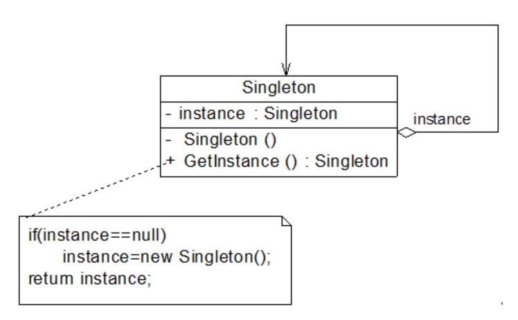
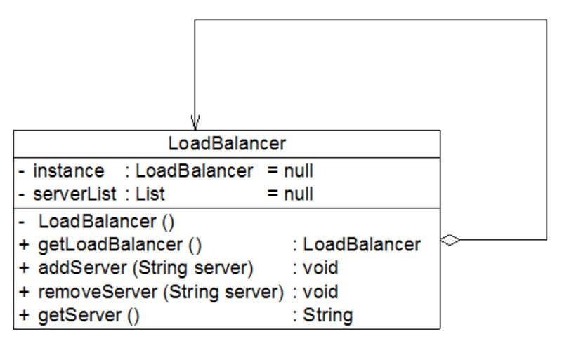
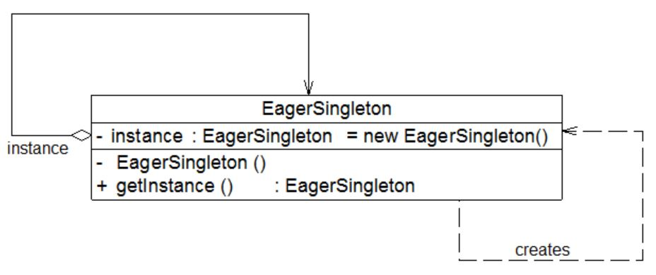
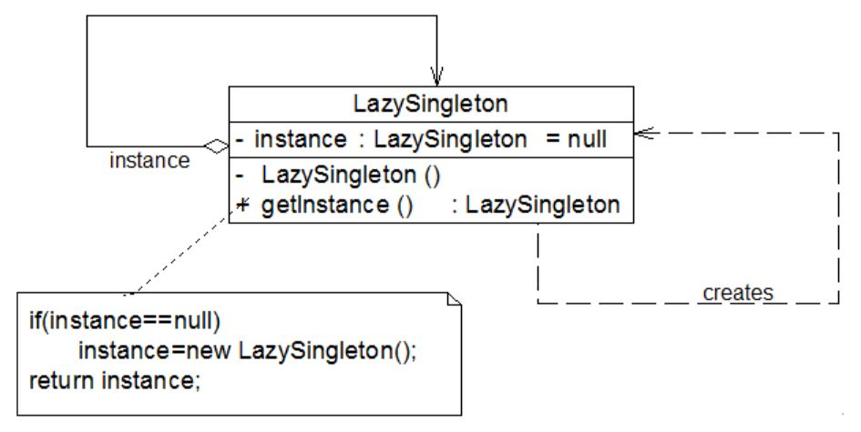

## 单例模式
单例模式的动机，对象的唯一性，内容一致性（相同）的最高要求。

#### 1. 案例： Windows 任务管理器
```java
class TaskManager
{
     public TaskManager() {……} //初始化窗口
     public void displayProcesses()  {……} //显示进程
     public void  displayServices() {……} //显示服务
     ……
}
```
添加唯一性约束：
```java
# 第一步， 拒绝**外部**使用 new 来创建对象
    (将构造函数的可见性改为 private)

private TaskManager() {……}

# 第二步， 唯一的单例实例在哪里 （定义）
    (private static 成员变量)

private static TaskManager tm = null;

# 第三步， 唯一实例的获取手段。 静态方法，在类外可以直接通过类名来访问，无需通过对象。
    (public static getInstance() 接口)

public static TaskManager getInstance()
{
    if (tm == null)
    {
        tm = new TaskManager();
    }
    return tm;
}
```
单例模式的 Windows 任务管理器：
```java
class TaskManager
{
     private static TaskManager tm = null;
     private TaskManager() {……} //初始化窗口
     public void  displayProcesses() {……} //显示进程
     public void  displayServices() {……} //显示服务
     public static TaskManager getInstance()
     {
        if (tm == null)
        {
            tm = new TaskManager();
        }
        return tm;
    }
    ……
}
```

#### 2. 简单的单例模式结构图
<div align="center"></div>

#### 3. 案例 2： 负载均衡器
负载均衡器运行在一台负载均衡服务器上，将并发访问和数据流量分发到服务器集群中的多台设备上进行并发处理，以提高系统的整体处理能力。
由于集群中的服务器需要动态删减，且客户端请求需要统一分发，必须确保负载均衡器的唯一性，即：只能有一个负载均衡器来负责服务器的管理和请求的分发。
否则，将出现请求分配冲突与服务器状态监控不一致等问题。
<div align="center"></div>

```java
import java.util.*;
 
//负载均衡器LoadBalancer：单例类，真实环境下该类将非常复杂，包括大量初始化的工作和业务方法，
                        考虑到代码的可读性和易理解性，只列出部分与模式相关的核心代码
class LoadBalancer {
	//私有静态成员变量，存储唯一实例
	private static LoadBalancer instance = null;
	//服务器集合
	private List serverList = null;
	
	//私有构造函数
	private LoadBalancer() {
		serverList = new ArrayList();
	}
	
	//公有静态成员方法，返回唯一实例
	public static LoadBalancer getLoadBalancer() {
		if (instance == null) {
			instance = new LoadBalancer();
		}
		return instance;
	}
	
	//增加服务器
	public void addServer(String server) {
		serverList.add(server);
	}
	
	//删除服务器
	public void removeServer(String server) {
		serverList.remove(server);
	}
	
	//使用Random类随机获取服务器
	public String getServer() {
		Random random = new Random();
		int i = random.nextInt(serverList.size());
		return (String)serverList.get(i);
	}
}

# 客户端代码 （main）

class Client {
	public static void main(String args[]) {
		//创建四个LoadBalancer对象
		LoadBalancer balancer1,balancer2,balancer3,balancer4;
		balancer1 = LoadBalancer.getLoadBalancer();
		balancer2 = LoadBalancer.getLoadBalancer();
		balancer3 = LoadBalancer.getLoadBalancer();
		balancer4 = LoadBalancer.getLoadBalancer();
		
		//判断服务器负载均衡器是否相同
		if (balancer1 == balancer2 && balancer2 == balancer3 && balancer3 == balancer4) {
			System.out.println("服务器负载均衡器具有唯一性！");
		}
		
		//增加服务器
		balancer1.addServer("Server 1");
		balancer1.addServer("Server 2");
		balancer1.addServer("Server 3");
		balancer1.addServer("Server 4");
		
		//模拟客户端请求的分发
		for (int i = 0; i < 10; i++) {
			String server = balancer1.getServer();
			System.out.println("分发请求至服务器： " + server);
		}
	}
}
```

#### 4. 饿汉式单例与懒汉式单例
仔细研究以上负载均衡器，当负载均衡器在启动过程中用户再次启动该负载均衡器时，系统无任何异常，但是，当客户端提交请求时出现请求分发失败。
其实，系统中还是存在多个负载均衡器对象，导致分发时目标服务器不一致，从而产生冲突。
```
▪ 第一次调用 getLoadBalancer() 方法创建并启动负载均衡器时，instance 对象为 null 值，因此系统将执行代码
  instance = new LoadBalancer()，在此过程中，由于要对 LoadBalancer 进行大量初始化工作，需要一段时间来
  创建 LoadBalancer 对象。
▪ 此时，如果再一次调用 getLoadBalancer() 方法（通常发生在多线程环境中），由于 instance 尚未创建成功，仍为 null 值，
  判断条件 (instance == null) 为真值，因此代码 instance = new LoadBalancer() 将再次执行，导致最终创建了多个 instance 对象。
```

##### 4.1 饿汉式单例类
在定义静态变量的时候实例化单例类。
<div align="center"></div>

代码架构：
```java
class EagerSingleton { 
    private static final EagerSingleton instance = new EagerSingleton(); 
    private EagerSingleton() { } 
 
    public static EagerSingleton getInstance() {
        return instance; 
    }   
}
```

##### 4.2 懒汉式单例类与线程锁定
懒汉式单例，即前面的负载均衡器 LoadBalancer 类的实现方式。在第一次调用 getInstance() 方法时实例化，在类加载时并不自行实例化。
该技术又称为延迟加载 (Lazy Load) 技术，即需要的时候再加载实例。
为避免多个线程同时调用 getInstance() 方法，使用关键字 synchronized 添加同步约束。
<div align="center"></div>

代码架构：
```java
class LazySingleton { 
    private static LazySingleton instance = null; 
 
    private LazySingleton() { } 
 
    synchronized public static LazySingleton getInstance() { 
        if (instance == null) {
            instance = new LazySingleton(); 
        }
        return instance; 
    }
}
```
线程锁的弊端：
```
每次调用 getInstance() 时都需要进行线程锁定判断，在多线程高并发访问环境中，将会导致系统性能大大降低。
```
缩小锁定范围 <br>
不锁定整个 getInstance()方法，只需对其中的代码 “instance = new LazySingleton();” 进行锁定。
```java
public static LazySingleton getInstance() { 
    if (instance == null) {
        synchronized (LazySingleton.class) {
            instance = new LazySingleton(); 
        }
    }
    return instance; 
}
```
分析：
```
在某一瞬间线程 A 和线程 B 都在调用 getInstance() 方法，此时 instance 对象为 null 值，均能通过 instance == null 的判断。
线程 A 和线程 B 排队执行实例创建代码，最终依旧产生多个单例对象。
```
▪ 双重检查锁定 (Double-Check Locking) <br>
```java
class LazySingleton { 
    private volatile static LazySingleton instance = null; 
 
    private LazySingleton() { } 
 
    public static LazySingleton getInstance() { 
        //第一重判断
        if (instance == null) {
            //锁定代码块
            synchronized (LazySingleton.class) {
                //第二重判断
                if (instance == null) {
                    instance = new LazySingleton(); //创建单例实例
                }
            }
        }
        return instance; 
    }
}
```
注意：
```
如果使用双重检查锁定来实现懒汉式单例类，需要在静态成员变量 instance 之前增加修饰符 volatile。
被 volatile 修饰的成员变量可以确保多个线程都能够正确处理。
```

#### 5. 一种更好的单例实现方式 （Initialization on Demand Holder - IoDH）
IoDH 实现中，单例类增加了一个静态(static)内部类 Holder，在该内部类 Holder 中创建单例对象。 (Holder 中依旧使用饿汉模式)
```java
//Initialization on Demand Holder
class Singleton {
	private Singleton() {
	}
	
	private static class HolderClass {
            private final static Singleton instance = new Singleton();
	}
	
	public static Singleton getInstance() {
	    return HolderClass.instance;
	}
	
	public static void main(String args[]) {
	    Singleton s1, s2; 
            s1 = Singleton.getInstance();
	    s2 = Singleton.getInstance();
	    System.out.println(s1==s2);
	}
}
```
分析：
```
由于静态单例对象没有作为 Singleton 的成员变量直接实例化，因此类加载时不会实例化 Singleton，
第一次调用 getInstance() 时将加载内部类 HolderClass，在该内部类中定义了一个 static 类型的变量 instance，
此时会首先初始化这个成员变量。
通过使用 IoDH，我们既可以实现延迟加载，又可以保证线程安全，不影响系统性能。
```

#### 6. 本模式优缺点
单例模式作为一种目标明确的设计模式，在软件开发中使用频率相当高。
```
优：
▪ 提供了对唯一实例的受控访问。
▪ 内存中只存在一个对象，对于一些需要频繁创建和销毁的对象单例模式无疑可以提高系统的性能。
▪ 扩展；可变数目的实例
    基于单例模式我们可以进行扩展，使用与单例控制相似的方法来获得指定个数的对象实例（线程池），
    既节省系统资源，又解决了单例对象共享过多有损性能的问题。
缺：
▪ 单例模式中没有抽象层，类的扩展有很大的困难。
▪ 单例类的职责过重，在一定程度上违背了“单一职责原则”。 单例类既充当了工厂角色，又充当了产品角色，包含一些业务方法。
▪ 很多面向对象语言 (如 Java、C#) 的运行环境都提供了自动垃圾回收的技术，
  如果实例化的共享对象长时间不被利用，系统会认为它是垃圾，会自动销毁并回收资源。
```
适用场景
```
▫ 一致性需求较高的情况。
▫ 资源消耗太大而只允许创建一个对象。
```
