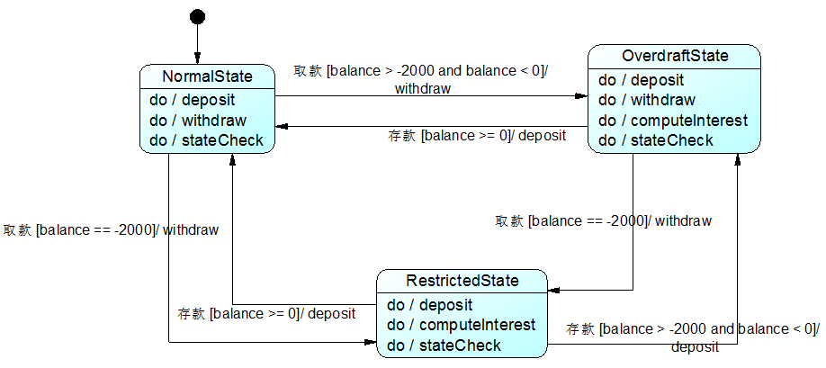

## 状态模式
“状态机（State Machine）”的实现方案。

#### 1. 案例： 银行系统中的账户类
对于一套信用卡业务系统，银行账户(Account)是该系统的核心类之一，其中，账户存在三种状态，且在不同状态下账户存在不同的行为。
* 余额大于等于 0，正常状态 (Normal State)。
* 余额小于 0，并且大于 -2000，透支状态 (Overdraft State)。
* 余额等于 -2000，受限状态 (Restricted State)。

UML(Unified Modeling Language)状态图：
<div align="center"></div>

代码框架
```java
class Account {
	private String state; //状态
	private int balance; //余额
	......
	
	//存款操作	
	public void deposit() {
		//存款
		stateCheck();	
	}
	
	//取款操作
	public void withdraw() {
		if (state.equalsIgnoreCase("NormalState") || state.equalsIgnoreCase("OverdraftState ")) {
			//取款
			stateCheck();
		}
		else {
			//取款受限
		}
	}
	
	//计算利息操作
	public void computeInterest() {
		if(state.equalsIgnoreCase("OverdraftState") || state.equalsIgnoreCase("RestrictedState ")) {
			//计算利息
		}
	}
	
	//状态检查和转换操作
	public void stateCheck() {
		if (balance >= 0) {
			state = "NormalState";
		}
		else if (balance > -2000 && balance < 0) {
			state = "OverdraftState";
		}
		else if (balance == -2000) {
			state = "RestrictedState";
		}
		else if (balance < -2000) {
			//操作受限
		}
	}
	......
}
```
问题
```
1. 忘记中介者模式要解决的问题了么？ （fc的过度耦合特性）
2. 职责链模式是怎样处理一连串的逻辑判断？
```

#### 2. 状态模式

##### 2.1 核心
```
1. 引入抽象状态类和具体状态类。
2. 操作行为分别封装在具体状态类中。 （对比职责链模式）
核心在于具体状态执行操作行为 （handle成员方法）。 （与命令模式的差异？ execute 方法的数量）
```
<div align="center"></div>

##### 2.2 代码框架
```java
# 1. 抽象状态类

abstract class State {
	//声明抽象业务方法，不同的具体状态类可以不同的实现
	public abstract void handle();
}

# 2. 具体状态

class ConcreteState extends State {
	public void handle() {
		//方法具体实现代码
	}
}

# 3. 环境类 （以注入方式获取具体状态）

class Context {
	private State state; //维持一个对抽象状态对象的引用
	private int value; //其他属性值，该属性值的变化可能会导致对象状态发生变化
 
	//设置状态对象
	public void setState(State state) {
		this.state = state;
	}
 
	public void request() {
		//其他代码
		state.handle(); //调用状态对象的业务方法
		//其他代码
	}
}

# 4. 主程序 （main）

方式 1： 统一由环境类来负责状态之间的转换。

public void changeState() {
	//判断属性值，根据属性值进行状态转换
	if (value == 0) {
		this.setState(new ConcreteStateA());
	}
	else if (value == 1) {
		this.setState(new ConcreteStateB());
	}
	......
}

方式 2： 由具体状态类来负责状态之间的转换。
（此时，状态类与环境类之间将存在依赖或关联关系，因为状态类需要访问环境类中的属性值。）

private Context ctx; //维持一个对环境对象实例的引用

public void changeState(Context ctx) {
	//根据环境对象中的属性值进行状态转换
	if (ctx.getValue() == 1) {
		ctx.setState(new ConcreteStateB());
	}
	else if (ctx.getValue() == 2) {
		ctx.setState(new ConcreteStateC());
	}
	......
}
```
补充说明
```
本实例中，环境类 Context 与抽象状态类 State 之间仅存在单向关联关系，
在实际使用时，它们之间可能存在更为复杂的双向关联关系。 （状态转换方式 2）
思考： 理解两种状态转换方式的异同？
```

#### 3. 使用状态模式重构银行系统的账户类
客户端只需要执行简单的存款和取款操作。Account 充当环境类角色，AccountState 充当抽象状态角色，NormalState、 OverdraftState 和 RestrictedState 充当具体状态角色。
<div align="center"></div>

代码框架
```java
# 1. 抽象状态类

//抽象状态类
abstract class AccountState {
	protected Account acc;
	public abstract void deposit(double amount);
	public abstract void withdraw(double amount);
	public abstract void computeInterest();
	public abstract void stateCheck();
}

# 2. 具体状态

//正常状态：具体状态类
class NormalState extends AccountState {
	public NormalState(Account acc) {
		this.acc = acc;
	}
 
	public NormalState(AccountState state) {
		this.acc = state.acc;
	}
		
	public void deposit(double amount) {
		acc.setBalance(acc.getBalance() + amount);
		stateCheck();
	}
	
	public void withdraw(double amount) {
		acc.setBalance(acc.getBalance() - amount);
		stateCheck();
	}
	
	public void computeInterest()
	{
		System.out.println("正常状态，无须支付利息！");
	}
	
	//状态转换
	public void stateCheck() {
		if (acc.getBalance() > -2000 && acc.getBalance() <= 0) {
			acc.setState(new OverdraftState(this));
		}
		else if (acc.getBalance() == -2000) {
			acc.setState(new RestrictedState(this));
		}
		else if (acc.getBalance() < -2000) {
			System.out.println("操作受限！");
		}	
	}   
}  
 
//透支状态：具体状态类
class OverdraftState extends AccountState
{
	public OverdraftState(AccountState state) {
		this.acc = state.acc;
	}
	
	public void deposit(double amount) {
		acc.setBalance(acc.getBalance() + amount);
		stateCheck();
	}
	
	public void withdraw(double amount) {
		acc.setBalance(acc.getBalance() - amount);
		stateCheck();
	}
	
	public void computeInterest() {
		System.out.println("计算利息！");
	}
	
	//状态转换
	public void stateCheck() {
		if (acc.getBalance() > 0) {
			acc.setState(new NormalState(this));
		}
		else if (acc.getBalance() == -2000) {
			acc.setState(new RestrictedState(this));
		}
		else if (acc.getBalance() < -2000) {
			System.out.println("操作受限！");
		}
	}
}
 
//受限状态：具体状态类
class RestrictedState extends AccountState {
	public RestrictedState(AccountState state) {
		this.acc = state.acc;
	}
	
	public void deposit(double amount) {
		acc.setBalance(acc.getBalance() + amount);
		stateCheck();
	}
	
	public void withdraw(double amount) {
		System.out.println("帐号受限，取款失败");
	}
	
	public void computeInterest() {
		System.out.println("计算利息！");
	}
	
	//状态转换
	public void stateCheck() {
		if(acc.getBalance() > 0) {
			acc.setState(new NormalState(this));
		}
		else if(acc.getBalance() > -2000) {
			acc.setState(new OverdraftState(this));
		}
	}
}

# 3. 银行账户 （环境类）

//银行账户：环境类
class Account {
	private AccountState state; //维持一个对抽象状态对象的引用
	private String owner; //开户名
	private double balance = 0; //账户余额
	
	public Account(String owner,double init) {
		this.owner = owner;
		this.balance = balance;
		this.state = new NormalState(this); //设置初始状态
		System.out.println(this.owner + "开户，初始金额为" + init);	
		System.out.println("---------------------------------------------");	
	}
	
	public double getBalance() {
		return this.balance;
	}
	
	public void setBalance(double balance) {
		this.balance = balance;
	}
	
	public void setState(AccountState state) {
		this.state = state;
	}
	
	public void deposit(double amount) {
		System.out.println(this.owner + "存款" + amount);
		state.deposit(amount); //调用状态对象的deposit()方法
		System.out.println("现在余额为"+ this.balance);
		System.out.println("现在帐户状态为"+ this.state.getClass().getName());
		System.out.println("---------------------------------------------");			
	}
	
	public void withdraw(double amount) {
		System.out.println(this.owner + "取款" + amount);
		state.withdraw(amount); //调用状态对象的withdraw()方法
		System.out.println("现在余额为"+ this.balance);
		System.out.println("现在帐户状态为"+ this. state.getClass().getName());		
		System.out.println("---------------------------------------------");
	}
	
	public void computeInterest()
	{
		state.computeInterest(); //调用状态对象的computeInterest()方法
	}
}

# 4. 主程序 （main）

class Client {
	public static void main(String args[]) {
		Account acc = new Account("段誉",0.0);
		acc.deposit(1000);
		acc.withdraw(2000);
		acc.deposit(3000);
		acc.withdraw(4000);
		acc.withdraw(1000);
		acc.computeInterest();
	}
}
```

#### 4. 共享状态
多个环境对象需要共享同一个状态（状态一致性）的情况在现实中一定会发生。
此时，将状态对象定义为环境类的静态成员对象。  (静态属性的“一致性”特性，单例模式也是基于此特性。)

案例： 一个电器可以被两个开关控制。
<div align="center"></div>

代码框架
```java
# 1. 抽象状态类

abstract class State {
	public abstract void on(Switch s);
	public abstract void off(Switch s);
}

# 2. 具体状态


//打开状态
class OnState extends State {
	public void on(Switch s) {
		System.out.println("已经打开！");
	}
	
	public void off(Switch s) {
		System.out.println("关闭！");
		s.setState(Switch.getState("off"));
	}
}
 
//关闭状态
class OffState extends State {
	public void on(Switch s) {
		System.out.println("打开！");
		s.setState(Switch.getState("on"));
	}
	
	public void off(Switch s) {
		System.out.println("已经关闭！");
	}
}

# 3. 开关 （环境类）

class Switch {
	private static State state,onState,offState; //定义三个静态的状态对象 （静态属性的一致性特点）
	private String name;
	
	public Switch(String name) {
		this.name = name;
		onState = new OnState();
		offState = new OffState();
		this.state = onState;
	}
 
	public void setState(State state) {
		this.state = state;
	}
 
	public static State getState(String type) {
		if (type.equalsIgnoreCase("on")) {
			return onState;
		}
		else {
			return offState;
		}
	}
		
	//打开开关
	public void on() {
		System.out.print(name);
		state.on(this);
	}
	
	//关闭开关
	public void off() {
		System.out.print(name);
		state.off(this);
	}
}

# 4. 主程序 （main）

class Client {
	public static void main(String args[]) {
		Switch s1,s2;
		s1=new Switch("开关1");
		s2=new Switch("开关2");
		
		s1.on();
		s2.on();
		s1.off();
		s2.off();
		s2.on();
		s1.on();	
	}
}
```

#### 5. 使用环境类实现状态转换
以具体状态类调用环境类 Context 的 setState() 方法进行状态的转换操作，此时，增加新的具体状态类可能需要修改其他具体状态类或者环境类的源代码。 （违反 “开闭原则”。）

通过环境类统一实现各种状态之间的转换操作。 案例： 屏幕放大镜。
<div align="center"></div>

代码框架
```java
# 1. 抽象状态类

//抽象状态类
abstract class State {
	public abstract void display();
}

# 2. 具体状态

//正常状态类
class NormalState extends State{
	public void display() {
		System.out.println("正常大小！");
	}
}
 
//二倍状态类
class LargerState extends State{
	public void display() {
		System.out.println("二倍大小！");
	}
}
 
//四倍状态类
class LargestState extends State{
	public void display() {
		System.out.println("四倍大小！");
	}
}

# 3. 屏幕放大镜 （环境类）

//屏幕类
class Screen {
	//枚举所有的状态，currentState表示当前状态
	private State currentState, normalState, largerState, largestState;
 
	public Screen() {
		this.normalState = new NormalState(); //创建正常状态对象
		this.largerState = new LargerState(); //创建二倍放大状态对象
		this.largestState = new LargestState(); //创建四倍放大状态对象
		this.currentState = normalState; //设置初始状态
		this.currentState.display();
	}
	
	public void setState(State state) {
		this.currentState = state;
	}
	
	//单击事件处理方法，封转了对状态类中业务方法的调用和状态的转换
	public void onClick() {
		if (this.currentState == normalState) {
			this.setState(largerState);
			this.currentState.display();
		}
		else if (this.currentState == largerState) {
			this.setState(largestState);
			this.currentState.display();
		}
		else if (this.currentState == largestState) {
			this.setState(normalState);
			this.currentState.display();
		}
	}
}

# 4. 主程序 （main）

class Client {
	public static void main(String args[]) {
		Screen screen = new Screen();
		screen.onClick();
		screen.onClick();
		screen.onClick();
	}
}
```
思考
```
此时添加新的具体状态是否违反 “开闭原则”？
增加新的具体状态时，同时定义一个新的环境类即可。 （是否与职责链模式的扩展有些相似）
```

#### 6. 本模式优缺点
实际开发中，状态模式具有较高的使用频率，在工作流和游戏开发中状态模式都得到了广泛的应用，例如公文状态的转换、游戏中角色的升级等。
```
优：
▪ 状态转换规则的封装。 （环境类或者具体状态类中。请优先考虑在环境类中统一/集中管理。）
▪ 将状态有关的行为放置于一个类中。 （命令模式也有此特点）
▪ 避免了，在庞大的条件语句来将**业务方法**和**状态转换代码**交织在一起。 （职责链模式也有此特点，但是状态管理方式采用非集中式）
缺：
▪ 使用不当将导致程序结构和代码的混乱。
▪ 状态模式对 “开闭原则” 的支持并不太好，增加新的状态类需要修改那些负责状态转换的源代码。
```
适用场景
```
▫ 对象的行为依赖其状态，同时对状态的变动与扩展性有要求。
```
