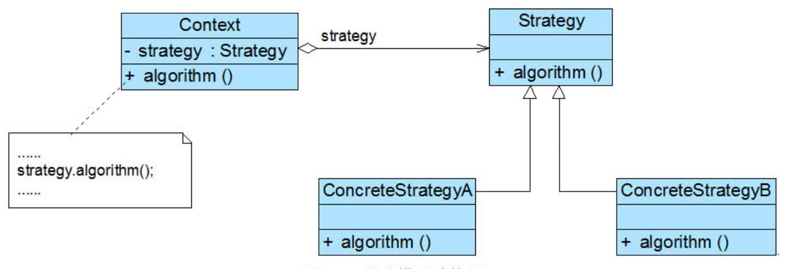
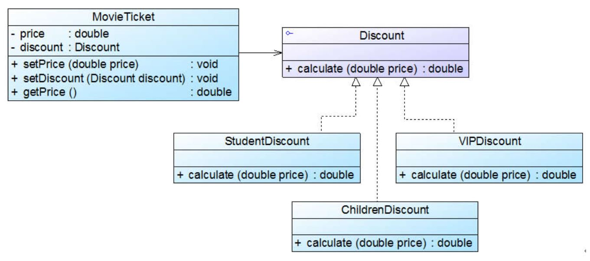
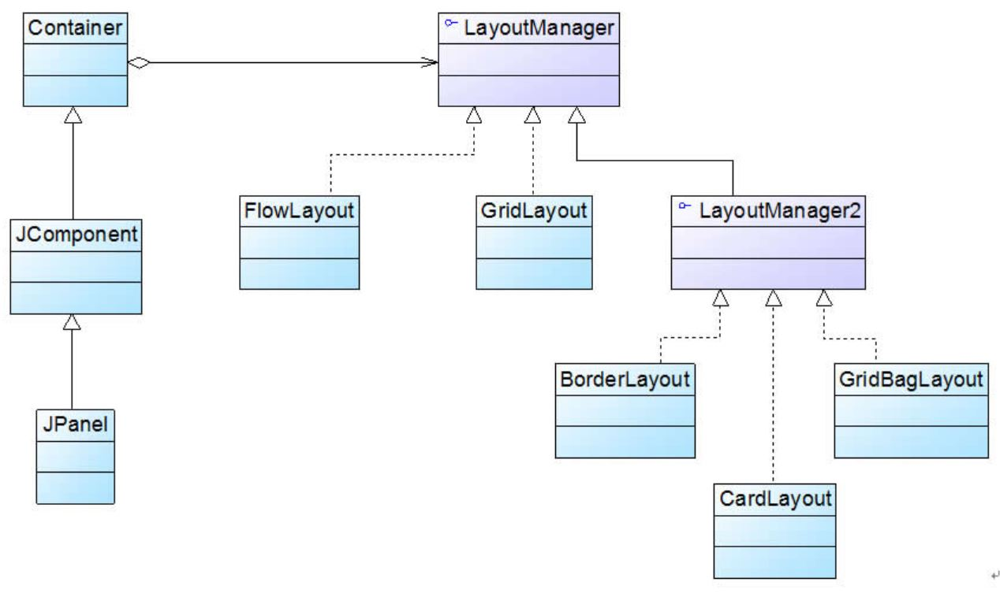
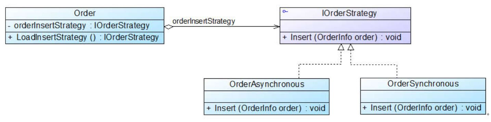

## 策略模式
“算法的封装与切换。”

#### 1. 案例： 电影票打折方案
影院售票系统，通常需要为不同类型的用户提供不同的电影票打折方式。
* 学生凭学生证可享受票价 8 折优惠。
* 年龄在 10 周岁及以下的儿童可享受每张票减免 10 元的优惠（原始票价需大于等于 20 元）。
* 影院 VIP 用户除享受票价半价优惠外还可进行积分，积分累计到一定额度可换取电影院赠送的奖品。

实现思路： 设计一个电影票类 MovieTicket。（对比状态模式的初始实现思路。）

代码框架
```java
# 1. 电影票类 MovieTicket

//电影票类
class MovieTicket {
	private double price; //电影票价格
	private String type; //电影票类型
	
	public void setPrice(double price) {
		this.price = price;
	}
	
	public void setType(String type) {
		this.type = type;
	}
	
	public double getPrice() {
		return this.calculate();
	}
	
	//计算打折之后的票价
	public double calculate() {
		//学生票折后票价计算
		if(this.type.equalsIgnoreCase("student")) {
			System.out.println("学生票：");
			return this.price * 0.8;
		}
		//儿童票折后票价计算
		else if(this.type.equalsIgnoreCase("children") && this.price >= 20 ) {
			System.out.println("儿童票：");
			return this.price - 10;
		}
		//VIP票折后票价计算
		else if(this.type.equalsIgnoreCase("vip")) {
			System.out.println("VIP票：");
			System.out.println("增加积分！");
			return this.price * 0.5;
		}
		else {
			return this.price; //如果不满足任何打折要求，则返回原始票价
		}
	}
}

# 2. 主程序 （main）

class Client {
	public static void main(String args[]) {
		MovieTicket mt = new MovieTicket();
		double originalPrice = 60.0; //原始票价
		double currentPrice; //折后价
		
		mt.setPrice(originalPrice);
		System.out.println("原始价为：" + originalPrice);
		System.out.println("---------------------------------");
			
		mt.setType("student"); //学生票
		currentPrice = mt.getPrice();
		System.out.println("折后价为：" + currentPrice);
		System.out.println("---------------------------------");
		
		mt.setType("children"); //儿童票
		currentPrice = mt.getPrice();
		System.out.println("折后价为：" + currentPrice);
	}
}
```
存在的问题
```
1. MovieTicket 类的 calculate() 方法非常庞大，包含各种打折算法的实现代码，还有链式判断逻辑。
2. 增加新的打折算法或者对原有打折算法进行修改时必须修改 MovieTicket 类的源代码，违反了“开闭原则”。 （其实增加新的票类就好，微笑.）
3. 算法的复用性差，主要依赖对源代码的复制粘贴来重用。
```
思考
```
职责链模式、命令模式、中介模式、观察者模式、状态模式，这些模式所要解决的问题由什么引起？
根本原因都是一个或几个类的职责过重，因此，对这些类的职责进行分解，然后集中于一个类或者分散于多个具体类。
```

#### 2. 策略模式
策略模式，定义一个/多个抽象的策略类来封装不同的算法，每一个具体策略类封装一种具体的算法。 策略模式的结构并不复杂，但需要理解其中环境类 Context 的作用。
<div align="center"></div>

环境类是使用算法的角色，它在解决某个问题（即实现某个方法）时采用/调用对应策略。

代码框架
```java
# 1. 抽象策略类

abstract class AbstractStrategy {
	public abstract void algorithm(); //声明抽象算法
}

# 2. 具体策略

class ConcreteStrategyA extends AbstractStrategy {
	//算法的具体实现
	public void algorithm() {
		//算法A
	}
}

# 3. 环境类 （通过注入方式获取策略对象）

class Context {
	private AbstractStrategy strategy; //维持一个对抽象策略类的引用
 
	public void setStrategy(AbstractStrategy strategy) {
		this.strategy = strategy;
	}
 
	//调用策略类中的算法
	public void algorithm() {
		strategy.algorithm();
	}
}

# 4. 主程序 （main）

Context context = new Context();
AbstractStrategy strategy;
strategy = new ConcreteStrategyA(); //可在运行时指定类型
context.setStrategy(strategy);
context.algorithm();
```

#### 3. 使用策略模式重构电影票打折方案
MovieTicket 充当环境类角色，Discount 充当抽象策略角色，StudentDiscount、 ChildrenDiscount 和 VIPDiscount 充当具体策略角色。
<div align="center"></div>

代码框架
```java
# 1. 环境类

//电影票类：环境类
class MovieTicket {
	private double price;
	private Discount discount; //维持一个对抽象折扣类的引用
 
	public void setPrice(double price) {
		this.price = price;
	}
 
	//注入一个折扣类对象
	public void setDiscount(Discount discount) {
		this.discount = discount;
	}
 
	public double getPrice() {
		//调用折扣类的折扣价计算方法
		return discount.calculate(this.price);
	}
}

# 2. 抽象策略类

//折扣类：抽象策略类
interface Discount {
	public double calculate(double price);
}

# 3. 具体策略

//学生票折扣类：具体策略类
class StudentDiscount implements Discount {
	public double calculate(double price) {
		System.out.println("学生票：");
		return price * 0.8;
	}
} 
 
//儿童票折扣类：具体策略类
class ChildrenDiscount implements Discount {
	public double calculate(double price) {
		System.out.println("儿童票：");
		return price - 10;
	}
} 
 
//VIP会员票折扣类：具体策略类
class VIPDiscount implements Discount {
	public double calculate(double price) {
		System.out.println("VIP票：");
		System.out.println("增加积分！");
		return price * 0.5;
	}
}

# 4. 配置文件及 XMLUtil 工具类

<?xml version="1.0"?>
<config>
    <className>StudentDiscount</className>
</config>

import javax.xml.parsers.*;
import org.w3c.dom.*;
import org.xml.sax.SAXException;
import java.io.*;
class XMLUtil {
	//该方法用于从XML配置文件中提取具体类类名，并返回一个实例对象
	public static Object getBean() {
		try {
			//创建文档对象
			DocumentBuilderFactory dFactory = DocumentBuilderFactory.newInstance();
			DocumentBuilder builder = dFactory.newDocumentBuilder();
			Document doc;							
			doc = builder.parse(new File("config.xml")); 
		
			//获取包含类名的文本节点
			NodeList nl = doc.getElementsByTagName("className");
			Node classNode = nl.item(0).getFirstChild();
			String cName = classNode.getNodeValue();
            
			//通过类名生成实例对象并将其返回
			Class c = Class.forName(cName);
			Object obj = c.newInstance();
			return obj;
		}   
		catch(Exception e) {
			e.printStackTrace();
			return null;
		}
	}
}

# 5. 主程序 （main）

class Client {
	public static void main(String args[]) {
		MovieTicket mt = new MovieTicket();
		double originalPrice = 60.0;
		double currentPrice;
		
		mt.setPrice(originalPrice);
		System.out.println("原始价为：" + originalPrice);
		System.out.println("---------------------------------");
			
		Discount discount;
		discount = (Discount)XMLUtil.getBean(); //读取配置文件并反射生成具体折扣对象
		mt.setDiscount(discount); //注入折扣对象
		
		currentPrice = mt.getPrice();
		System.out.println("折后价为：" + currentPrice);
	}
}
```

#### 4. 策略模式的两个典型应用

##### 4.1 Java SE 容器布局管理
<div align="center"></div>

Container 类充当环境角色 Context，而 LayoutManager 作为所有布局类的公共父类扮演了抽象策略角色。 对客户端而言，只需要使用 Container 类提供的 setLayout() 方法就可设置任何具体布局方式。
（曾经的 Borland 公司，在 JBuilder 中提供了一种新的布局方式—— XYLayout，作为对 JDK 提供的 Layout 类的补充。）

Container 类的代码片段
```java
public class Container extends Component {
	......
	LayoutManager layoutMgr;//维持一个抽象策略的引用
	......
	//以注入方式获得一个具体策略
	public void setLayout(LayoutManager mgr) {
		layoutMgr = mgr;
		......
	}
	......
}
```

##### 4.2 微软 PetShop 处理同步订单和异步订单
PetShop 的 BLL（Business Logic Layer，业务逻辑层） 子项目/模块中有一个 OrderAsynchronous 类和一个 OrderSynchronous 类，它们都继承自 IOrderStrategy 接口。
<div align="center"></div>

#### 5. 本模式优缺点
策略模式是应用较为广泛的设计模式之一。 只要涉及到算法的封装、复用和切换都可以考虑使用策略模式。
```
优：
▪ 策略类的等级结构定义了一个算法或行为族。
▪ 可以避免多重条件选择语句。
缺：
▪ 客户端必须知道所有的策略类，并自行决定使用哪一个策略类。
▪ 无法同时在客户端使用多个策略类。
```
适用场景
```
▫ 一个对象有多种行为。 （使用多重条件选择？）
```
