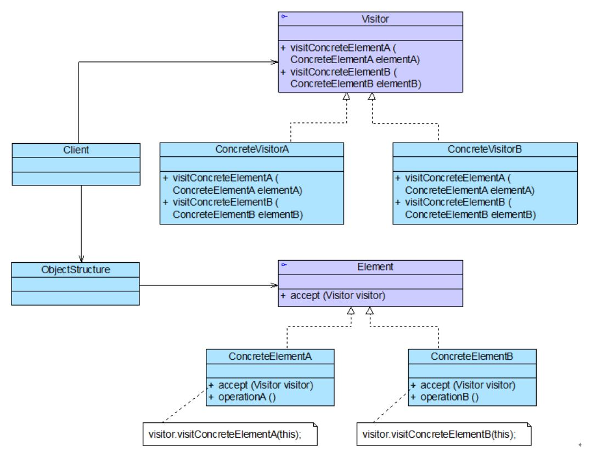
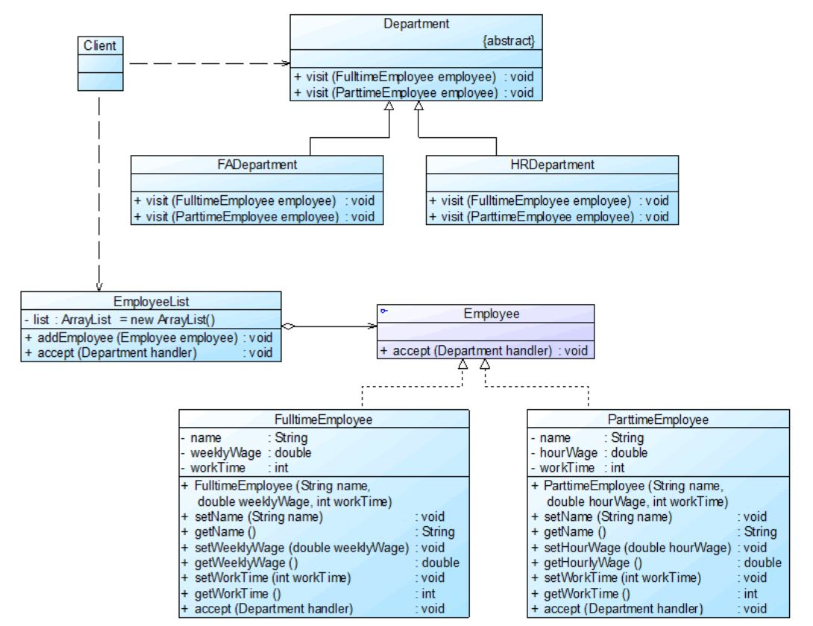
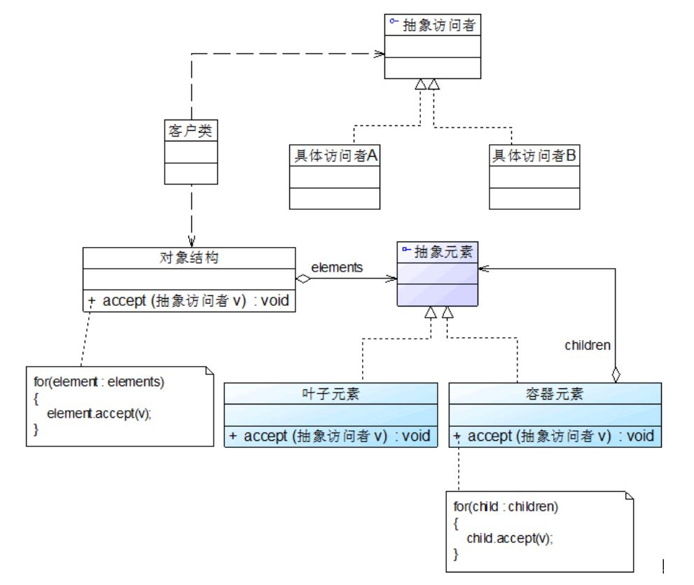

## 访问者模式
以 “信息表单/集合” 驱动的行为系统。 （与状态模式不同，信息集合内的成员属性可被修改。 ——“无限状态”）

#### 1. 案例： 员工信息管理系统中的员工数据汇总
员工类型包括正式员工和临时工，汇总数据包括员工工作时间、员工工资等。

工作考核制度如下：
* 正式员工 (Full time Employee) 每周工作时间为 40 小时，不同级别、不同部门的员工每周基本工资不同。
  如超过 40 小时，超出部分按照 100 元/小时作为加班费。如少于 40 小时，所缺时间按请假处理，请假所扣工资以 80 元/小时计算，直至基本工资扣除到零为止。
* 临时工 (Part time Employee) 每周工作时间不固定，基本工资按小时计算，不同岗位的临时工小时工资不同。

人力资源部和财务部根据各自的需要对员工数据进行汇总处理，人力资源部负责汇总每周员工工作时间，而财务部负责计算每周员工工资。

代码框架
```java
class EmployeeList
{
	private ArrayList<Employee> list = new ArrayList<Employee>(); //员工集合
 
	//增加员工
	public void addEmployee(Employee employee) 
	{
		list.add(employee);
	}
    
	//处理员工数据 (数据汇总工作)
	public void handle(String departmentName)
	{
		if (departmentName.equalsIgnoreCase("财务部")) //财务部处理员工数据
		{
			for (Object obj : list)
			{
				if (obj.getClass().getName().equalsIgnoreCase("FulltimeEmployee"))
				{
					System.out.println("财务部处理全职员工数据！");			
				}
				else 
				{
					System.out.println("财务部处理兼职员工数据！");
				}
			}
		}
		else if (departmentName.equalsIgnoreCase("人力资源部")) //人力资源部处理员工数据
		{
			for (Object obj : list)
			{
				if (obj.getClass().getName().equalsIgnoreCase("FulltimeEmployee"))
				{
					System.out.println("人力资源部处理全职员工数据！");					
				}
				else 
				{
					System.out.println("人力资源部处理兼职员工数据！");
				}
			}			
		}
	}
}
```
以上方案的问题
```
1. 包含职责过重。
2. 链式 if…else… 判断逻辑。
3. 审计部门、员工类型、汇总/考核内容扩展性差。
```

#### 2. 访问者模式
访问者模式包含 “访问者” 和 “被访问元素” 两个主要组成部分。 通常，被访问的元素具有不同的类型，且不同的访问者可以对它们进行不同的访问操作。
被访问元素通常不是单独存在的，它们存储在一个集合中，这个集合被称为 **“对象结构”**。

##### 2.1 核心
```
1. Vistor （抽象访问者）
   为每一个具体元素类 ConcreteElement 声明一个访问操作。 （访问操作行为的集合 —— 接口）
2. Element （抽象元素）
   定义一个 accept() 方法，以一个抽象访问者作为参数。
3. ConcreteElement （具体元素）
   实现抽象类的 accept() 方法，在 accept() 方法中调用访问者的访问方法完成对本元素的访问操作。
4. ObjectStructure （对象结构）
   一个元素集合，用于存放具体元素对象，提供遍历其内部元素的方法 。
   （可结合 “组合模式” 来实现，或使用简单的集合对象，如 List、Set。）
```
<div align="center"></div>

##### 2.2 代码框架
“访问者模式将系统/业务划分为： 访问行为 + 访问内容。 访问者的层次结构对应访问行为，元素类的层次结构对应访问内容。”

```
1. 注意： 元素类是针对抽象访问者进行编程。
2. ** “双重分派” 机制 **： 
    元素类针对抽象访问者编程，调用抽象访问者的 visit() 方法；
    具体访问者在实现 visit() 方法时， 调用具体元素类的 operation() 业务方法。
```

代码框架
```java
# 1. 抽象访问者

abstract class Visitor
{
	public abstract void visit(ConcreteElementA elementA);//访问具体元素A
	public abstract void visit(ConcreteElementB elementB);//访问具体元素B
	public void visit(ConcreteElementC elementC) //访问具体元素C
	{
		//元素ConcreteElementC操作代码
	}
}

# 2. 抽象元素

interface Element
{
	public void accept(Visitor visitor);
}

# 3. 具体元素

class ConcreteElementA implements Element
{
	public void accept(Visitor visitor)
	{
		visitor.visit(this); // **“双重分派”**： accept() -> visit() -> operationA()
	}
	
	public void operationA()
	{
		//业务方法
	}
}

# 4. 具体访问者

class ConcreteVisitor extends Visitor
{
	public void visit(ConcreteElementA elementA)
	{
		//元素ConcreteElementA操作代码
		elementA.operationA(); //业务方法 （**“双重分派”**）
	}
	public void visit(ConcreteElementB elementB)
	{
		//元素ConcreteElementB操作代码
	}
}

# 5. 对象结构


class ObjectStructure
{
	private ArrayList<Element> list = new ArrayList<Element>(); //定义一个集合用于存储元素对象
 
	public void accept(Visitor visitor)
	{
		Iterator i = list.iterator();
		
		while(i.hasNext())
		{
			((Element)i.next()).accept(visitor); //遍历访问集合中的每一个元素
		}
	}
 
	public void addElement(Element element)
	{
		list.add(element);
	}
 
	public void removeElement(Element element)
	{
		list.remove(element);
	}
}
```
在对象结构中，使用迭代器对存储在集合中的元素对象进行遍历，逐个调用每一个元素对象的 accept() 方法。

#### 3. 使用访问者模式重构员工考核系统
FADepartment 表示财务部，HRDepartment 表示人力资源部，它们充当具体访问者角色，其抽象父类 Department 充当抽象访问者角色。
FulltimeEmployee 表示正式员工，ParttimeEmployee 表示临时工，它们充当具体元素角色，其抽象父类 Employee 充当抽象元素角色。
EmployeeList 充当对象结构，用于存储员工列表。
<div align="center"></div>

代码框架
```java
# 1. 抽象元素类

//员工类：抽象元素类
interface Employee
{
	public void accept(Department handler); //接受一个抽象访问者访问
}

# 2. 具体元素

//全职员工类：具体元素类
class FulltimeEmployee implements Employee
{
	private String name;
	private double weeklyWage;
	private int workTime;
 
	public FulltimeEmployee(String name,double weeklyWage,int workTime)
	{
		this.name = name;
		this.weeklyWage = weeklyWage;
		this.workTime = workTime;
	}	

	//业务方法
	public void setName(String name) 
	{
		this.name = name; 
	}
 
	public void setWeeklyWage(double weeklyWage) 
	{
		this.weeklyWage = weeklyWage; 
	}
 
	public void setWorkTime(int workTime) 
	{
		this.workTime = workTime; 
	}
 
	public String getName() 
	{
		return (this.name); 
	}
 
	public double getWeeklyWage() 
	{
		return (this.weeklyWage); 
	}
 
	public int getWorkTime() 
	{
		return (this.workTime); 
	}

	//accept()访问入口
	public void accept(Department handler)
	{
		handler.visit(this); //调用访问者的访问方法
	}
}
 
//兼职员工类：具体元素类
class ParttimeEmployee implements Employee
{
	private String name;
	private double hourWage;
	private int workTime;
 
	public ParttimeEmployee(String name,double hourWage,int workTime)
	{
		this.name = name;
		this.hourWage = hourWage;
		this.workTime = workTime;
	}	

	//业务方法
	public void setName(String name) 
	{
		this.name = name; 
	}
 
	public void setHourWage(double hourWage) 
	{
		this.hourWage = hourWage; 
	}
 
	public void setWorkTime(int workTime) 
	{
		this.workTime = workTime; 
	}
 
	public String getName() 
	{
		return (this.name); 
	}
 
	public double getHourWage() 
	{
		return (this.hourWage); 
	}
 
	public int getWorkTime() 
	{
		return (this.workTime); 
	}

	//accept()访问入口
	public void accept(Department handler)
	{
		handler.visit(this); //调用访问者的访问方法
	}
}

# 3. 抽象访问者

//部门类：抽象访问者类
abstract class Department
{
	//声明一组重载的访问方法，用于访问不同类型的具体元素
	public abstract void visit(FulltimeEmployee employee);
	public abstract void visit(ParttimeEmployee employee);	
}

# 4. 具体访问者

//财务部类：具体访问者类
class FADepartment extends Department
{
	//实现财务部对全职员工的访问
	public void visit(FulltimeEmployee employee)
	{
		int workTime = employee.getWorkTime();
		double weekWage = employee.getWeeklyWage();
		if(workTime > 40)
		{
			weekWage = weekWage + (workTime - 40) * 100;
		}
		else if(workTime < 40)
		{
			weekWage = weekWage - (40 - workTime) * 80;
			if(weekWage < 0)
			{
				weekWage = 0;
			}
		}
		System.out.println("正式员工" + employee.getName() + "实际工资为：" + weekWage + "元。");			
	}
 
	//实现财务部对兼职员工的访问
	public void visit(ParttimeEmployee employee)
	{
		int workTime = employee.getWorkTime();
		double hourWage = employee.getHourWage();
		System.out.println("临时工" + employee.getName() + "实际工资为：" + workTime * hourWage + "元。");		
	}		
}
 
//人力资源部类：具体访问者类
class HRDepartment extends Department
{
	//实现人力资源部对全职员工的访问
	public void visit(FulltimeEmployee employee)
	{
		int workTime = employee.getWorkTime();
		System.out.println("正式员工" + employee.getName() + "实际工作时间为：" + workTime + "小时。");
		if(workTime > 40)
		{
			System.out.println("正式员工" + employee.getName() + "加班时间为：" + (workTime - 40) + "小时。");
		}
		else if(workTime < 40)
		{
			System.out.println("正式员工" + employee.getName() + "请假时间为：" + (40 - workTime) + "小时。");
		}						
	}
 
	//实现人力资源部对兼职员工的访问
	public void visit(ParttimeEmployee employee)
	{
		int workTime = employee.getWorkTime();
		System.out.println("临时工" + employee.getName() + "实际工作时间为：" + workTime + "小时。");
	}		
}

# 5. 对象结构

//员工列表类：对象结构
class EmployeeList
{
	//定义一个集合用于存储员工对象
	private ArrayList<Employee> list = new ArrayList<Employee>();
 
	public void addEmployee(Employee employee)
	{
		list.add(employee);
	}
 
	//遍历访问员工集合中的每一个员工对象
	public void accept(Department handler)
	{
		for(Object obj : list)
		{
			((Employee)obj).accept(handler);
		}
	}
}

# 6. 主程序 （main）

<?xml version="1.0"?>
<config>
    <className>FADepartment</className>
</config>

class XMLUtil
{
	//该方法用于从XML配置文件中提取具体类类名，并返回一个实例对象
	public static Object getBean()
	{
		try
		{
			//创建文档对象
			DocumentBuilderFactory dFactory = DocumentBuilderFactory.newInstance();
			DocumentBuilder builder = dFactory.newDocumentBuilder();
			Document doc;							
			doc = builder.parse(new File("config.xml")); 
		
			//获取包含类名的文本节点
			NodeList nl = doc.getElementsByTagName("className");
			Node classNode = nl.item(0).getFirstChild();
			String cName = classNode.getNodeValue();
            
			//通过类名生成实例对象并将其返回
			Class c = Class.forName(cName);
			Object obj = c.newInstance();
			return obj;
		}   
		catch(Exception e)
		{
			e.printStackTrace();
			return null;
		}
	}
}

class Client
{
	public static void main(String args[])
	{
		EmployeeList list = new EmployeeList();
		Employee fte1,fte2,fte3,pte1,pte2;
 
		fte1 = new FulltimeEmployee("张无忌",3200.00,45);
		fte2 = new FulltimeEmployee("杨过",2000.00,40);
		fte3 = new FulltimeEmployee("段誉",2400.00,38);
		pte1 = new ParttimeEmployee("洪七公",80.00,20);
		pte2 = new ParttimeEmployee("郭靖",60.00,18);
 
		list.addEmployee(fte1);
		list.addEmployee(fte2);
		list.addEmployee(fte3);
		list.addEmployee(pte1);
		list.addEmployee(pte2);
 
		Department dep;
		dep = (Department)XMLUtil.getBean();
		list.accept(dep);
	}
}
```

思考
```
访问者模式是否符合“开闭原则”？ （从增加新的访问者和增加新的元素两方面考虑。）
(1) 增加一种新的访问者时，无需修改元素类与对象结构，符合“开闭原则”。
(2) 增加一种新的具体元素，需在原有的抽象访问者类和具体访问者类中增加相应的访问方法。
综上所述，访问者模式与抽象工厂模式类似，对“开闭原则”的支持具有倾斜性.
```

#### 4. 访问者模式与组合模式联用
对象结构是存储元素对象的集合，常使用迭代器来遍历对象结构。 其实，具体元素之间可以存在整体与部分关系，有些元素作为容器对象，有些元素作为成员对象，可以使用组合模式来组织元素。

##### 引入组合模式后的访问者模式结构图
<div align="center"></div>

提醒
```
要防止单独将已增加到容器元素中的叶子元素再次加入对象结构中。
```

#### 5. 本模式优缺点
访问者模式使用条件较为苛刻，本身结构也较为复杂。 当系统中存在一个较为复杂的对象结构时，考虑使用访问者模式。
在 XML 文档解析、编译器的设计、复杂集合对象的处理等领域访问者模式得到了一定的应用。
```
优：
▪ 增加新的访问操作很方便。 （但增加新的元素不方便。）
▪ 将访问行为集中到一个访问者对象中，而不是分散在一个个的元素类中。 （“双重分派” 机制，与状态模式和命令模式的区别。）
缺：
▪ 增加新的元素类很困难。
▪ 访问者模式要求访问者对象访问并调用每一个元素对象的操作，意味着元素对象有时候必须暴露一些自己的内部操作和内部状态。
  （“双重分派” 机制的缺点）
```
适用场景
```
▫ 对一个对象结构中的元素对象进行很多不同的并且不相关的操作。
```
