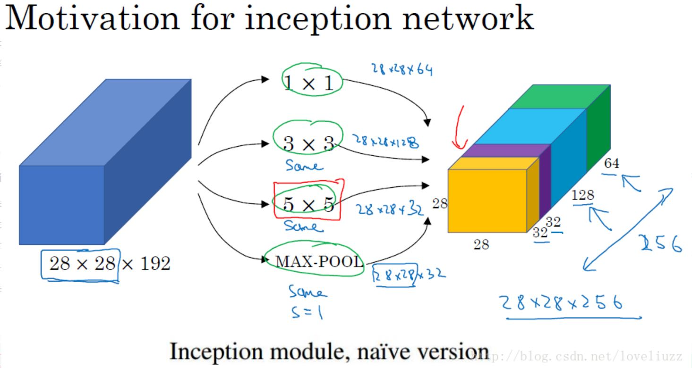
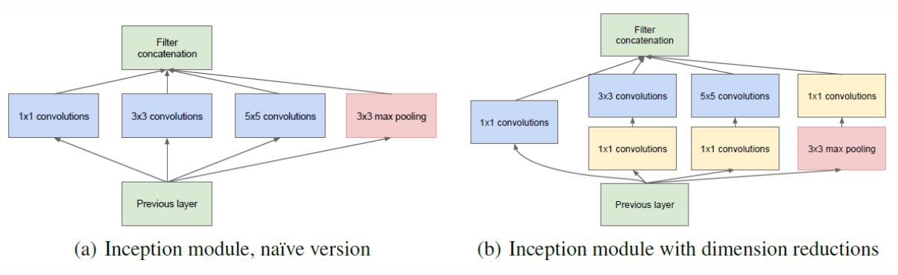

# Inception V3
***GoogLeNet 发展历程：***
* Inception v1 的网络，打破了常规的卷积层串联的模式，将 1x1，3x3，5x5 的卷积层和 3x3 的 pooling 池化层并联组合后 concatenate 组装在一起的设计思路。
* Inception v2 的网络在 Inception v1 的基础上，进行了改进，一方面了加入了 BN 层，减少了 Internal Covariate Shift （内部神经元分布的改变），使每一层的输出都规范化到一个 N(0, 1) 的高斯，还去除了 Dropout、 LRN 等结构；另外一方面学习 VGG 用 2 个 3x3 的卷积替代 inception 模块中的 5x5 卷积，既降低了参数数量，又加速计算。
* Inception v3 一个最重要的改进是分解（Factorization），将 7x7 分解成两个一维的卷积 （1x7,7x1），3x3 也是一样 （1x3,3x1）。这样的好处，既可以加速计算（多余的计算能力可以用来加深网络），又可以将 1 个 conv 拆成 2 个 conv，使得网络深度进一步增加，增加了网络的非线性，可以处理更多更丰富的空间特征，增加特征多样性。还有值得注意的地方是网络输入从 224x224 变为了 299x299，更加精细设计了 35x35/17x17/8x8 的模块。
* Inception v4 结合了微软的 ResNet，发现 ResNet 的结构可以极大地加速训练，同时性能也有提升，得到一个 Inception-ResNet v2 网络，同时还设计了一个更深更优化的 Inception v4 模型，能达到与 Inception-ResNet v2 相媲美的性能。

#### 起源
_获得高质量模型最保险的做法就是: 增加模型的**深度**（层数）或者**宽度**（层核或者神经元数）_

一般设计思路的情况下会出现如下的缺陷:
* 参数太多，若训练数据集有限，容易过拟合。
* 网络越大计算复杂度越大，难以应用。
* 网络越深，梯度越往后穿越容易消失，难以优化模型。

解决上述缺点的根本方法是：
* 将全连接甚至一般的卷积都转化为<b><i>稀疏连接</i></b>

###### 为了**打破网络对称性**和**提高学习能力**，传统的网络都使用了**随机稀疏连接**。但是，计算机软硬件对非均匀稀疏数据的计算效率很差，所以在 AlexNet 中又重新启用了全连接层，目的是为了更好地优化并行运算。

###### ***TODO:*** 现在的问题是有没有一种方法，既能保持网络结构的稀疏性，又能利用密集矩阵的高计算性能。

#### ***Inception 模块***
***Inception 架构的主要思想是找出如何用密集成分来近似最优的局部稀疏结***

**Naive Inception Module**  

* 采用不同大小的卷积核意味着不同大小的感受野，最后拼接意味着不同尺度特征的融合。
* 另外多处表明 pooling 挺有效，所以 Inception 里面也嵌入了 pooling。
* 网络越到后面特征越抽象，且每个特征涉及的感受野也更大，随着层数的增加，3x3 和 5x5 卷积的比例也要增加。

**使用 1x1 conv 降维**  

###### ***Inception 的作用***：代替人工确定卷积层中的过滤器类型或者确定是否需要创建卷积层和池化层。即：不需要人为的决定使用哪个过滤器，是否需要池化层等，由网络自行决定这些参数。

###### reference
[1] https://blog.csdn.net/loveliuzz/article/details/79135583
