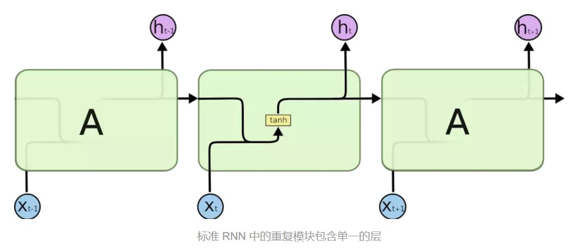
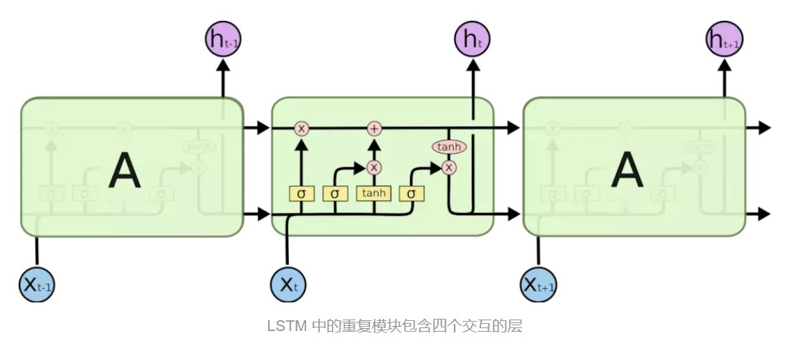
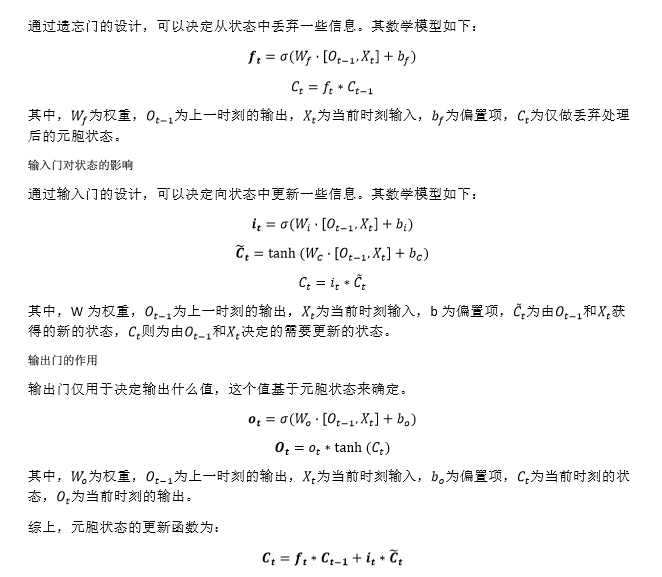

# LSTM（Long Short Term Memory）

## RNN（Recurrent Neural Networks）
人们的每次思考并不都是从零开始的。在阅读这篇文章时，你基于对前面的文字的理解来理解你目前阅读到的文字。RNN 解决了这个问题。RNN 是包含循环的网络，允许信息的持久化。RNN 网络具有记忆特性。

在普通的 RNN 中，重复模块结构非常简单，例如只有一个 tanh 层：

<p align="center">

</p>

RNN 模型涉及到一个问题： 相关信息和当前预测位置之间的间隔大小问题。


## 长期依赖 (Long-Term Dependencies) 问题

理论上说，RNN 是有能力来处理这种长期依赖 (Long Term Dependencies) 的。人们可以通过精心调参来构建模型处理一个这种玩具问题 (Toy Problem) 。不过，在实际问题中，RNN 并没有能力来学习这些。

**LSTM** 全称为长短期记忆网络 (Long Short Term Memory networks) ，是一种特殊的 RNN，能够学习到长期依赖关系。LSTM 通过刻意的设计来避免长期依赖问题。记住长期的信息在实践中是 LSTM 的默认行为，而非需要付出很大代价才能获得的能力！

LSTM 的重复模块中有 4 个神经网络层，并且他们之间的交互非常特别：

<p align="center">

</p>


## LSTM 的核心思想

#### 1. 元胞状态

LSTM 的关键是元胞状态 (Cell State) ，即横穿整个元胞顶部的水平线。细胞状态类似于传送带。直接在整个链上运行，只有一些少量的线性交互。信息在上面流传保持不变会很容易。

#### 2. 门

LSTM 有通过精心设计的称作为 “门” 的结构来去除或者增加信息到细胞状态的能力。门是一种选择性让信息通过的方法。它们由一个 Sigmoid 神经网络层和一个按位的乘法操作组成。

Sigmoid 层输出 0~1 之间的值，每个值表示对应的部分信息是否应该通过。 0 值表示不允许信息通过，1 值表示让所有信息通过。一个 LSTM 有 3 个这种门，来保护和控制元胞状态。


## LSTM 的三个门

#### 1· 遗忘门
LSTM 的第一步是决定我们将要从元胞状态中扔掉哪些信息。该决定由一个叫做 “遗忘门 (Forget Gate)” 的 Sigmoid 层控制。

*下一步是决定我们将会把哪些新信息存储到元胞状态中。这一步分为两部分：计算新特征和通过判定。*

#### 2. 输入门
首先，有一个叫做 “输入门 (Input Gate)” 的 Sigmoid 层决定我们要更新哪些信息。接下来，一个 tanh 层创造了一个新的候选值，该值可能被加入到元胞状态中。

*最后，我们需要决定最终的输出。*

#### 3. 输出门
首先我们建立一个 Sigmoid 层的输出门 (Output Gate)，来决定我们将输出元胞的哪些部分。然后我们将元胞状态通过 tanh 之后（使得输出值在 -1 到 1 之间），与输出门相乘，这样我们只会输出我们想输出的部分。

### 公式推导

<div align="center">

</div>

### 代码实现
```python
import numpy as np


def sigmoid(x):
    return 1 / (1 + np.exp(-x))


def tanh(x):
    return (np.exp(x) - np.exp(-x)) / (np.exp(x) + np.exp(-x))


class BasicLSTMCell(object):
    
    def __init__(self,
                 num_units,
                 forget_bias=1.0,
                 activation=tanh):
        self._num_units = num_units
        self._forget_bias = forget_bias
        self._activation = activation

    def build(self, inputs_shape):
        if inputs_shape[1] is None:
            raise ValueError("Expected inputs.shape[-1] to be known, saw shape: {}".format(inputs_shape))
        input_depth = inputs_shape[1]
        h_depth = self._num_units

        #此处，定义四组权重和偏置项，分别对应于遗忘门（1组）、输入门（2组）、输出门（1组）的权重和偏置项。
        #注意！此处为随机生成权重和偏置项，仅用于模拟计算过程而使用。
        self._kernel = np.random.rand(input_depth + h_depth, 4*self._num_units)
        self._bias = np.random.rand(4*self._num_units)

    def forward(self, inputs, state):
        """
        inputs: `2-D` tensor with shape `[batch_size, input_size]`.
        state: `2-D` tensor with shape `[batch_size, 2 * num_units]`.
        """
        c, h = np.split(state, 2, 1)
        #门计算
        gate_inputs = np.dot(np.concatenate([inputs, h], 1), self._kernel) + self._bias
        #i = input_gate, j = new_input, f = forget_gate, o = output_gate
        i, j, f, o = np.split(gate_inputs, 4, 1)
        #更新状态：new_c = c*sigmoid（f+bias) + sigmoid(i)*tanh(o)
        new_c = c * sigmoid(f + self._forget_bias) + sigmoid(i) * self._activation(j)
        #计算输出值：new_h = sigmoid(o) * tanh(new_c)
        new_h = sigmoid(o) * tanh(new_c)

        #返回。new_h:最后一个时刻的H，new_state：最后一个时刻的C和H。(H表示当前的输出，C表示当前的元胞状态)
        return new_h, np.concatenate([new_c, new_h], 1)


if __name__ == '__main__':

    input_size = 25
    num_hidden = 2

    #第0时刻的输入数据，随机初始化。（假定BatchSize为1）
    data = np.random.rand(input_size)[np.newaxis,:]
    #第0时刻的C和H，全部初始化为0。
    state = np.zeros(2*num_hidden)[np.newaxis,:]

    #构建LSTM循环模块
    lstm_cell = BasicLSTMCell(num_hidden)
    lstm_cell.build(data.shape)

    #执行一次LSTM的循环模块，同时获取输出和新的元胞状态。
    new_h, new_state = lstm_cell.forward(data, state)
    print(new_h, new_state)
```

<br>

## LSTM 的变种
本文前面所介绍的 LSTM 是最普通的 LSTM，但并非所有的 LSTM 模型都与前面相同。事实上，似乎每一篇 paper 中所用到的 LSTM 都是稍微不一样的版本。不同之处很微小，不过其中一些值得介绍。

- 一个流行的 LSTM 变种，由 Gers & Schmidhuber (2000) 提出，加入了 “窥视孔连接 (peephole connection)” 。也就是说我们让各种门可以观察到元胞状态。
- 另一种变种是使用对偶的遗忘门和输入门。我们不再是单独地决定需要遗忘什么信息，需要加入什么新信息；而是一起做决定：我们只会在需要在某处放入新信息时忘记该处的旧值；我们只会在已经忘记旧值的位置放入新值。
- 另一个变化更大一些的 LSTM 变种叫做 Gated Recurrent Unit，或者 GRU，由 Cho, et al. (2014) 提出。GRU 将遗忘门和输入门合并成为单一的 “更新门 (Update Gate)” 。GRU 同时也将元胞状态 (Cell State) 和隐状态 (Hidden State) 合并，同时引入其他的一些变化。该模型比标准的 LSTM 模型更加简化，同时现在也变得越来越流行
- 另外还有很多其他的模型，比如 Yao, et al. (2015) 提出的 Depth Gated RNNs。同时，还有很多完全不同的解决长期依赖问题的方法，比如 Koutnik, et al. (2014) 提出的 Clockwork RNNs。

#### 总结
不同的模型中哪个最好？这其中的不同真的有关系吗？

> Greff, et al. (2015) 对流行的变种做了一个比较，发现它们基本相同。 <br>
> Jozefowicz, et al. (2015) 测试了一万多种 RNN 结构，发现其中的一些在特定的任务上效果比 LSTM 要好。

#### 展望
LSTM 使我们在使用 RNN 能完成的任务上迈进了一大步。很自然，我们会思考，还会有下一个一大步吗？

> 研究工作者们的共同观点是：“是的！还有一个下一步，那就是注意力 (Attention)！” <br>
> 注意力机制的思想是：在每一步中，都让 RNN 从一个更大的信息集合中去选择信息。
