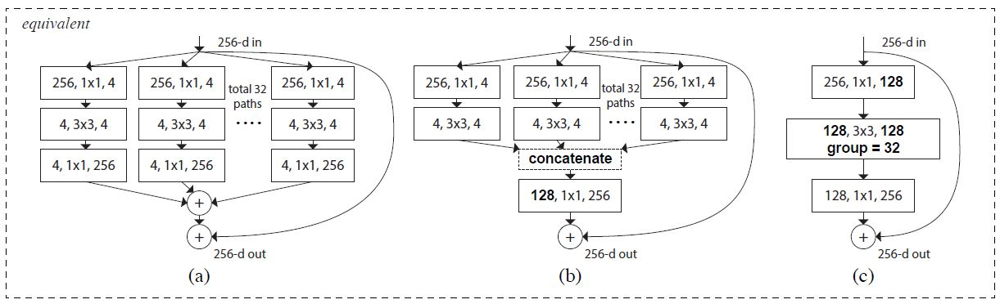
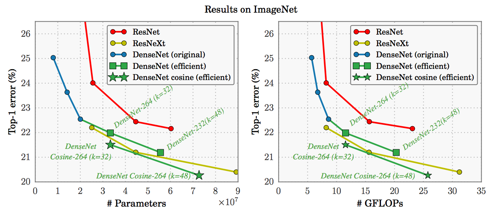

## ResNeXt - Aggregated Residual Transformations for DNN

###### ResNet v3

引入了新的维度，即 Cardinality (涉及的变换集的尺寸)，作为网络 depth 和 width 维度之外的一种必要因子。
ResNeXt 结构的设计具有更少的参数。
```
▪ 深度 - 重复的 block 数量
▪ 宽度 - 每个 block 最终的 output channels
▪ Cardinality(基数) - convolution groups
```

特点：
```
▫ VGG-nets/ResNets： 堆叠相同形状的网络 building blocks。—— 网络 depth
▫ Inceptions：split-transform-merge，将输入采用 (1×11×1 Conv) 分裂为几个低维 embedding，再经过一系列特定 filters (如 3×33×3，5×55×5) 的变换，最后连接在一起。
▫ ResNeXt：采用 VGGs/ResNets 的网络的 depth 加深方式，同时利用 split-transform-merge 策略。
```

#### Aggregating transformation (聚合变换)
人工神经网络中，最简单的神经元就是全连接，又称内积 （inner product）。
Inner product 可以看作是 splitting-transforming-aggregating 的组合：
* (1) Splitting：输入向量 x 被分为低维 embedding，即单维空间的 xi；
* (2) Transforming：变换得到低维表示，即：wixi；
* (3) Aggregating： 通过相加（求和）将所有的 embeddings 变换聚合，即：∑。

#### 三种等价形式 (ResNeXt、Inception-ResNet、Grouped Convolutions)
<div align="center"></div>

#### ResNeXt 性能
<div align="center"></div>

FLOPs - floating point operations per second (每秒浮点运算次数)
