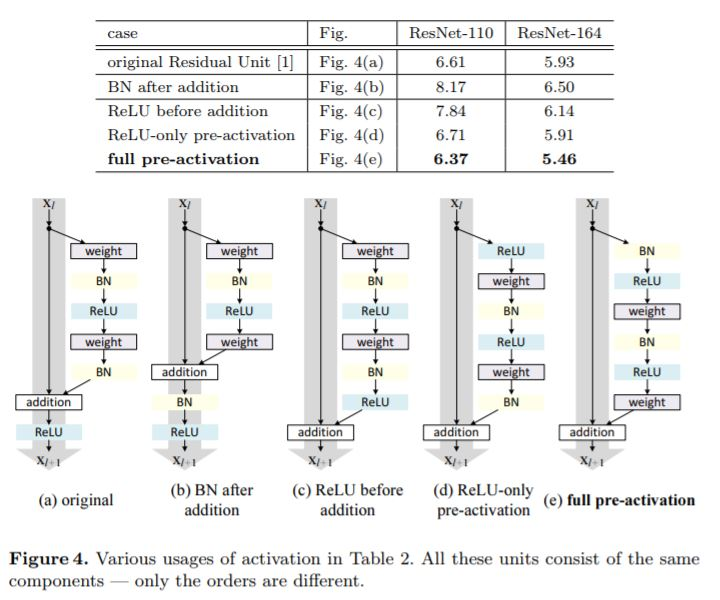
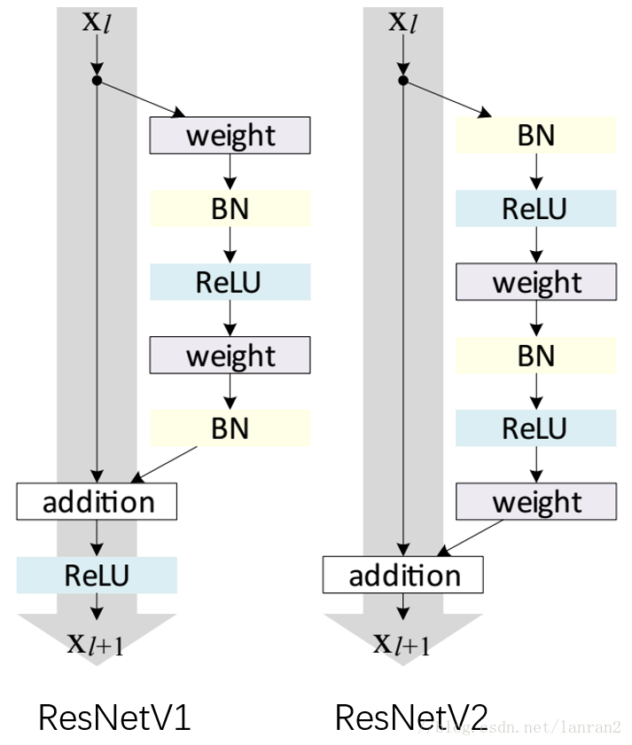

## ResNet


#### 模型
***resnet_v1:*** https://github.com/KaimingHe/deep-residual-networks

***resnet_v2 (full pre-activation):*** the new version of resnet <br>
 <br>
Reference: Identity Mappings in Deep Residual Networks (http://arxiv.org/pdf/1603.05027.pdf)

* 每个图右侧部分我们称作 “residual” 分支，左侧部分我们称作 “identity” 分支，如果 ReLU 作为 “residual” 分支的结尾，我们不难发现 “residual” 分支的结果永远非负，这样前向表达的时候输入会单调递增，从而会影响特征的表达能力，所以我们希望 “residual” 分支的结果应该在 (-∞, +∞)。
* BN after addition 的问题：这里 BN 改变了 “identity” 分支的分布，影响了信息的传递，在训练的时候会阻碍 loss 的下降。
    ```
    简单回顾 ResNet 的公式：
      yl = h(xl) + F(xl,Wl)
      xl+1 = f(yl)
    简化以上公式，令所有 “identity” 分支 h(xl) = xl 以及 xl+1 = yl，
    那么得到: xl+1 = xl + F(xl,Wl)

    递推计算得到：
      xL = xl + ∑(L−1,i=l)F(xi,Wi)
    该式表达了任意第 L 层（深层）与第 l 层（浅层）之间关系

    反向传播公式：
    ∂loss/∂xl = (∂loss/∂xL) * (∂xL/∂xl) = (∂loss/∂xL) * (1 + ∂/∂xl∑(L−1,i=l)F(xi,Wi))

    反向传播公式的 3 个特点：
        * xl 的梯度信息分为两部分，其中第一部分为 ∂loss/∂xL, 即 xL 的梯度值. 表明：
          两层之间梯度信息无障碍传递了。
        * xl 的梯度 ∂loss/∂xl 的值不会轻易抵消(变为0)，因为在一个 mini-batch 中，∂/∂xl∑(L−1,i=l)F(xi,Wi)) 不会一直为-1。
        * 有效的防止了当权重很小时，梯度消失的问题。

    以上优点只有在假设 h(xl)=xl 以及 xl+1=yl 成立时才有效，所以 ResNet 要尽量保证两点：
        1) 不轻易改变 ”identity“ 分支的值，也就是输入与输出一致；
        2) addition 之后不再接改变信息分布的层。
    ```
* BN 加入 pre-activation，起到了正则化的作用。


#### ResNet_v1 v.s. ResNet_v2
 <br>

###### resnet_v2_101: [pics/resnet_v2_101.jpg](pics/resnet_v2_101.jpg)
