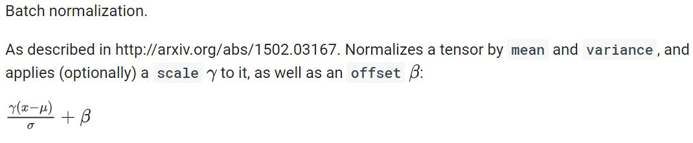
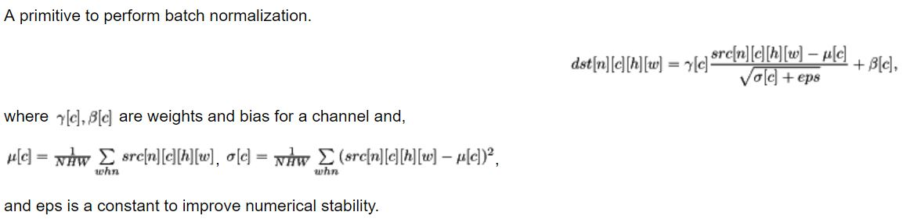

# Your First TF CNN
A sample/quick start to create your first tensorflow cnn.


## Tensorflow - your first cnn
#### 1. prerequisite knowledge
在使用 tensorflow 时，会发现 tf.nn，tf.layers， tf.contrib 模块的很多功能是重复的，尤其是卷积操作. <br>
比如：<br>
tf.nn.conv2d 与 tf.layers.conv2d 在功能上事相同的.

下面是对三个模块的简述：<br>
1. tf.nn： 提供神经网络相关操作的支持，包括卷积操作 (conv)、池化 (pooling)、归一化 (norm)、 loss 等等。可以认为: tf.nn 提供了卷积神经网络最底层的支持。
1. tf.layers：顾名思义，在 tf.nn 的基础上进一步封装，使得对神经网络的建立变得更加简单。
1. tf.contrib：提供将计算图中的网络层、正则化等构建计算图的高级操作。但是 tf.contrib 包含不稳定和实验代码，有可能以后 API 会改变。

#### 2. your firt network
```python
# coding: utf8
import os
import sys

import numpy as np
import tensorflow as tf


def Convolution(name, bottom, out_channels, kernel_h, kernel_w, stride_h, stride_w, pad_type, with_type):
	"""
	pad_type: "VALID" or "SAME"
	with_type: "None" or "relu"
	# tensor: [batch, height, width, channel]
	# stride: [1, stride_h, stride_w, 1]
	# filter: [height, width, in_channels, out_channels]
	# tf.nn.conv2d(input, filter, strides, padding, use_cudnn_on_gpu=None, data_format='NHWC', name=None)
	"""
	with tf.variable_scope(name):
		in_channels = bottom.shape[3].value
		filter = tf.Variable(tf.random_normal([kernel_h, kernel_w, in_channels, out_channels]))
		conv = tf.nn.conv2d(input=bottom, filter=filter, strides=[1, stride_h, stride_w, 1], padding=pad_type)
		conv_biases = tf.Variable(tf.random_normal([out_channels]))
		bias = tf.nn.bias_add(conv, conv_biases)
		if ("relu" == with_type.lower()):
			relu = tf.nn.relu(bias)
			return relu
		else:
			return bias


def Pooling(name, bottom, kernel_h, kernel_w, stride_h, stride_w, pool_type, pad_type):
	"""
	pad_type: "VALID" or "SAME"
	pool_type: "AVG" or "MAX"
	# tf.nn.pool(input, window_shape, pooling_type, padding, dilation_rate=None, strides=None, name=None, data_format=None)
	"""
	with tf.variable_scope(name):
		pool = tf.nn.pool(bottom, window_shape=[kernel_h,kernel_w], strides=[stride_h, stride_w],
				pooling_type=pool_type, padding=pad_type)
		return pool


def BatchNorm(name, bottom, epsilon, with_type, scale_out=1.0):
	"""
	variance_epsilon: A small float number to avoid dividing by 0.
	# tf.nn.batch_normalization(x, mean, variance, offset, scale, variance_epsilon, name=None)
	"""
	with tf.variable_scope(name):
		mean = tf.Variable(tf.random_normal([bottom.shape[3].value]))
		variance = tf.Variable(tf.random_normal([bottom.shape[3].value]))
		scale = tf.Variable(tf.random_normal([bottom.shape[3].value]))
		offset = tf.Variable(tf.random_normal([bottom.shape[3].value]))
		batch_norm = tf.nn.batch_normalization(bottom, mean=mean, variance=variance, offset=offset, scale=scale, variance_epsilon=epsilon)
		if ("relu" == with_type.lower()):
			relu = tf.nn.relu(batch_norm)
			return relu
		else:
			return batch_norm


def Sum(name, bottom1, bottom2, scale_in1, scale_in2, with_type):
	"""
	"""
	with tf.variable_scope(name):
		if ("relu" == with_type.lower()):
			relu = tf.nn.relu(bottom1+bottom2)
			return relu
		else:
			return bottom1 + bottom2


def make_fake_input(batch_size, input_height, input_width, input_channel):
	im = np.zeros((input_height,input_width,input_channel), np.uint8)
	im[:,:,:] = 1
	images = np.zeros((batch_size, input_height, input_width, input_channel), dtype=np.float32)
	for i in xrange(batch_size):
		images[i, 0:im.shape[0], 0:im.shape[1], :] = im
		#channel_swap = (0, 3, 1, 2)  # caffe
		#images = images.transpose(channel_swap)
		#cv2.imwrite("test.jpg", im)
	return images 


def main(argv):
	images = tf.placeholder(tf.float32, shape=(None, 224,224,3))
	res1a = Convolution("layer1_layer1_conv_Conv2D", images, 64, 7, 7, 2, 2, "SAME", "relu")
	res1a = Pooling("layer2_MaxPool2D_MaxPool", res1a, 3, 3, 2, 2, "MAX", "SAME")
	res1a = BatchNorm("layer2_block0_common_bn_relu_FusedBatchNorm", res1a, 0.0010000000475, "relu")
	res2a_b2 = Convolution("layer2_block0_sub1_sub1_conv_Conv2D", res1a, 64, 1, 1, 1, 1, "SAME", "relu")
	res2a_b2 = Convolution("layer2_block0_sub2_sub2_conv_Conv2D", res2a_b2, 64, 3, 3, 1, 1, "SAME", "relu")
	res2a_b2 = Convolution("layer2_block0_sub3_sub3_conv_Conv2D", res2a_b2, 256, 1, 1, 1, 1, "SAME", "none")
	res2a_b1 = Convolution("layer2_block0_shortcut_sub_sc_Conv2D", res1a, 256, 1, 1, 1, 1, "SAME", "none")
	res2a = Sum("layer2_block0_shortcut_add", res2a_b1, res2a_b2, 1.0, 1.0, "none")
	res2a = BatchNorm("layer2_block1_residual_bn_relu_FusedBatchNorm", res2a, 0.0010000000475, "relu")

	init = tf.global_variables_initializer()
	with tf.Session() as sess:
		sess.run(init)
		for step in range(1):
			imgs = make_fake_input(1, 224, 224, 3)
			result = sess.run(res2a, feed_dict={images:imgs})
			print(result.shape)
	return 0
    

if __name__ == "__main__":
	tf.app.run()
```
reference:
1. https://tensorflow.google.cn/api_docs/python/tf/nn
1. https://github.com/tensorflow/models/blob/master/official/resnet/resnet_model.py

#### 3. supplement knowledge
###### **BatchNorm**
**tf.nn** <br>
 <br>
variance_epsilon: A small float number to avoid dividing by 0. <br>
**mkldnn** <br>
 <br>

###### **tf.add(a, b) 与 a+b**
在神经网络前向传播的过程中，经常可见如下两种形式的代码:
* tf.add(tf.matmul(x, w), b)
* tf.matmul(x, w) + b

二者并没有差别. 运算符重载的形式 a+b, 会在内部转换为 a.\_\_add__(b), 而 a.\_\_add__(b) 会再一次地映射为 tf.add.

## Tensorflow - High Level Library
* Keras
* TensorLayer
* TFLearn
* tensorflow.contrib.slim


## Tensorflow - use high level library to create your cnn
Keras
```python

```
