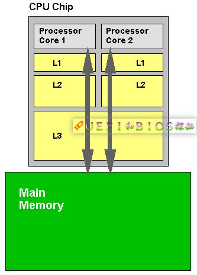
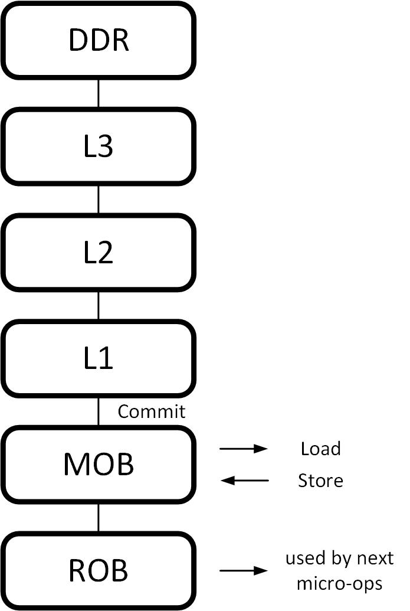
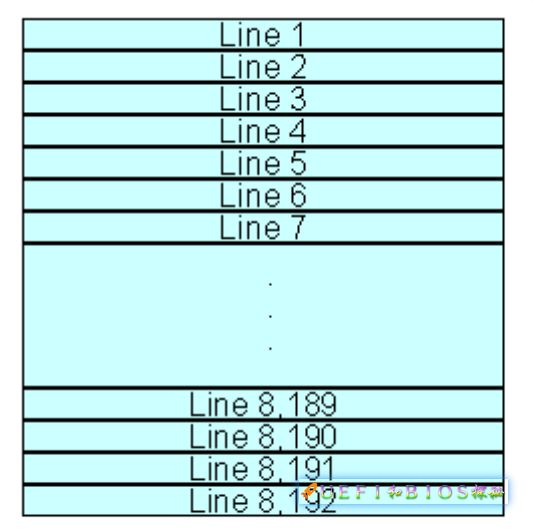
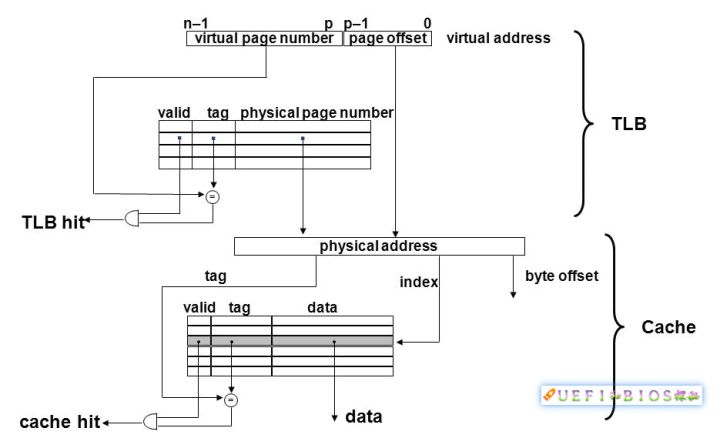
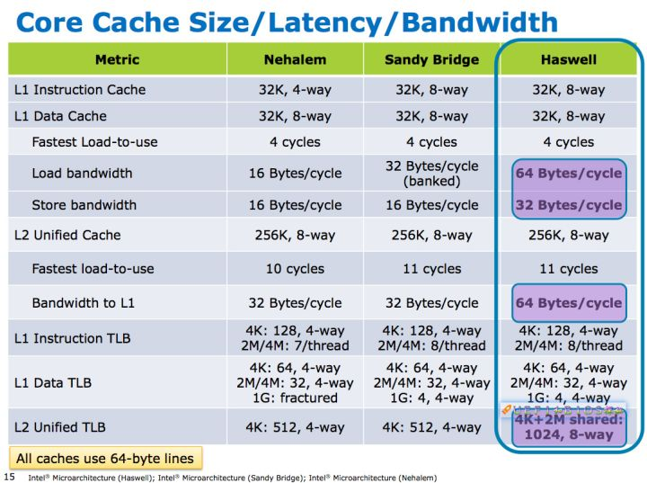

## **cache** 是怎么组织和工作的


#### 1. Memory Hierarchy (内存层级)
在 CPU 中， Cache Memory 处于 Memory Hierarchy 的最顶端，其下是内存和外存。 <br>



#### 2. Cache 的组成和访问方式
现代大多数处理器中，Cache 被分为很多行 （Cache Line），Cache Line 大小不一，从 16Byte 到 128Byte 不等。一般大小是 64 个 Byte。假设 Cache Line 为 64B，一个 512KB 的 Cache 可划分成 8192 个 Cache Line。 <br>
<div align="center"></div>

##### **那么一个地址访问如何映射到 Cache 中去呢？**
```
1. 首先，地址分为：逻辑地址（虚拟地址）、线性地址和物理地址。
2. 线性地址是逻辑地址到物理地址变换之间的中间层。
   程序代码会产生逻辑地址，或者说是段中的偏移地址，加上相应段的基地址就生成了一个线性地址。
   如果启用了分页机制，那么线性地址可以再经变换以产生一个物理地址。
   若没有启用分页机制，那么线性地址直接就是物理地址。
3. 变换过程中线性地址到物理地址需要用到页表（page table）。
   页表由很多项组成，每一项叫一个页表项，整个页表由操作系统维护，并放置在内存中（或磁盘中）。
```
```
一次内存访问需要数百个时钟周期，如果每次地址转换都要查看内存页表也太浪费时间了。由此，引入翻译后援缓冲器（TLB）。
TLB 可以看作页表的 Cache，CPU 每次转换地址都会查看 TLB，如果有了就不用去取内存页表了。

可以说 TLB 命中是 Cache 命中的基本条件。TLB 不命中，会更新 TLB 项，这个代价非常大，Cache 命中的好处基本都没有了。
在 TLB 命中的情况下，物理地址才能够被选出，Cache 的命中与否才能够达成。 <br>
```
<div align="center"></div>

##### **Cache 地址和物理地址的对应关系有很多种**
```
1. 直接映射(Direct Mapping)
   直接映射可以理解为每个地址都可以立刻直接且只能映射到某个 Cache Line 上。
   由于数据的相关性和局限性，同一时刻需要用的数据大部分都在附近，会造成 Cache 频繁换进换出，造成颠簸。
2. 全相联映射(Fully Associative Mapping)
   全映射就是所有 Cache Line 对应相同地址。Cache Miss 减小，查找 Cache 命中与否的代价(Over head)很高。
3. n 路组相联映射(n-ways Set-Associative mapping)
   这里 n 路是指将 Cache 分成 n 个组（set），每一组对应一个地址。也就是说一个地址可以映射到 n 个 Cache Line 中。
n-ways Set-Associative，这个 n=1，就是直接映射；n=cache 大小，就是全相关映射。
```
<div align="center"></div>


###### reference
[1]: https://zhuanlan.zhihu.com/p/31859105 <br>
[2]: https://my.oschina.net/fileoptions/blog/1633021
