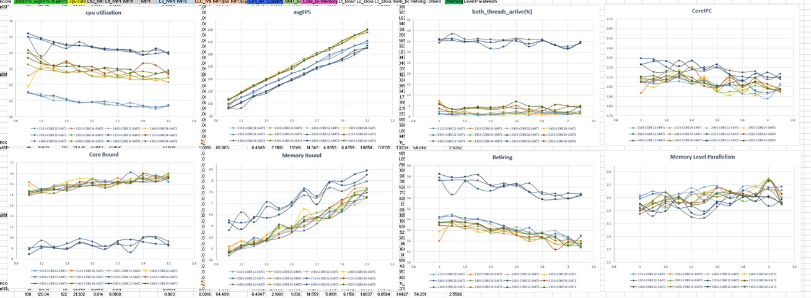

### Performance Modeling

##### 分析思路
Phase 1 —— Qualitative Analysis (定性分析)
* 数据采集工具 emon + sde
* 图表分析报告 （趋势图）

Phase 2 —— Quantitative Analysis (定量分析)
* 确定模型
* 参数求解，计算影响因子。

##### 量化分析工具选择
* numpy + scipy
* scikit-learn
* tensorflow

 

