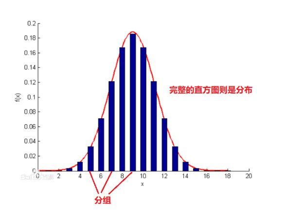

## Performance Modeling

#### 1. 分析思路
Phase 1 —— Qualitative Analysis (定性分析)
* 数据采集工具 emon + sde
* 图表分析报告 （趋势图）

Phase 2 —— Quantitative Analysis (定量分析)
* 确定模型
* 参数求解，计算影响因子。

#### 2. 量化分析工具选择
* numpy + scipy
* scikit-learn
* tensorflow

##### 2.1 numpy + scipy
—— Scientific Computing Tools for Python.

常用组合
* **Numpy**， 数值计算(numerical computation)的基础工具包。
* **SciPy**， a collection of numerical algorithms（数值算法） and domain-specific toolboxes（特定领域的工具箱）, including signal processing, optimization, statistics and much more.
* **Matplotlib**， a mature and popular plotting package. 成熟且流行的绘图包。

SciPy 用户手册  
https://docs.scipy.org/doc/scipy/reference/

##### 2.2 scikit-learn （推荐）
—— Machine Learning in Python.

* 工具定位  
data mining and data analysis. 数据挖掘和数据分析。

* **Built on NumPy, SciPy, and matplotlib.**

一些应用案例  
https://scikit-learn.org/stable/auto_examples/index.html

教程及 API 手册
* https://scikit-learn.org/stable/tutorial/index.html （机器学习，统计学习，新闻分类）
* https://scikit-learn.org/stable/user_guide.html  (内包含完善的机器学习知识结构，推荐阅读。)
* https://scikit-learn.org/stable/modules/classes.html

Scikit-Learn 的一些不成文规定（惯例）
* https://scikit-learn.org/stable/tutorial/basic/tutorial.html#conventions （注意查看）

##### 2.3 tensorflow
—— An end-to-end open source machine learning platform.

https://tensorflow.google.cn/overview

构成
* **High Level APIs**
    * **Keras**, TensorFlow's high-level API for building and training deep learning models.
    * **Eager Execution**, an API for writing TensorFlow code imperatively, like you would use Numpy.
    * **Importing Data**, easy input pipelines to bring your data into your TensorFlow program.
    * **Estimators**, a high-level API that provides fully-packaged models ready for large-scale training and production.
* **Low Level APIs**
    * **Tensors**, which explains how to create, manipulate, and access Tensors--the fundamental object in TensorFlow.
    * **Variables**, which details how to represent shared, persistent state in your program.
    * **Graphs**, dataflow graphs, which are TensorFlow's representation of computations as dependencies between operations.
    * **Sessions**, which are TensorFlow's mechanism for running dataflow graphs across one or more local or remote devices.
* Estimators （预定义模型）
    * **Premade Estimators**(已有模型), the basics of premade Estimators.
    * **Checkpoints**(中间结果备份), save training progress and resume where you left off.
    * **Feature Columns**(原始数据与模型中 tensor 的对应), handle a variety of input data types without changes to the model.
    * **Datasets for Estimators**(输入), use ``tf.data`` to input data.
    * **Creating Custom Estimators**(自定义模型), write your own Estimator.
* Accelerators
    * Using GPUs
    * Using TPUs

 

#### Machine Learning v.s. Statistical Learning
##### 1. 机器学习
一般的，一个学习问题首先有一个样本集，希望做的是预测未知数据的特性。

学习问题进一步细分为以下几类
* 监督学习 —— 典型： 分类、回归。
* 无监督学习 —— 典型： clustering、density estimation（密度估计）、visualization（可视化）。

说明：
* 有监督与无监督的区别在于，是否每个训练集输入特征向量 x 都提供一个对应的 target value。
* 聚类问题的核心是分组，最直观的例子是直方图。
* 密度估计的核心是数据的分布特性，最直观的例子是高斯分布曲线图。 （高斯分布的直方图版本是否同时说明，探索分布先要分组？）
* 可视化？ —— 即 将数据从高维空间投影到二维或三维。 因为只有二维或三维才可视。

##### 2. 统计学习
机器学习是一种技术。 统计学习指使用机器学习技术，同时以统计预测(Statistical inference)为目标。 是机器学习在应用上的细分。

**Statistical Inference** 的明确含义
* 使用数据分析理论，推导潜在概率分布。
* 关键词： data analysis, distribution, probability.

说明
* 何为概率分布？ 先有分布直方图，后得每个分组的概率。

 

#### 确定所求问题的位置
##### 1. 需求
* 可视化 （report）
* 预测 -> 监督学习
* 分布图？
