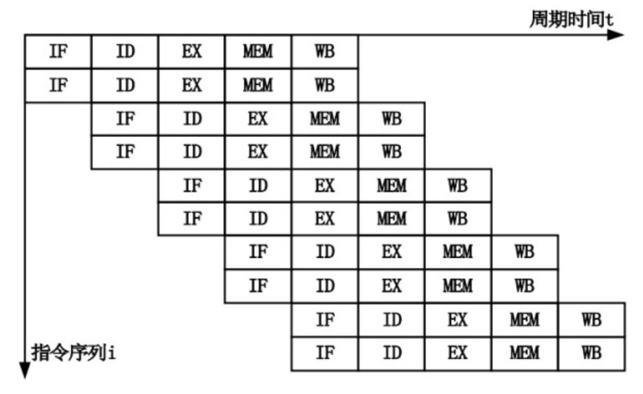
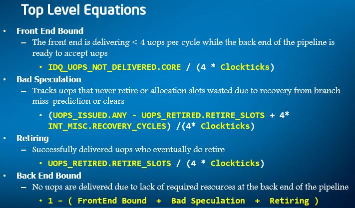
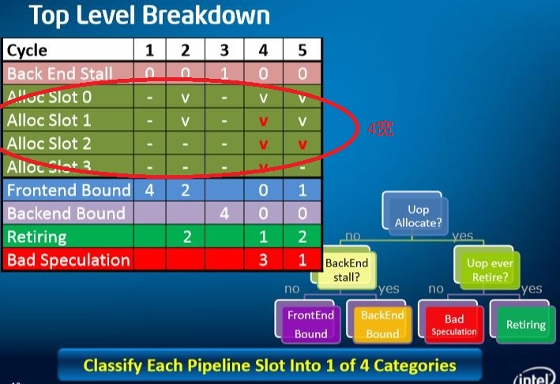

## CPU 微架构分析

### Part I - CPU 指令的执行
#### 一、CPU指令的执行过程
几乎所有的冯·诺伊曼型计算机的 CPU，其工作都可以分为 5 个阶段：取指令、指令译码、执行指令、访存取数、结果写回。
```
1. 取指令（Instruction Fetch，IF）
   将一条指令从主存中取到指令寄存器的过程。
2. 指令译码（Instruction Decode，ID）
   指令译码器按照预定的指令格式，对取回的指令进行拆分和解释，识别区分出不同的指令类别以及各种获取操作数的方法。
3. 执行指令（Execute，EX）
4. 访存取数（Memory，MEM）
   根据指令地址码，得到操作数在主存中的地址，并从主存中读取该操作数用于运算。
5. 结果写回（Writeback，WB）
   运行结果数据“写回”到某种存储形式。
```

#### 二、CPU指令流水线
流水线技术本质上是将一个重复的时序过程分解成若干个子过程，而每一个子过程都可有效地在其专用功能段上与其他子过程同时执行。采用流水线技术通过硬件实现并行操作后，就某一条指令而言，其执行速度并没有加快，但就程序执行过程的整体而言，程序执行速度大大加快。
```
# 超标量流水计算机工作方式
一般的流水计算机因只有一条指令流水线，所以称为标量流水计算机。所谓超标量（Superscalar）流水计算机，是指它具有两条以上的指令流水线。
```
* 超标量流水<br>


#### 三、指令的相关性
要使流水线发挥高效率，就要使流水线连续不断地流动，尽量不出现断流情况。然而，由于流水过程中存在的相关性冲突，断流现象是不可避免的。
```
1. 数据相关
   数据相关是由于指令之间存在数据依赖性而引起的。
2. 资源相关
   可能会有2条指令同时需要访问存储器，导致资源相关冲突解决资源相关冲突的一般办法是增加资源。
3. 控制相关
   由转移指令引起。若依据判断条件转移到新的目标地址取指令，则指令流水线将被排空，
   并等待转移指令形成下一条指令的地址，以便读取新的指令，这就使得流水线发生断流。
```

#### 四、指令的动态执行技术
```
1. 指令调度
   （静态指令调度-编译器，动态指令调度-硬件）
   消除指令相关性对流水线性能的限制，其基本思想就是允许指令的执行是无序的（out-of-order，也称乱序）。
   也就是说，在保持指令间、数据间的依赖关系的前提下，允许不相关的指令的执行顺序与程序的原有顺序有所不同，
   这一思想是实行动态指令调度的前提。
2. 乱序执行技术
   根据各个电路单元的状态和各指令能否提前执行的具体情况分析，将能够提前执行的指令立即发送给相应电路单元予以执行，然后由重新排列单元将各执行单元结果按指令顺序重新排列。
   实现乱序执行的关键在于取消传统的“取指”和“执行”两个阶段之间指令需要线性排列的限制，而使用一个指令缓冲池来开辟一个较长的指令窗口。
3. 分支预测
   分支预测（Branch Prediction）是对程序的流程进行预测。
   一旦前条指令结果出来后证明分支预测是错误的，那么就必须将已经装入流水线执行的指令和结果全部清除，然后再装入正确的指令重新处理，这样就比不进行分支预测而是等待结果再执行新指令还要慢了。
```

#### 五、Retire 回退
（OoOE— Out-of-Order Execution）乱序执行是为了直接提升 ILP(Instruction Level Parallelism)指令级并行化的设计，在有多个执行单元的超标量设计当中，一系列的执行单元可以同时运行一些没有数据关联性的若干指令。
###### **乱序执行引擎是一个很重要的部分，需要进行复杂的调度管理。**
```
1. 在乱序执行架构中，不同的指令可能都会需要用到通用寄存器(GPR，General Purpose Registers)，x86 架构天生就缺乏 GPR。
   为此，Intel 引入重命名寄存器(Rename Register)，不同的指令可以通过具有名字相同但实际不同的寄存器来解决。
2. 乱序执行从 Allocator 定位器开始，Allocator 管理着 RAT(Register Alias Table，寄存器别名表)、ROB(Re-Order Buffer，重排序缓冲区) 和 RRF(Retirement Register File，退回寄存器文件)。
   在 Allocator 之前，流水线都是顺序执行的，在 Allocator 之后，就可以进入乱序执行阶段了。
3. RAT 将重命名的、虚拟的寄存器(称：Architectural Register 或 Logical Register) 指向 ROB 或者 RRF。 RAT 是一式两份，每个线程独立，每个 RAT 包含了 128 个重命名寄存器。
   RAT 指向 ROB 里面的最近的执行寄存器状态，或者指向 RRF 保存的最终的提交状态。
4. ROB(Re-Order Buffer，重排序缓冲区) 是一个非常重要的部件，它是将乱序执行完毕的指令们按照程序编程的原始顺序重新排序的一个队列，以保证所有的指令都能够逻辑上实现正确的因果关系。
   ① 当一条指令通过 RAT 发往下一个阶段确实执行的时候这条指令(包括寄存器状态在内)将被加入 ROB 队列。
   ② 执行完毕的指令(包括寄存器状态)将从 ROB 队列移除。从 ROB 中移出一条指令，就意味着一条指令执行完毕了，这个阶段叫做 Retire 回退，相应地， ROB 往往也叫做 Retirement Unit(回退单元)，并将其画为流水线的最后一部分。
5. 在一些超标量设计中，Retire 阶段会将 ROB 的数据写入 L1D 缓存，而在另一些设计里， 写入 L1D 缓存由另外的队列完成。
6. ROB 是乱序执行引擎架构中都存在的一个缓冲区，重新排序指令的目的是：将指令们的寄存器状态依次提交到 RRF（退回寄存器文件）当中，以确保具有因果关系的指令们在乱序执行中可以得到正确的数据。
7. Core/Nehalem 的 Retirement Unit(回退单元) 每时钟周期可以执行 4 个 uops 的寄存器文件写入，和 RAT 每时钟 4 个 uops 的重命名一致。
8. ROB 里面的指令是调度器（dispacher）通过 RAT 发往 RS 的同时发往 ROB 的。指令并不是在 ROB 当中乱序挑选的 (这是在 RS - Reservation Station 当中进行的)。
   ROB 担当的是流水线的最终阶段: 一个指令的 Retire （回退单元），同时担当中间计算结果的缓冲区。
9. RS 中的指令等待源数据到来，以进行 OoOE 乱序执行，没有获取到数据的指令将在 RS 中等待。
   ROB 中的指令等待结果到达，以进行 Retire 指令回退，没有获取到结果的指令将在 ROB 中等待。
10. ROB 担当中间计算结果的缓冲区，在 ROB 里产生的结果若被标志为已结束，则可以立即地被后继指令使用而不再需要进行 L1 Data Cache 的 Load 操作（即从 L1D 取数据）。因此 ROB 可以避免大量的 Cache Load 操作，作用巨大。
11. 重命名技术并不是没有代价的，在获得前面所说的众多的优点之后，它令指令在发射的时候需要扫描额外的地方来寻找到正确的寄存器状态，不过总体来说这种代价是非常值得的。
12. RAT 可以在每一个时钟周期重命名 4 个 uops 的寄存器，经过重命名的指令等待读取到正确的操作数并发射到统一的 RS(Reservation Station，保留站点) 上。
    因等待数据而停滞的指令不会发往 RS，但是仍然会占用 ROB 条目。
```

#### 六、执行单元
uops 通过每时钟周期 4 条的速度进入 Reservation Station 中继站(保留站)，拥有 36 条目的中继站指令在分发器的管理下，挑选出尽量多的可以同时执行的指令(也就是乱序执行的意思) - 最多 6 条 - 发送到执行端口。
```
这些执行端口并不都是用于计算，实际上，有三个执行端口是专门用来执行内存相关的操作的，只有剩下的三个是计算端口。
没有采用完全对称的设计可能是基于统计学上的考虑。

在流水线架构当中运行速度并不是由最 “宽”的单元来决定的，而是由最“窄”的单元来决定的，这就是木桶原理。
Opteron 的解码器后端只能每时钟周期输出 3 条 uops，因此 Opteron 为三路超标量处理器。
```

#### 七、存取单元
三个存取单元中，一个用于所有的 Load 操作(地址和数据)，一个用于 Store 地址，一个用于 Store 数据，前两个数据相关的单元带有 AGU(Address Generation Unit，地址生成单元)功能。
```
在乱序架构中，存取操作也可以打乱进行。类似于指令预取一样，Load/Store 操作也可以提前进行以降低延迟的影响，提高性能。
然而，由于 Store 操作会修改数据影响后继的 Load 操作，而指令却不会有这种问题(寄存器依赖性问题通过 ROB 解决)，因此数据的乱序操作更为复杂。

内存数据相依性预测功能(Memory Disambiguation) 可以预测哪些指令是具有依赖性的或者使用相关的地址(地址混淆，Alias)，从而决定哪些 Load/Store 指令是可以提前的， 哪些是不可以提前的。
可以提前的指令在其后继指令需要数据之前就开始执行、读取数据到 ROB 当中，这样后继指令就可以直接从中使用数据，从而避免了无法提前 Load/Store 时访问 L1 缓存带来的延迟(3~4 个时钟周期)。
```
```
Load 操作占据了通常程序的 1/3 左右，并且 Load 操作可能会导致巨大的延迟(在命中的情况下，Core 的 L1D Cache 延迟为 3 个时钟周期，Nehalem 则为 4 个。
L1 未命中时则会访问 L2 缓存，一般为 10~12 个时钟周期。访问 L3 通常需要 30~40 个时钟周期，访问主内存则可以达到最多约 100 个时钟周期)。
Store 操作并不重要，什么时候写入到 L1 乃至主内存并不会影响到执行性能。

和为了顺序提交到寄存器而需要 ROB 重排序缓冲区的存在一样，在乱序架构中，多个打乱了顺序的 Load 操作和 Store 操作也需要按顺序提交到内存。
MOB(Memory Reorder Buffer，内存重排序缓冲区) 就是起到这样一个作用的重排序缓冲区(介于 Load/Store 单元 与 L1D Cache 之间的部件，有时候也称之为 LSQ)。
``` 
和 ROB 一样，Load/Store 单元的乱序存取操作会在 MOB 中按照原始程序顺序排列，以提供正确的数据。内存数据依赖性检测功能也在里面实现(内存数据依赖性的检测比指令寄存器间的依赖性检测要负责的多)。
MOB 的 Load/Store 操作结果也会直接反映到 ROB 当中（中间结果）。

**MOB 还附带了数据预取(Data Prefetch)的功能，它会猜测未来指令会使用到的数据，并预先从 L1D Cache 缓存 Load 入 MOB 中(Data Prefetcher 也会对 L2 至系统内存的数据进行这样的操作)。**
这样 MOB 当中的数据有些在 ROB 中是不存在的(这有些像 ROB 当中的 Speculative Execution 猜测执行，MOB 当中也存在着“Speculative Load Execution 猜测载入”，只不过失败的猜测执行会导致管线停顿，而失败的猜测载入仅仅会影响到性能。
MOB包括了Load Buffers和Store Buffers。

#### 八、缓存（Cache）
通常缓存具有两种设计：非独占和独占。
```
Nehalem 处理器的 L3 采用了非独占高速缓存设计(或者说“包含式”，L3 包含了 L1/L2 的内容)，这种方式在 Cache Miss 的时候比独占式具有更好的性能，
而在缓存命中的时候需要检查不同的核心的缓存一致性。 Nehalem 并采用了“内核有效”数据位的额外设计，降低了这种检查带来的性能影响。

随着核心数目的逐渐增多(多线程的加入也会增加 Cache Miss 率)，对缓存的压力也会继续增大。
```
关于缓存 Cache 架构原理和 Cache 一致性 MESI 的原理不是本文的重点，此处不再赘述。

#### 后记
1. 处于猜测执行阶段的 store 指令是不允许提交的（commit），因为猜测执行之前的代码还没有提交（时刻记住 ***乱序执行、按顺序提交*** 贯穿全文），而一旦猜测执行之前的代码提交，也就可以验证猜测执行是否成功，此时如果猜测成功就执行 commit， store 数据到 DCache（但是还是允许提前 load 数据到 DCache），否则就直接丢弃猜测执行的结果（直接丢弃 load buffer 里面的数据）。
2. x86 体系结构中 store 指令的确是不会被乱序执行的。（回忆下前文，乱序执行只会发生在从 RS 发往执行单元的时候，在 MOB 中是没有乱序执行这个概念的，MOB 只是按顺序存放内存访问指令以保证乱序后可以按序提交，很多情况下 MOB 其实就是 ROB 的一部分）。
3. store store 是不允许乱序执行的，store 指令是在 RS 被顺序 dispatch 到执行引擎的。
4. 在 store 结果被 commit 到 Memory Subsystem 的时候（此时肯定也是按照编程顺序 commit），但是，如果前一条 store 要操作的地址不在本地 cache 中，此时该 store 结果就会被暂时存储到 store buffer （等待 cache 层 MESI 协议把数据同步过来），然而，恰巧后一条 store 指令（与前一条 store 不存在地址冲突）操作的地址就在本地 cache 中，就会导致后一条 store 结果先作用到 cache 的现象！！
（解决方式就是：在两条 store 之间添加 store store 内存屏障，后一条 store 在作用到 cache 之前，先等待 store buffer 被排空。）
5. 由于 load 指令一般是允许乱序执行的，也就是 load 指令会在 RS 中被乱序 dispatch 到执行引擎（计算地址等），因此 Memory Subsystem 中的 load buffer 就用来暂存这些提前执行的 load 指令结果。如果乱序执行出现错误、或者分支预测错误，直接丢弃 load buffer 中的内容即可，但是 load 操作也带有副作用，它会导致数据被 load 到 cache 上。


### Part II - CPU 微架构（模块划分）

* CPU 微架构图：<br>


* Top-Down 分析方法 - 前端(frontend)、后端(backend)、错误预测(bad speculation)、回退(retiring)：<br>
 <br>

* 四部分的解释：<br>
 <br>

* Top-Down 统计实例(划分)：<br>



### Part III - CPU 微架构分析思路


<br>
<br>
###### reference
[1] https://my.oschina.net/fileoptions/blog/1633021 <br>
[2] **Top-Down 分析理论：** https://sites.google.com/site/analysismethods/yasin-pubs
